# Sprawozdanie - Lab 5

**Kacper Szlachta 422031**

---

## 1. Przygotowanie środowiska Jenkins

### 1.1. Weryfikacja obrazów z poprzednich zajęć

Na początku sprawdzono dostępność obrazów przygotowanych wcześniej dla procesu *build* i *test*. W systemie były obecne obrazy `lab3-makefile-c-build:latest` oraz `lab3-makefile-c-test:latest`, co pozwoliło wykorzystać wcześniejsze środowisko jako punkt odniesienia do dalszych prac z *pipeline*. Z widoku kontenerów i obrazów wynikało również, że działały już kontenery związane z Jenkins oraz *Docker-in-Docker*.

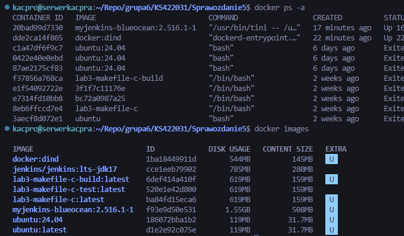

### 1.2. Utworzenie sieci, wolumenów i kontenera DIND

Przygotowano sieć `jenkins`, a następnie wolumeny `jenkins-docker-certs` oraz `jenkins-data`. Po tym uruchomiono kontener `jenkins-docker` na obrazie `docker:dind` z włączonym trybem uprzywilejowanym, aliasem sieciowym `docker` oraz katalogiem certyfikatów TLS. Rozwiązanie to zapewnia oddzielne środowisko Dockera dostępne dla instancji Jenkinsa.

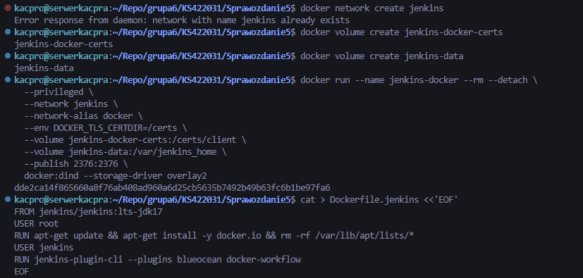

### 1.3. Przygotowanie własnego obrazu Jenkins

Utworzono plik `Dockerfile.jenkins`, bazujący na obrazie `jenkins/jenkins:lts-jdk17`. W obrazie doinstalowano `docker.io`, a następnie dodano wtyczki `blueocean` oraz `docker-workflow`. Po zapisaniu pliku zbudowano własny obraz `myjenkins-blueocean:2.516.1-1`, a następnie uruchomiono kontener `jenkins-blueocean` z odpowiednimi zmiennymi środowiskowymi `DOCKER_HOST`, `DOCKER_CERT_PATH` i `DOCKER_TLS_VERIFY`. Dzięki temu kontroler Jenkins mógł komunikować się z wcześniej uruchomionym kontenerem DIND. Obraz z *Blue Ocean* rozszerza klasyczny obraz Jenkinsa o dodatkowe wtyczki i interfejs do pracy z *pipeline*.

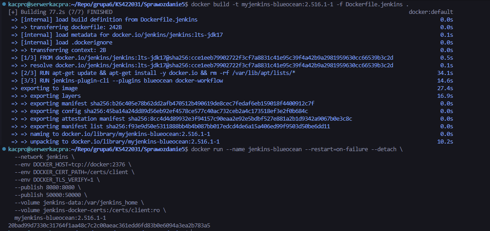

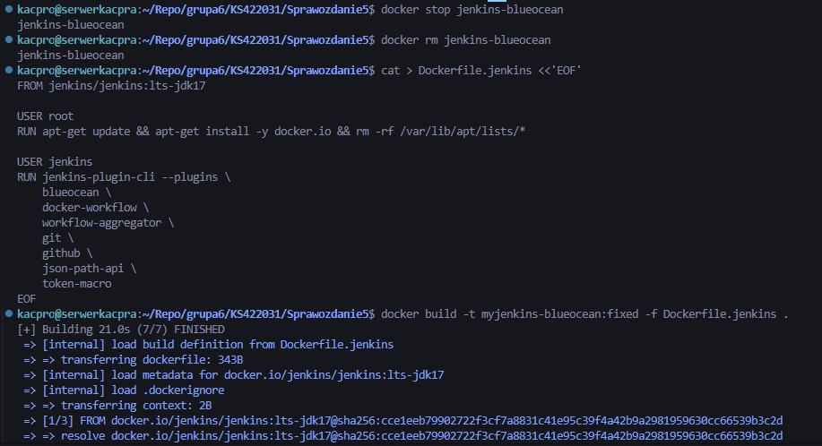

### 1.4. Diagnostyka uruchomienia Jenkinsa

Po starcie instancji przejrzano logi kontenera `jenkins-blueocean` poleceniem `docker logs`. Logi potwierdziły uruchomienie serwera WWW i inicjalizację środowiska. W początkowej konfiguracji pojawił się problem z zależnościami części wtyczek, co było widoczne zarówno w logach kontenera, jak i w panelu administracyjnym Jenkinsa. Problem został udokumentowany jako element diagnostyczny środowiska.

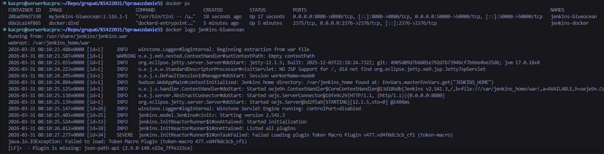

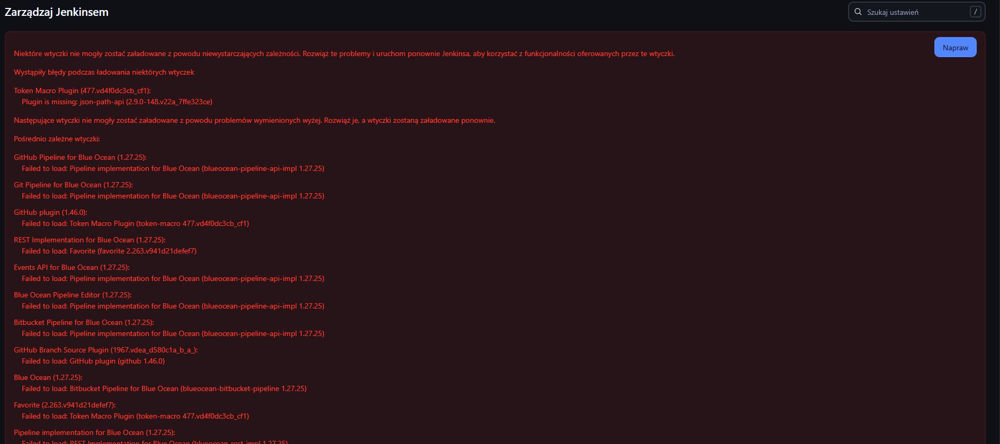

---

## 2. Zadanie wstępne: uruchomienie

### 2.1. Pipeline wyświetlający `uname`

Utworzono pierwszy obiekt typu *pipeline*, którego zadaniem było wykonanie polecenia `uname -a`. Treść skryptu wpisano bezpośrednio w Jenkinsie, a po uruchomieniu uzyskano poprawny wynik opisujący środowisko systemowe kontrolera Jenkins.

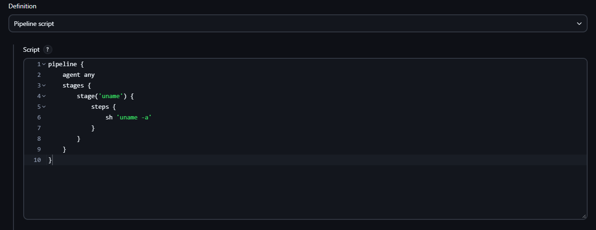

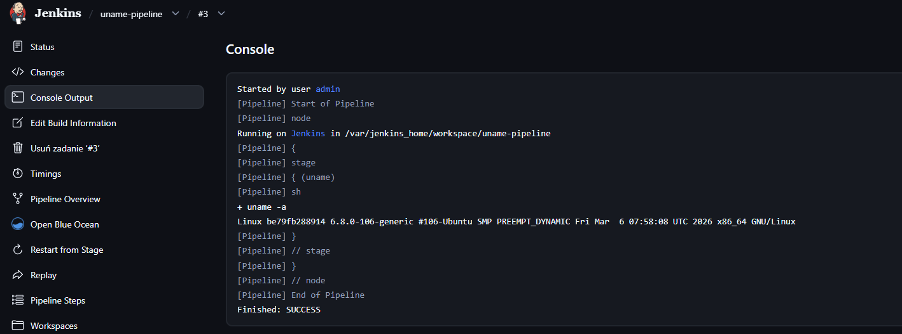

### 2.2. Pipeline zwracający błąd przy nieparzystej godzinie

Drugi obiekt *pipeline* sprawdzał aktualną godzinę systemową. W skrypcie pobierano wartość `date +%H`, usuwano ewentualne wiodące zera, a następnie wykonywano operację modulo 2. Jeśli godzina była nieparzysta, skrypt kończył się kodem błędu `exit 1`; w przeciwnym przypadku wypisywał komunikat potwierdzający poprawny wynik. Na końcowym uruchomieniu, przy godzinie `08`, etap zakończył się komunikatem `Godzina jest parzysta - OK` oraz statusem `SUCCESS`.

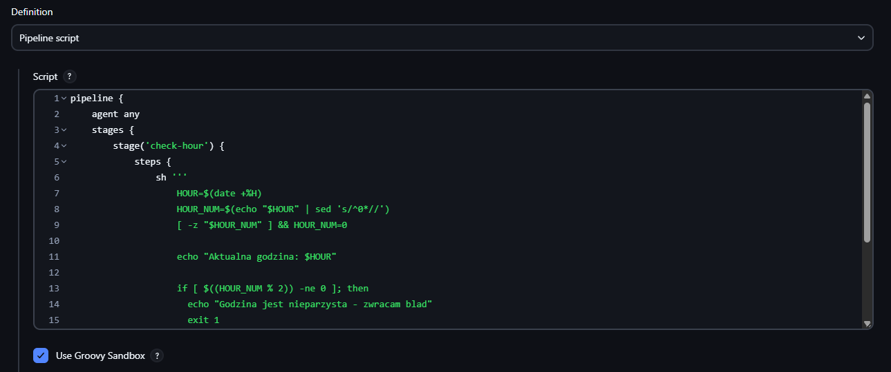

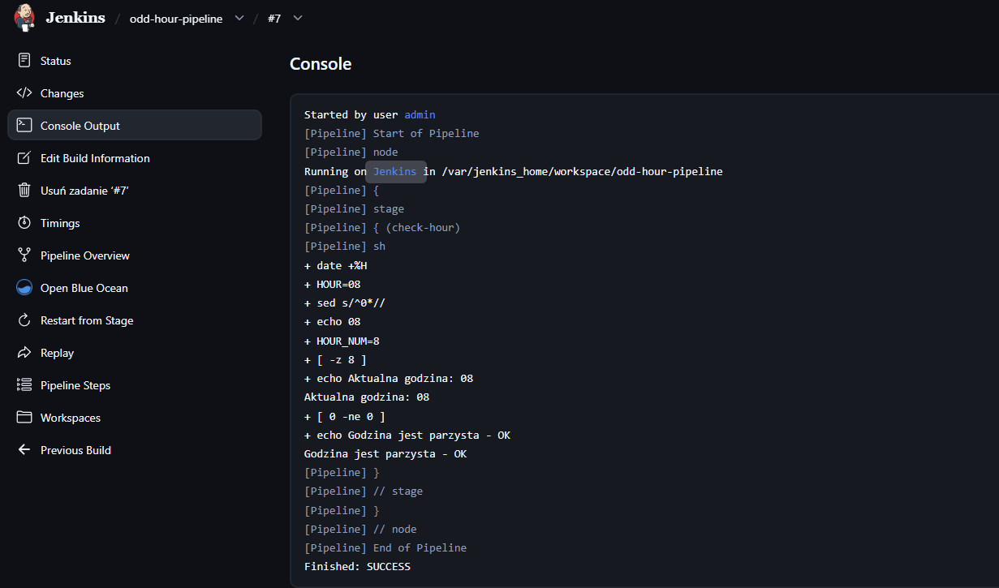

### 2.3. Pipeline pobierający obraz `ubuntu`

Trzeci obiekt *pipeline* wykonywał kolejno `docker version`, `docker pull ubuntu` oraz `docker images | grep ubuntu`. Wynik potwierdził, że środowisko Jenkins miało dostęp do silnika Docker oraz mogło pobierać obrazy z rejestru. W logu pojawiło się pobranie warstw obrazu oraz wpis `ubuntu:latest` na liście lokalnych obrazów.

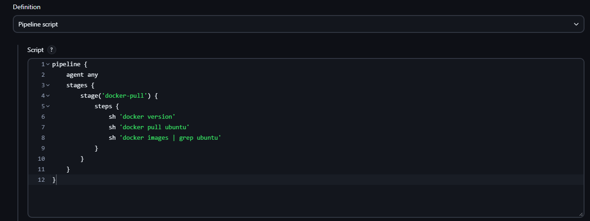

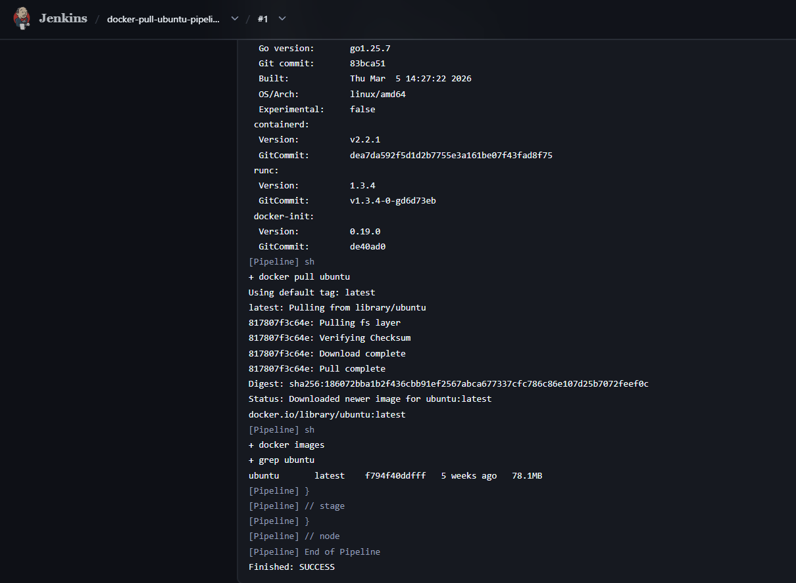

---

## 3. Zadanie wstępne: obiekt typu pipeline

### 3.1. Utworzenie właściwego obiektu `pipeline`

Po potwierdzeniu działania Jenkinsa utworzono nowy obiekt typu `pipeline`, tym razem przeznaczony do realizacji właściwego przebiegu związanego z budowaniem projektu. Zgodnie z poleceniem treść *pipeline'u* została wpisana bezpośrednio do obiektu, bez użycia *SCM* jako źródła definicji skryptu. W sekcji `environment` zdefiniowano adres repozytorium `MDO2026_ITE`, nazwę gałęzi `KS422031`, nazwę budowanego obrazu oraz ścieżkę do pliku `grupa6/KS422031/Sprawozdanie3/Dockerfile.build`.

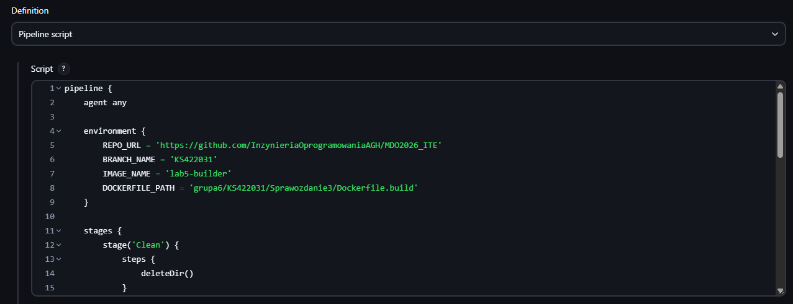

### 3.2. Checkout repozytorium i gałęzi

W pierwszych etapach pipeline wykonano `deleteDir()`, a następnie `git branch: "${BRANCH_NAME}", url: "${REPO_URL}"`. Repozytorium `MDO2026_ITE` zostało poprawnie sklonowane do przestrzeni roboczej Jenkinsa, po czym wykonano *checkout* gałęzi `KS422031`. W kolejnym etapie wypisano zawartość katalogu roboczego oraz wyszukano pliki `Dockerfile`, co pozwoliło potwierdzić poprawną lokalizację pliku `grupa6/KS422031/Sprawozdanie3/Dockerfile.build`.

### 3.3. Budowanie obrazu z `Dockerfile.build`

W etapie `Build image` uruchomiono polecenie:

    docker build -t lab5-builder:latest -f grupa6/KS422031/Sprawozdanie3/Dockerfile.build .

Po poprawieniu ścieżki do pliku `Dockerfile.build` budowa obrazu zakończyła się sukcesem. W logu widoczne były kolejne kroki kompilacji projektu oraz zapis końcowego obrazu do lokalnej pamięci Dockera. Następnie w etapie `List images` potwierdzono obecność obrazu `lab5-builder:latest` na liście dostępnych obrazów.

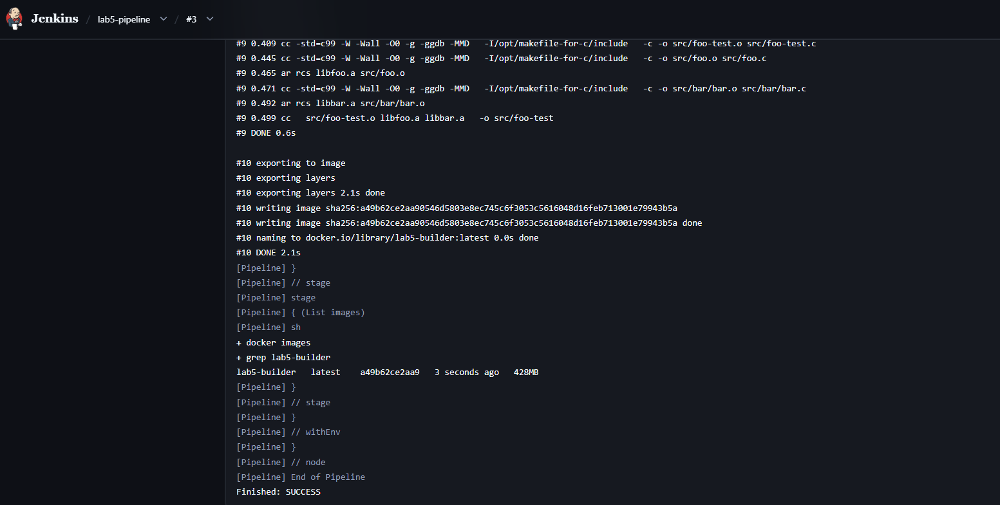

### 3.4. Drugie uruchomienie pipeline

Po poprawnym zakończeniu pierwszego uruchomienia *pipeline* został wykonany ponownie. Na liście buildów widoczne były dwa kolejne poprawne przebiegi (`#3` i `#4`), oba zakończone statusem `SUCCESS`. Potwierdziło to powtarzalność działania przygotowanej definicji oraz spełniło ostatni wymóg obowiązkowej części laboratorium.

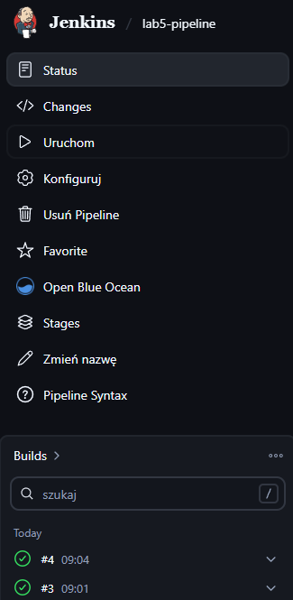

---

## Listing historii poleceń
```bash
    docker network create jenkins
    docker volume create jenkins-docker-certs
    docker volume create jenkins-data

    docker run --name jenkins-docker --rm --detach \
      --privileged \
      --network jenkins \
      --network-alias docker \
      --env DOCKER_TLS_CERTDIR=/certs \
      --volume jenkins-docker-certs:/certs/client \
      --volume jenkins-data:/var/jenkins_home \
      --publish 2376:2376 \
      docker:dind --storage-driver overlay2

    cat > Dockerfile.jenkins <<'EOF'
    FROM jenkins/jenkins:lts-jdk17
    USER root
    RUN apt-get update && apt-get install -y docker.io && rm -rf /var/lib/apt/lists/*
    USER jenkins
    RUN jenkins-plugin-cli --plugins blueocean docker-workflow
    EOF

    docker build -t myjenkins-blueocean:2.516.1-1 -f Dockerfile.jenkins .
    docker run --name jenkins-blueocean --restart=on-failure --detach \
      --network jenkins \
      --env DOCKER_HOST=tcp://docker:2376 \
      --env DOCKER_CERT_PATH=/certs/client \
      --env DOCKER_TLS_VERIFY=1 \
      --publish 8080:8080 \
      --publish 50000:50000 \
      --volume jenkins-data:/var/jenkins_home \
      --volume jenkins-docker-certs:/certs/client:ro \
      myjenkins-blueocean:2.516.1-1

    docker ps -a
    docker images
    docker logs jenkins-blueocean

    docker stop jenkins-blueocean
    docker rm jenkins-blueocean

    cat > Dockerfile.jenkins <<'EOF'
    FROM jenkins/jenkins:lts-jdk17
    USER root
    RUN apt-get update && apt-get install -y docker.io && rm -rf /var/lib/apt/lists/*
    USER jenkins
    RUN jenkins-plugin-cli --plugins blueocean docker-workflow workflow-aggregator git github json-path-api token-macro
    EOF

    docker build -t myjenkins-blueocean:fixed -f Dockerfile.jenkins .
    docker run --name jenkins-blueocean --restart=on-failure --detach \
      --network jenkins \
      --env DOCKER_HOST=tcp://docker:2376 \
      --env DOCKER_CERT_PATH=/certs/client \
      --env DOCKER_TLS_VERIFY=1 \
      --publish 8080:8080 \
      --publish 50000:50000 \
      --volume jenkins-data:/var/jenkins_home \
      --volume jenkins-docker-certs:/certs/client:ro \
      myjenkins-blueocean:fixed
```