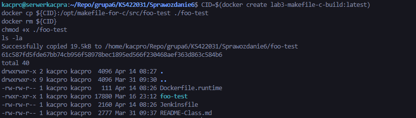
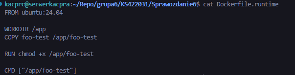
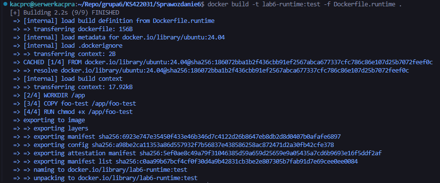
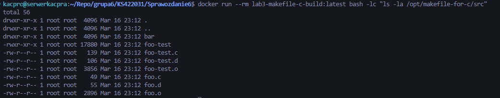
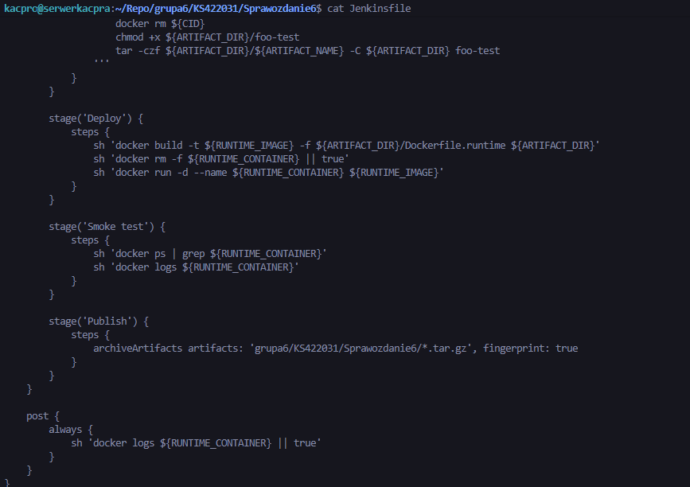
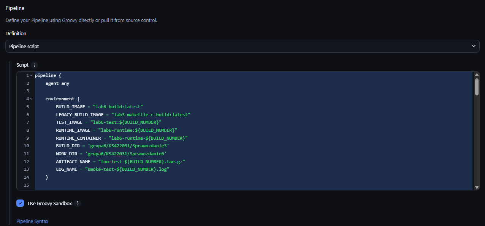
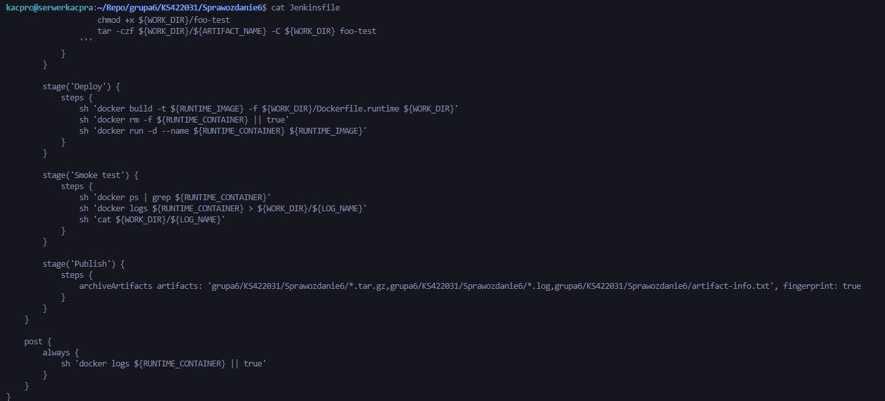
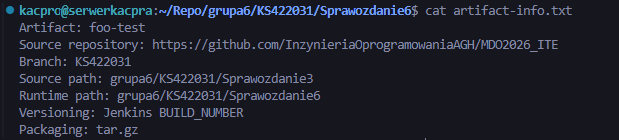
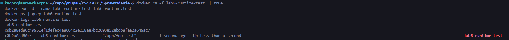

# Sprawozdanie - Lab 6

**Kacper Szlachta 422031**

---

## 1. Cel ćwiczenia

Celem ćwiczenia było rozszerzenie wcześniej przygotowanego środowiska Jenkins i Docker do postaci prostego pipeline CI/CD realizującego pełną ścieżkę krytyczną:

- commit / *manual trigger*
- clone
- build
- test
- deploy
- publish

Jako aplikację wybrano projekt `rikusalminen/makefile-for-c`. Program buduje się poprawnie, posiada dołączone testy oraz nadaje się do pokazania rozdzielenia etapów *build*, *test*, *deploy* i *publish*.

---

## 2. Przygotowanie artefaktu i kontenera runtime

Najpierw sprawdzono, jaki plik wykonywalny powstaje po kompilacji w obrazie build. W katalogu `/opt/makefile-for-c/src` był dostępny plik `foo-test`, który został przyjęty jako artefakt wykonywalny do dalszych etapów pipeline.

Następnie przygotowano lekki kontener uruchomieniowy `Dockerfile.runtime`, którego zadaniem było uruchomienie już zbudowanego pliku binarnego bez pełnego środowiska kompilacyjnego. Kontener runtime bazował na obrazie `ubuntu:24.04`, kopiował plik `foo-test` do katalogu `/app` i uruchamiał go jako proces startowy.

Dodatkowo lokalnie zbudowano testowy obraz runtime `lab6-runtime:test`, aby potwierdzić poprawność przygotowanego kontenera *deploy*. Po uruchomieniu kontenera `lab6-runtime-test` uzyskano poprawny start procesu.

---

## 3. Jenkinsfile i plan pipeline

Przygotowano plik `Jenkinsfile` opisujący przebieg pipeline. W konfiguracji użyto oddzielnych nazw dla obrazu build, obrazu testowego i obrazu deploy. Zmienna `BUILD_NUMBER` była wykorzystywana do wersjonowania obrazu testowego, obrazu runtime oraz artefaktów archiwizowanych po zakończeniu zadania.

Początkowo lokalny `Jenkinsfile` zawierał wersję pośrednią z klasycznym etapem `Deploy` opartym bezpośrednio o `Dockerfile.runtime` w katalogu `Sprawozdanie6`. Następnie w Jenkinsie wprowadzono końcową wersję skryptu, w której etap `Deploy` tworzył tymczasowy `Dockerfile.runtime` wewnątrz workspace, co pozwoliło obejść problem z dostępnością plików w zdalnym repozytorium.

Dodatkowo przygotowano plik `artifact-info.txt`, opisujący pochodzenie artefaktu: nazwę programu, repozytorium źródłowe, gałąź, ścieżkę źródła, ścieżkę runtime oraz sposób wersjonowania i pakowania.

---

## 4. Realizacja ścieżki krytycznej

### 4.1. Commit / manual trigger

Wykonanie pipeline było wyzwalane ręcznie z poziomu Jenkins, co spełniało wymaganie *manual trigger*. Zadanie zostało uruchomione jako obiekt `lab6-pipeline-scm`.

### 4.2. Clone

W etapie `Clone` Jenkins pobierał repozytorium `MDO2026_ITE`, wykonywał fetch gałęzi `KS422031` i przechodził do wskazanej rewizji. W logu było widoczne poprawne pobranie repozytorium oraz przełączenie na lokalną gałąź roboczą.

    Fetching upstream changes from https://github.com/InzynieriaOprogramowaniaAGH/MDO2026_ITE
    Checking out Revision 384eefedcd15edf49c588177e0f6495304eb1837
    > git checkout -b KS422031 384eefedcd15edf49c588177e0f6495304eb1837

### 4.3. Build

Etap `Build image` budował obraz `lab6-build:latest` na podstawie pliku `grupa6/KS422031/Sprawozdanie3/Dockerfile.build`. Dzięki temu kompilacja była wykonywana całkowicie wewnątrz kontenera buildowego. Dodatkowo po budowie wykonano tagowanie obrazu do `lab3-makefile-c-build:latest`, aby zachować zgodność ze starszym `Dockerfile.test`.

Z logu:

    + docker build -t lab6-build:latest -f grupa6/KS422031/Sprawozdanie3/Dockerfile.build grupa6/KS422031/Sprawozdanie3
    #9 [6/6] RUN make
    #10 naming to docker.io/library/lab6-build:latest done
    + docker tag lab6-build:latest lab3-makefile-c-build:latest

### 4.4. Test

Etap `Test image` budował osobny obraz `lab6-test:${BUILD_NUMBER}` na podstawie istniejącego `Dockerfile.test`. Następnie w etapie `Test` uruchamiano kontener testowy. W praktyce dawało to rozdzielenie obrazu budującego i obrazu testowego, przy czym kontener testowy był logicznie oparty o kontener build.

Z logu:

    + docker build -t lab6-test:13 -f grupa6/KS422031/Sprawozdanie3/Dockerfile.test grupa6/KS422031/Sprawozdanie3
    #6 [3/3] RUN make test
    #7 naming to docker.io/library/lab6-test:13 done

    + docker run --rm lab6-test:13

### 4.5. Package

Etap `Package` kopiował plik `foo-test` z obrazu build do katalogu roboczego `grupa6/KS422031/Sprawozdanie6`, nadawał mu prawa wykonania i pakował go jako archiwum `foo-test-${BUILD_NUMBER}.tar.gz`.

Z logu:

    + docker create lab6-build:latest
    + docker cp 450c364c5b45691f764de441a88a1c13ed73a92ecbfbac0687d36b8d341d410a:/opt/makefile-for-c/src/foo-test grupa6/KS422031/Sprawozdanie6/foo-test
    + chmod +x grupa6/KS422031/Sprawozdanie6/foo-test
    + tar -czf grupa6/KS422031/Sprawozdanie6/foo-test-13.tar.gz -C grupa6/KS422031/Sprawozdanie6 foo-test

### 4.6. Deploy

W etapie `Deploy` generowano tymczasowy `Dockerfile.runtime`, a następnie budowano obraz `lab6-runtime:${BUILD_NUMBER}`. Na końcu uruchamiano kontener `lab6-runtime-${BUILD_NUMBER}`. Taki sposób wdrożenia był poprawny dla prostego programu konsolowego: kontener runtime nie zawierał narzędzi kompilacyjnych, a jedynie gotowy plik wykonywalny.

Z logu:

    + cat Dockerfile.runtime
    FROM ubuntu:24.04
    WORKDIR /app
    COPY grupa6/KS422031/Sprawozdanie6/foo-test /app/foo-test
    RUN chmod +x /app/foo-test
    CMD ["/app/foo-test"]

    + docker build -t lab6-runtime:13 -f Dockerfile.runtime .
    #9 naming to docker.io/library/lab6-runtime:13 done

    + docker run -d --name lab6-runtime-13 lab6-runtime:13
    a6a68e33c83fc12ad851efb8660207dca217c8c706f8ac57dd4b886adbcbaa9b

### 4.7. Smoke test

W etapie `Smoke test` sprawdzano stan kontenera poleceniem `docker ps -a --filter "name=${RUNTIME_CONTAINER}"`, a następnie zapisywano log działania do pliku `smoke-test-${BUILD_NUMBER}.log`. Kontener kończył pracę kodem `0`, co w tym przypadku oznaczało poprawne uruchomienie programu w kontenerze *deploy*.

Z logu:

    + docker ps -a --filter name=lab6-runtime-13
    CONTAINER ID   IMAGE             COMMAND           CREATED        STATUS                              PORTS     NAMES
    a6a68e33c83f   lab6-runtime:13   "/app/foo-test"   1 second ago   Exited (0) Less than a second ago             lab6-runtime-13

    + docker logs lab6-runtime-13
    + cat grupa6/KS422031/Sprawozdanie6/smoke-test-13.log

### 4.8. Publish

W etapie `Publish` Jenkins archiwizował artefakty z katalogu `Sprawozdanie6`, w szczególności archiwum `foo-test-13.tar.gz` oraz log `smoke-test-13.log`. Artefakty były również objęte fingerprintingiem.

Z logu:

    [Pipeline] { (Publish)
    [Pipeline] archiveArtifacts
    Archiving artifacts
    Recording fingerprints

---

## 5. Wnioski

W trakcie ćwiczenia zrealizowano pełny, działający pipeline CI/CD dla niewielkiego projektu w języku C. Proces obejmował pobranie kodu, budowę obrazu kompilacyjnego, uruchomienie testów w osobnym kontenerze, spakowanie binarki, zbudowanie lekkiego kontenera runtime, wykonanie prostego *smoke testu* oraz publikację artefaktów w Jenkinsie. Najważniejszym wnioskiem z ćwiczenia było praktyczne rozdzielenie etapów *build*, *test* i *deploy*, dzięki czemu końcowy kontener uruchomieniowy nie zawierał zbędnych narzędzi kompilacyjnych. Dodatkowo pokazano, że nawet przy ograniczeniach związanych z repozytorium i aktualizacją gałęzi można zbudować poprawny pipeline, wykorzystując generowanie części plików tymczasowo wewnątrz workspace Jenkins.

## Listing historii poleceń

    docker run --rm lab3-makefile-c-build:latest bash -lc "ls -la /opt/makefile-for-c/src"

    cat > Dockerfile.runtime <<'EOF'
    FROM ubuntu:24.04

    WORKDIR /app
    COPY foo-test /app/foo-test

    RUN chmod +x /app/foo-test

    CMD ["/app/foo-test"]
    EOF

    cat Dockerfile.runtime

    CID=$(docker create lab3-makefile-c-build:latest)
    docker cp ${CID}:/opt/makefile-for-c/src/foo-test ./foo-test
    docker rm ${CID}
    chmod +x ./foo-test
    ls -la

    docker build -t lab6-runtime:test -f Dockerfile.runtime .

    docker rm -f lab6-runtime-test || true
    docker run -d --name lab6-runtime-test lab6-runtime:test
    docker ps | grep lab6-runtime-test
    docker logs lab6-runtime-test

    tar -czf foo-test-local.tar.gz foo-test
    ls -la

    cat > artifact-info.txt <<'EOF'
    Artifact: foo-test
    Source repository: https://github.com/InzynieriaOprogramowaniaAGH/MDO2026_ITE
    Branch: KS422031
    Source path: grupa6/KS422031/Sprawozdanie3
    Runtime path: grupa6/KS422031/Sprawozdanie6
    Versioning: Jenkins BUILD_NUMBER
    Packaging: tar.gz
    EOF

    cat artifact-info.txt

    docker system df
    docker volume ls
    docker ps -a
    docker images

    docker container prune -f
    docker image prune -f
    docker builder prune -f

    cat Jenkinsfile

    docker logs jenkins-blueocean --tail 120