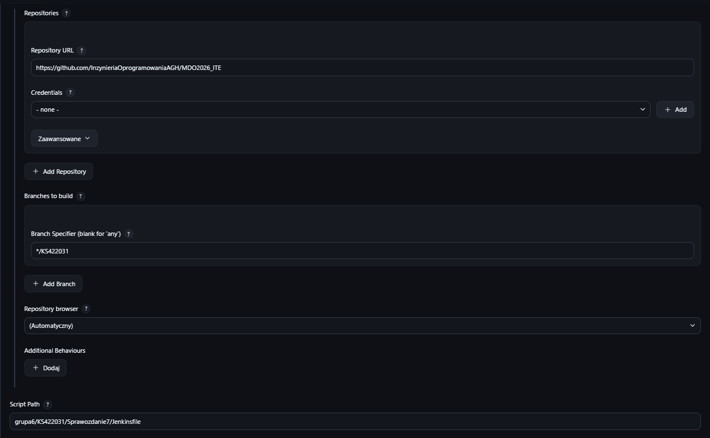
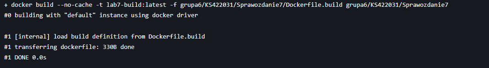
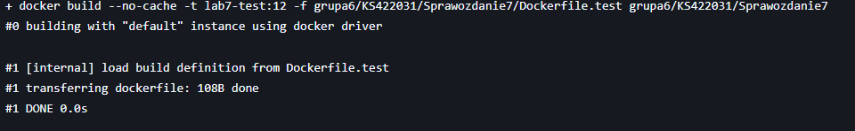
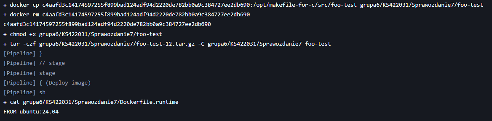
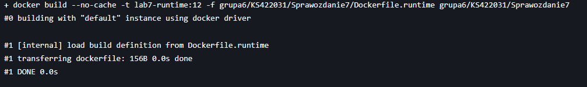
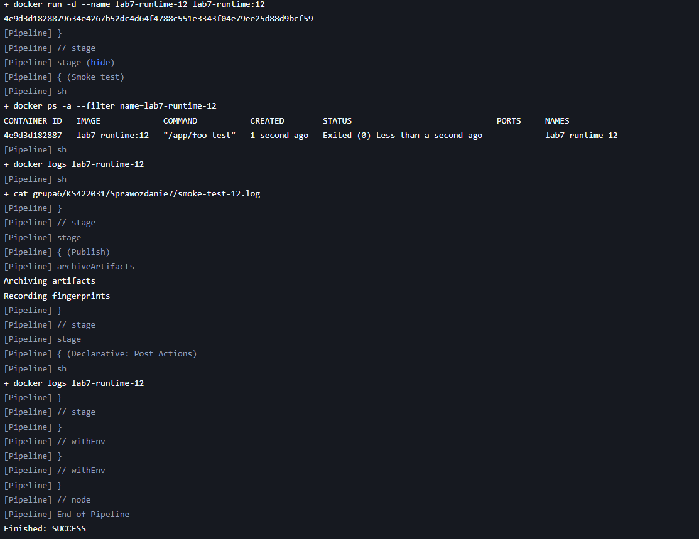
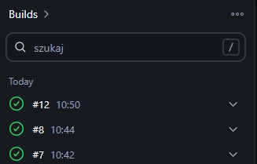

# Sprawozdanie - Lab 7  

**Kacper Szlachta 422031**

---

## 1. Cel ćwiczenia

Celem ćwiczenia było przygotowanie kompletnego pipeline’u CI/CD w *Jenkins*, który realizuje pełną ścieżkę: clone → build → test → package → deploy → smoke test → publish, z wykorzystaniem kontenerów *Docker* oraz projektu w języku C opartego na *Makefile*.

---

## 2. Realizacja pipeline

### 2.1. Konfiguracja zadania Jenkins

Pipeline został uruchomiony jako obiekt typu *pipeline (SCM)* wskazujący repozytorium `MDO2026_ITE` oraz gałąź `KS422031`. Plik *Jenkinsfile* był pobierany bezpośrednio z repozytorium, co umożliwiło pełną automatyzację procesu oraz wersjonowanie konfiguracji pipeline razem z kodem źródłowym.

---

### 2.2. Clone repozytorium

W początkowym etapie pipeline wykonywany był checkout repozytorium oraz przełączenie na odpowiednią gałąź. Jenkins usuwał wcześniej katalog roboczy (`deleteDir()`), a następnie pobierał aktualną wersję projektu i ustawiał ją jako workspace. W logu widoczne było poprawne przejście na gałąź `KS422031`, co gwarantowało pracę na właściwej wersji kodu.

Dodatkowo wykonano polecenia diagnostyczne (`ls`, `find`), które pozwoliły potwierdzić strukturę katalogów oraz obecność plików `Dockerfile`, `Jenkinsfile` i kodu źródłowego.

---

### 2.3. Build

W etapie *Build* zbudowano obraz `lab7-build:latest` na podstawie pliku `Dockerfile.build`. W pierwszym kroku instalowane były pakiety systemowe (`build-essential`, `make`), a następnie wykonywana była kompilacja projektu przy użyciu *Makefile*. Cały proces odbywał się w odizolowanym środowisku kontenera, co zapewniało powtarzalność buildów.

Z logu:

    docker build --no-cache -t lab7-build:latest ...

    RUN make
    cc -std=c99 -W -Wall -O0 -g -ggdb -c src/foo.c  
    cc src/foo-test.o libfoo.a libbar.a -o src/foo-test  

W wyniku tego etapu powstał plik wykonywalny `foo-test`, który stanowił podstawę dalszych kroków pipeline.

---

### 2.4. Test

Etap testowania został podzielony na dwie części. Najpierw zbudowano obraz `lab7-test:${BUILD_NUMBER}`, który bazował na obrazie build i zawierał środowisko do uruchomienia testów. Następnie w osobnym kroku uruchomiono kontener testowy.

Testy były wykonywane poprzez polecenie `make test`, które uruchamiało przygotowany program testowy. Rozdzielenie obrazu build i test pozwala na wyraźne oddzielenie procesu kompilacji od procesu weryfikacji poprawności działania aplikacji.

Z logu:

    docker build -t lab7-test:12 ...
    RUN make test

    docker run --rm lab7-test:12

Poprawne zakończenie oznaczało brak błędów i kod wyjścia równy 0.

---

### 2.5. Package

W etapie *Package* wykorzystano tymczasowy kontener utworzony z obrazu build, z którego skopiowano plik wykonywalny `foo-test` do katalogu roboczego Jenkins. Następnie nadano mu prawa wykonania oraz spakowano go do archiwum `.tar.gz`.

Takie podejście umożliwia oddzielenie artefaktu od obrazu Docker i jego dalsze wykorzystanie poza kontenerem.

Z logu:

    docker create lab7-build:latest  
    docker cp ...:/opt/.../foo-test foo-test  
    chmod +x foo-test  
    tar -czf foo-test-12.tar.gz foo-test  

---

### 2.6. Deploy

W etapie *Deploy image* przygotowano lekki obraz runtime, który zawierał jedynie skompilowany plik wykonywalny bez narzędzi kompilacyjnych. Dzięki temu końcowy obraz był znacznie mniejszy i bardziej optymalny.

Następnie uruchomiono kontener aplikacji, który wykonywał program jako proces startowy.

Z logu:

    FROM ubuntu:24.04  
    COPY foo-test /app/foo-test  
    CMD ["/app/foo-test"]  

    docker run -d --name lab7-runtime-12 lab7-runtime:12  

---

### 2.7. Smoke test

W etapie *Smoke test* sprawdzono, czy kontener uruchomił się poprawnie oraz czy aplikacja zakończyła działanie bez błędów. W tym celu użyto poleceń `docker ps` oraz `docker logs`.

Status kontenera:

    Exited (0)

oznacza, że aplikacja wykonała się poprawnie i zakończyła bez błędów. Jest to najprostsza forma testu końcowego potwierdzająca poprawność całego pipeline.

---

### 2.8. Publish

Ostatni etap pipeline odpowiadał za archiwizację artefaktów w Jenkinsie. Zapisane zostały pliki binarne oraz logi, co umożliwia ich późniejsze pobranie i analizę.

Dodatkowo Jenkins tworzy fingerprinty plików, co pozwala śledzić ich wykorzystanie w kolejnych buildach.

---

## 3. Podsumowanie

W ramach ćwiczenia przeanalizowano i uruchomiono pipeline zapisany w pliku *Jenkinsfile*, który realizuje pełny proces CI/CD dla aplikacji w języku C. Pipeline obejmuje wszystkie kluczowe etapy – od pobrania kodu, przez budowę i testowanie, aż do wdrożenia i publikacji artefaktów. Każdy etap został wykonany poprawnie, a końcowy *smoke test* potwierdził działanie aplikacji w kontenerze. Dodatkowo wielokrotne uruchomienie pipeline’u zakończyło się statusem SUCCESS, co potwierdza jego stabilność i powtarzalność.