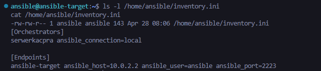
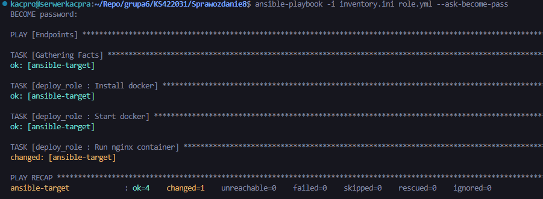
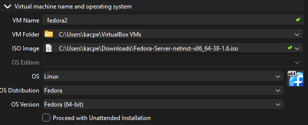
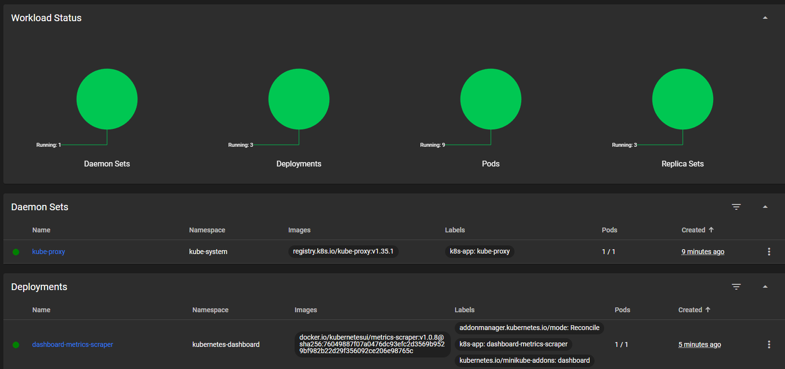
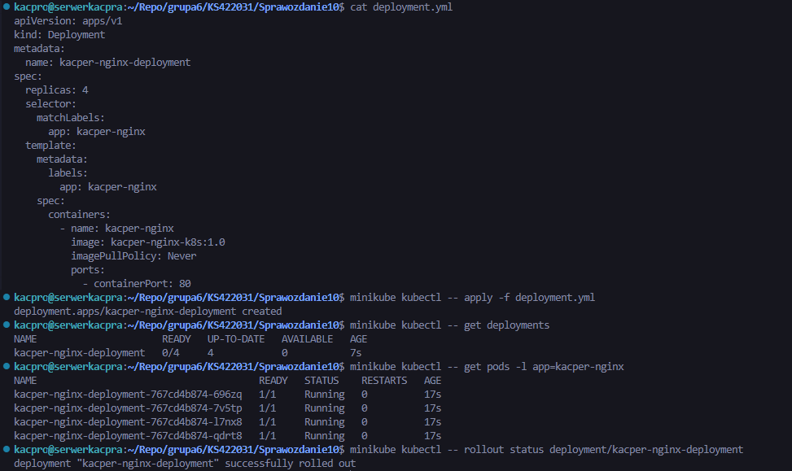
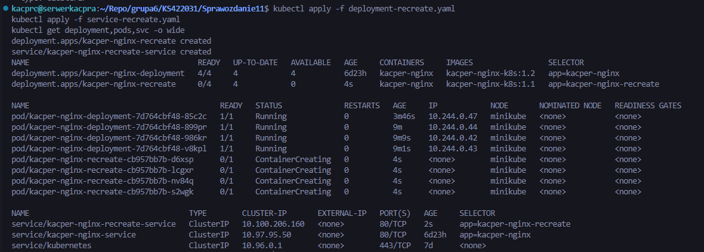
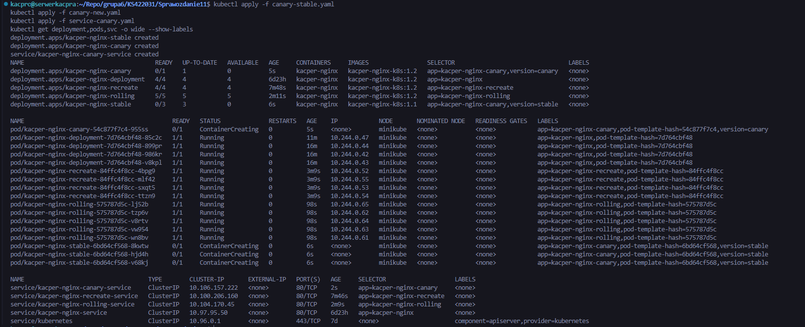
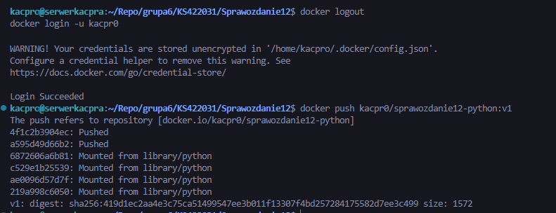
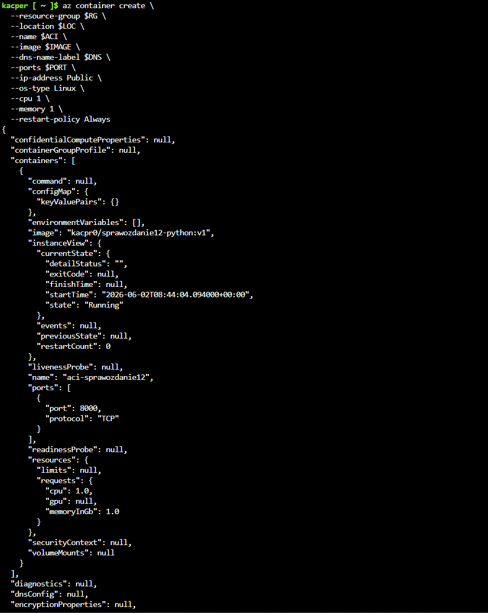
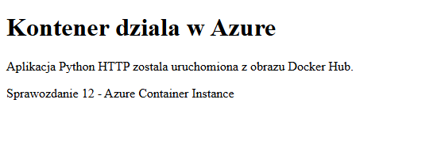

# Sprawozdanie zbiorcze — laboratoria 8–12

*Kacper Szlachta 422031*

## 1. Wstęp

Laboratoria 8–12 stanowiły kluczowy etap w pełnym zrozumieniu ekosystemu narzędzi DevOps, płynnie przechodząc od automatyzacji konfiguracji systemów i środowisk lokalnych, aż po zaawansowane techniki orkiestracji kontenerów oraz wdrażanie aplikacji w chmurze publicznej. W pierwszej fazie zajęć (laboratoria 8-9) skupiono się na fundamentalnej dla DevOps koncepcji Infrastructure as Code (IaC). Przy użyciu narzędzi takich jak Ansible i Vagrant udowodniono, że zarządzanie serwerami nie musi polegać na ręcznym wpisywaniu komend przez administratora, lecz może być procesem w pełni zautomatyzowanym, wersjonowanym i powtarzalnym. Zapewnia to identyczność środowisk deweloperskich, testowych i produkcyjnych.

W drugiej fazie (laboratoria 10-11) przeniesiono ciężar infrastruktury na konteneryzację w dużo większej skali, wprowadzając system Kubernetes (przy użyciu lokalnego klastra Minikube). Poznano nie tylko podstawowe obiekty orkiestracji (takie jak Pod, Deployment, czy Service), ale przede wszystkim skupiono się na zaawansowanych strategiach wdrażania (Recreate, Rolling Update, Canary Deployment). Te strategie rozwiązują jeden z najważniejszych problemów we współczesnym IT: jak zaktualizować aplikację na produkcji bez powodowania przerw w dostępie dla użytkowników końcowych.

Laboratorium 12 stanowiło zwieńczenie całego bloku, wprowadzając koncepcję usług chmurowych w modelu Serverless. Zbudowany obraz aplikacji został wypchnięty do publicznego rejestru Docker Hub, a następnie wdrożony bezpośrednio do chmury Microsoft Azure przy użyciu usługi Azure Container Instances (ACI). Pozwoliło to na oderwanie się od zarządzania infrastrukturą serwerową czy nawet klastrami, przerzucając ten obowiązek na dostawcę chmury.

Z perspektywy metodyki DevOps był to bardzo istotny etap. Wcześniejsze laboratoria (np. praca z Jenkinsem) uczyły budowania samej aplikacji, natomiast omawiany tu blok zajęć uczył zarządzania środowiskami, w których ta aplikacja ma działać. Pokazano kompletną drogę od zautomatyzowanego podniesienia wirtualnego serwera z bazowym systemem, poprzez orkiestrację tysięcy kontenerów, aż po nowoczesne wdrożenia w chmurze z publicznym adresem IP.

## 2. Zastosowane technologie i przebieg prac

### a) Automatyzacja konfiguracji infrastruktury z użyciem Ansible (lab 8)

Zajęcia ósme rozpoczęto od zapoznania się z Ansible – bezagentowym narzędziem do automatyzacji konfiguracji, które komunikuje się z zarządzanymi hostami poprzez protokół SSH. W pierwszym kroku skonfigurowano plik inwentarza `inventory.ini`, definiujący zarządzane hosty i ich parametry połączeniowe. Następnie przetestowano poprawność komunikacji za pomocą ad-hocowego modułu `ping`. 

Zamiast wykonywać pojedyncze komendy, przygotowano tzw. playbooki (pliki YAML) opisujące pożądany stan systemu, m.in. playbooki do instalacji silnika Docker (`install.yml`), zarządzania jego usługą oraz czyszczenia środowiska. Cechą charakterystyczną Ansible jest idempotencyjność – wielokrotne uruchomienie tego samego playbooka nie psuje systemu, lecz jedynie upewnia się, że osiągnięto zdefiniowany stan.

Kluczowym elementem laboratorium było wprowadzenie i wdrożenie ról w Ansible (`deploy_role`). Pozwoliły one na strukturyzację i modułowość kodu. Zamiast tworzyć monolityczne skrypty, konfiguracja została podzielona na mniejsze, logiczne podkatalogi: zadania (`tasks`), zmienne (`vars`), procedury obsługi zdarzeń (`handlers`) i ustawienia domyślne. Znacząco ułatwia to zarządzanie kodem infrastruktury, skalowanie projektów i wielokrotne wykorzystywanie gotowych komponentów w różnych środowiskach.

### b) Provisioning lokalnych środowisk z Vagrant (lab 9)

W dziewiątym laboratorium skupiono się na rozwiązaniu odwiecznego problemu programistów: "u mnie działa". Z wykorzystaniem narzędzia Vagrant zautomatyzowano proces budowania i zarządzania środowiskami maszyn wirtualnych. Stworzono deklaratywną konfigurację w pliku `Vagrantfile`, określającą rodzaj bazowego systemu operacyjnego (tzw. box) oraz zaawansowane ustawienia sieciowe maszyn (np. przekierowania portów czy prywatne adresy IP). Maszyny były uruchamiane w środowisku VirtualBox działającym pod spodem jako provider.

Dzięki temu udowodniono, że w ciągu kilku minut można w sposób całkowicie powtarzalny odtworzyć gotowe do pracy środowisko testowe. Nowy członek zespołu nie musi spędzać dni na ręcznej konfiguracji systemu – wystarczy wykonanie jednej komendy `vagrant up`, aby otrzymać maszynę wirtualną przygotowaną dokładnie tak samo, jak na komputerach reszty zespołu produkcyjnego.

### c) Orkiestracja kontenerów z Kubernetes – podstawy (lab 10)

Kolejne laboratorium stanowiło mocne wejście w świat orkiestracji systemów rozproszonych przy użyciu potężnego narzędzia, jakim jest Kubernetes (K8s). Za pomocą środowiska Minikube stworzono lokalny, jedno-węzłowy klaster, idealny do celów ewaluacyjnych. 

Przygotowano proste pliki manifestów w formacie YAML, definiujące podstawowe zasoby: `Deployment` oraz `Service`. `Deployment` posłużył do wdrożenia skonteneryzowanej aplikacji internetowej, dbając o utrzymanie pożądanej liczby replik (podów) i automatyczny restart w przypadku awarii. Zasób typu `Service` z kolei pozwolił na zgrupowanie podów i wystawienie ich na zewnątrz klastra ze stabilnym adresem IP. Użyto mechanizmu port-forwardingu, aby móc uzyskać bezpośredni, łatwy dostęp do uruchomionej usługi z poziomu przeglądarki na localhost.

Dodatkowo zapoznano się z narzędziem Kubernetes Dashboard, ułatwiającym wizualizację, zarządzanie i monitorowanie stanu całego klastra w formie przejrzystego interfejsu graficznego (GUI). Zrozumiano, że Kubernetes to "system operacyjny dla chmury", automatyzujący zarządzanie kontenerami i odciążający administratora z ręcznego sprawdzania ich stanu.

### d) Zaawansowane strategie wdrażania aplikacji w Kubernetes (lab 11)

Jedenaste laboratorium stanowiło obszerne rozszerzenie pracy z Kubernetesem, dotykając bardzo istotnego z punktu widzenia biznesowego aspektu: strategii aktualizacji oprogramowania (deployments) bez obniżania niezawodności usługi. W praktyce przećwiczono trzy główne podejścia, definiowane bezpośrednio w manifestach:

- **Recreate:** Podejście najbardziej inwazyjne, w którym stare pody są w całości usuwane (skalowane do zera) przed rozpoczęciem uruchamiania nowych instancji. Zaletą jest brak równoległego działania dwóch wersji aplikacji (co jest kluczowe np. przy niekompatybilnych zmianach schematu bazy danych), jednak wadą jest natychmiastowa przerwa w świadczeniu usług i pełna niedostępność dla klientów podczas aktualizacji.
- **Rolling Update:** Domyślna, bezpieczna strategia w Kubernetes. Pody wymieniane są stopniowo, instancja po instancji. Zapewnia to wdrożenie bezprzerwowe (Zero-Downtime Deployment). Wykorzystano tu kluczowe parametry `maxUnavailable` (maksymalna liczba niedostępnych podów podczas wymiany) oraz `maxSurge` (maksymalna liczba podów ponad pożądany stan), co daje inżynierowi pełną kontrolę nad wydajnością w trakcie aktualizacji.
- **Canary Deployment:** Skomplikowana, lecz niezwykle elastyczna metoda opierająca się na równoległym uruchomieniu starszej (stabilnej) i nowej (eksperymentalnej) wersji aplikacji. Odpowiedni balans ruchu osiągnięto konfigurując jeden wspólny `Service`, kierujący zapytania do podów opartych na ich etykietach (np. `version=stable` i `version=canary`). Pozwala to na skierowanie np. 10% ruchu produkcyjnego na nową funkcję, przetestowanie jej na "żywym" organizmie, i w razie sukcesu płynne zwiększenie wagi do 100%, chroniąc ogół użytkowników przed krytycznymi błędami.

Zrozumienie i biegłość w stosowaniu tych strategii pozwala na wyeliminowanie tak zwanych "okien serwisowych" odbywających się tradycyjnie w środku nocy.

### e) Wdrażanie aplikacji w chmurze publicznej – Azure Container Instances (lab 12)

Ostatnie z omawianych laboratoriów domknęło pętlę ciągłego dostarczania oprogramowania, wprowadzając środowisko chmury publicznej Microsoft Azure. Proces rozpoczęto od zbudowania obrazu prostej aplikacji serwującej komunikaty po protokole HTTP (napisanej w języku Python). Następnie obraz ten wypchnięto do globalnego rejestru kontenerów `Docker Hub`, czyniąc go dostępnym dla zewnętrznych serwerów.

Kluczowym punktem ćwiczenia była praca z interfejsem Azure Cloud Shell. Utworzono chmurową grupę zasobów, po czym za pomocą zaledwie jednego polecenia (`az container create`) wdrożono aplikację do chmury w ramach usługi Azure Container Instances. Jest to usługa klasyfikowana jako CaaS (Containers as a Service) oraz Serverless – zdejmuje ona z barków programisty całkowity obowiązek instalacji i konfiguracji wirtualnych maszyn bazowych. 

Wystarczyło podać adres obrazu, port komunikacyjny oraz zażądać zewnętrznego, publicznego adresu IP (opartego o automatycznie wygenerowane Fully Qualified Domain Name). Platforma Azure zaledwie w kilkadziesiąt sekund uruchomiła kontener. Przeprowadzono diagnozę, sprawdzając w interfejsie CLI status kontenera oraz jego ujednolicone logi, potwierdzając poprawne odbieranie zewnętrznych zapytań `GET`. Na koniec testowe zasoby zostały celowo i poprawnie usunięte komendą `az group delete`, wykazując dobrą praktykę inżynierską w optymalizacji i redukcji kosztów subskrypcji chmurowych.

