# Sprawozdanie – Lab 8  

**Kacper Szlachta 422031**

---

## 1. Cel ćwiczenia

Celem ćwiczenia było zapoznanie się z narzędziem *Ansible* do automatyzacji zarządzania systemami oraz przygotowanie środowiska umożliwiającego zdalne wykonywanie zadań administracyjnych. W ramach zajęć wykonano inwentaryzację hostów, przygotowano playbooki, przetestowano scenariusze awarii oraz wdrożono aplikację w kontenerze *Docker* z wykorzystaniem mechanizmu *roles*.

---

## 2. Realizacja

### 2.1. Konfiguracja środowiska

Utworzono dwie maszyny wirtualne: główną (*orchestrator*) oraz docelową (*endpoint*). Na maszynie docelowej ustawiono hostname `ansible-target` oraz utworzono użytkownika `ansible`. Na maszynie głównej zainstalowano *Ansible*.

Skonfigurowano dostęp SSH bez hasła pomiędzy maszynami przy użyciu kluczy, co umożliwiło automatyczne wykonywanie poleceń.

---

### 2.2. Inwentaryzacja hostów

Utworzono plik `inventory.ini`, w którym zdefiniowano grupy hostów oraz parametry połączenia.

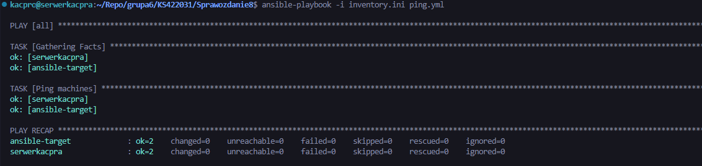

Zweryfikowano poprawność konfiguracji poprzez wysłanie polecenia ping do wszystkich maszyn.

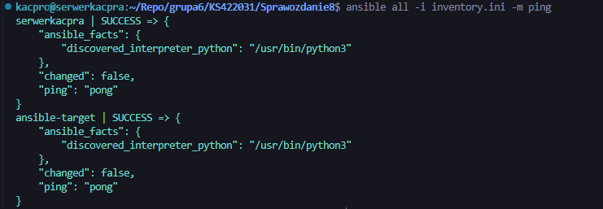

---

### 2.3. Playbooki

#### Ping hostów

Przygotowano playbook umożliwiający sprawdzenie dostępności wszystkich maszyn.

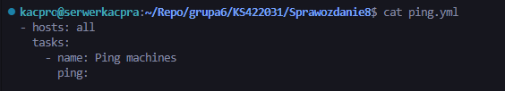  

---

#### Kopiowanie pliku inwentaryzacji

Zrealizowano kopiowanie pliku `inventory.ini` na maszynę docelową. Ponowne wykonanie operacji nie wprowadziło zmian (*changed=0*), co potwierdza idempotentność.

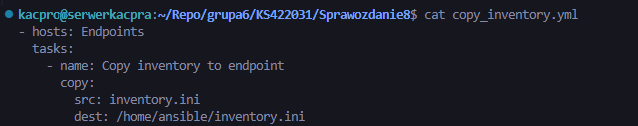  
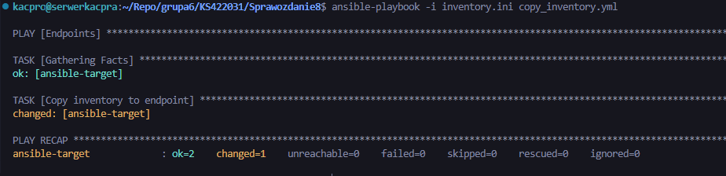  
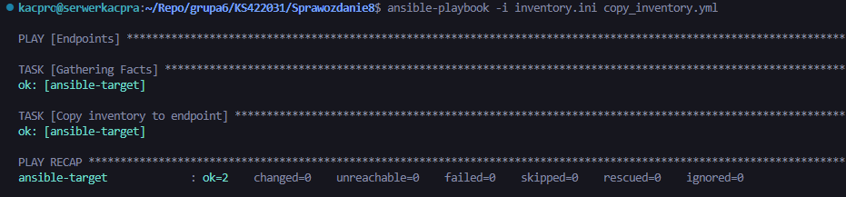

---

#### Instalacja pakietów

Zainstalowano pakiety `nginx` oraz `rng-tools` na maszynie docelowej.

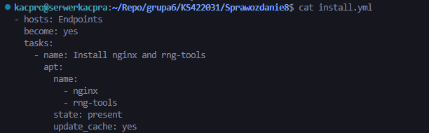  
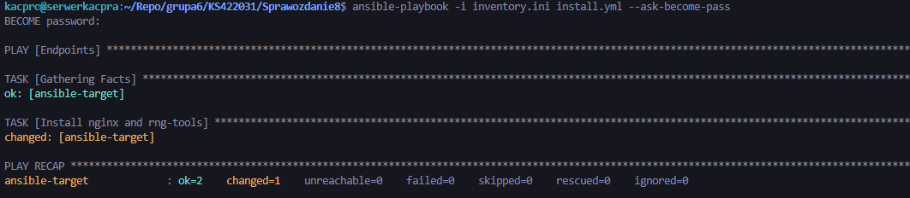

---

#### Restart usług

Zrestartowano usługi systemowe, w tym serwer SSH oraz generator liczb losowych.

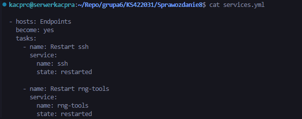  
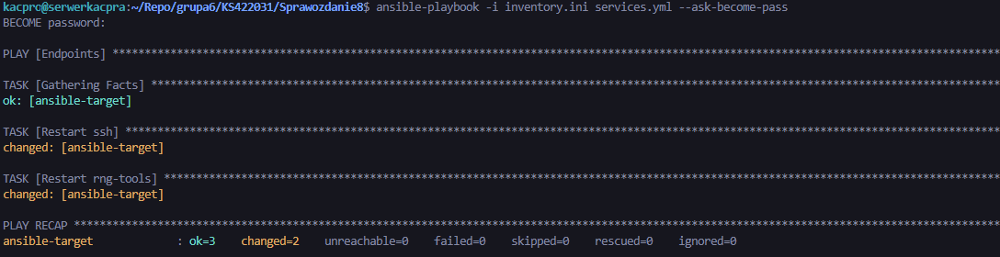

---

### 2.4. Test awarii

Przeprowadzono symulację awarii poprzez wyłączenie usługi SSH na maszynie docelowej. W wyniku tego komunikacja została przerwana, a Ansible zwrócił błąd *UNREACHABLE*.

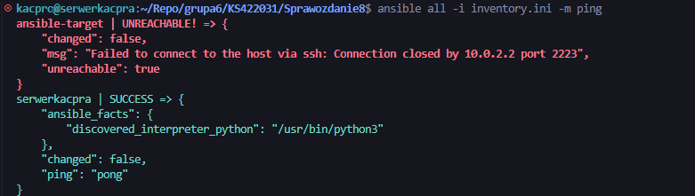

Po przywróceniu usługi SSH komunikacja została wznowiona.

---

### 2.5. Zarządzanie artefaktem – Docker

#### Instalacja Dockera

Na maszynie docelowej zainstalowano środowisko *Docker* przy użyciu Ansible.

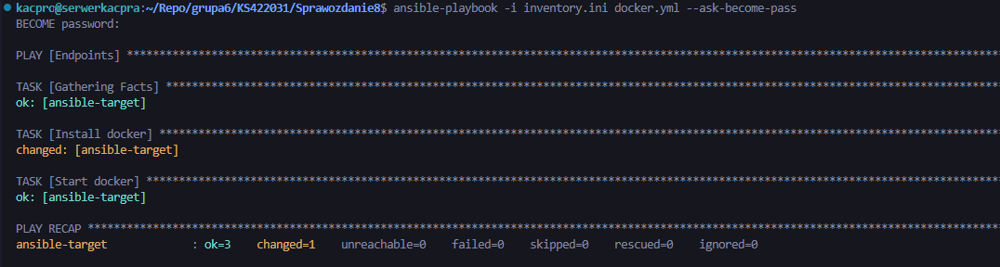

---

#### Sanity check

Przed wdrożeniem sprawdzono stan usługi Docker, co pozwoliło upewnić się, że środowisko jest poprawnie przygotowane.

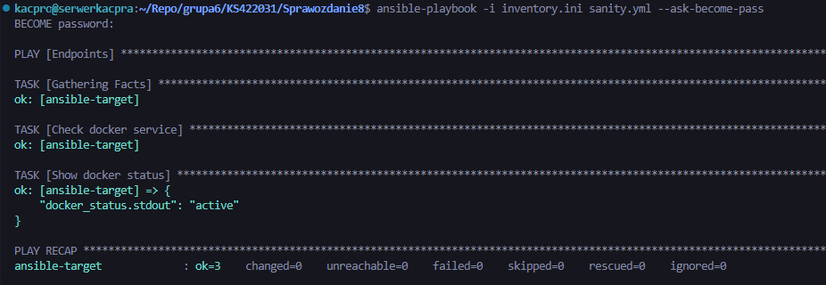

---

#### Uruchomienie kontenera

Uruchomiono kontener z serwerem *nginx*. Poprawność działania została zweryfikowana poprzez zapytanie HTTP.

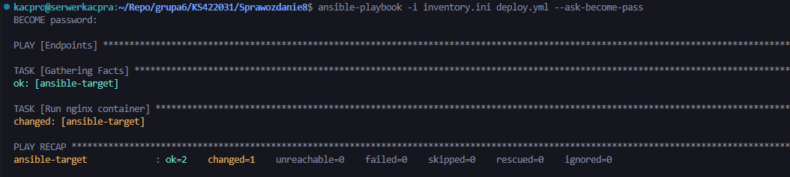  
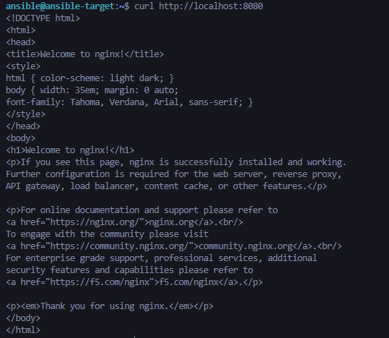

---

#### Usunięcie kontenera

Po zakończeniu testów kontener został zatrzymany i usunięty.

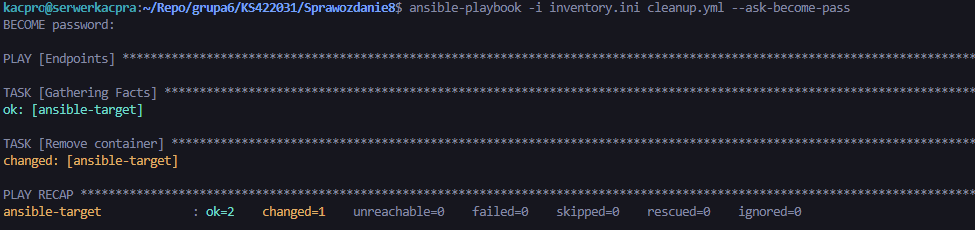

---

### 2.6. Roles

Utworzono rolę przy użyciu narzędzia *ansible-galaxy*, a następnie zdefiniowano w niej zadania związane z instalacją Dockera oraz uruchomieniem kontenera.

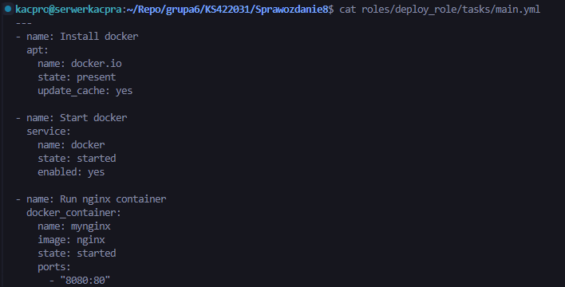

Uruchomienie roli zakończyło się powodzeniem.

---

## 3. Podsumowanie

W ramach ćwiczenia skonfigurowano środowisko zarządzane przez *Ansible* oraz przygotowano zestaw playbooków umożliwiających automatyzację zadań administracyjnych. Wykonano inwentaryzację hostów, instalację pakietów, zarządzanie usługami oraz wdrożenie aplikacji w kontenerze *Docker*. Test awarii potwierdził poprawność działania systemu w przypadku niedostępności hosta. Zastosowanie mechanizmu *roles* umożliwiło uporządkowanie konfiguracji oraz zwiększenie jej modularności i czytelnościv