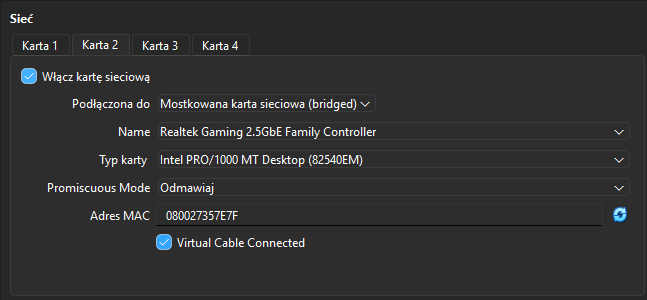
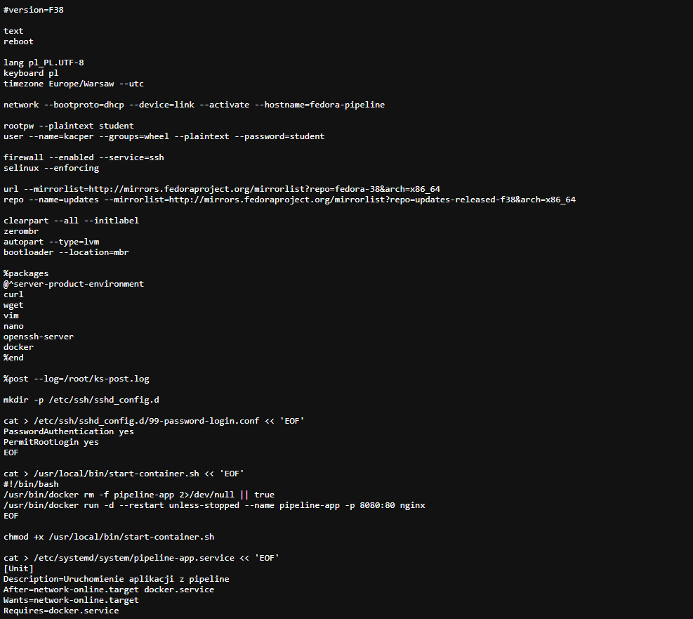
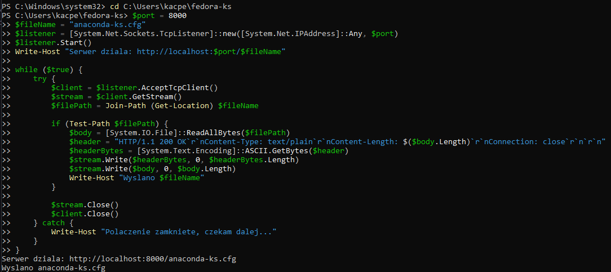
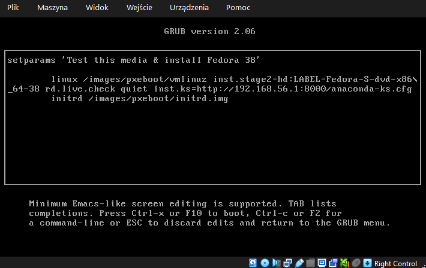
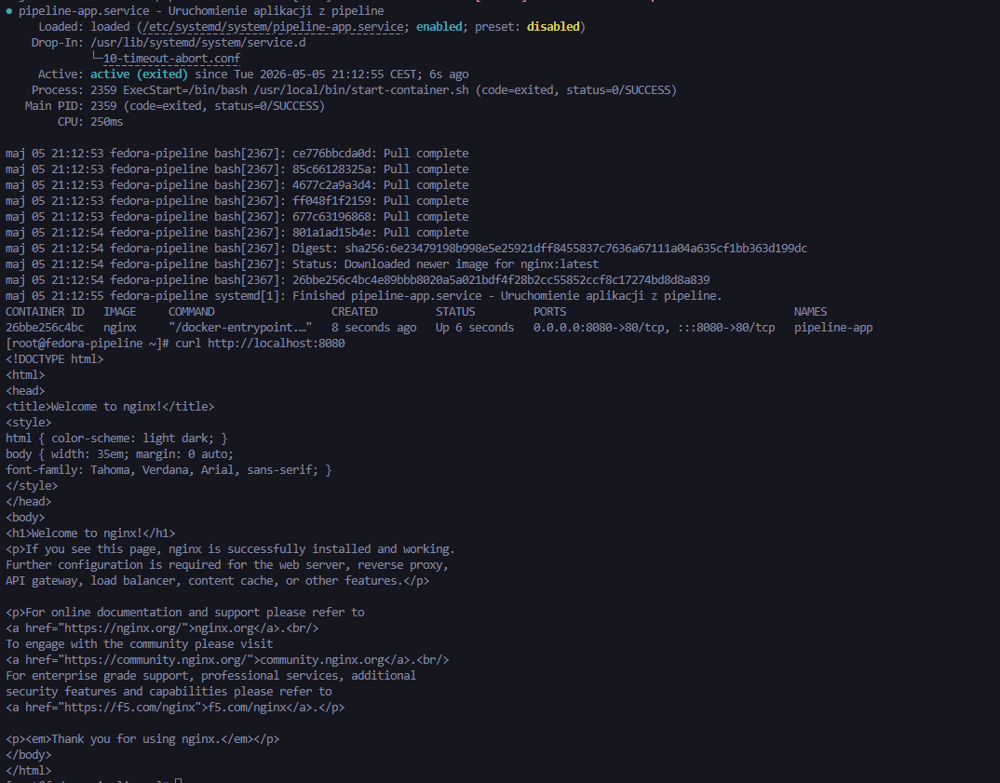
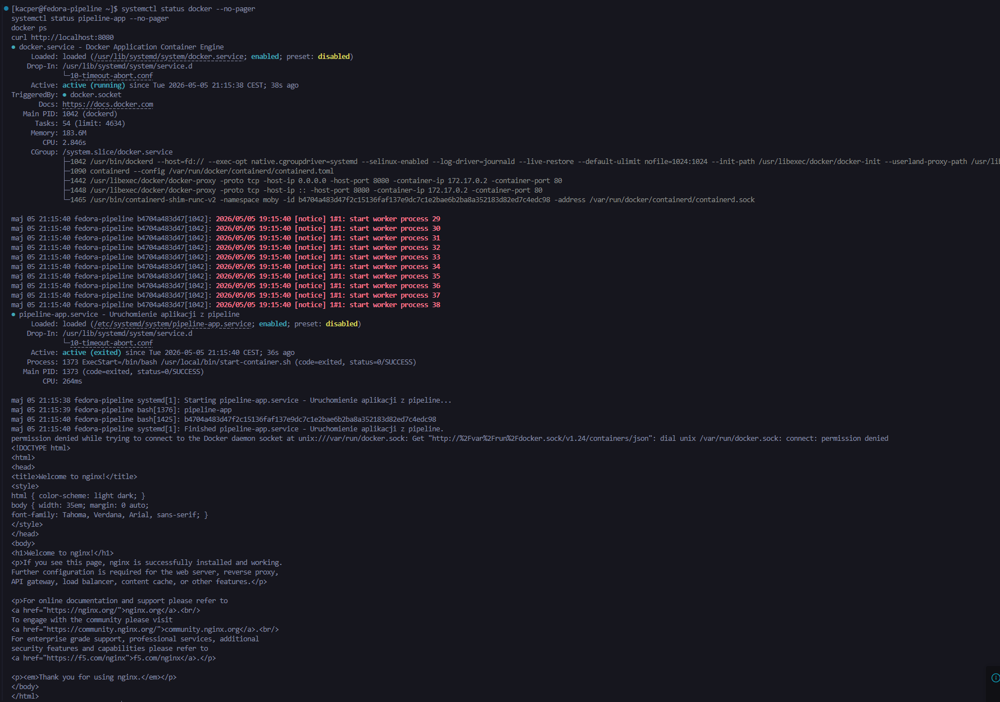

# Sprawozdanie - Lab 9

**Kacper Szlachta 422031**

---

## 1. Cel ćwiczenia

Celem ćwiczenia było przeprowadzenie nienadzorowanej instalacji systemu *Fedora 38* z wykorzystaniem pliku odpowiedzi *Kickstart*. Instalacja została wykonana na maszynie wirtualnej w *VirtualBox*, uruchomionej z obrazu ISO *Fedora Server Netinstall*. Plik odpowiedzi `anaconda-ks.cfg` został udostępniony przez serwer HTTP i wskazany instalatorowi za pomocą parametru `inst.ks`.

---

## 2. Realizacja instalacji

### 2.1. Przygotowanie maszyny wirtualnej

Utworzono nową maszynę wirtualną `fedora2` z systemem typu *Linux / Fedora 64-bit*. Jako nośnik instalacyjny wykorzystano obraz `Fedora-Server-netinst-x86_64-38-1.6.iso`. Wyłączono mechanizm *Unattended Installation* dostępny w VirtualBox, ponieważ instalacja miała być sterowana przez plik odpowiedzi *Kickstart*, a nie przez kreator VirtualBoxa.

Maszyna została podłączona do sieci w trybie *bridged*, dzięki czemu instalator Fedory mógł pobrać plik odpowiedzi z serwera HTTP uruchomionego na hoście.

---

### 2.2. Plik odpowiedzi Kickstart

Do instalacji przygotowano plik `anaconda-ks.cfg`, w którym zdefiniowano ustawienia języka, klawiatury, strefy czasowej, sieci, użytkowników, repozytoriów, partycjonowania oraz pakietów. Plik zawierał także sekcję `%post`, odpowiedzialną za konfigurację usług po zakończeniu instalacji systemu.

W pliku ustawiono nazwę hosta inną niż domyślna:

    network --bootproto=dhcp --device=link --activate --hostname=fedora-pipeline

Dodano repozytoria Fedory 38:

    url --mirrorlist=http://mirrors.fedoraproject.org/mirrorlist?repo=fedora-38&arch=x86_64
    repo --name=updates --mirrorlist=http://mirrors.fedoraproject.org/mirrorlist?repo=updates-released-f38&arch=x86_64

Zapewniono automatyczne formatowanie całego dysku:

    clearpart --all --initlabel
    zerombr
    autopart --type=lvm

Dodano automatyczne ponowne uruchomienie po zakończeniu instalacji:

    reboot

---

### 2.3. Udostępnienie pliku odpowiedzi w sieci

Plik `anaconda-ks.cfg` został udostępniony przez prosty serwer HTTP uruchomiony w PowerShellu. Serwer nasłuchiwał na porcie `8000` i zwracał plik odpowiedzi instalatorowi Fedory.

Z PowerShella:

    cd C:\Users\kacpe\fedora-ks

    $port = 8000
    $fileName = "anaconda-ks.cfg"

    Serwer dziala: http://localhost:8000/anaconda-ks.cfg
    Wyslano anaconda-ks.cfg

Instalatorowi wskazano plik odpowiedzi przez dopisanie parametru w menu GRUB:

    inst.ks=http://192.168.56.1:8000/anaconda-ks.cfg

Dzięki temu nośnik instalacyjny uruchamiał instalator Fedory, a konfiguracja instalacji była pobierana z pliku odpowiedzi dostępnego w sieci.

---

### 2.4. Sekcja `%packages`

W sekcji `%packages` wskazano pakiety wymagane do działania systemu oraz uruchomienia programu po instalacji. Najważniejszym pakietem był *Docker*, ponieważ program został uruchomiony jako kontener.

    %packages
    @^server-product-environment
    curl
    wget
    vim
    nano
    openssh-server
    docker
    %end

Pakiet `openssh-server` umożliwił późniejsze połączenie z maszyną przez SSH oraz pracę z poziomu *Visual Studio Code*.

---

### 2.5. Sekcja `%post`

Sekcja `%post` została wykorzystana do konfiguracji systemu po zakończeniu instalacji pakietów. W jej ramach przygotowano konfigurację SSH, skrypt uruchamiający kontener oraz usługę *systemd*, która startuje program po uruchomieniu systemu.

Działania sekcji `%post` zapisywano do pliku logu:

    %post --log=/root/ks-post.log

Utworzono skrypt `/usr/local/bin/start-container.sh`:

    #!/bin/bash
    /usr/bin/docker rm -f pipeline-app 2>/dev/null || true
    /usr/bin/docker run -d --restart unless-stopped --name pipeline-app -p 8080:80 nginx

Następnie nadano mu prawa wykonywania:

    chmod +x /usr/local/bin/start-container.sh

Utworzono usługę `pipeline-app.service`, która uruchamia skrypt po starcie systemu:

    [Unit]
    Description=Uruchomienie aplikacji z pipeline
    After=network-online.target docker.service
    Wants=network-online.target
    Requires=docker.service

    [Service]
    Type=oneshot
    ExecStart=/bin/bash /usr/local/bin/start-container.sh
    RemainAfterExit=yes

    [Install]
    WantedBy=multi-user.target

Usługi zostały włączone automatycznie:

    systemctl enable sshd.service
    systemctl enable docker.service
    systemctl enable pipeline-app.service

Docker nie był uruchamiany bezpośrednio w instalatorze poleceniem `docker run`. Zamiast tego w sekcji `%post` przygotowano usługę, która uruchamia kontener dopiero po pierwszym normalnym starcie systemu.

---

## 3. Weryfikacja działania

Po zakończeniu instalacji system uruchomił się z dysku. Sprawdzono działanie usług oraz kontenera. Przed restartem `docker.service` był aktywny, a usługa `pipeline-app.service` zakończyła się poprawnie, uruchamiając kontener `pipeline-app`.

Z terminala:

    systemctl status docker --no-pager
    systemctl status pipeline-app --no-pager
    docker ps
    curl http://localhost:8080

Wynik `docker ps` potwierdził działanie kontenera:

    pipeline-app
    0.0.0.0:8080->80/tcp

Polecenie `curl` zwróciło stronę testową *nginx*, co potwierdziło działanie programu wewnątrz systemu.

Następnie wykonano restart maszyny. Po ponownym uruchomieniu systemu ponownie sprawdzono status usług i kontenera. Docker działał jako usługa systemowa, `pipeline-app.service` była włączona, a kontener `pipeline-app` nadal był uruchomiony.

---

## 4. Podsumowanie

W ramach ćwiczenia wykonano nienadzorowaną instalację systemu *Fedora 38* z użyciem pliku odpowiedzi *Kickstart*. Plik `anaconda-ks.cfg` zawierał wymagane repozytoria, automatyczne formatowanie dysku, własny hostname oraz listę pakietów potrzebnych do działania systemu i kontenera. Instalator został uruchomiony z obrazu ISO, a plik odpowiedzi został wskazany przez parametr `inst.ks` i pobrany z serwera HTTP. W sekcji `%post` przygotowano skrypt startowy oraz usługę *systemd*, dzięki czemu po pierwszym uruchomieniu system automatycznie uruchamiał kontener Dockera. Poprawność instalacji i działania programu potwierdzono poleceniami `systemctl`, `docker ps` oraz `curl http://localhost:8080`.