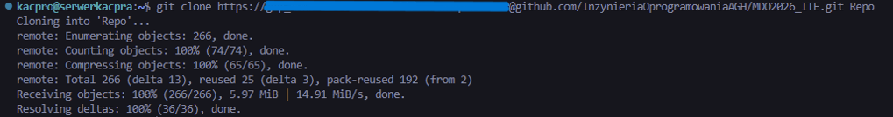
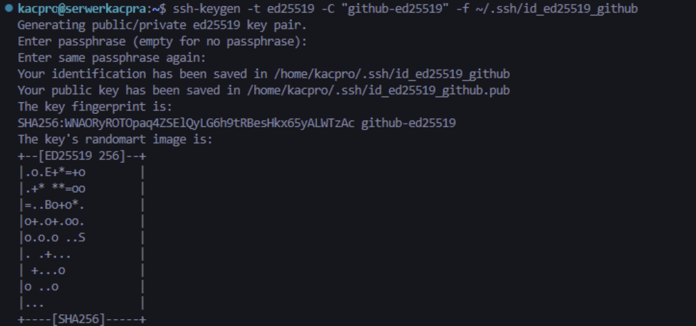
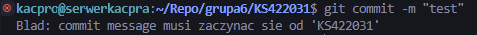
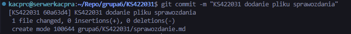

# Sprawozdanie - Lab 1

**Kacper Szlachta 422031**

---

## 1. Narzędzia

### 1.1. Konfiguracja dostępu do repozytorium i maszyny wirtualnej w edytorze IDE
Środowisko pracy zostało przygotowane w *Visual Studio Code* z wykorzystaniem maszyny wirtualnej.

### 1.2. Natychmiastowa wymiana plików ze środowiskiem pracy
Do wymiany plików wykorzystano program *FileZilla* i protokół *SFTP*. Połączenie zostało zestawione z maszyną wirtualną przez adres `127.0.0.1` oraz port `2222`. 


---

## 2. Git

### 2.1. Instalacja klienta Git i obsługa kluczy SSH
W środowisku linuksowym zainstalowano i skonfigurowano klienta *Git*. Następnie przygotowano obsługę kluczy *SSH*.

### 2.2. Klonowanie repozytorium przedmiotowego za pomocą HTTPS i personal access token
Repozytorium zostało sklonowane z użyciem protokołu *HTTPS* oraz *personal access token*.



---

## 3. SSH

### 3.1. Utworzenie dwóch kluczy SSH innych niż RSA
Utworzono dwa klucze *SSH* inne niż *RSA*: klucz *ed25519* oraz klucz *ecdsa 521*. ed25519 to ten z hasłem.

#### Klucz *ed25519*


#### Klucz *ecdsa 521*


### 3.2. Dodanie kluczy do agenta SSH
Uruchomiono *ssh-agent* i dodano do niego oba utworzone klucze.


### 3.3. Konfiguracja klucza SSH jako metody dostępu do GitHuba
Klucz publiczny został dodany do konta *GitHub*. Następnie wykonano test połączenia z serwisem.


### 3.4. Klonowanie repozytorium z wykorzystaniem protokołu SSH
Repozytorium zostało sklonowane również z użyciem protokołu *SSH*.


### 3.5. Konfiguracja uwierzytelniania dwuskładnikowego
Na koncie *GitHub* już kiedyś skonfigurowano uwierzytelnianie dwuskładnikowe z użyciem aplikacji *Authenticator*.


---

## 4. Gałąź

### 4.1. Przełączenie na gałąź `main`, a następnie na gałąź grupy

### 4.2. Utworzenie własnej gałęzi
Utworzono gałąź roboczą o nazwie `KS422031`.

### 4.3. Rozpoczęcie pracy na nowej gałęzi
W katalogu grupy utworzono katalog `KS422031`. Następnie przygotowano skrypt *git hook* weryfikujący początek komunikatu *commit message*. Hook sprawdza, czy komunikat zaczyna się od wymaganego prefiksu `KS422031`.

### 4.4. Treść githooka
```sh
#!/bin/sh

PREFIX="KS422031"

MSG_FILE="$1"
FIRST_LINE=$(head -n 1 "$MSG_FILE")

case "$FIRST_LINE" in
  "$PREFIX"*)
    exit 0
    ;;
  *)
    echo "Blad: commit message musi zaczynac sie od '$PREFIX'"
    exit 1
    ;;
esac
```
### 4.5. Weryfikacja działania hooka
Działanie hooka zostało sprawdzone na dwóch przykładach. W pierwszej próbie wykonano commit z komunikatem `test`, który nie zawierał wymaganego prefiksu. Skrypt poprawnie zablokował operację i zwrócił komunikat o błędzie. W drugiej próbie zastosowano poprawny komunikat rozpoczynający się od `KS422031`, dzięki czemu commit został zaakceptowany.

#### Niepoprawny commit


#### Poprawny commit
