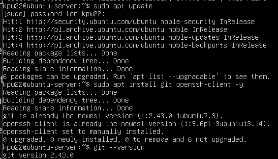
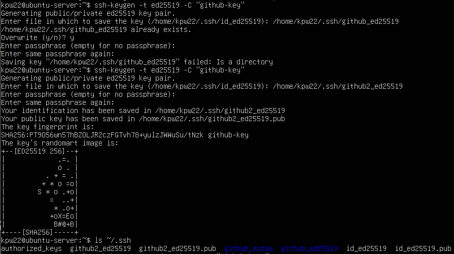
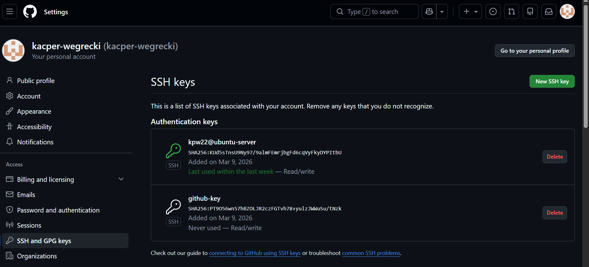
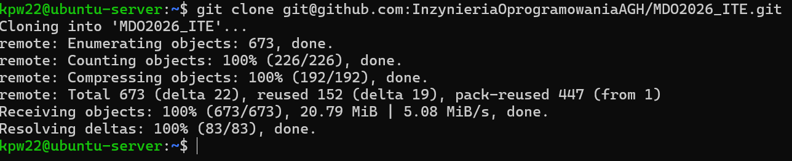
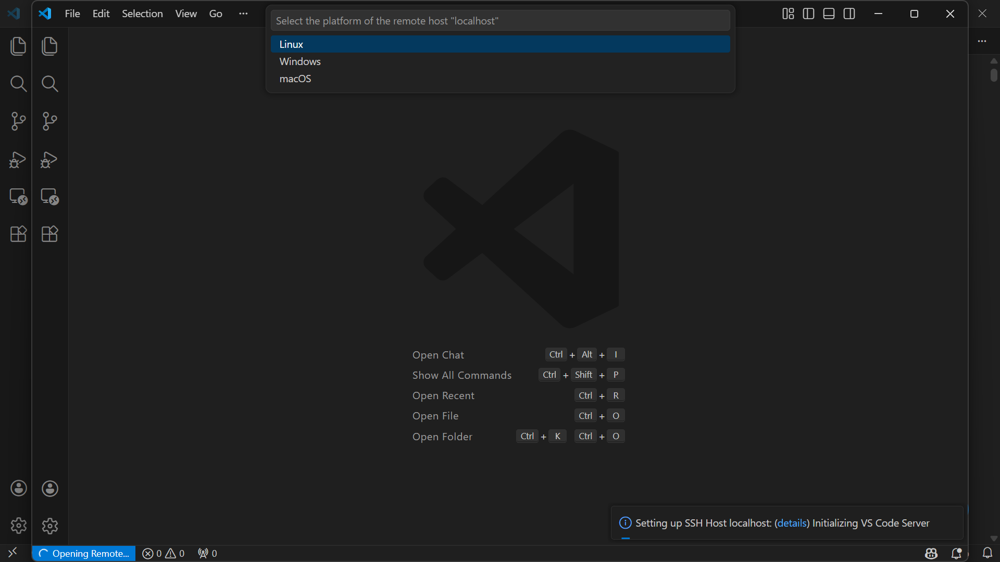
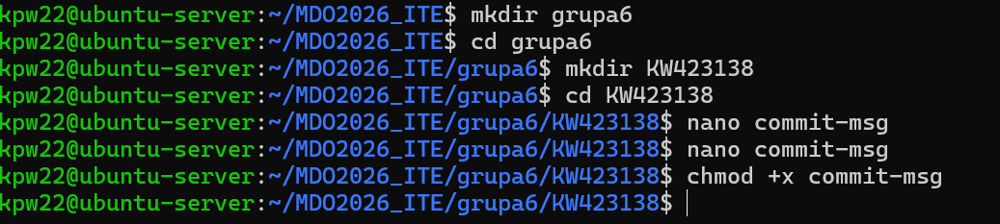

# Srodowisko
Ćwiczenie wykonywane było na Ubuntu Serverze, pracującym na maszynie wirtualnej oraz w terminalu hosta połączonym przez SSH z wirtualką.

1. Git
Instalacja klienta Git i obsługa kluczy SSH na maszynie wirtualnej:

2. Klucze SSH
Utworzenie dwóch kluczy SSH

Konfiguracja klucza SSH jako metoda dostępu do GitHuba:

Sklonowanie repozytorium z wykorzystaniem SSH:

Konfiguracja uwierzytelniania dwuskładnikowego na koncie GitHub:

3. Narzędzia
Konfiguracja Visual Studio Code:

Zainstalowanie FileZilla + konfiguracja:

4. Gałąź

Przełączenie się na gałąź main, a potem na gałąź swojej grupy,
utworzenie gałęzi o nazwie "inicjały & nr indeksu"

Skrypt:
#!/bin/bash

if [[ "$1" != KW423138* ]]; then
echo "Commit message musi zaczynać się od KW423138"
exit 1
fi

