# Sprawozdanie - zajęcia 10

### Instalacja klastra Kubernetes

1. Instalacja minikube, kubernetes

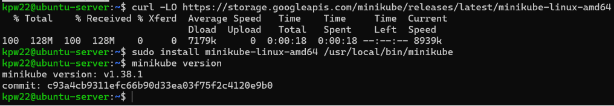
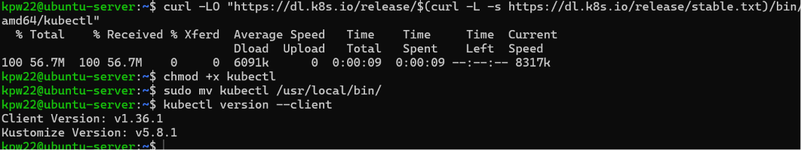

2. Uruchomienie, dodanie użytkownika do grupy sudo

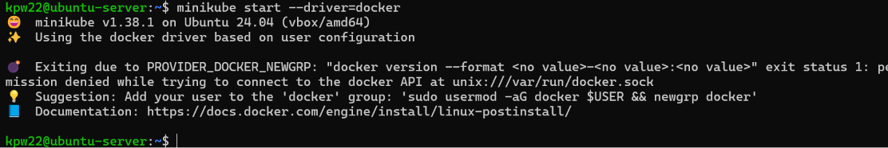
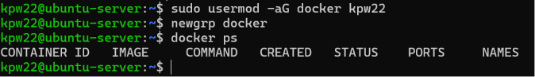
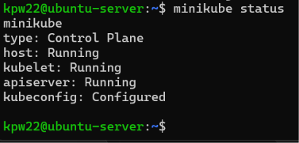
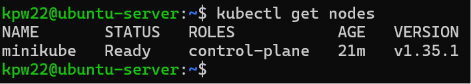

3. Uruchomienie dashboard, otworzenie w przeglądarce

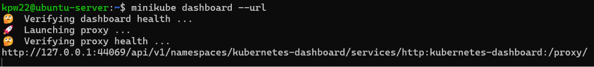
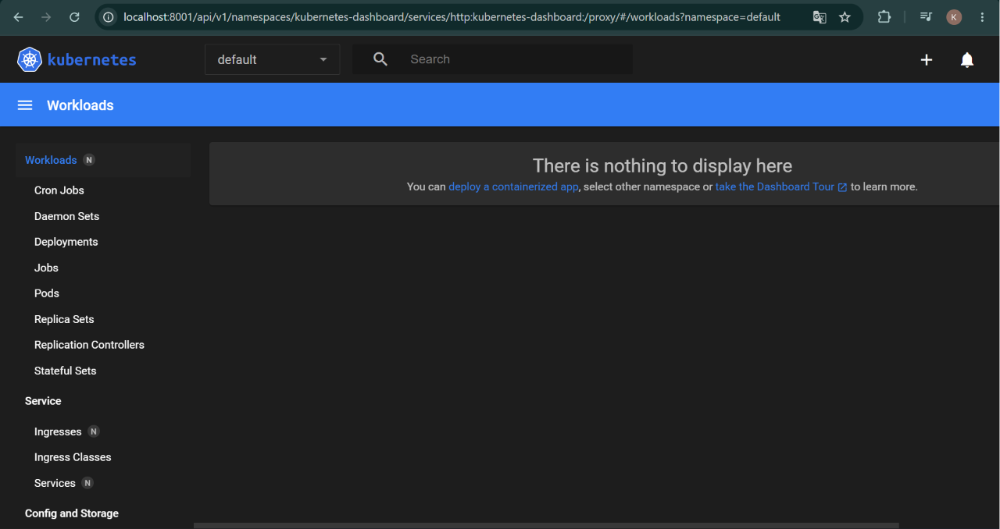

4. Sprawdzenie działalności klastra

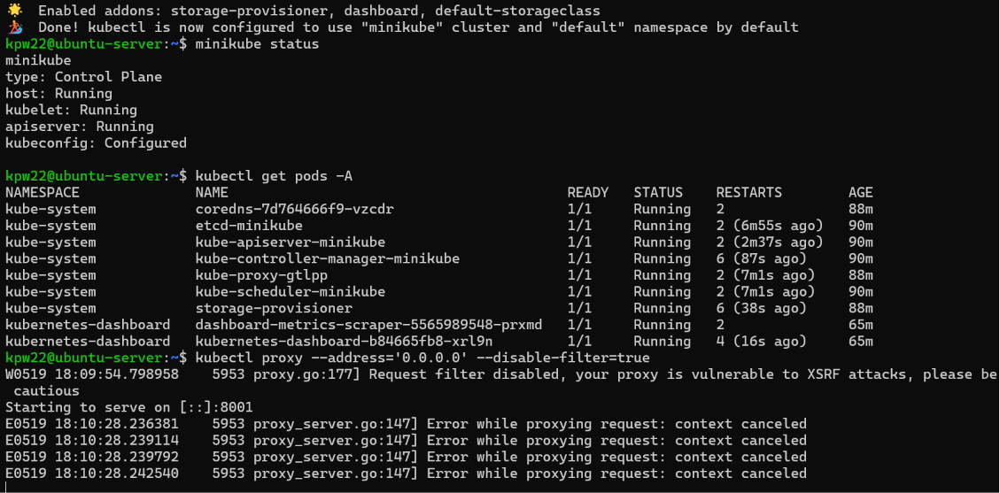

### Analiza posiadanego kontenera

1. Budowanie, sprawdzanie i uruchomienie obrazu

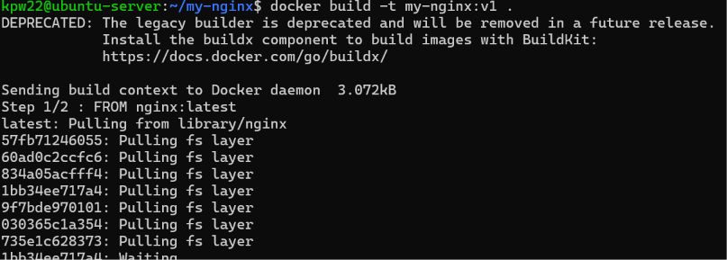
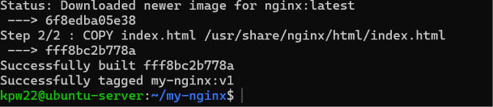
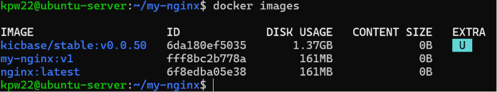
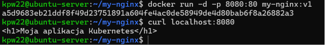

### Uruchomienie aplikacji w Kubernetes

1. Uruchomienie, sprawdzenie poda, sprawdzenie w przeglądarce

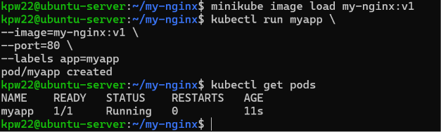


```
kubectl port-forward pod/myapp 8080:80
```

### Przekucie wdrożenia manualnego w plik wdrożenia

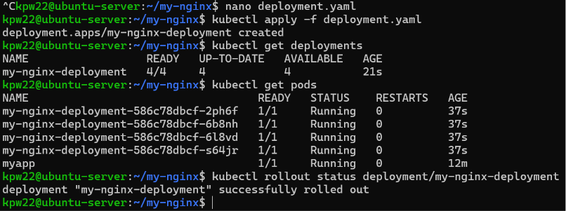
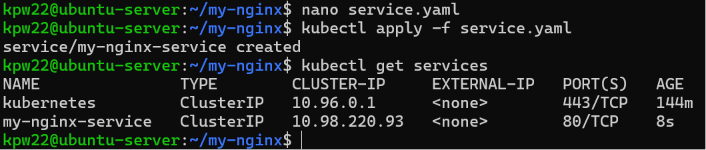
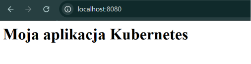
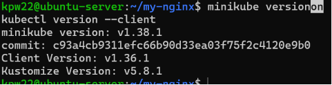
