# Sprawozdanie - zajęcia 11

### Przygotowanie nowego obrazu

1. Przygotowanie dwóch wersji obrazów w katalogu app:
```
app/
 ├── Dockerfile
 └── index.html
```

#### Index.html
```
<h1>Wersja 1</h1>
```
#### Dockerfile
```Dockerfile
FROM httpd:2.4
COPY index.html /usr/local/apache2/htdocs/index.html
```

2. Budowanie:

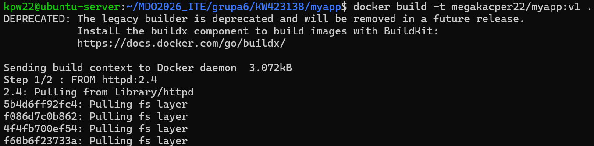
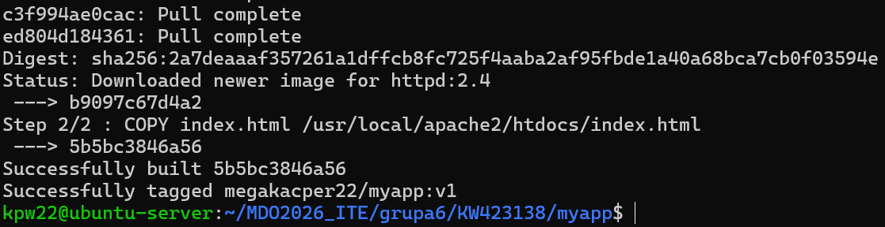

3. Wysłanie do Docker Hub:

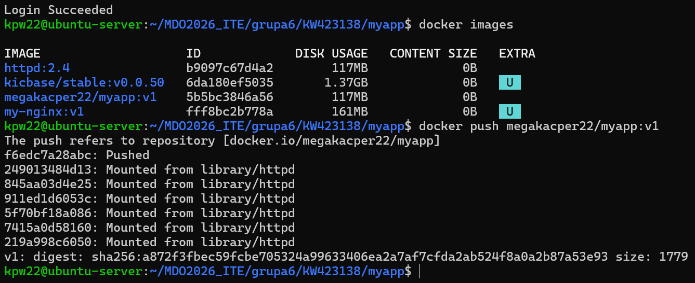
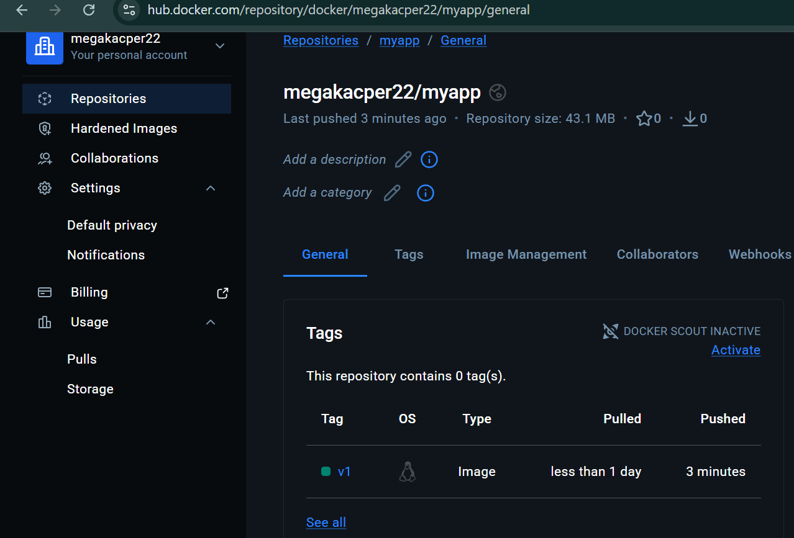

4. Przygotowanie drugiej wersji (v2) i wersji wadliwej, budowanie, push, uruchomienie:

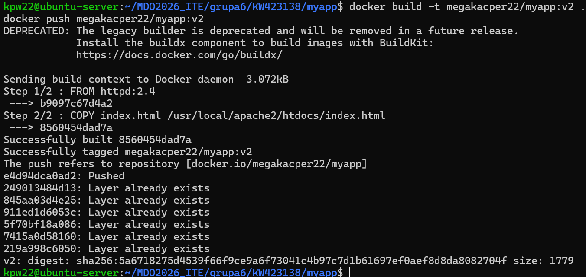
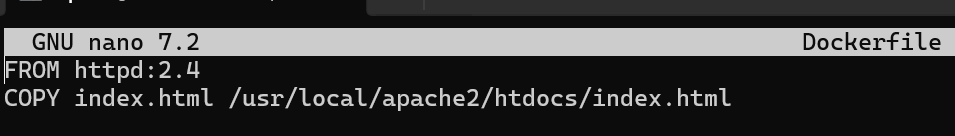
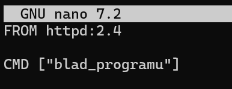
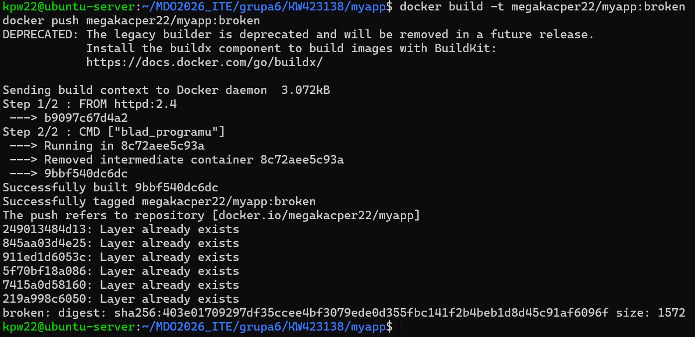
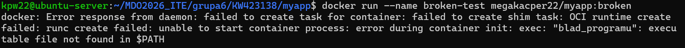

### Zmiany w deploymencie

1. Utworzenie plików deployment.yaml i service.yaml które są umieszczone w folderze `Sprawozdanie11/myapp`.
2. Wdrożenie i sprawdzenie:

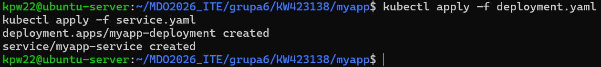
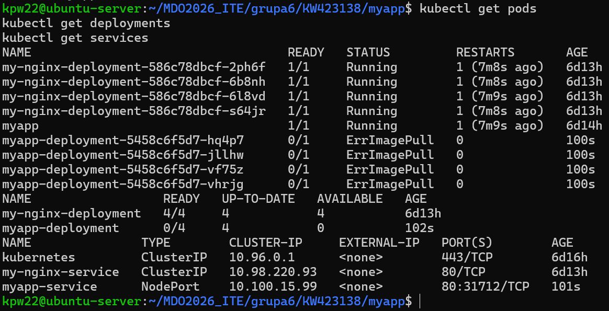

#### Skalowanie deploymentu

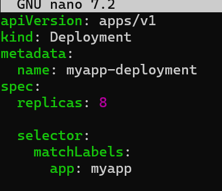
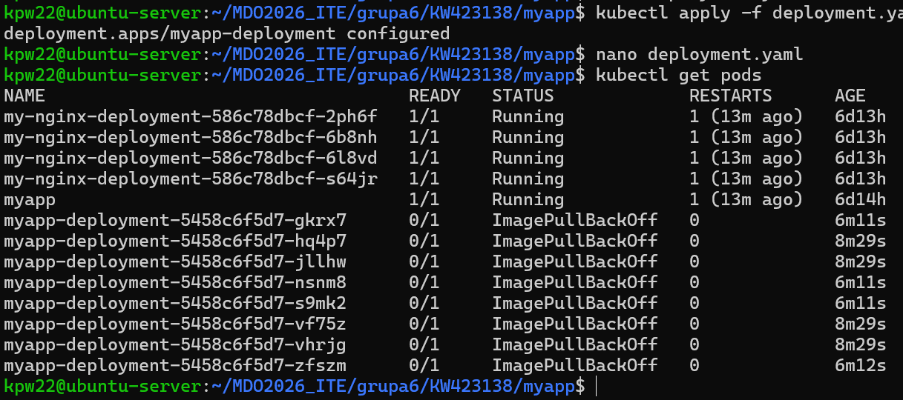

#### Dla replic 4 i wiekszej ilości, przywracanie poprzednich wersji, sprawdzenie

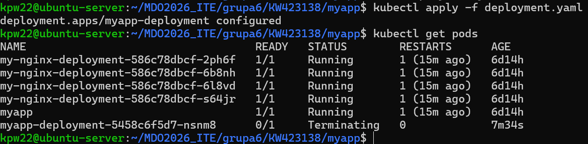
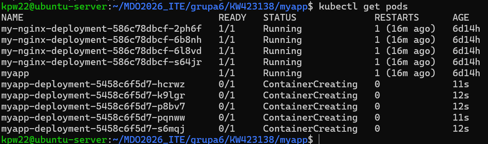
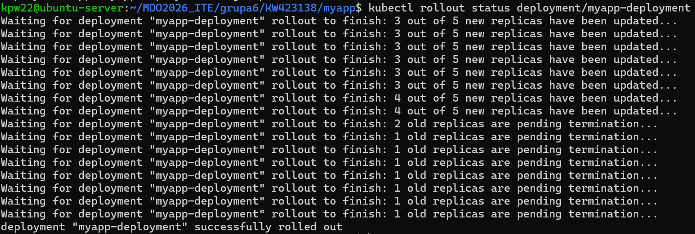
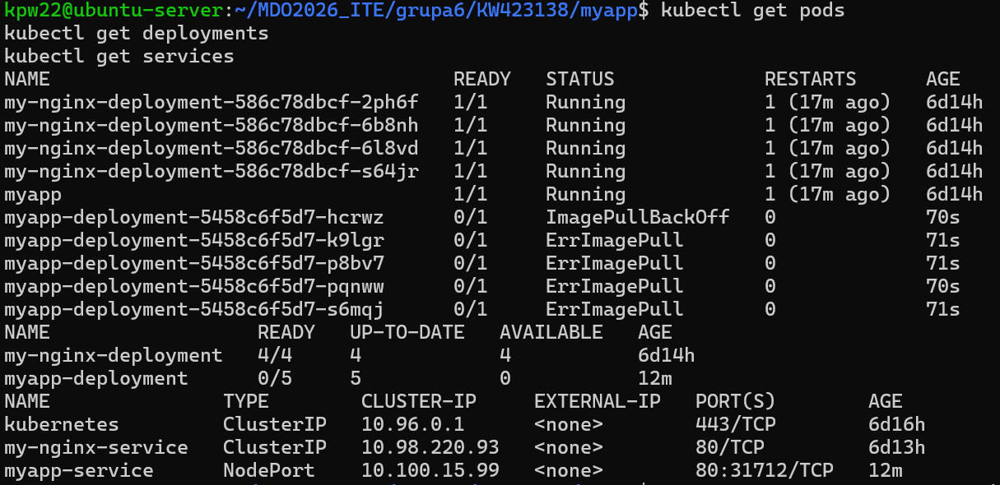
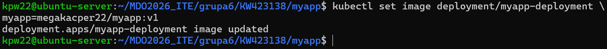
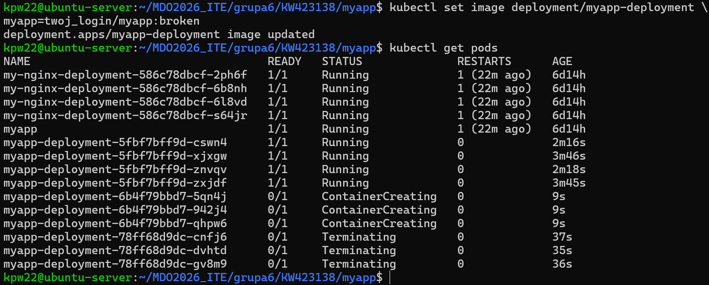
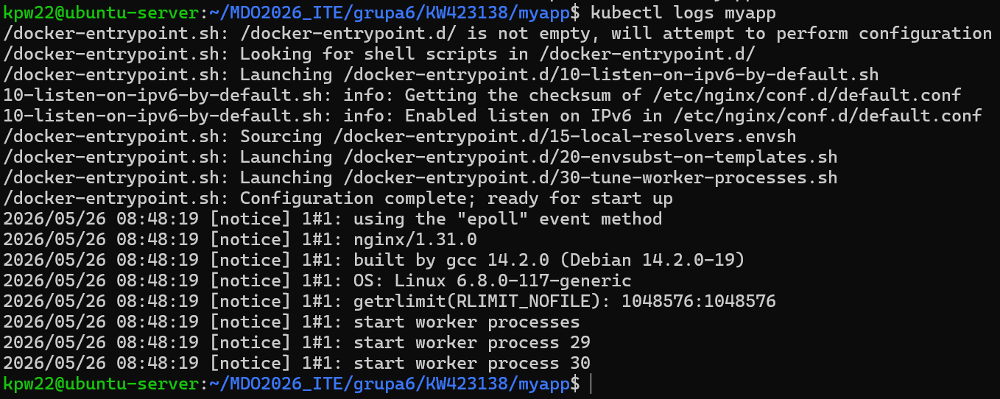
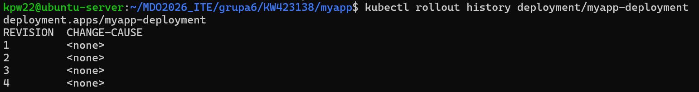
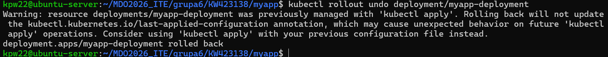
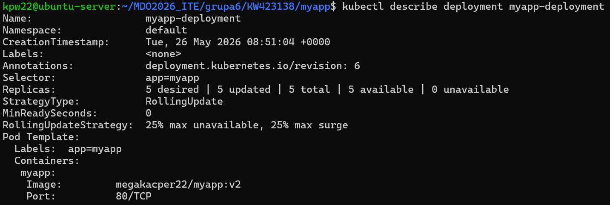
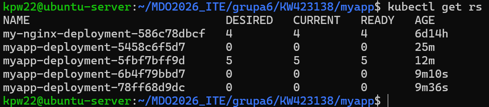

### Kontrola & Strategie wdrożenia

Skrypt wdrożenia `deploy-check.sh`:
```Bash
(hasztak)!/bin/bash

DEPLOYMENT=myapp-deployment
TIMEOUT=60s

kubectl rollout status deployment/$DEPLOYMENT --timeout=$TIMEOUT

if [ $? -eq 0 ]; then
    echo "Deployment OK"
    exit 0
else
    echo "Deployment FAILED"
    exit 1
fi
```
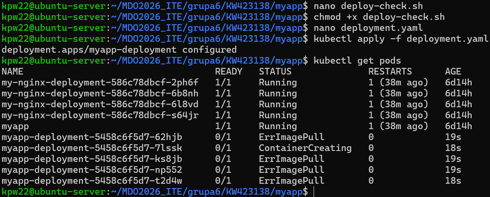
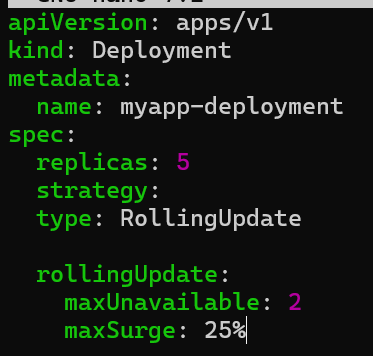
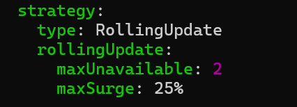
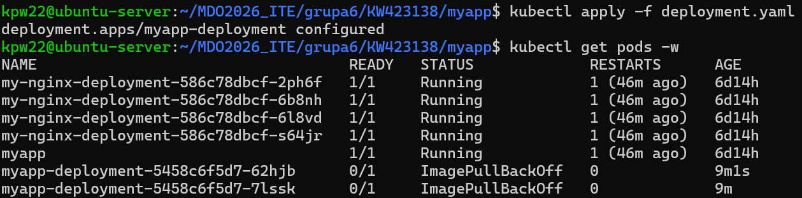
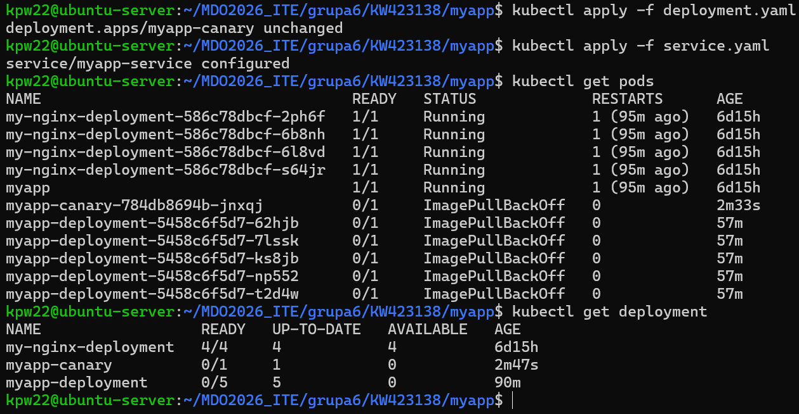
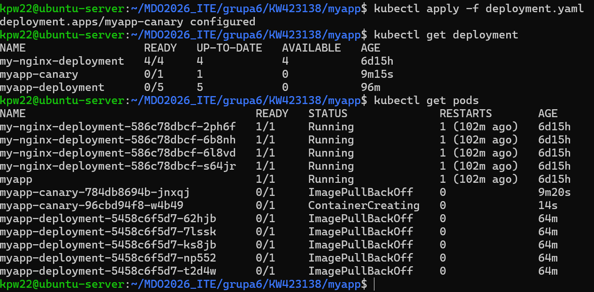
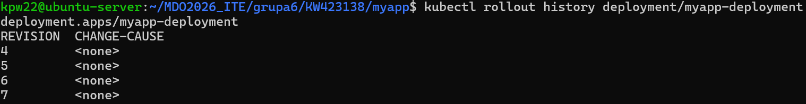

#### Obserwacje:
Recreate:
- szybkie przełączenia
- brak starych podów podczas update
RollingUpdate:
- brak przerwy
- pody wymieniają się stopniowo
- chwilowo więcej podów
Canary:
- równoczesne działanie dwóch wersji

