# Sprawozdanie - zajęcia 12

## Przygotowanie kontenera

Przed przystąpieniem do ćwiczenia, zaktualizowałem obecną wersję kontenera na moim koncie Docker Hub:

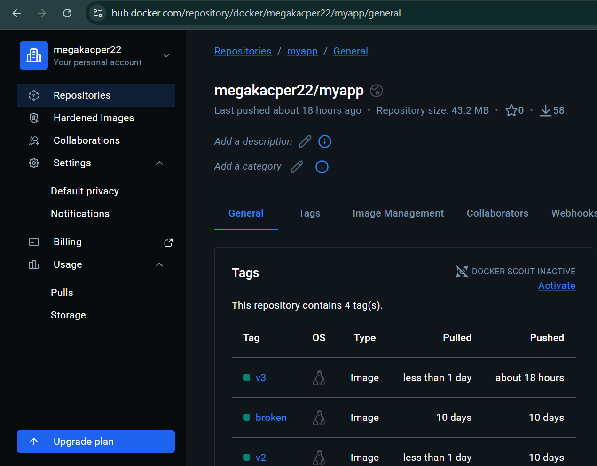

## Zapoznanie się z dokumentacją Azure, odblokowanie konta studenckiego

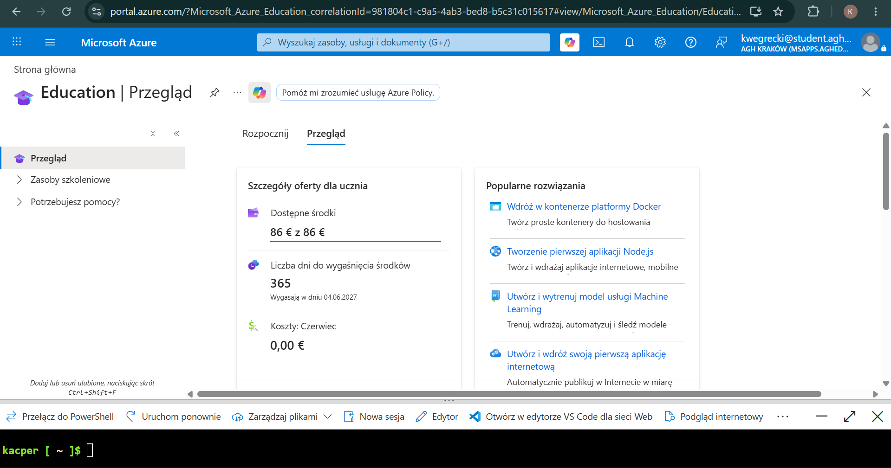

## Zadania do wykonania

### Utworzenie własnego resource group:

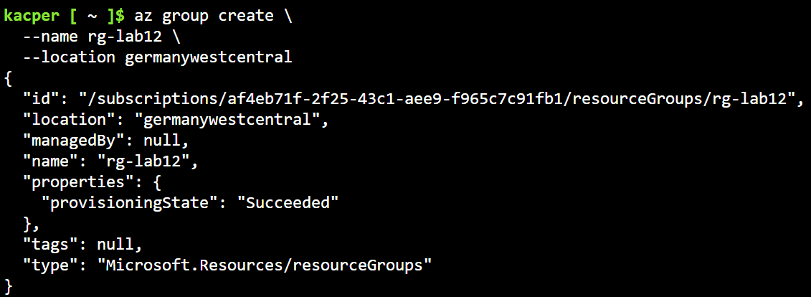
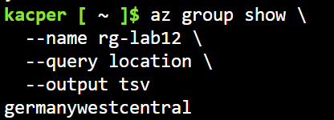

Grupa została utworzona w regionie `germanywestcentral`, ponieważ subskrybcja studencka pozwalała tylko w określonych regionach tworzyć zasoby.

### Wdrożenie kontenera z Docker Hub do Azure

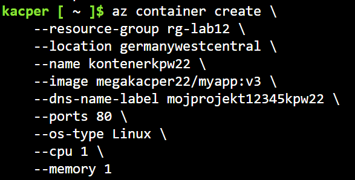
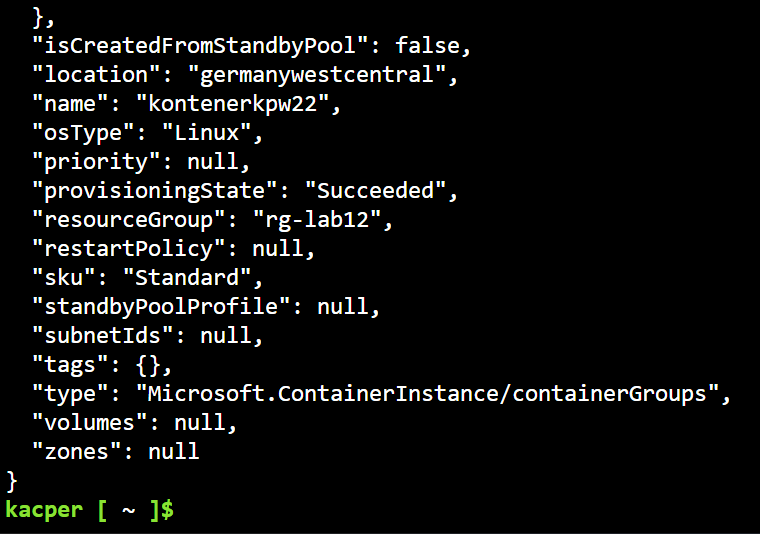

### Pokazanie działania kontenera, logi

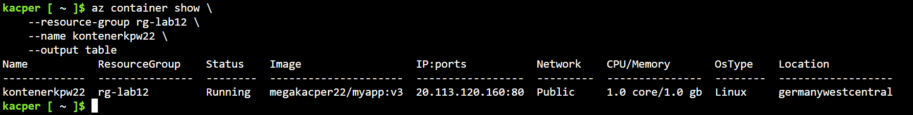
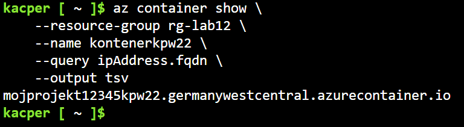
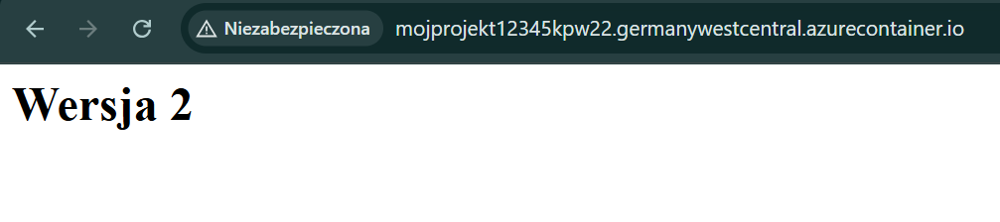
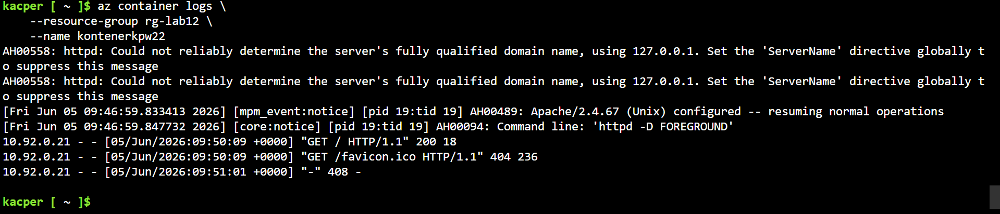

### Usunięcie kontenera i grupy

Po wykonaniu ćwiczenia usunąłem utworzony kontener i resorce group:

```
az container delete \
    --resource-group rg-lab12 \
    --name kontenerkpw22 \
    --yes
```

```
az group delete --name rg-lab12 --yes --no-wait
```

#### Sprawdzenie czy zasoby się usunęły:

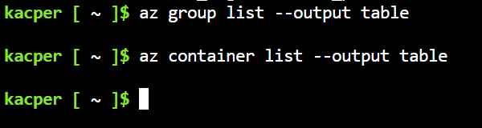

Nic się nie wyświetla, więc zasoby usunęły się poprawnie.
