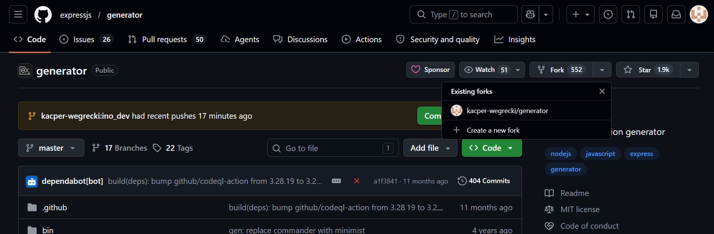
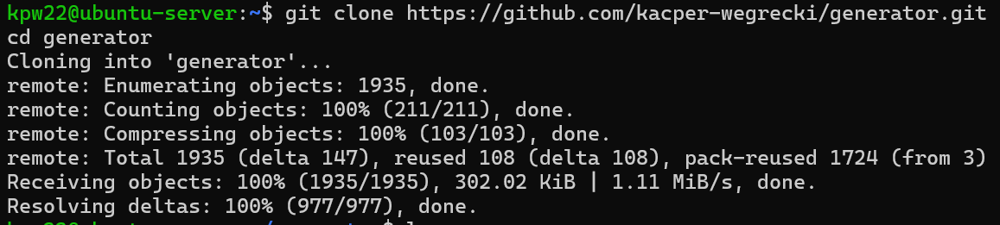
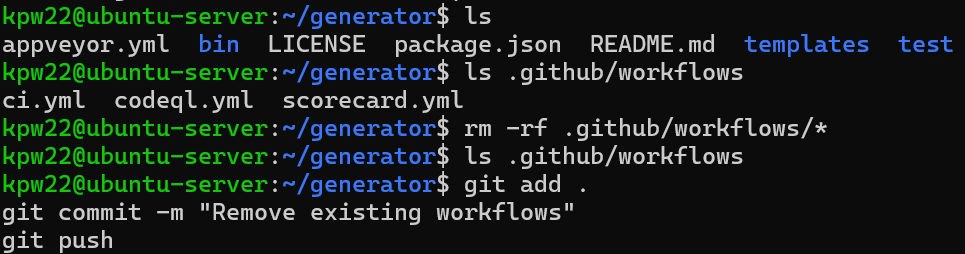
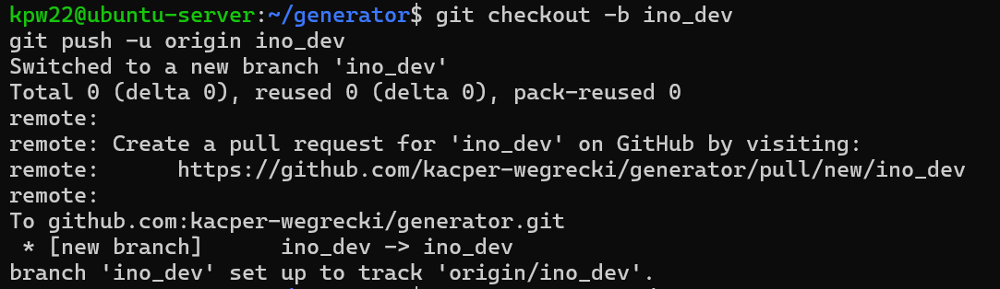
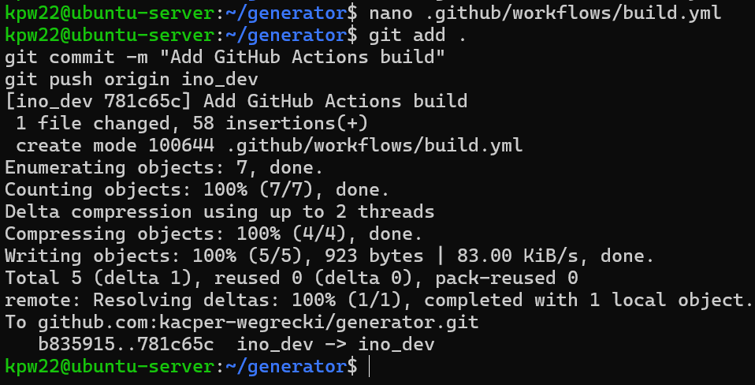
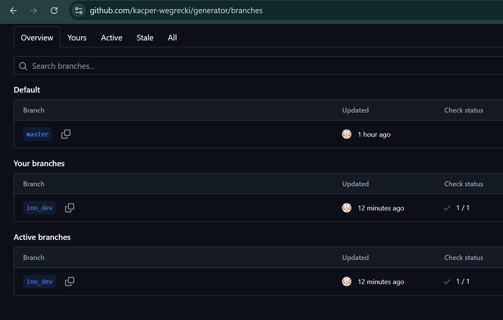
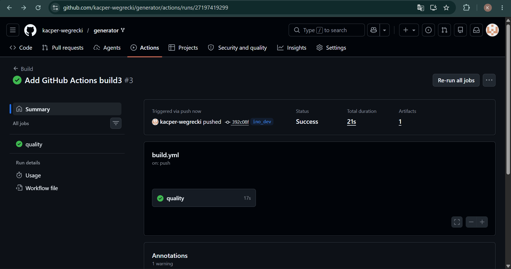
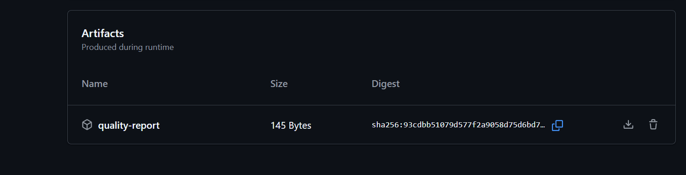

# Sprawozdanie - zajęcia 13

### Fork wybranego repozytorium, clone




### Usunięcie istniejące workflows w projekcie



### Utworzenie gałęzi `ino_dev`



### Utworzenie własnego pliku workflow `build.yaml`

```yaml
name: Build

on:
  push:
    branches:
      - ino_dev
  workflow_dispatch:

jobs:
  quality:
    runs-on: ubuntu-latest

    steps:
      - uses: actions/checkout@v4

      - uses: actions/setup-node@v4
        with:
          node-version: 20

      - name: Install dependencies
        run: npm install

      - name: Check package integrity
        run: npm ls --depth=0

      - name: Count source files
        run: |
          mkdir artifacts
          find . -name "*.js" | wc -l > artifacts/js-files.txt

      - name: Upload artifact
        uses: actions/upload-artifact@v4
        with:
          name: quality-report
          path: artifacts/

```

### Pokazanie utworzonej gałęzi, commit, push, akcja, artefakt






**Utworzony artefakt znajduje się w folderze `Sprawozdanie13`**
