#Sprawozdanie - zajecia 2

1. Instalacja Docker`a w systemie linuksowym i sprawdzenie 
poprawności instalacji.

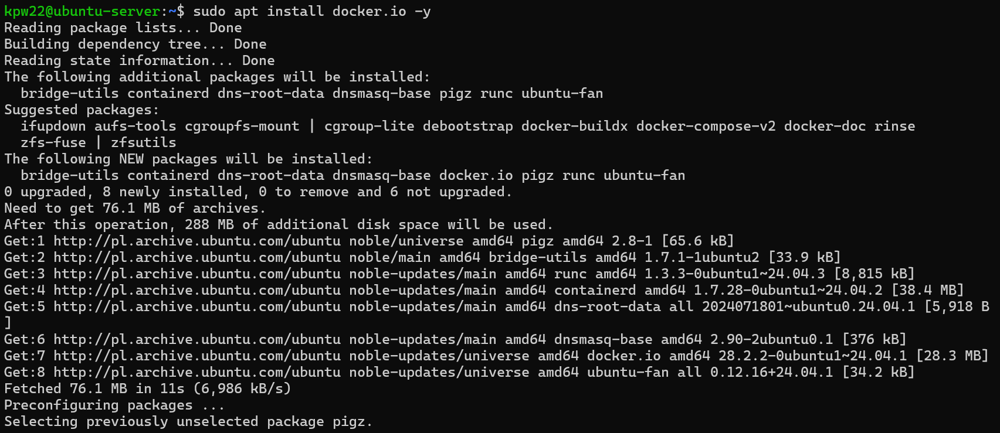

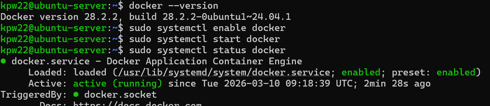

2. Po zarejestrowaniu się w Docker Hub zapoznano się z 
 obrazami: hello-world, busybox, ubuntu lub fedora, mariadb, 
 runtime, aspnet i sdk dla Microsoft .NET oraz pobranie ich.

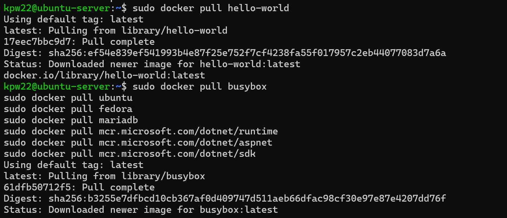

Następnie sprawdzono ich rozmiary, kod wyjścia i po kolei 
uruchomiono je.

Srawdzenie rozmiarów:

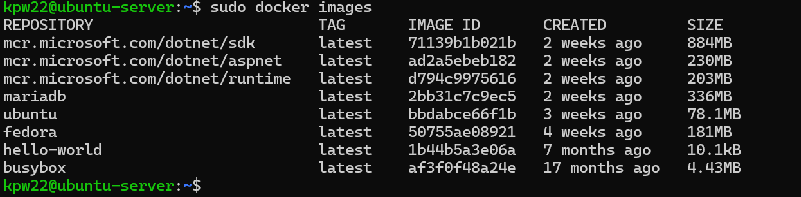

Uruchomienie:

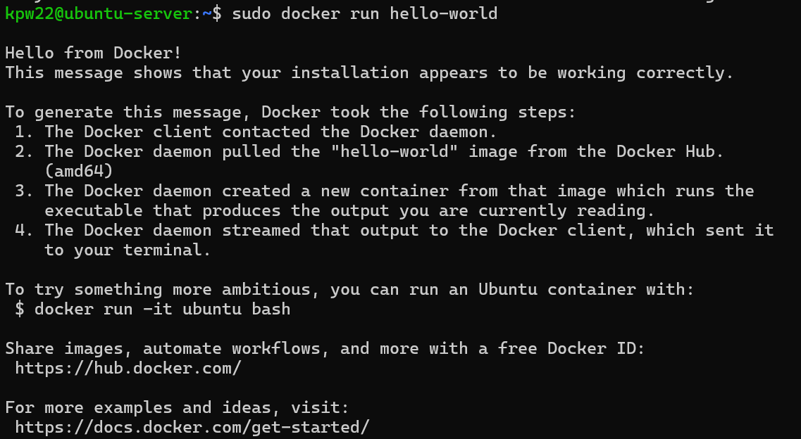

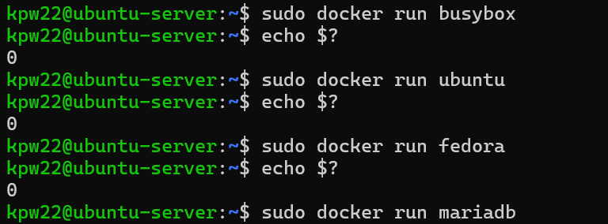

3. Uruchomienie kontenera z obrazu busybox. 
	a) pokazanie efektu uruchomionego kontenera
	b) podłączenie się do kontenera interaktywnie i wywołanie numeru wersji

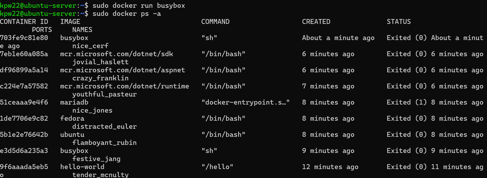

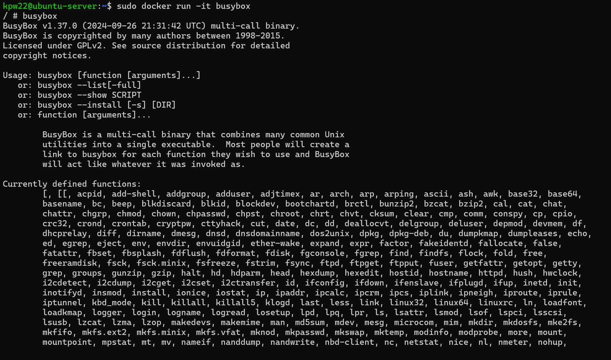

4. Uruchomienie "systemu w kontenerze"
5. Zaprezentowanie PID1 w kontenerze i procesy dockera na hoście.
6. Zaktualizowanie pakietów i wyjście.

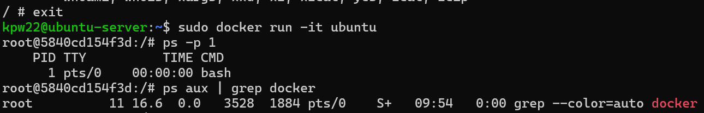

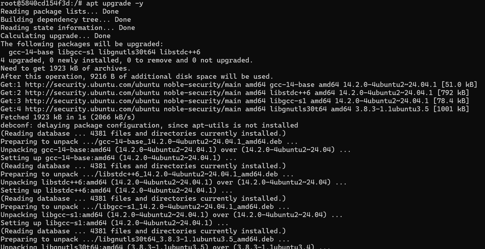

7. Stworzenie własnoręczne, zbudowanie i uruchomienie pliku 
Dockerfile i sklonowanie w nim repozytorium przedmiotowego.

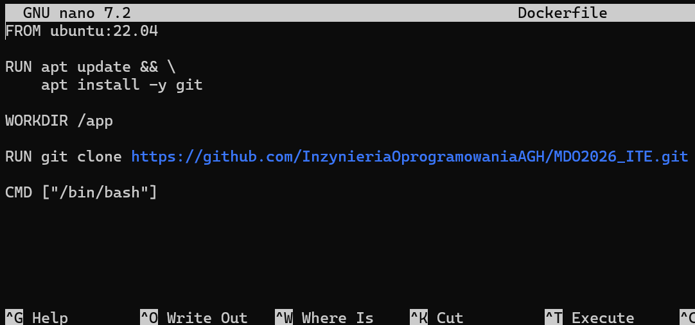

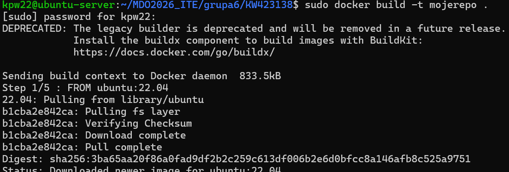
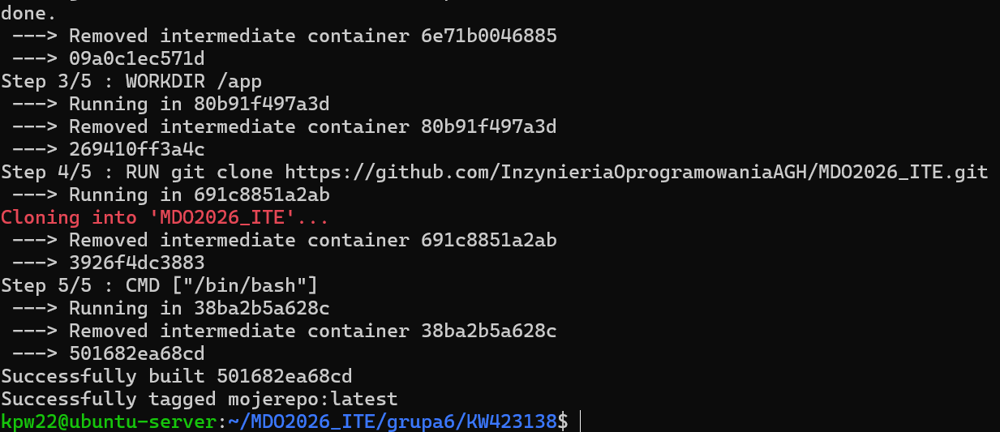

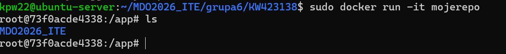

8. Uruchomione kontenery, czyszczenie zakończonych.

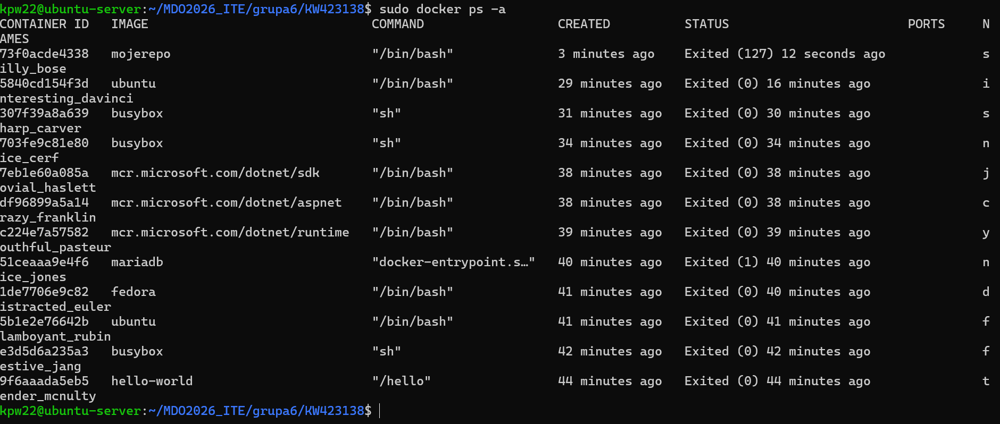

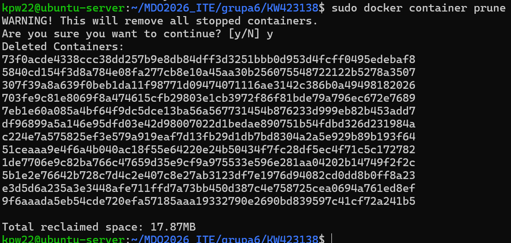

9. Wyczyszczenie obrazów przechowywanych w lokalnym magazynie.

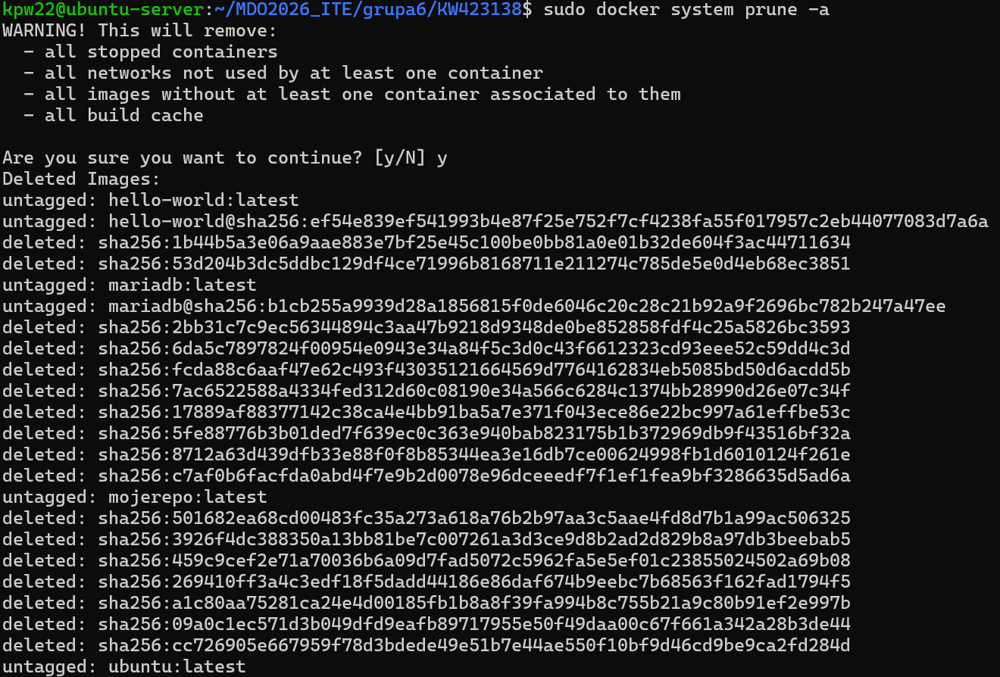

10. Dodanie stworzonych plików Dockerfile do folderu Sprawozdanie1
w swoim katalogu na odpowiedniej gałęzi wrepozytorium.

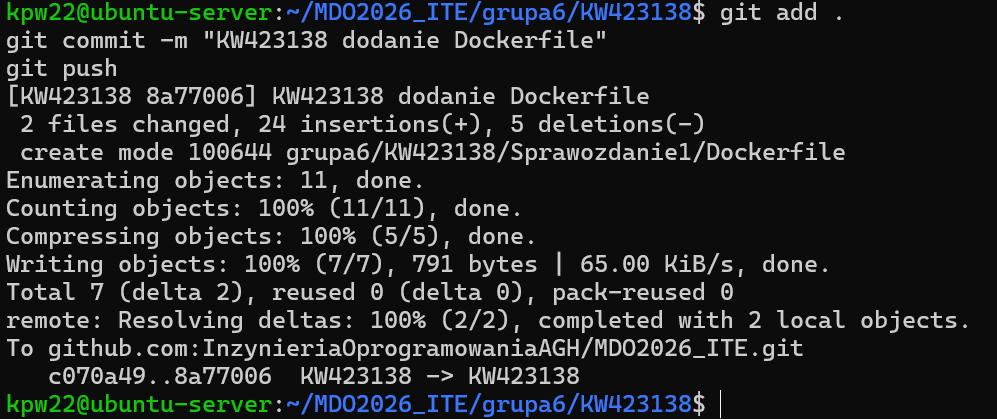
