# Sprawozdanie - zajęcia 3

1. Po znalezieniu repozytorium z kodem danego oprogramowania, które spełniało warunki scenariusza:
	a) dysponowało otwartą licencją
	b) miało narzędzia typu make build
	c) zawierało zdefiniowane i obecne testy
nastąpiło kolejno: sklonowanie niniejszego repozytorium, przeprowadzenie build-a programu wraz z instalacją wymaganych zależności. Na koniec uruchomiono testy jednostkowe dołączone do projektu w repozytorium.

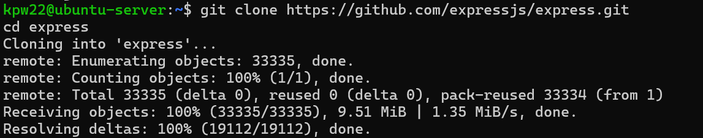

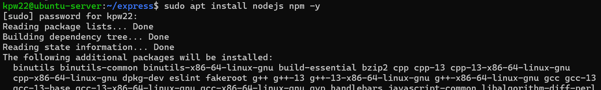

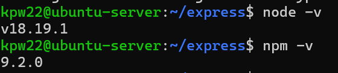

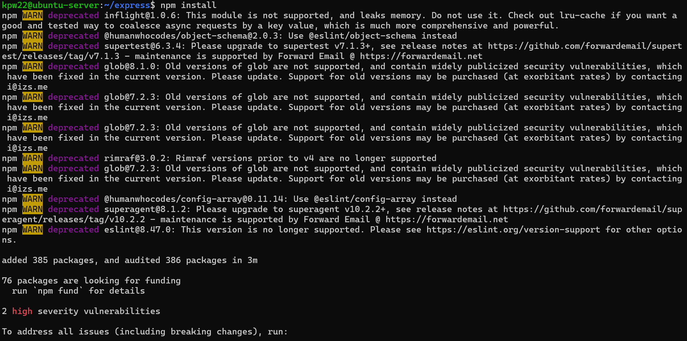

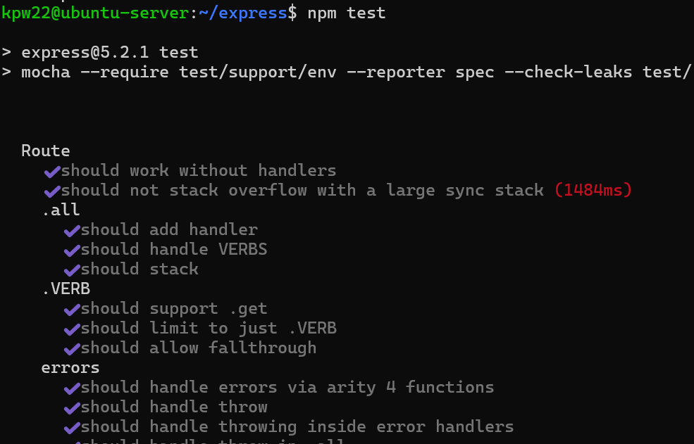

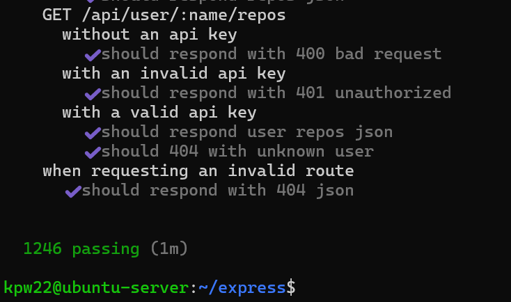

2. Ponowienie wcześniejszego procesu w kontenerze (interaktywnie).

Uruchomienie kontenera z Node, instalacja git, sklonowanie repo w kontenerze, build, testy

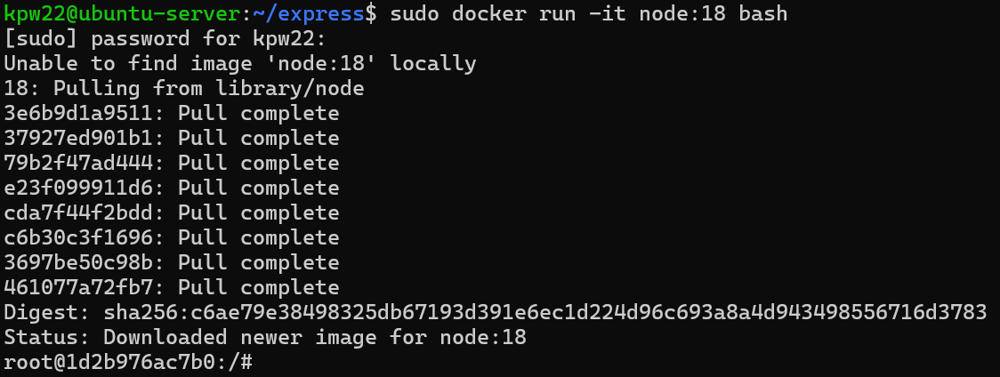

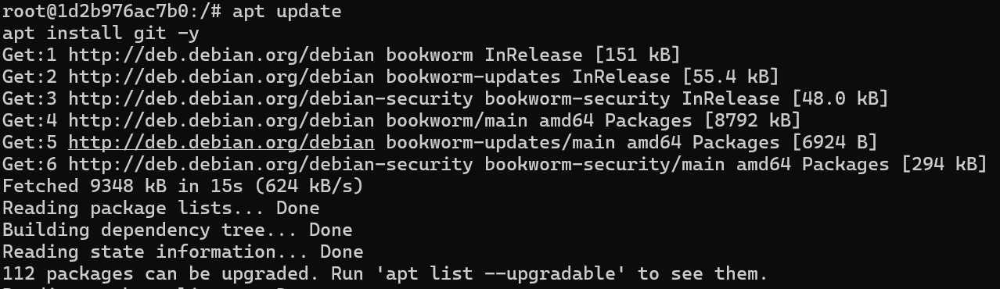

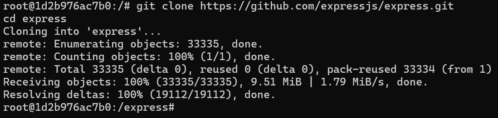

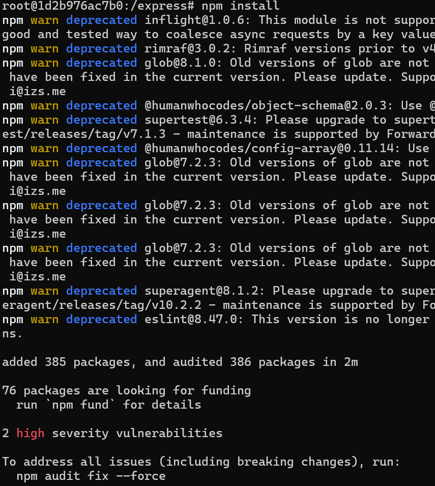

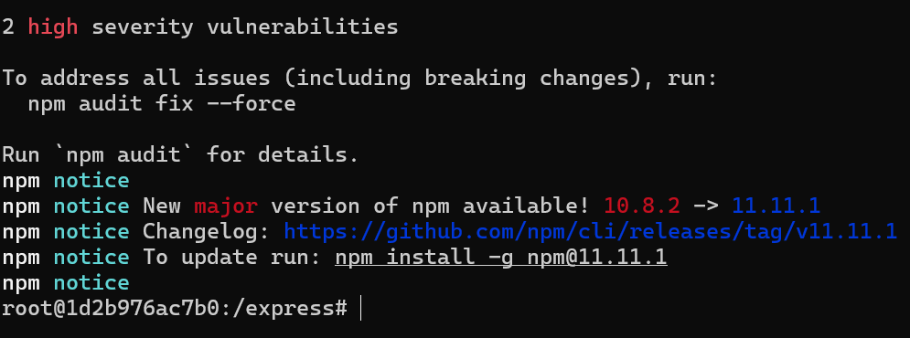

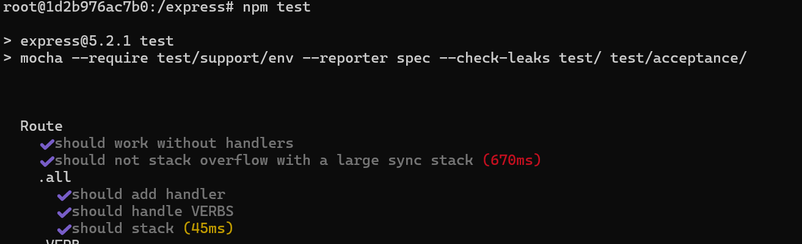

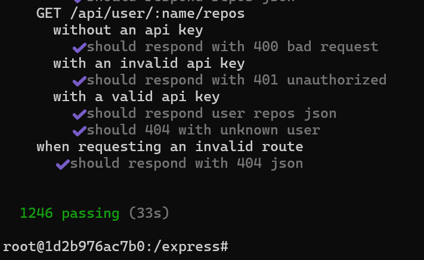

3. Tworzenie plików Dockerfile (automatyzacja powyższych kroków)

Utworzenie pliku Dockerfile.build
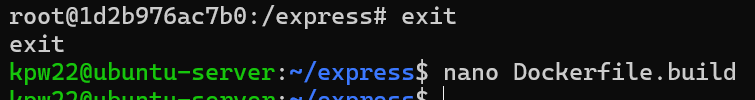

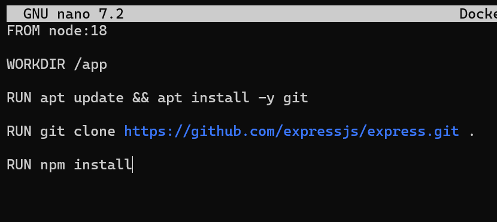

Budowanie obrazu:

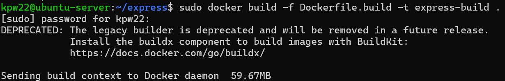
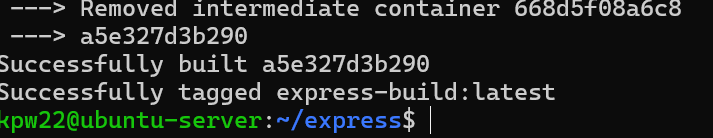

Utworzenie pliku Dockerfile.test, budowa drugiego obrazu
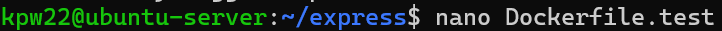

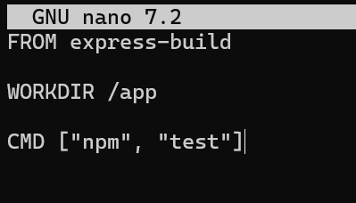

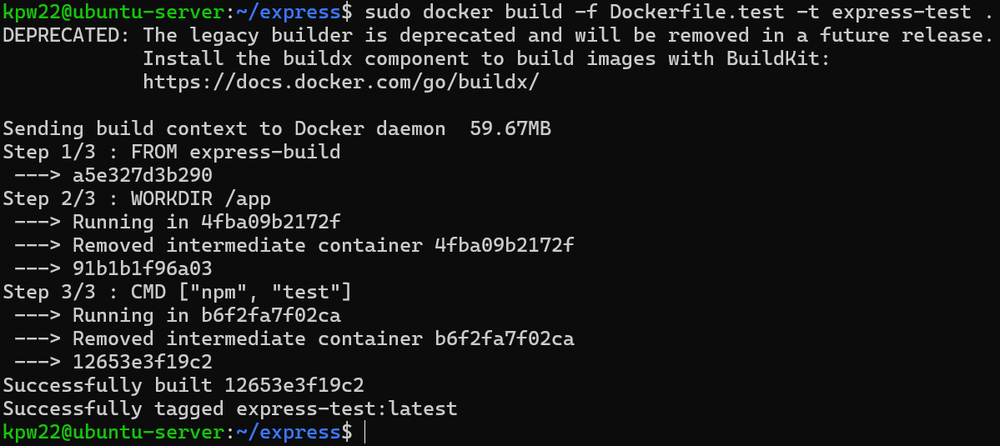

Uruchomienie testów z kontenera:

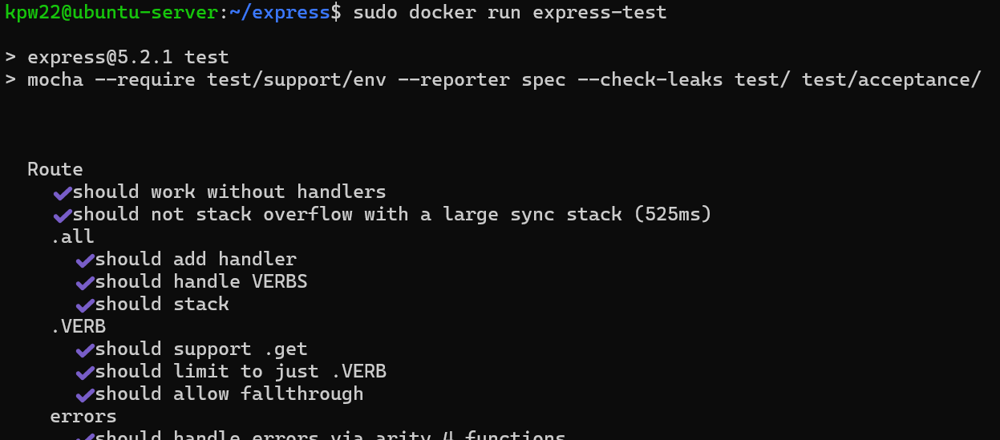
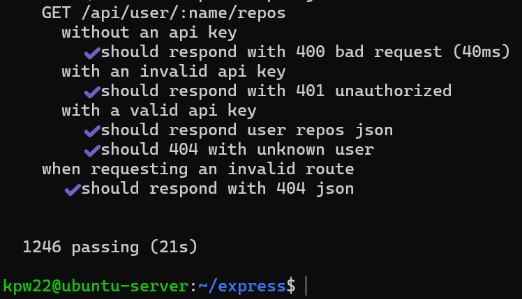

4. Obraz vs kontener

Obraz - szablon (np. node:18)
Kontener - uruchomiona instancja obrazu

W moim przypadku w kontenerze działa proces Node.js uruchamiający testy (npm test)

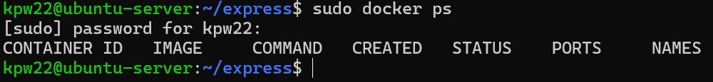

