# Sprawozdanie - zajęcia 4

1. Przygotowanie woluminów: wejściowego i wyjściowego.

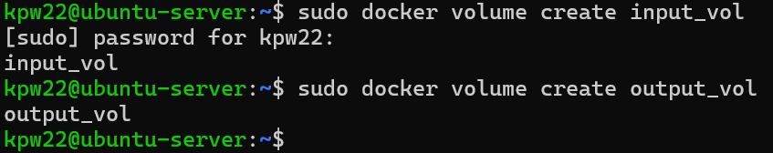

2. Uruchomienie kontenera z woluminami, zainstalowanie niezbędnych wymagań (bez Gita).

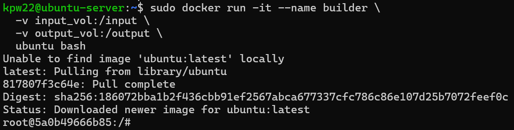

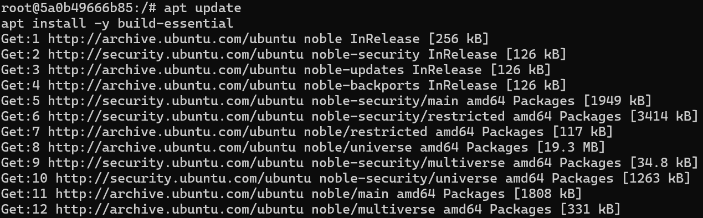
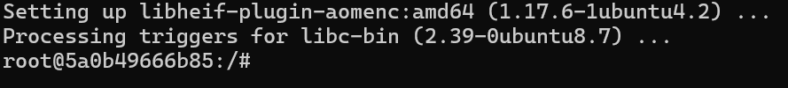

3. Sklonowanie repozytorium na wolumin wejściowy.
W moim przypadku został użyty wolumin Dockera jako "wejścia", a następnie uruchomiono kontener.

Jest to dobra praktyka, ponieważ:
	a) kontener można usunąć, ale wolumin zostaje (trwałość danych).
	b) separujemy dane od kontenera.
	c) ten sam wolumin może być podpięty do różnych kontenerów.

Alternatywne podejścia:
	a) Bind mount (lokalny katalog) -v /home/user/project:/input (dzięki temu pliki widoczne są na hoście)
	b) Kopiowanie do /var/lib/docker (raczej mniej zalecane, ze względu na mniejszą kontrolę).

W zastosowanym podejściu nie był potrzebny wolumin pomocniczy (wystarczył jeden kontener - builder).

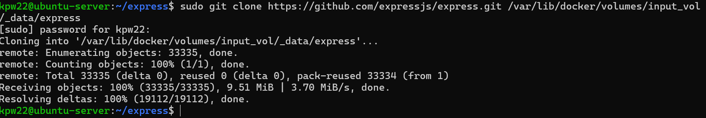

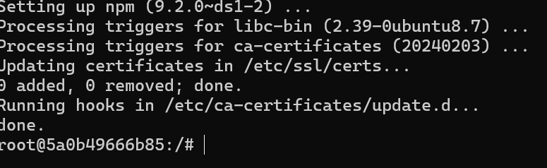

4. Build w kontenerze, zapisanie danych na wolumnie wyjściowym.

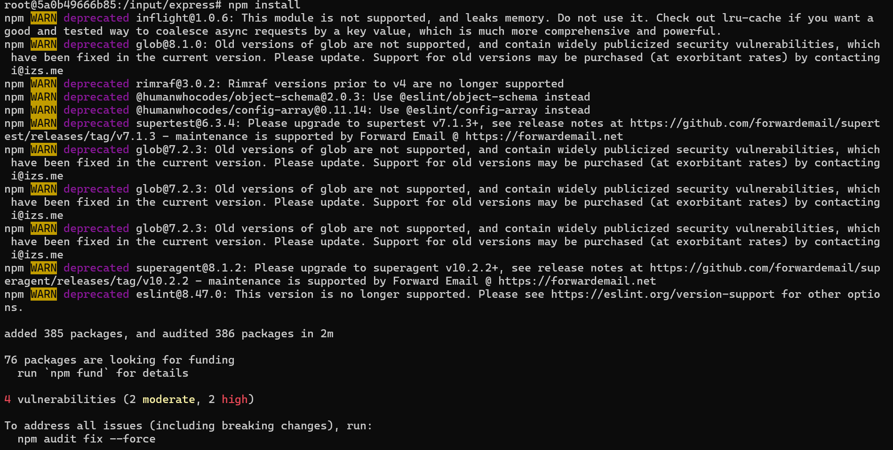

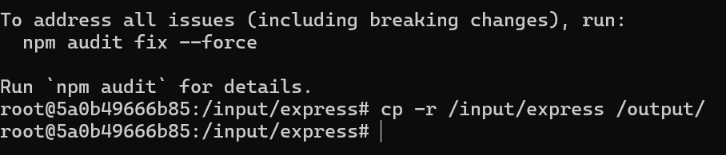
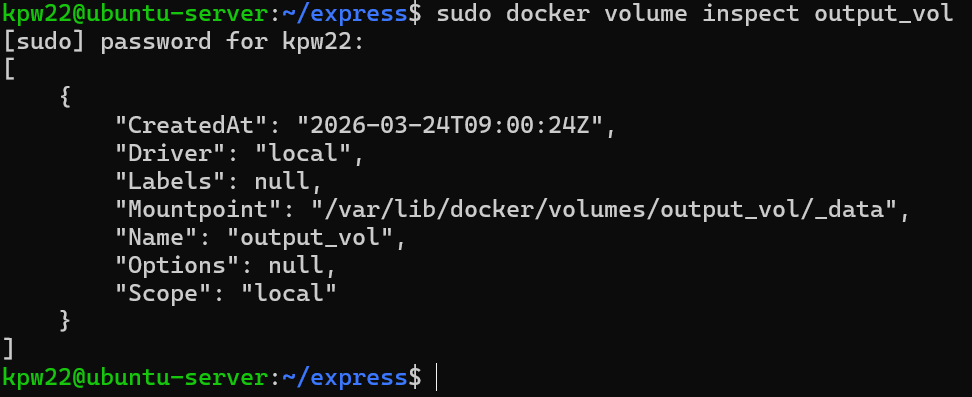

5. Klonowanie wewnątrz kontenera.

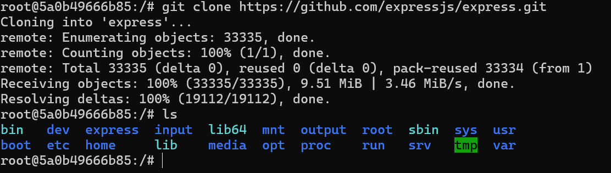

6. Dyskusja na temat możliwosci wykonania ww. kroków za pomocą docker build i pliku Dockerfile:

Kroki realizacji (klonowanie repozytorium, instalacja zależności oraz budowa projektu) mogą zostać zrealizowane również w trakcie budowania obrazu Docker przy użyciu Dockerfile oraz mechanizmu RUN --mount.
W tym podejściu operacje takie jak git clone lub dostęp do katalogów projektu mogą być wykonywane w warstwie builda, bez konieczności ręcznego uruchamiania kontenera i montowania wolumenów w runtime.

W przeciwieństwie do podejścia opartego o woluminy Docker, dane uzyskane w RUN --mount są tymczasowe i istnieją jedynie w trakcie budowania obrazu, chyba że zostaną jawnie zapisane do warstwy obrazu (COPY/RUN).

7. Uruchomienie wewnątrz kontenerów serweru iperf.

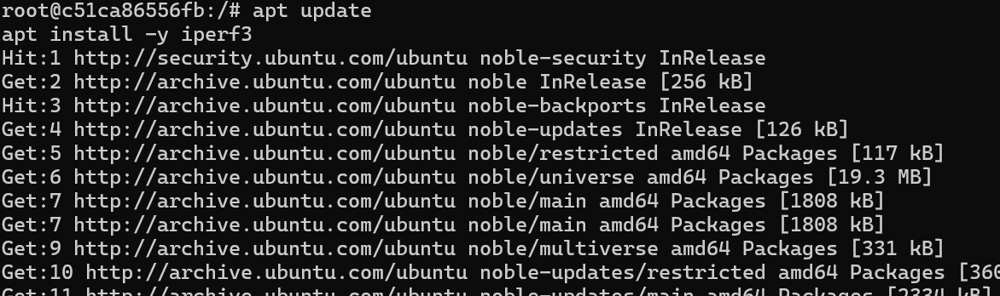
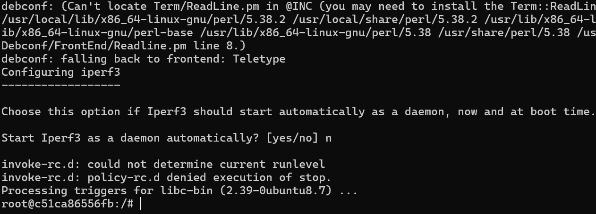

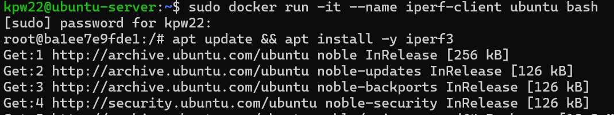

8. Znalezienie adresu IP, połączenie się z "kontenerem-serverem" z drugiego kontenera.

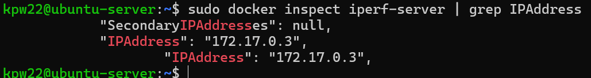
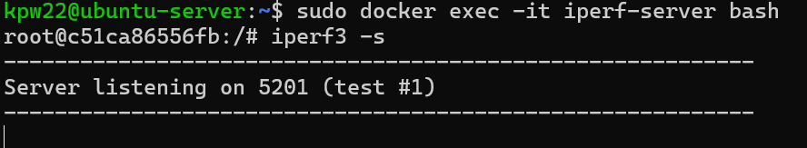
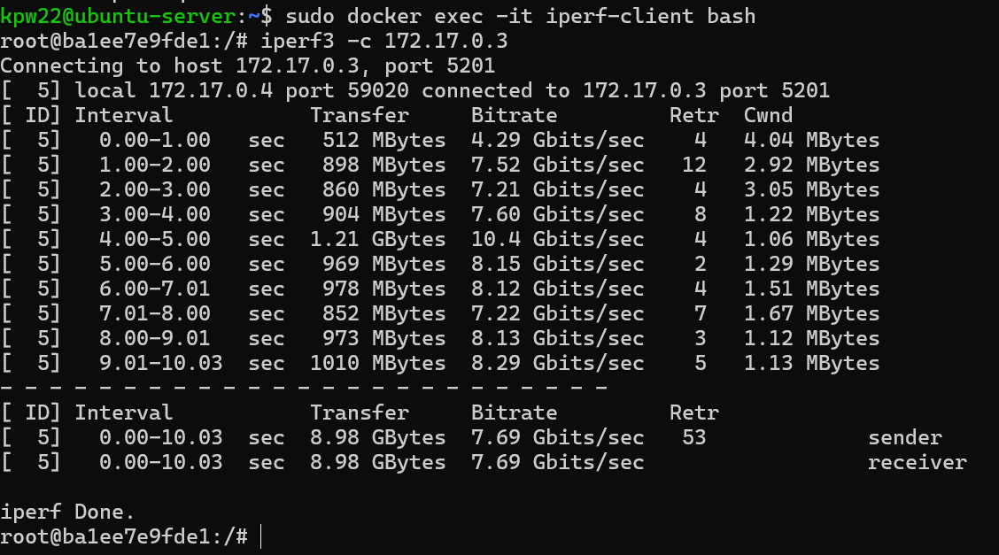

9. Ponowienie poprzedniego kroku, ale z wykorzystaniem własnej sieci mostkowej (wykorzystanie nazw zamiast adresów IP).

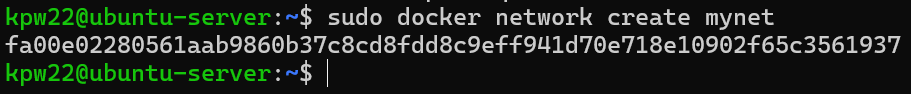
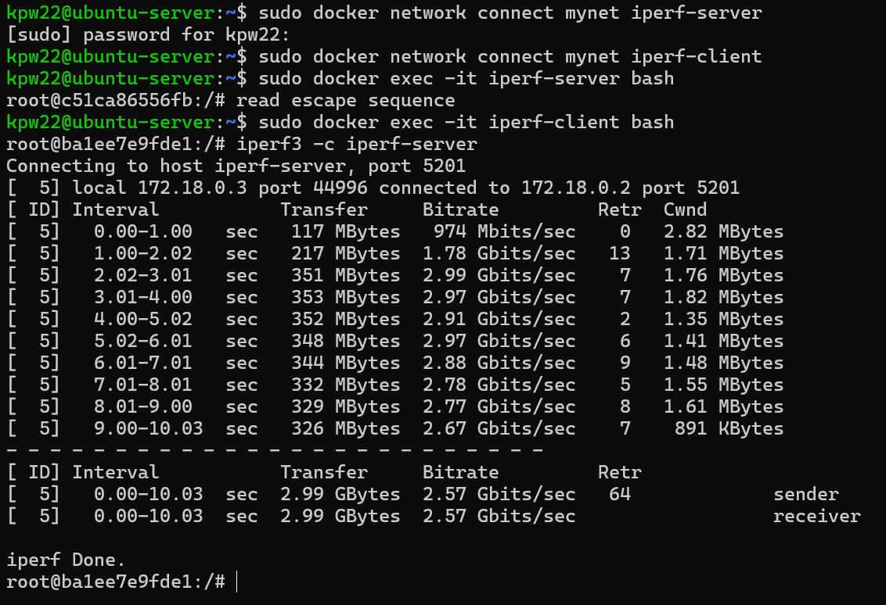

10. Połączenie z poza kontenera.

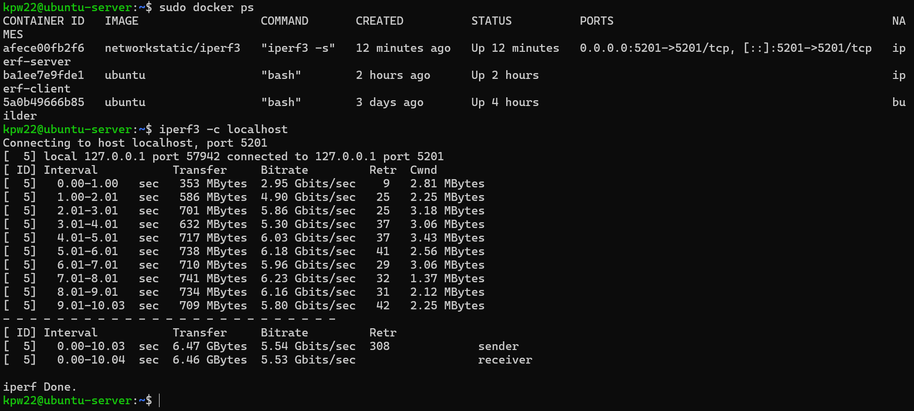

11. SSH w kontenerze.

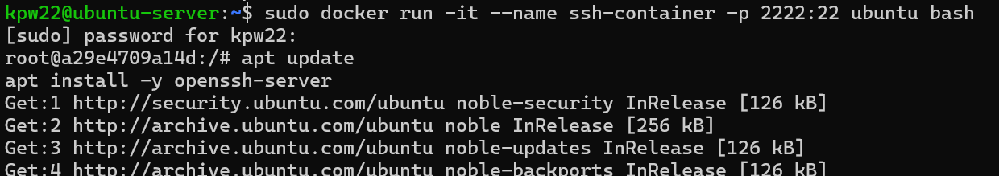
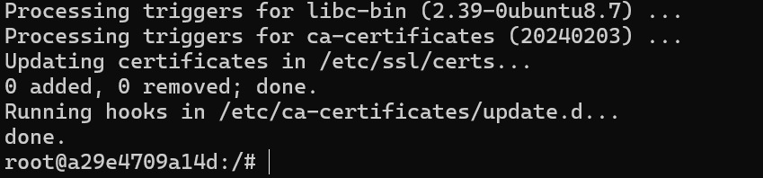
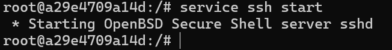

Nastąpił problem z zalogowaniem się do root`a. Wszelkie próby szukania/zmienienia hasła zakończyły się niepowodzeniem.

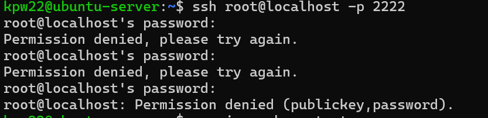

12. Zalety i wady komunikacji z kontenerem z wykorzystaniem SSH.

Wykorzystanie SSH do komunikacji z kontenerem umożliwia interaktywne zarządzanie środowiskiem w sposób podobny do klasycznych serwerów. Rozwiązanie to ułatwia diagnostykę oraz integrację z istniejącymi narzędziami administracyjnymi.
Jednakże podejście to stoi w sprzeczności z ideą konteneryzacji, gdzie zaleca się uruchamianie pojedynczego procesu oraz zarządzanie kontenerami przez mechanizmy natywne Dockera.

13. Instalacja, inicjalizacja, uruchomienie skonteneryzowanej instancji Jenkinsa z pomocnikiem DIND.

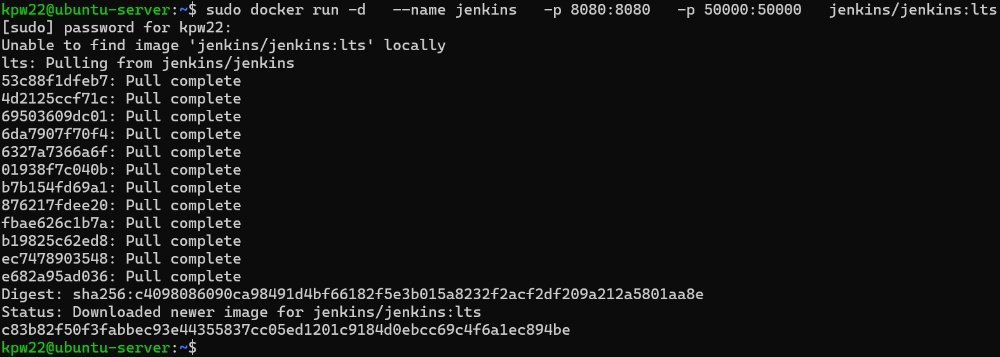
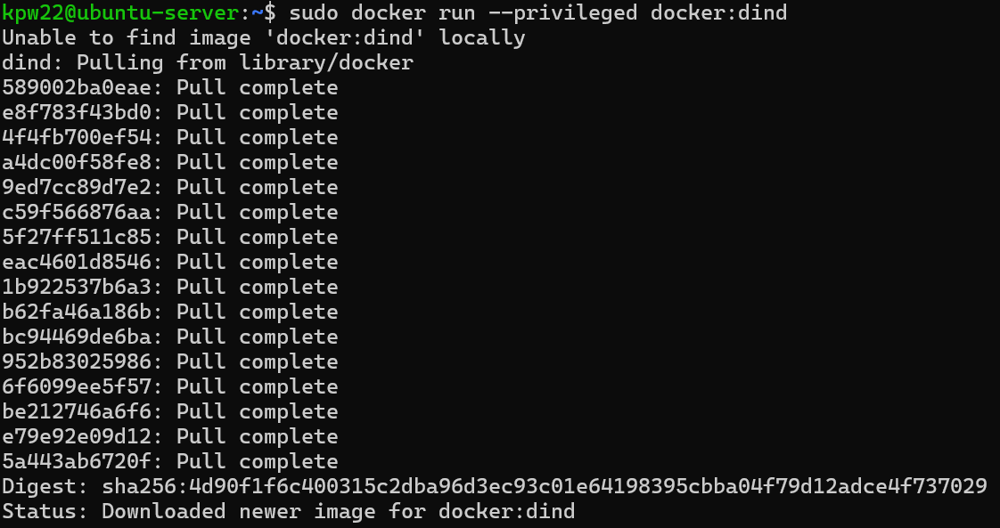
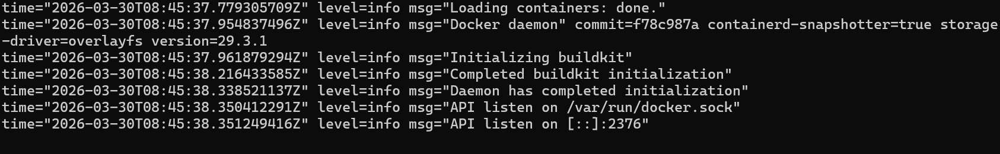

inicjalizacja
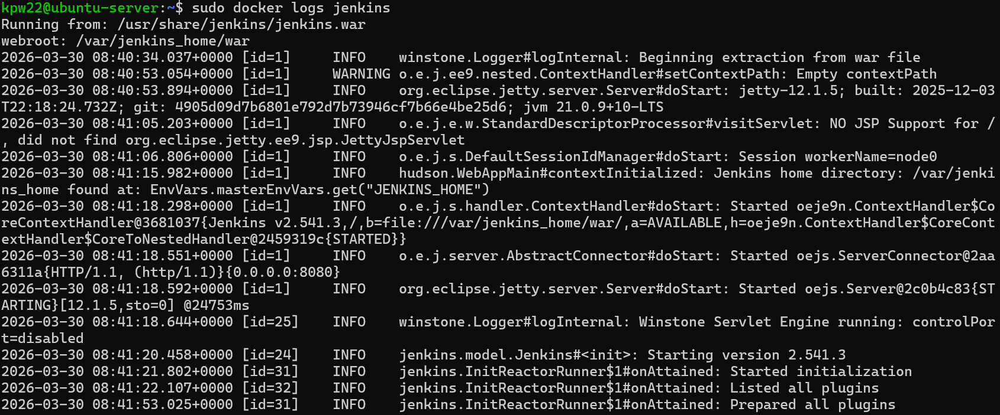
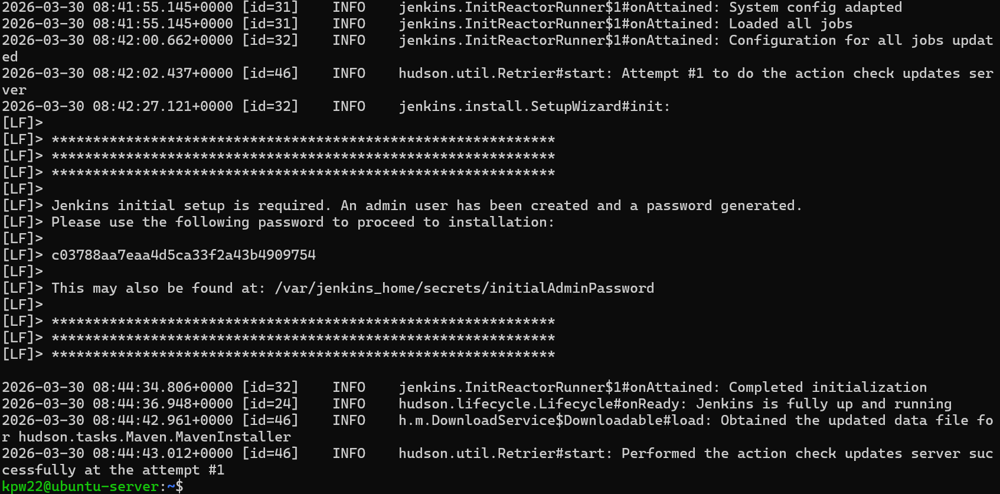

sprawdzenie czy kontener działa
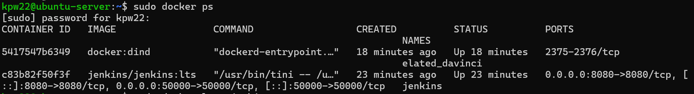

14. Ekran logowania.

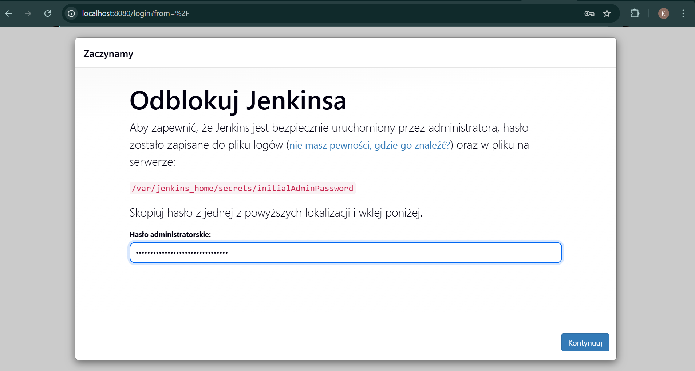
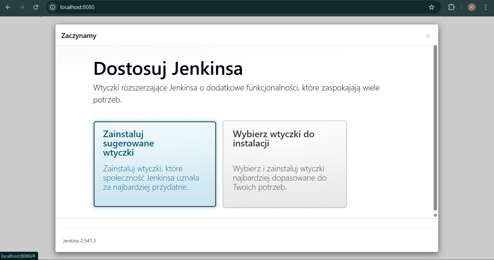
