# Sprawozdanie - zajęcia 5

1. Sprawdzenie działania Jenkinsa, utworzonego na poprzednich zajęciach, dodanie obrazu blueocean.

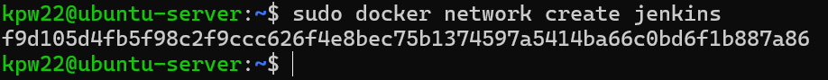
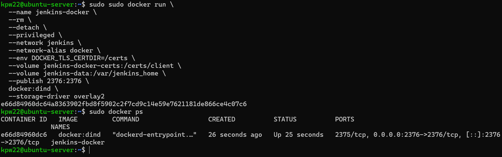
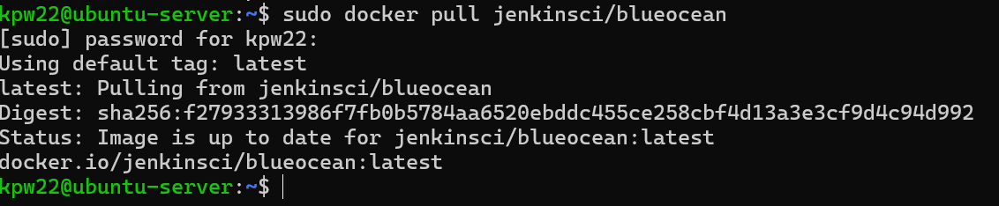

Konfiguracja, instalowanie wtyczek, logowanie.

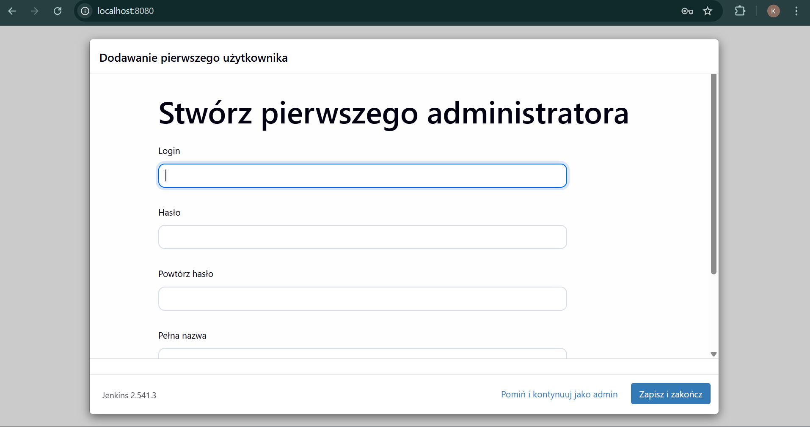

2. Zadania do wykonania:
	a) utworzenie projektu, który wyświetla uname
	b) utworzenie projektu, który zwraca błąd gdy godzina jest nieparzysta
	c) pobranie w projekcie obrazu kontenera ubuntu (docker pull)

 
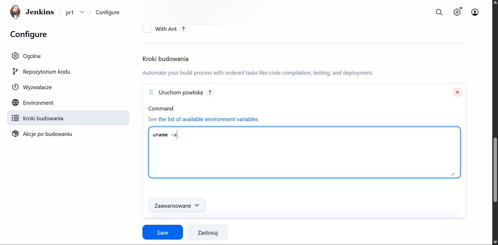

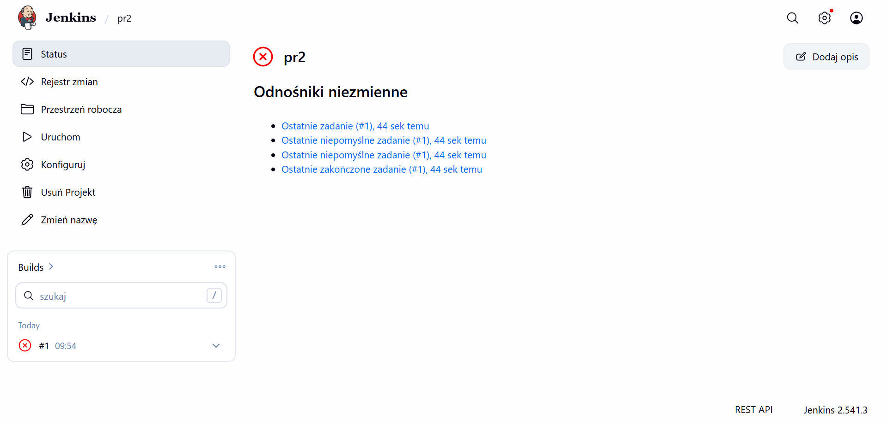
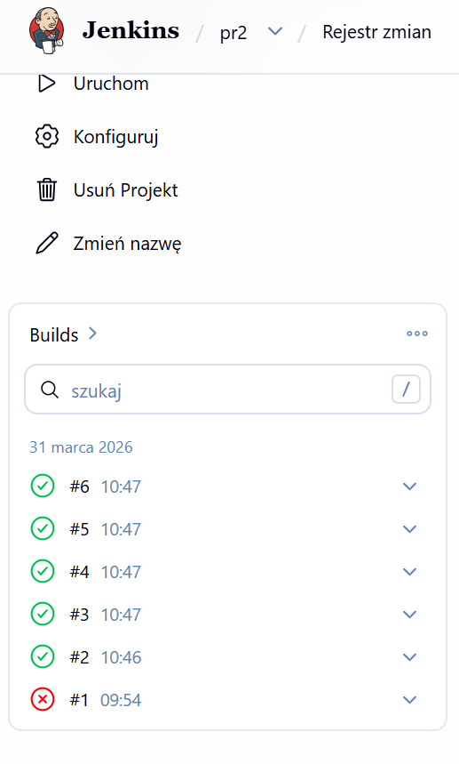
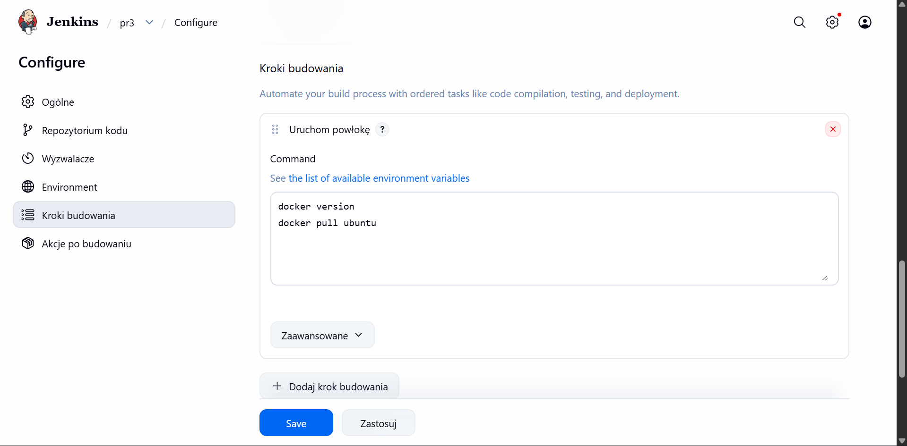
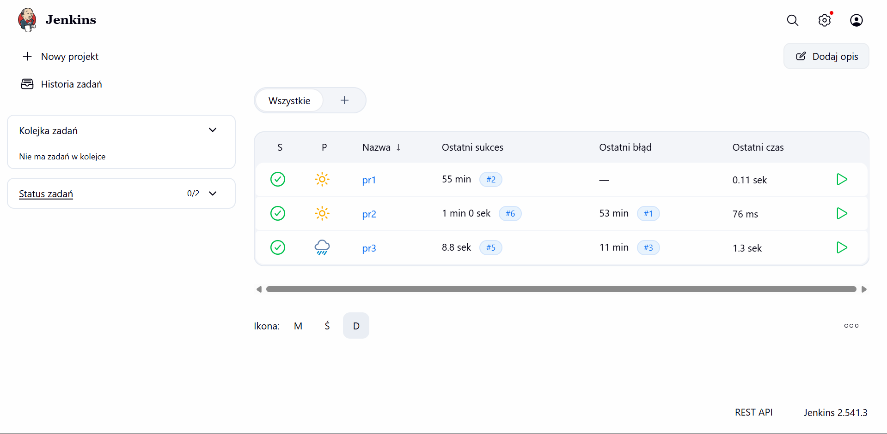

3. Utworzenie obiektu typu pipeline.

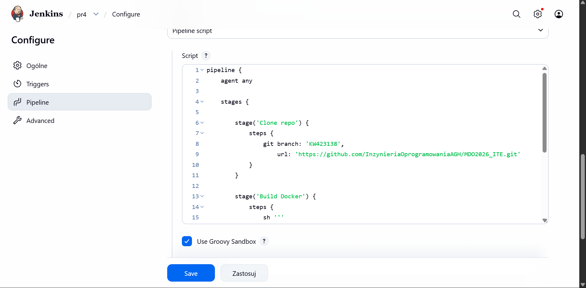
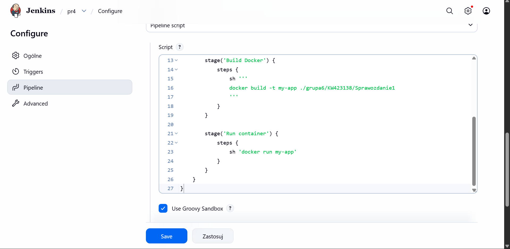
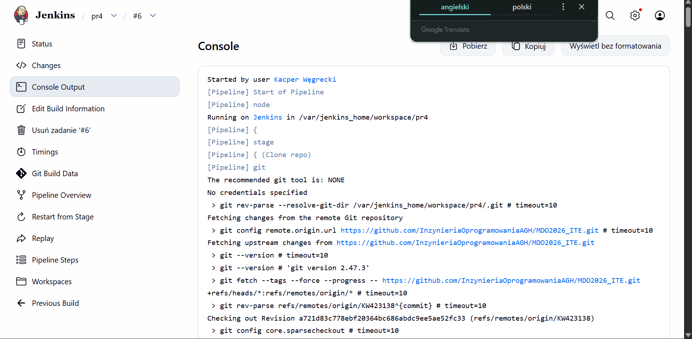
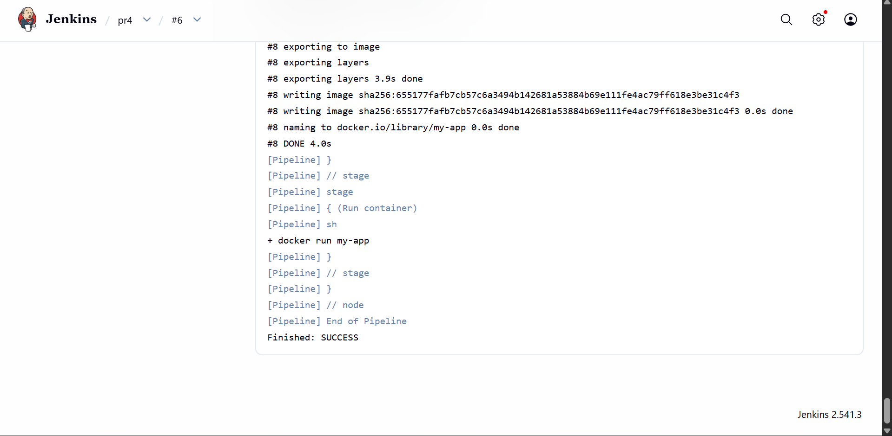
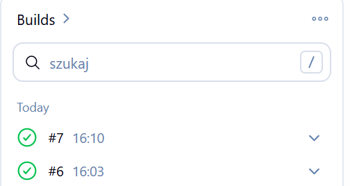
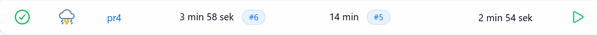

Logi z konsoli dla poszczególnych zadań zostały zapisane w plikach .txt w folderze Sprawozdanie5
