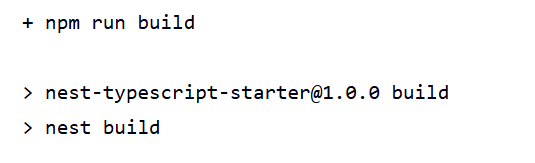
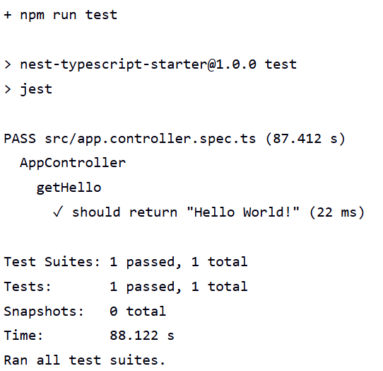
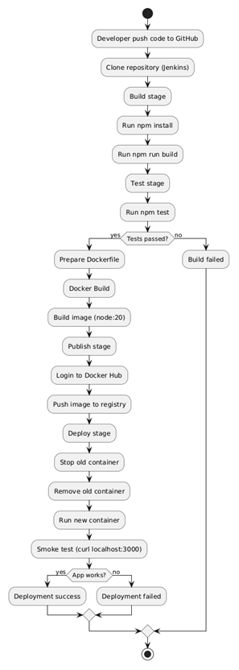
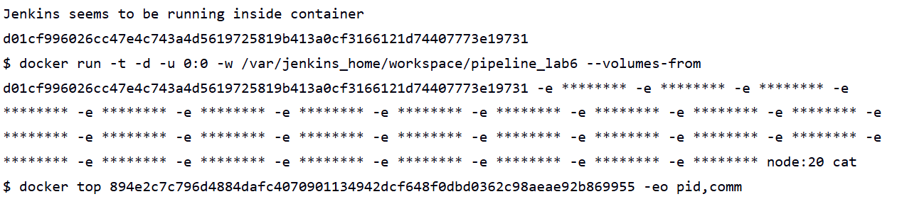
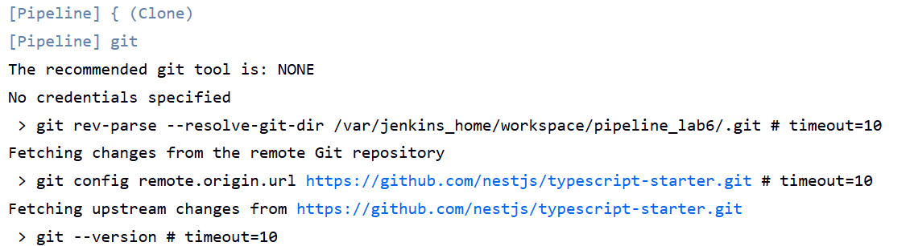
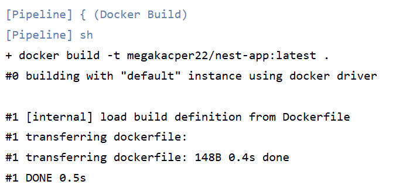
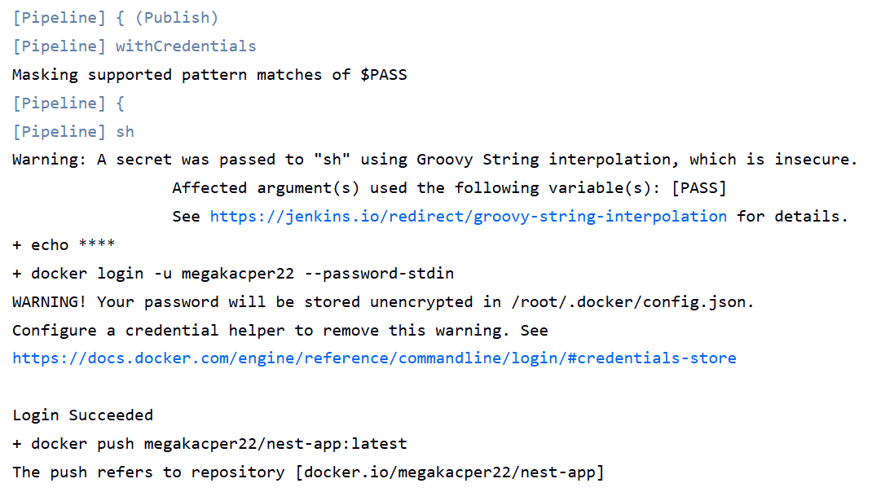
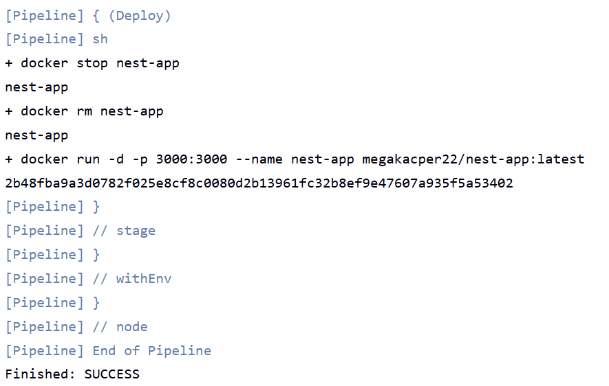

# Sprawozdanie - zajęcia 6

Podstawowy zbiór czynności do wykonania w ramach zadania z pipelinem CI/CD. Ścieżką krytyczną jest:
- [x] commit (lub tzw. *manual trigger* @ Jenkins)
- [x] clone
- [x] build
- [x] test
- [x] deploy
- [x] publish

Dodatkowe czynności wykraczające poza ścieżkę krytyczną:
- [x] Aplikacja została wybrana
Wybrałem repozytorium: github.com/nestjs/typescript-starter

- [x] Licencja potwierdza możliwość swobodnego obrotu kodem na potrzeby zadania
Repozytorium posiada licencję MIT co pozwala na dowolne wykorzystanie kodu.

- [x] Wybrany program buduje się
widać to przy poleceniu npm run build w logu konsoli.

- [x] Przechodzą dołączone do niego testy
również widać że testy przechodzą

- [x] Zdecydowano, czy jest potrzebny fork własnej kopii repozytorium
Zdecydowałem o użyciu oryginalnego repozytorium bez forka, ponieważ projekt jest wykorzystywany tylko do demonstracji pipeline.

- [x] Stworzono diagram UML zawierający planowany pomysł na proces CI/CD

- [x] Wybrano kontener bazowy lub stworzono odpowiedni kontener wstepny (runtime dependencies)
Wybrano oficjalny obraz Node.js jako środowisko runtime.
Treść Dockerfile:

'''
FROM node:20
WORKDIR /app
COPY . .
RUN npm install
RUN npm run build
EXPOSE 3000
CMD ["node", "dist/main.js"]
'''

- [x] *Build* został wykonany wewnątrz kontenera

- [ ] Testy zostały wykonane wewnątrz kontenera (kolejnego)
- [ ] Kontener testowy jest oparty o kontener build
- [ ] Logi z procesu są odkładane jako numerowany artefakt, niekoniecznie jawnie
- [ ] Zdefiniowano kontener typu 'deploy' pełniący rolę kontenera, w którym zostanie uruchomiona aplikacja (niekoniecznie docelowo - może być tylko integracyjnie)
- [ ] Uzasadniono czy kontener buildowy nadaje się do tej roli/opisano proces stworzenia nowego, specjalnie do tego przeznaczenia
- [ ] Wersjonowany kontener 'deploy' ze zbudowaną aplikacją jest wdrażany na instancję Dockera
- [ ] Następuje weryfikacja, że aplikacja pracuje poprawnie (*smoke test*) poprzez uruchomienie kontenera 'deploy'
- [ ] Zdefiniowano, jaki element ma być publikowany jako artefakt
- [ ] Uzasadniono wybór: kontener z programem, plik binarny, flatpak, archiwum tar.gz, pakiet RPM/DEB
- [ ] Opisano proces wersjonowania artefaktu (można użyć *semantic versioning*)
- [x] Dostępność artefaktu: publikacja do Rejestru online, artefakt załączony jako rezultat builda w Jenkinsie
Linijka w Jenkinsfile:
docker push megakacper22/nest-app

- [ ] Przedstawiono sposób na zidentyfikowanie pochodzenia artefaktu
- [x] Pliki Dockerfile i Jenkinsfile dostępne w sprawozdaniu w kopiowalnej postaci oraz obok sprawozdania, jako osobne pliki
Pliki Dockerfile i Jenkinsfile są dostępne w katalogu Sprawozdanie6.

- [ ] Zweryfikowano potencjalną rozbieżność między zaplanowanym UML a otrzymanym efektem

Wybrane fragmenty z pliku console-logs potwierdzające przejście kroków ze ścieżki krytycznej. Pełen output z konsoli znajduje się w pliku console-logs w katalogu Sprawozdanie6.

