# Sprawozdanie - zajęcia 8
---
## Wprowadzenie - przygotowanie środowiska

Przed rozpoczęciem laboratorium zainstalowano ansible na głównej maszynie oraz utworzono drugą maszynę wirtualną `ansible-target`
Wymieniono klucze ssh między maszyną główną a ansible-target, aby było możliwe szybkie logowanie bez podawania hasła.

Kopiowanie klucza nastąpiło za pomocą komendy:
```ssh-copy-id ansible@ansible-target```
Następnie można było przystąpić do realizacji ćwiczenia.

## Automatyzacja i zdalne wykonywanie poleceń za pomocą Ansible
Nazwy maszyny i użytkownika ansible i ansible-target były ustawiane podczas instalacji.

1. Wprowadzenie nazw DNS dla maszyn wirtualnych.

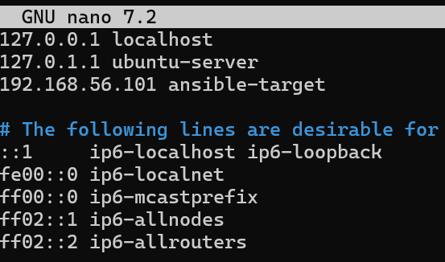
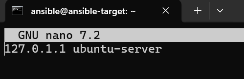
2. Weryfikacja łączności przez SSH bez hasła.

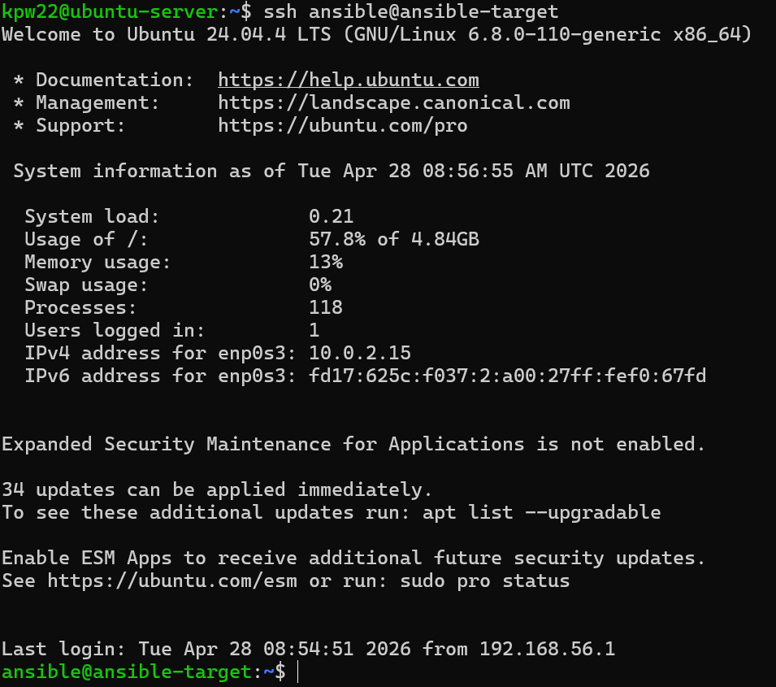

3. Stworzenie pliku inwentaryzacji.

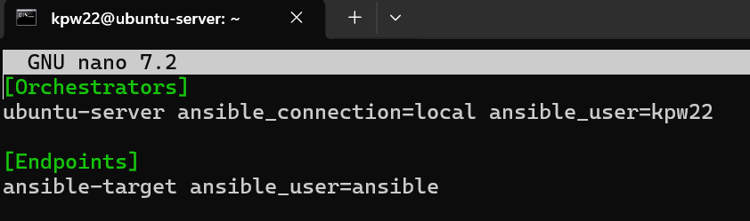

4. Wysłanie rządania ping do wszystkich maszyn.

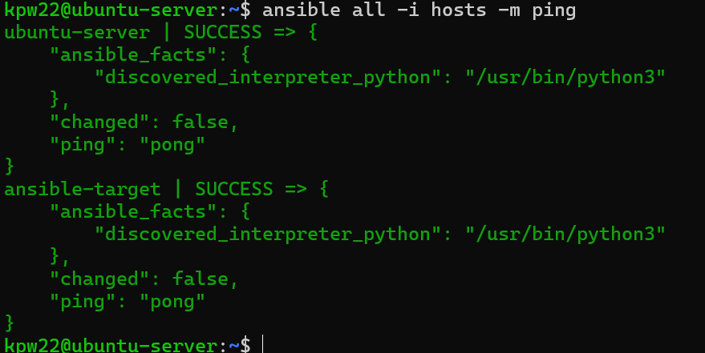
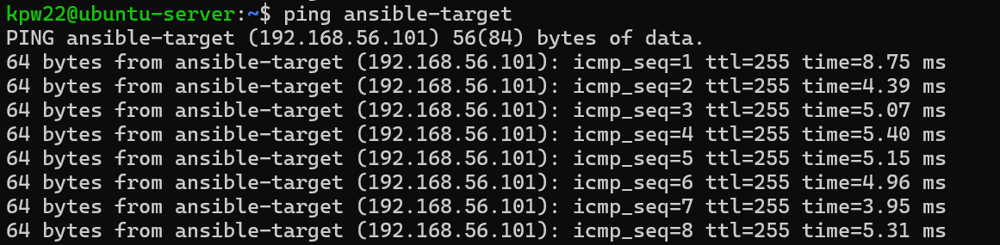
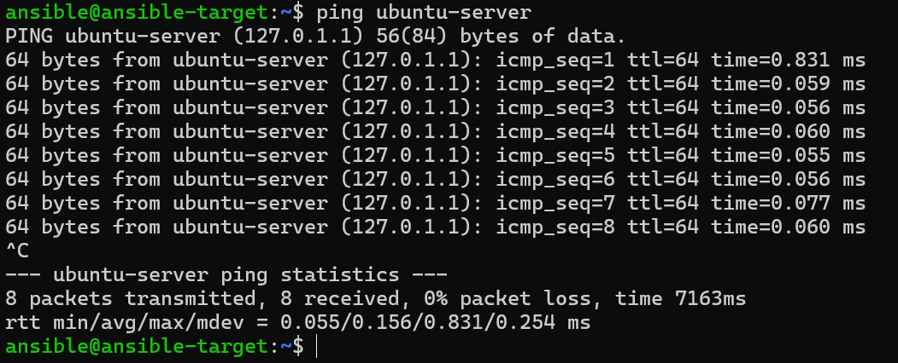

### Zdalne wywoływanie procedur za momocą playbooka

Doinstalowanie wymaganych zależności:
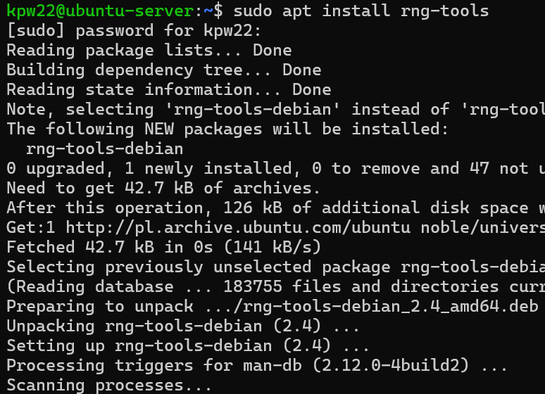

1. Utworzenie pliku `playbook.yaml` w którym uwzględniono wszystkie poniższe kroki, a następnie uruchomiono:
- wysłanie żądanie ping do wszystkich maszyn
- skopiowanie pliku inwentaryzacji na maszynę Endpoints
- zaktualizowanie pakietów
- zrestartowanie usługo ssh i rngd

plik `playbook.yaml`:
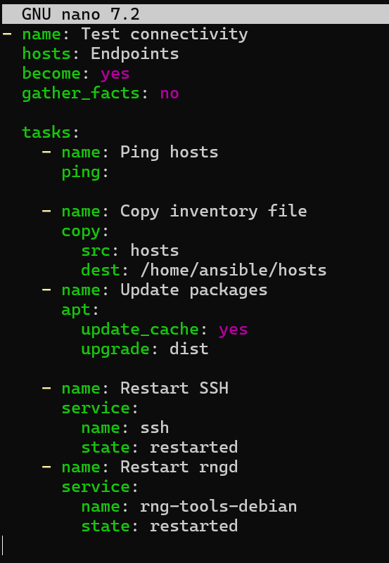

Uruchomienie:
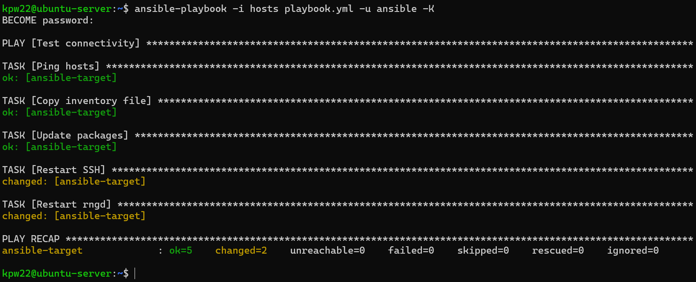

2. Przeprowadzenie operacji z wyłączonym serwerem SSH:
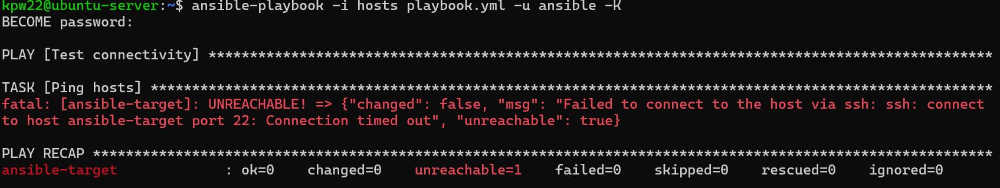

Zgodnie z oczekiwaniami błąd został złapany.

### Zarządzanie stworzonym artefaktem

Utworzono nowy plik: `playbook2.yaml` i uruchomiono go.
Instalacja docker, uruchomienie kontenera, pobranie dockerHub, zweryfikowanie łączności z kontenerem, zatrzymanie i usunięcie kontenera:

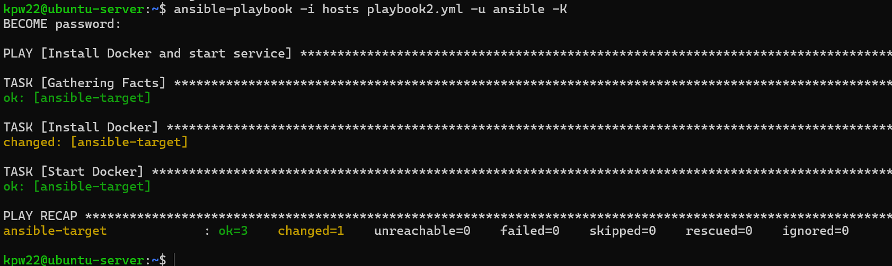
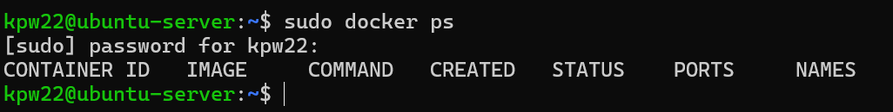
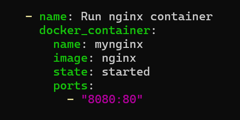
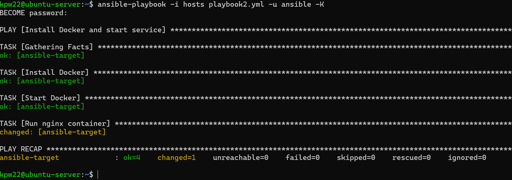
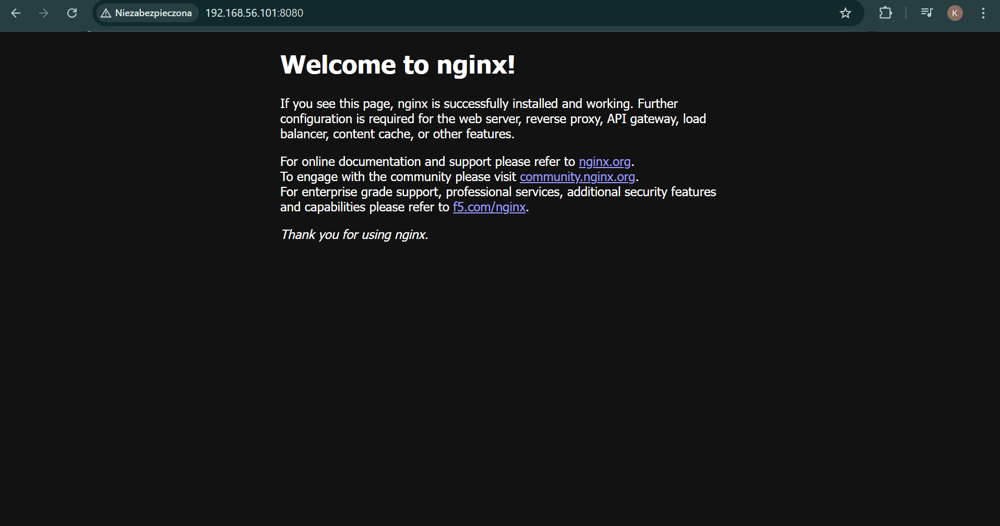
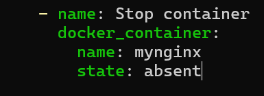
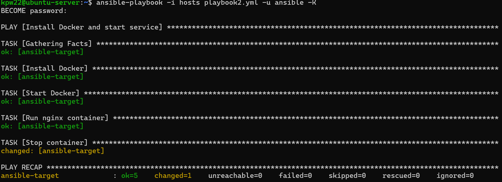

### Sanity Check

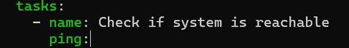

### Rola ansible

Utworzenie roli, sprawdzenie struktury:
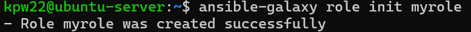
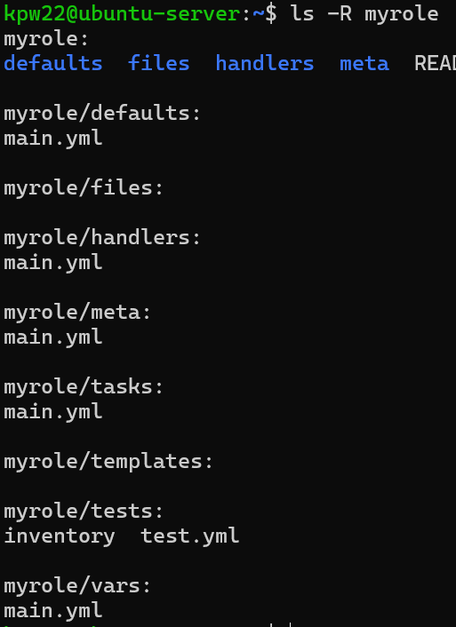

Wypełnienie `meta/main.yaml`, użycie roli:
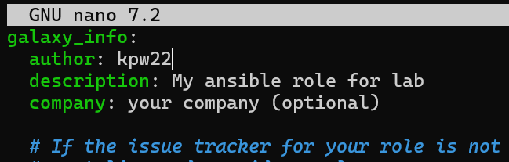
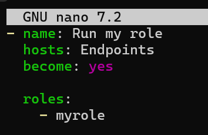


Upewnienie się czy inwentory działają, uruchomienie roli, sprawdzenie czy docker działa na ansible-target:

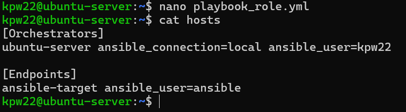
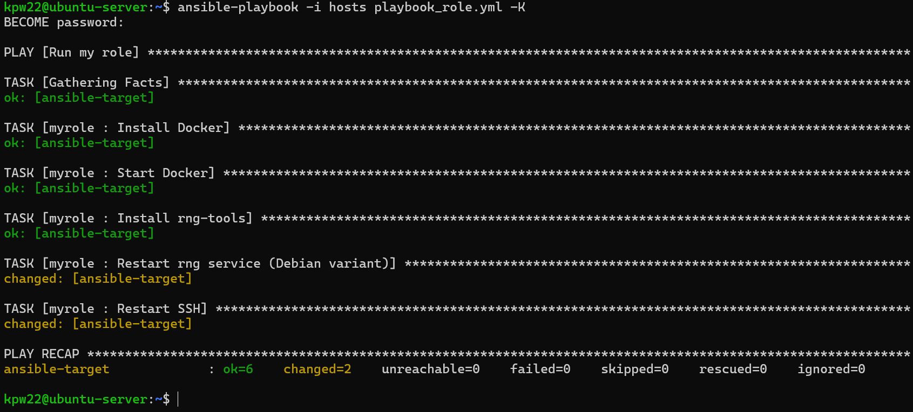
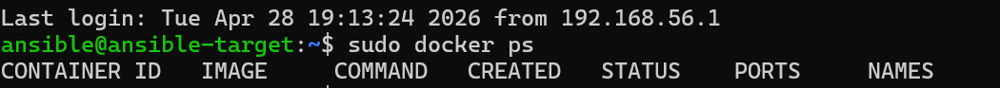

Struktura została umieszczona w katalogu Sprawozdanie8 w podkatalogu `myrole`.
