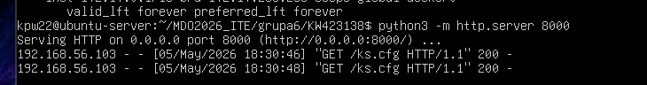
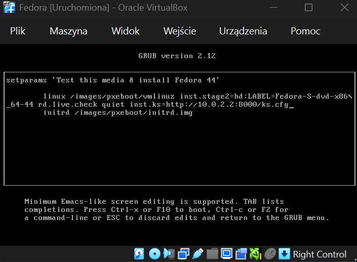
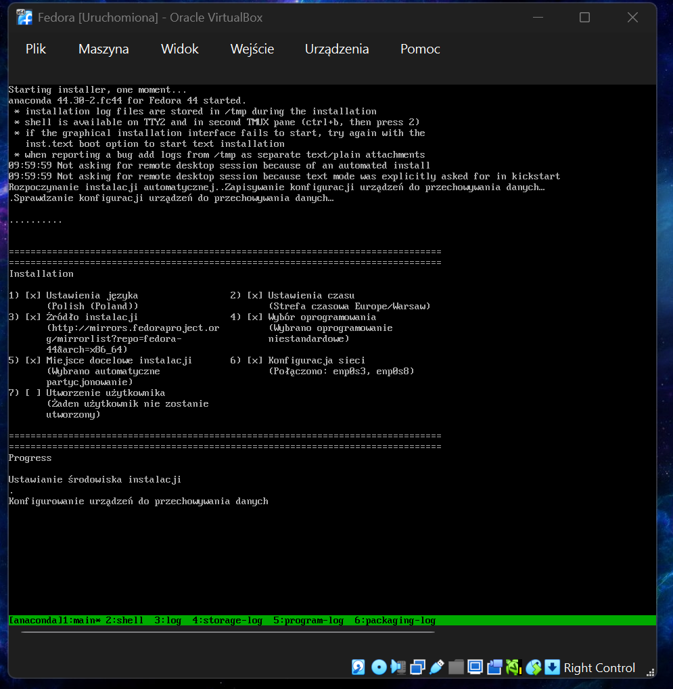
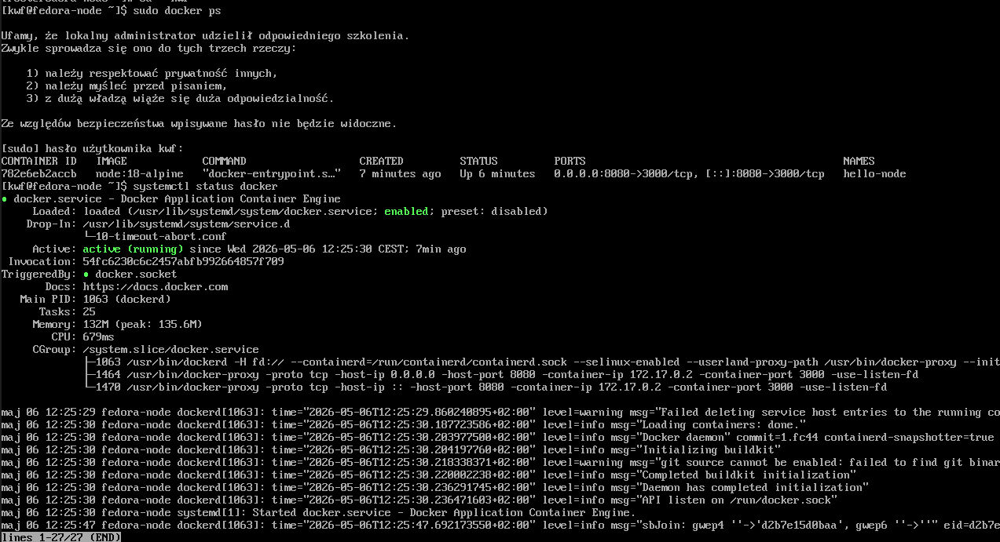
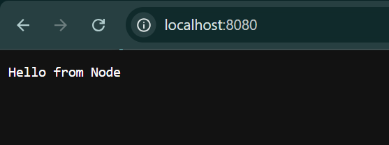

# Sprawozdanie - zajęcia 9

1. Do przeprowadzenia instalacji nienadzorowanej systemu Fedora przeprowadzono poniższe kroki:
- pobranie odpowiedniego pliku ze strony: https://mirror.23m.com/fedora/linux/releases/ (w moim przypadku Fedora 44 - Everything, wariant Server)
- utworzenie pliku odpowiedzi `ks.cfg` (jest on załączony w folderze `Sprawozdanie9`
- użycie pliku odpowiedzi do przeprowadzenia instalacji nienadzorowanej (dzięki temu że plik znajdował się na serwerze, można go było udostępnić podczas instalacji nowej maszynie):




Automatyczna nienadzorowana instalacja (dzięki plikowi odpowiedzi):


### Sekcja `%post`

W pliku `ks.cfg` w sekcji `%post` stworzono mechanizmy umożliwiające uruchomienie kontenera:

```
%post --log=/root/ks-post.log
systemctl enable docker
cat <<EOF > /usr/local/bin/deploy-app.sh

sleep 15

docker rm -f hello-node || true

docker run -d \
  --name hello-node \
  -p 8080:3000 \
  node:18-alpine \
  sh -c "echo 'const http = require(\"http\"); http.createServer((req,res)=>res.end(\"Hello from Node\" )).listen(3000);' > app.js && node app.js"
EOF

chmod +x /usr/local/bin/deploy-app.sh

cat <<EOF > /etc/systemd/system/app-autostart.service
[Unit]
Description=Start Node App
After=docker.service network-online.target
Requires=docker.service

[Service]
Type=oneshot
ExecStart=/usr/local/bin/deploy-app.sh
RemainAfterExit=yes

[Install]
WantedBy=multi-user.target
EOF

systemctl enable app-autostart.service

%end
```
### Sekcja `%packages`

W tej sekcji znajdują się wszystkie dependencje potrzebne do działania programu:

```
%packages
@core
docker
curl
%end

firstboot --disable

zerombr
ignoredisk --only-use=sda
clearpart --all --initlabel
autopart

timezone Europe/Warsaw --utc
rootpw --plaintext root

```
### Sprawdzenie działania po instalacji

Po poprawnym zakończeniu instalacji maszyny Fedora i jej ponownym uruchomieniu, sprawdzono czy docker faktycznie działa:


Następnie sprawdzono czy wchodząc przez przeglądarkę na adres maszyny (lokalhost dzięki przekierowaniu portów), wyświetla nam się oczekiwany widok (`Hello from Node`):


