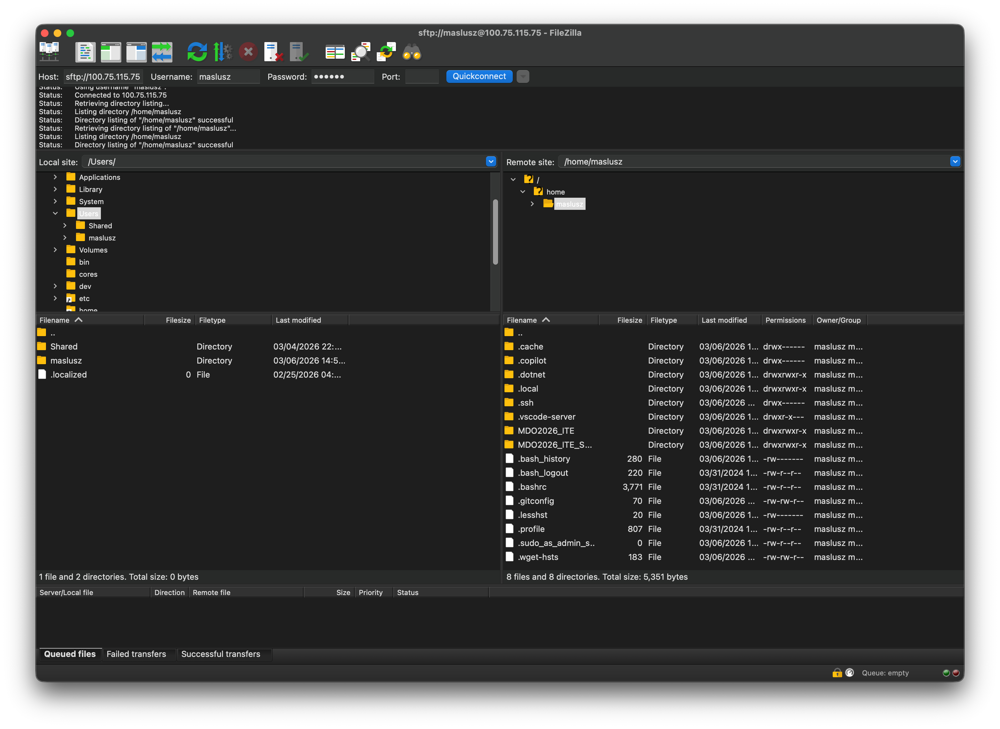
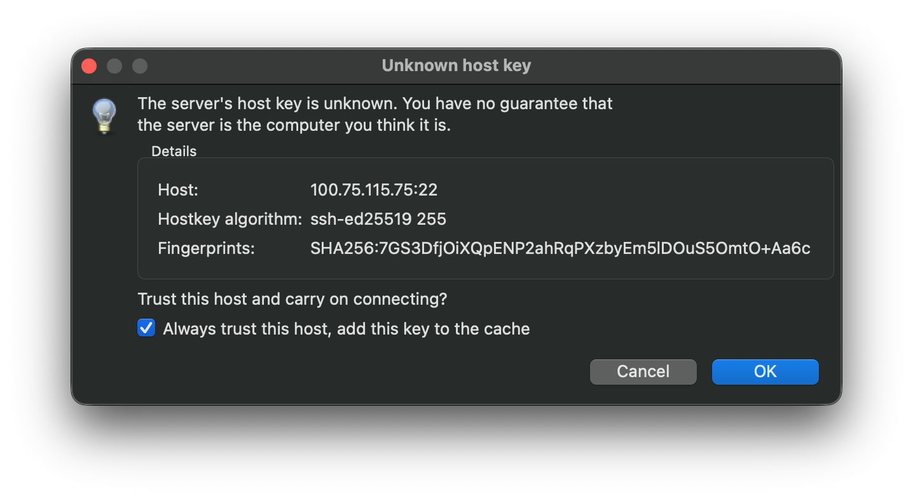
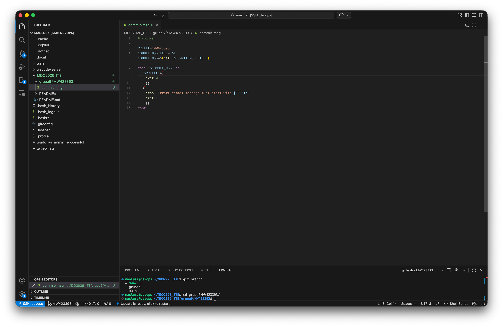
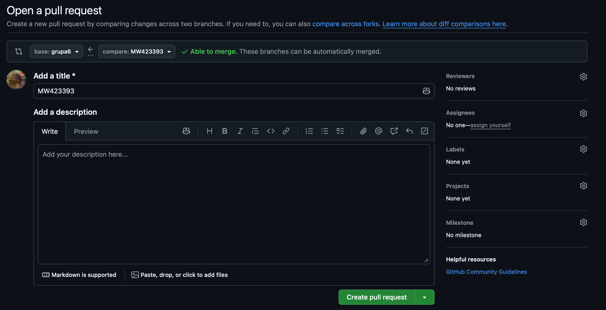
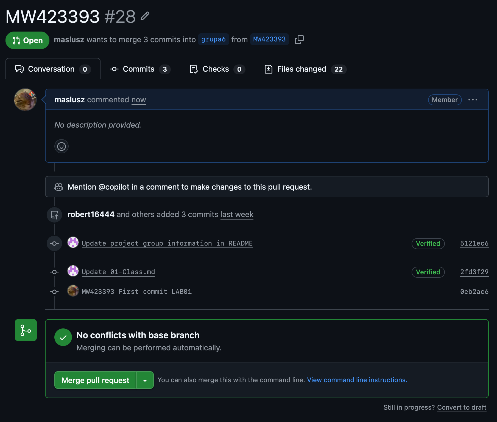

# Sprawozdanie 01 - Wprowadzenie, Git, Gałęzie, SSH

**Data zajęć:** 03.03.2026 r.
**Imię i nazwisko:** Mateusz Wiech
**Nr indeksu:** 423393
**Grupa:** 6
**Branch:** MW423393

---

## 0. Środowisko

Ćwiczenie wykonano w środowisku linuksowym (Ubuntu Server 24.04.4 LTS) działającym na maszynie wirtualnej z wykorzystaniem klienta `git` (2.43.0) i `OpenSSH` (9.6p1). Połączenie z maszyną realizowano przez SSH. Repozytorium było obsługiwane z poziomu terminala oraz edytora Visual Studio Code.

---

## 1. Git

Zainstalowano klienta `git` oraz narzędzia SSH w systemie.


Skonfigurowano dane użytkownika Git.


Repozytorium przedmiotowe sklonowano przez HTTPS z użyciem Personal Access Token.


---

## 2. SSH

Utworzono dwa klucze SSH typu `ed25519`, w tym jeden zabezpieczony hasłem.


Dodano klucze do agenta SSH i skonfigurowano dostęp do GitHub przez SSH.


Oba klucze publiczne zostały pomyślnie dodane do konta na GitHub-ie.


Repozytorium sklonowano również z użyciem protokołu SSH.


Włączono uwierzytelnianie dwuskładnikowe na koncie GitHub.


---

## 3. Narzędzia

Skonfigurowano dostęp do maszyny i repozytorium w Visual Studio Code.


Skonfigurowano wymianę plików z użyciem FileZilla przez SFTP.




---

## 4. Gałąź

Przełączono się na gałąź `main`, następnie na gałąź grupową `grupa6`.


Na podstawie gałęzi grupowej utworzono własną gałąź `MW423393` i rozpoczęto na niej pracę.


W katalogu właściwym dla grupy utworzono katalog `MW423393`.


---

## 5. Git hook

Przygotowano skrypt `commit-msg`, który sprawdza, czy każdy komunikat commita zaczyna się od `MW423393`.

```sh
#!/bin/sh

PREFIX="MW423393"
COMMIT_MSG_FILE="$1"
COMMIT_MSG=$(cat "$COMMIT_MSG_FILE")

case "$COMMIT_MSG" in
  "$PREFIX"*)
    exit 0
    ;;
  *)
    echo "Error: commit message must start with $PREFIX"
    exit 1
    ;;
esac
```



Skrypt dodano do katalogu `MW423393`, a następnie skopiowano do `.git/hooks/commit-msg`, aby był uruchamiany przy każdym commicie.


Sprawdzenie działania hooka.


Poprawny commit.


Wysłanie zmian do zdalengo źródła.


---

## 6. Pull request

Po wysłaniu zmian stworzono Pull Request z własnej gałęzi do gałęzi grupy z pomocą odpowiedniego mechanizmu na GitHubie.



Status utworzonego Pull Requesta.



Brak konfliktów merge'owania - może odbyć się automatycznie.
Na koniec zaktualizowano sprawozdanie o brakujące kroki, utworzono nowy commit i przesłano aktualizację do zdalnego źródła.

---