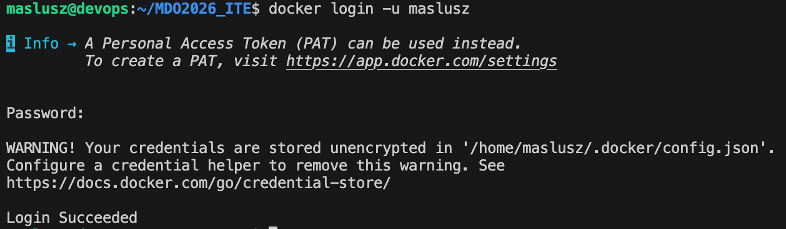

# Sprawozdanie 02 - Git, Docker

**Data zajęć:** 03.03.2026 r.

**Imię i nazwisko:** Mateusz Wiech

**Nr indeksu:** 423393

**Grupa:** 6

**Branch:** MW423393

---

## 0. Środowisko

Ćwiczenie wykonano w środowisku linuksowym (Ubuntu Server 24.04.4 LTS) działającym na maszynie wirtualnej z wykorzystaniem klienta `git` (2.43.0) i `OpenSSH` (9.6p1). Połączenie z maszyną realizowano przez SSH. Repozytorium było obsługiwane z poziomu terminala oraz edytora Visual Studio Code.

---

## 1. Instalacja Docker

W tym celu wykorzystano polecenie `apt install docker.io`


Dodano użytkownika do grupy `docker` i sprawdzono wersję Dockera.


Sprawdzenie działania dokonano poprzez polecenie `docker run hello-world`


Dodatkowo zalogowano się przy użyciu Personal Access Token.



---

## 2. Obrazy

Obrazy pobrano polceniem:

```
docker pull hello-world
docker pull busybox
docker pull ubuntu
docker pull mariadb
docker pull mcr.microsoft.com/dotnet/runtime
docker pull mcr.microsoft.com/dotnet/aspnet
docker pull mcr.microsoft.com/dotnet/sdk
```


Sprawdzenia wielkości pobranych obrazów można dokonać dzięki poleceniu `docker images`.


Uruchamianie kontenerów i sprawdzenie ich kodów wyjścia.


`busybox` jest kontenerem interaktywnym - aby do niego wejść należy skorzystać z polecenia `docker run -it busybox sh`.


Uruchomienie systemu `ubuntu` w kontenerze - sprawdzenie procesu PID1 oraz aktualizacja pakietów.


Procesy dockera na hoście:


---

# 3. Dockerfile

Treść utworzonego Dockerfile:

```
FROM ubuntu:latest

RUN apt update && apt install -y git ca-certificates && rm -rf /var/lib/apt/lists/*

WORKDIR /workspace

RUN git clone https://github.com/InzynieriaOprogramowaniaAGH/MDO2026_ITE.git

CMD ["/bin/bash"]
```

Budowanie obrazu:


Uruchomienie interaktywne obrazu:


Repozytorium zostało poprawnie sklonowane.

---

# 4. Czyszczenie kontenerów i obrazów

Wyświetlenie zakończonych i uruchomionych kontenerów:


Wyczyszczenie zakończonych kontenerów:


Po tej operacji `docker ps -a` zwraca pustą listę.

Usuwanie lokalnych obrazów:


Po usunięciu `docker images` zwraca pustą listę.