# Sprawozdanie 03 - Dockerfiles, kontener jako definicja etapu

**Data zajęć:** 17.03.2026 r.

**Imię i nazwisko:** Mateusz Wiech

**Nr indeksu:** 423393

**Grupa:** 6

**Branch:** MW423393

---

## 0. Środowisko

Ćwiczenie wykonano w środowisku linuksowym (Ubuntu Server 24.04.4 LTS) działającym na maszynie wirtualnej z wykorzystaniem klienta `git` (2.43.0) i `OpenSSH` (9.6p1). Połączenie z maszyną realizowano przez SSH. Repozytorium było obsługiwane z poziomu terminala oraz edytora Visual Studio Code.

---

## 1. Wybór oprogramowania na zajęcia

Wykorzystano repozytorium [mesqueeb/merge-anything](https://github.com/mesqueeb/merge-anything), ponieważ posiada licencję MIT oraz zdefiniowane kroki `npm install`, `npm run build` i `npm test`. Repozytorium zawiera kod źródłowy, konfigurację budowania oraz testy automatyczne.

Sklonowanie repo
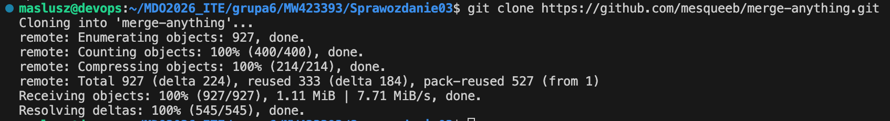

Sprawdzenie wersji `node` i `npm`
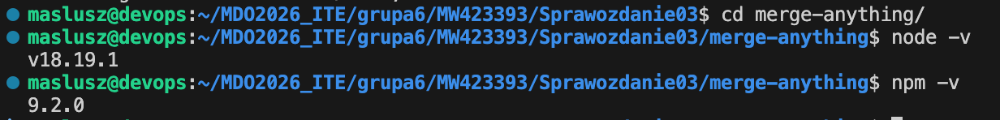

Instalacja `npm`
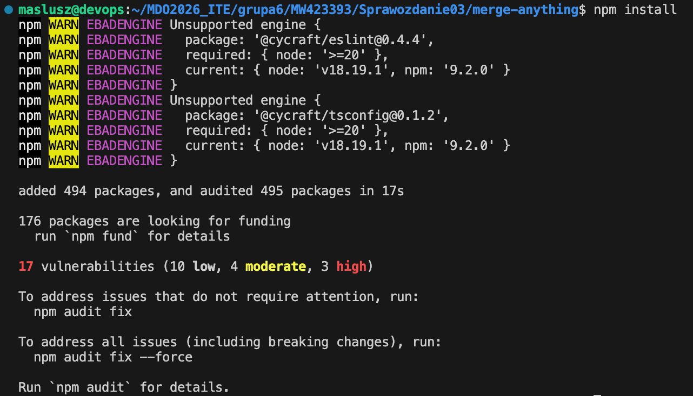

Build programu i uruchomienie testów
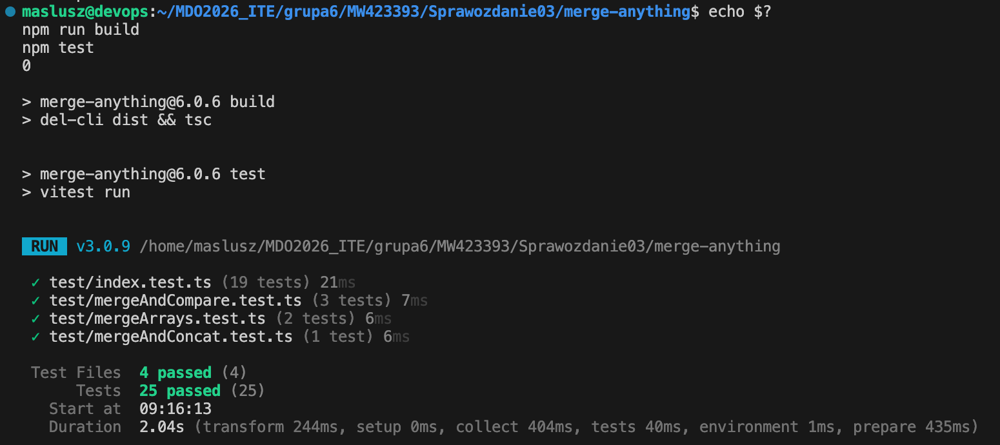

---

## 2. Izolacja i powtarzalność: build w kontenerze

Pobranie obrazu z wymaganym środowiskiem uruchomieniowym (`node`)
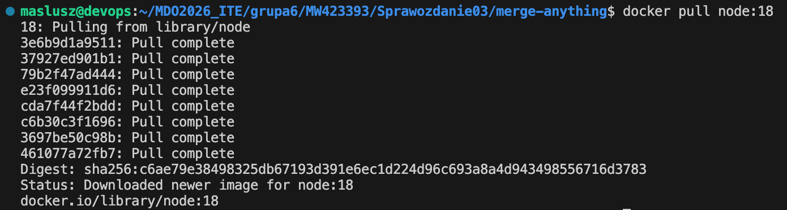

Uruchomienie kontenera interaktywnie i instalacja `git`
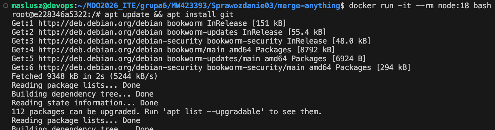

Sklonowanie repo
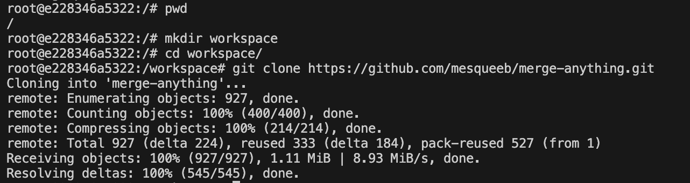

Sprawdzenie wersji `node` i `npm`
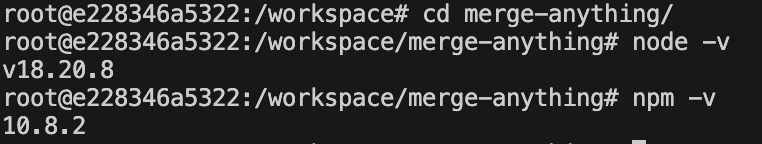

Instalacja `npm`
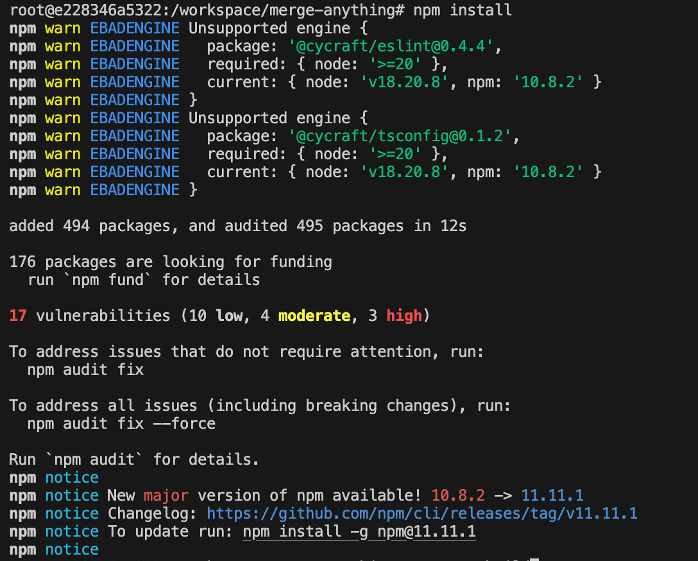

Build i uruchomienie testów
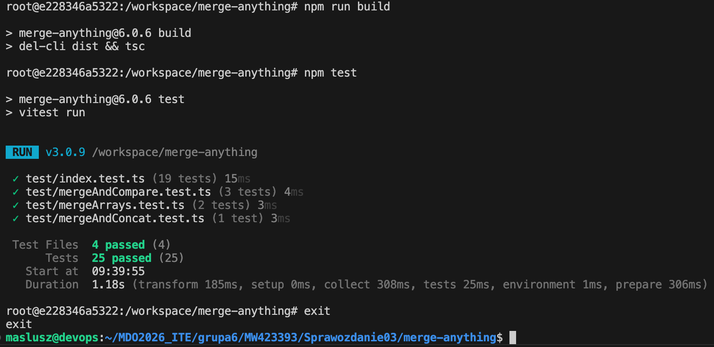

Utworzono dwa pliki Dockerfile o zawartości:

- `Dockerfile.build` - bazuje na `node:18`, instaluje `git`, klonuje repozytorium `mesqueeb/merge-anything`, instaluje zależności i wykonuje `npm run build`:
```
FROM node:18

RUN apt update && apt install -y git && rm -rf /var/lib/apt/lists/*

WORKDIR /app

RUN git clone https://github.com/mesqueeb/merge-anything.git .

RUN npm install
RUN npm run build
```

Zbudowanie pierwszego do buildowania
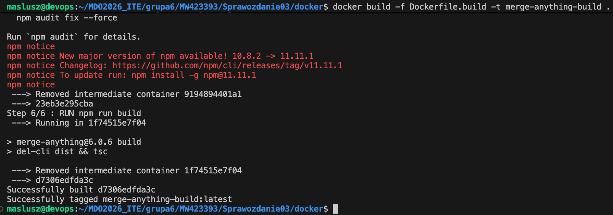

oraz jego uruchomienie
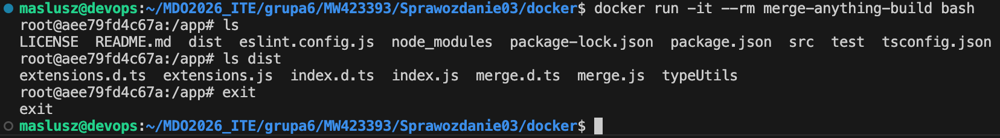

- `Dockerfile.test` - bazuje na obrazie utworzonym przez `Dockerfile.build` i uruchamia wyłącznie `npm test`, bez ponownego builda:
```
FROM merge-anything-build

WORKDIR /app

CMD ["npm", "test"]
```

Zbudowanie drugiego kontenera jedynie do testowania
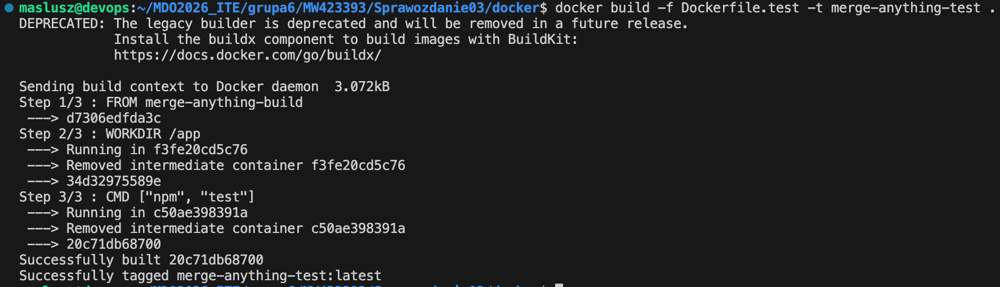

oraz jego uruchomienie
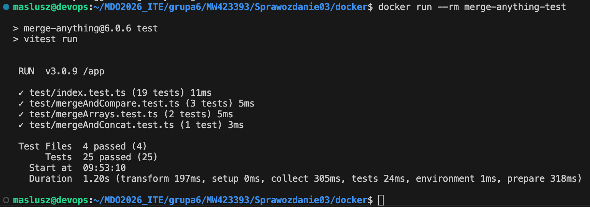

Wewnątrz kontenera na bazie obrazu `merge-anything-build` wykonano polecenie `ps -ef` - procesem głównym kontenera jest `bash`. Potwierdza to, że kontener jest uruchomioną instancją obrazu i wykonuje konkretny proces.
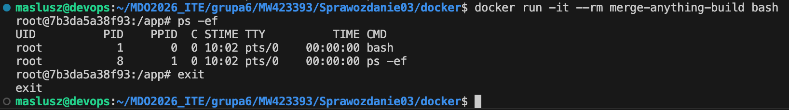

Uruchomiono kontener `merge-test` - kontener wykonał polecenie `npm test`, uruchomił testy projektu i zakończył działanie kodem wyjścia `0`. Polecenie `docker ps -a` potwierdziło, że kontener został utworzony i zakończył pracę poprawnie (`Exited (0)`).
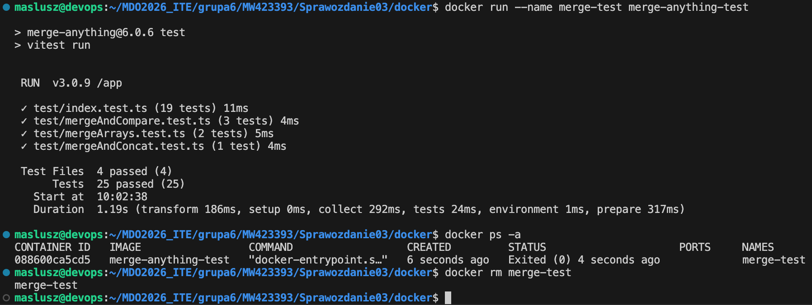

---
