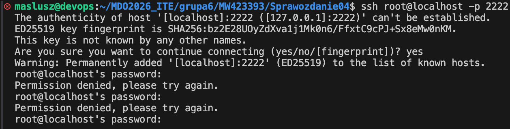

# Sprawozdanie 04 - Dodatkowa terminologia w konteneryzacji, instancja Jenkins

**Data zajęć:** 24.03.2026 r.

**Imię i nazwisko:** Mateusz Wiech

**Nr indeksu:** 423393

**Grupa:** 6

**Branch:** MW423393

---

## 0. Środowisko

Ćwiczenie wykonano w środowisku linuksowym (Ubuntu Server 24.04.4 LTS) działającym na maszynie wirtualnej z wykorzystaniem klienta `git` (2.43.0) i `OpenSSH` (9.6p1). Połączenie z maszyną realizowano przez SSH. Repozytorium było obsługiwane z poziomu terminala oraz edytora Visual Studio Code.

---

## 1. Zachowywanie stanu między kontenerami

Do kontenera bazowego wykorzystano obraz z poprzednich zajęć - `merge-anything-build`, który potrafi już budować projekt i ma zainstalowane wszystkie dependencje.


Utworzono dwa woluminy - wejściowy `merge-input` oraz wyjściowy `merge-output`.


Podłączenie woluminów do kontenera i uruchomienie go.


Repozytorium sklonowano lokalnie na hoście, następnie przeniesiono jego zawartość na wolumin wejściowy `merge-input` z wykorzystaniem kontenera pomocniczego. Lokalny katalog projektu podłączono do kontenera jako bind mount tylko od odczytu. Wolumin wejściowy podłączono jako katalog docelowy. W kontenerze skopiowano pliki z `/src` do `/input`. Przy tym podejściu nie wykorzystano `git` wewnątrz kontenera.


Uruchomiono kontener z podłączonymi woluminami oraz build wewnątrz niego. Wykonano polecenia `npm install` oraz `npm run build`. Katalog z powstałymi plikami `dist` został skopiowany do `/output` na wolumin wyjściowy.


Widoczność plików po zakończeniu pracy kontenera zweryfikowano przez uruchomienie nowego kontenera z podłączonym tym samym woluminem `merge-output`.


Przed ponowynym klonowaniem, ale tym razem wewnątrz kontenera, wyczyszczono oba woluminy. Repozytorium sklonowano bezpośrednio na wolumin wejściowy z poziomu kontenera. W katalogu `/input` wykonano `git clone https://github.com/mesqueeb/merge-anything.git .`. Wykonano `npm install` oraz `npm run build`, katalog `dist` skopiowano na wolumin wyjściowy `/output`.


Sprawdzenie czy pliki pozostają dostępne po zakończeniu pracy kontenera.


Część kroków można zautomatyzować za pomocą `docker build` i `Dockerfile` - sklonowanie repo, instalację zależności i wykonanie builda, a `RUN --mount` może tymczasowo udostępnić źródła podczas budowania obrazu. Nie zastępuje to jednak named volume, ponieważ `RUN --mount` działa tylko w czasie budowania obrazu oraz nie służy do trwałego przechowywania danych między uruchomieniami kontenerów.

---

## 2. Eksponowanie portu i łączność między kontenerami

Uruchomienie obrazów iperf3 w dwóch kontenerach - w jednym w trybie serwera, w drugim klienta.


Sprawdzenie adresów IP kontenerów.


Uruchomienie testu `iperf3 -c adres_serwera`


Utworzenie własnej sieci poprzez `docker network create` i uruchomnienie nowych kontenerów z tą siecią.


Test połączenia z wykorzystaniem nazwy, a nie adresu IP.


Połączernie się z kontenerem z hosta. Wystawienie portu serwera na hosta.


Test połączenia z hosta.

`localhost`, ponieważ z punktu widzenia hosta usługa jest dostępna lokalnie na jego własnym porcie 5201.

Test połączenia spoza hosta.


Do tworzenia maszyn wirtualnych korzystam z serwera zdalnego, z którym jestem połącznony po prywatnym VPN-ie. Ograniczeniem tutaj jest więc przepustowość łącza udostępniana przez ISP.

W domyślnej sieci `bridge`, przy połączeniu kontener–kontener po adresie IP, uzyskano przepustowość około `37.0 Gbit/s`. Po utworzeniu własnej sieci mostkowej i wykorzystaniu rozwiązywania nazw, przy połączeniu do kontenera `iperf-server-net` po nazwie, uzyskano około `33.6 Gbit/s`.

Połączenie z hosta przez `localhost`, uzyskało około `26.2 Gbit/s`. Połączenie spoza hosta, do adresu `192.168.0.155`, uzyskało około `22.4 Mbit/s`. Różnica względem komunikacji wewnątrz Dockera wynika z faktu, że ostatni pomiar obejmował rzeczywisty ruch sieciowy między urządzeniami, a nie tylko komunikację lokalną wewnątrz hosta.

---

## 3. Usługi w rozumieniu systemu, kontenera i klastra

Uruchomienie kontenera Ubuntu i wystawienie `sshd` na porcie hosta.


Wewnątrz kontenera wykonano polecenie `apt install -y openssh-server` do instalacji serwera `openssh`.


Próba połączenia po SSH.


Należy w konfiguracji `sshd` zmienić ustawienia na:
```
PermitRootLogin yes
PasswordAuthentication yes
```

Ponowna próba połączenia.


Komunikacja z kontenerem przez SSH może być wygodna w sytuacjach, w których chcemy traktować kontener podobnie do zdalnego systemu. Ułatwia to logowanie z użyciem standardowego klienta `ssh`.
Wadą jest jednak fakt, że w kontenerach zwykle uruchamia się pojedynczy proces aplikacyjny, a nie pełną usługę systemową. Dodawanie `sshd` zwiększa złożoność obrazu, wymaga dodatkowej konfiguracji, otwierania portów i zarządzania hasłami lub kluczami, a także zmniejsza prostotę kontenera.

---

## 4. Przygotowanie do uruchomienia serwera Jenkins

Utworzenie sieci i uruchomienie DIND.


Uruchomienie Jenkins Contorller.


Oba kontenery działają.


Aby zainicjalizować Jenkins należy wydobyć hasło z logów (polecenie `docker logs jenkins-blueocean`) i użyć go na stronie pod adresem hosta (np. `http://192.168.0.155:8080`).


Instalacja zalecanych pluginów.


---
