# Sprawozdanie 05 - Pipeline, Jenkins, izolacja etapów

**Data zajęć:** 31.03.2026 r.

**Imię i nazwisko:** Mateusz Wiech

**Nr indeksu:** 423393

**Grupa:** 6

**Branch:** MW423393

---

## 0. Środowisko

Ćwiczenie wykonano w środowisku linuksowym (Ubuntu Server 24.04.4 LTS) działającym na maszynie wirtualnej z wykorzystaniem klienta `git` (2.43.0) i `OpenSSH` (9.6p1). Połączenie z maszyną realizowano przez SSH. Repozytorium było obsługiwane z poziomu terminala oraz edytora Visual Studio Code. Wykostano oprogramowanie `Docker` w wersji 28.2.2.

---

## 1. Przygotowanie

Uruchomienie obrazu DIND:
```
docker run \
  --name jenkins-docker \
  --rm \
  --detach \
  --privileged \
  --network jenkins \
  --network-alias docker \
  --env DOCKER_TLS_CERTDIR=/certs \
  --volume jenkins-docker-certs:/certs/client \
  --volume jenkins-data:/var/jenkins_home \
  --publish 2376:2376 \
  docker:dind \
  --storage-driver overlay2
```
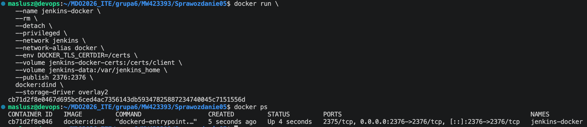

Stworzenie obrazu blueocean na podstawie obrazu Jenkinsa z `Dockerfile`:
```
FROM jenkins/jenkins:2.541.3-jdk21
USER root
RUN apt-get update && apt-get install -y lsb-release ca-certificates curl && \
    install -m 0755 -d /etc/apt/keyrings && \
    curl -fsSL https://download.docker.com/linux/debian/gpg -o /etc/apt/keyrings/docker.asc && \
    chmod a+r /etc/apt/keyrings/docker.asc && \
    echo "deb [arch=$(dpkg --print-architecture) signed-by=/etc/apt/keyrings/docker.asc] \
    https://download.docker.com/linux/debian $(. /etc/os-release && echo \"$VERSION_CODENAME\") stable" \
    | tee /etc/apt/sources.list.d/docker.list > /dev/null && \
    apt-get update && apt-get install -y docker-ce-cli && \
    apt-get clean && rm -rf /var/lib/apt/lists/*
USER jenkins
RUN jenkins-plugin-cli --plugins "blueocean docker-workflow json-path-api"
```
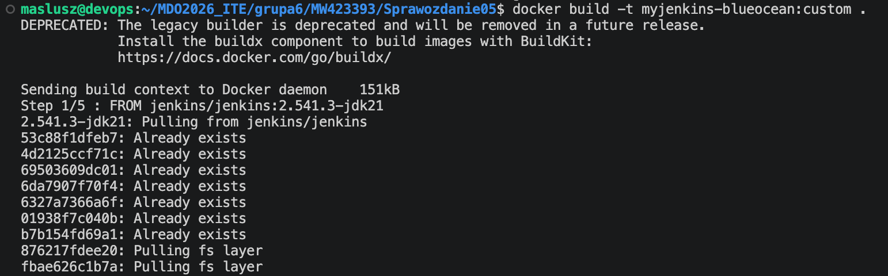
Customowy obraz posiada wbudowanego klienta Dockera, przez co Jenkins może zarządzać innymi kontenerami.

Uruchomienie blueocean:
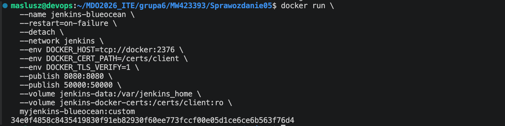

Konfiguracja Jenkinsa:
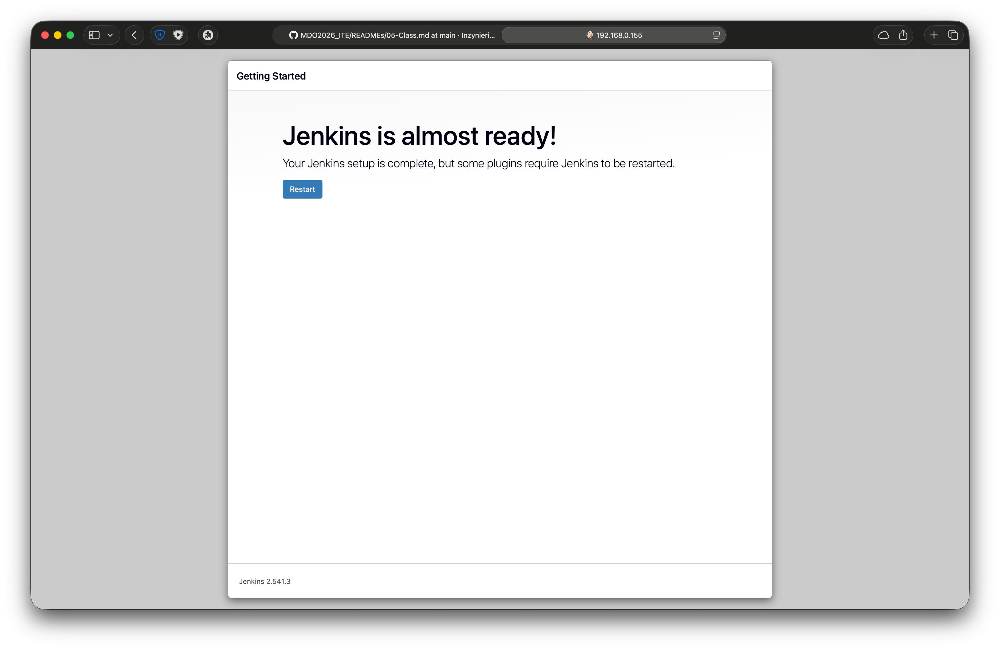
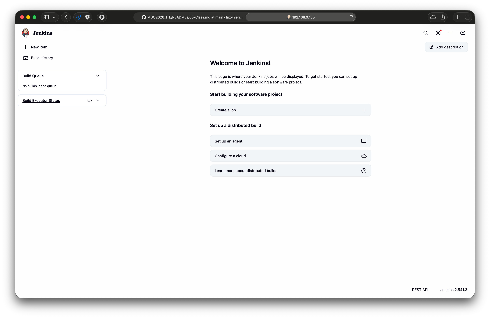

---

## 2. Zadanie wstepne: uruchomienie

### Projekt `zadanie-uname`

Stworzenie nowego zadania:
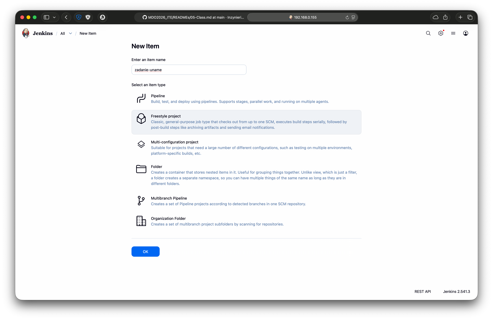

Dodanie execute shell jako build step:
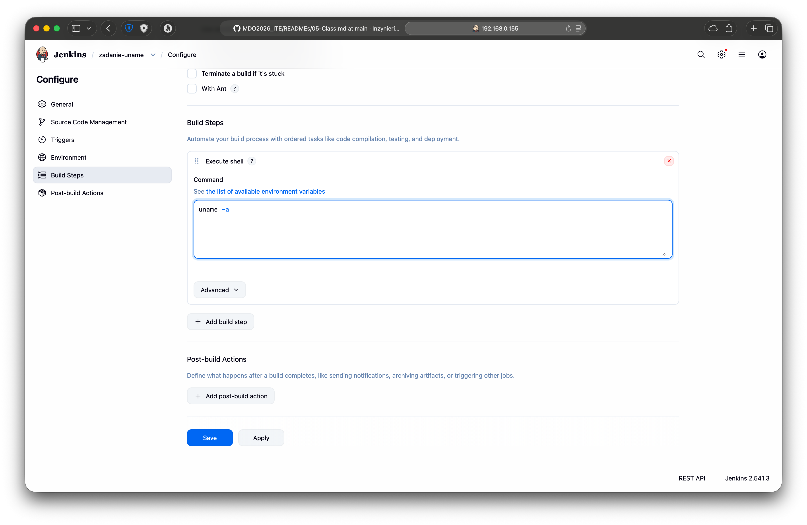

Sprawdzenie outputu po uruchomieniu `Build Now`:
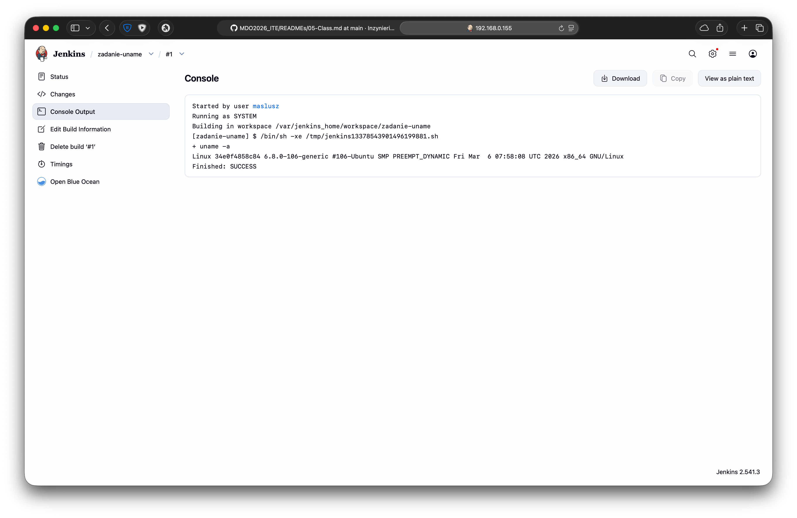

### Projekt `sprawdzanie-godziny`

Kroki builda:
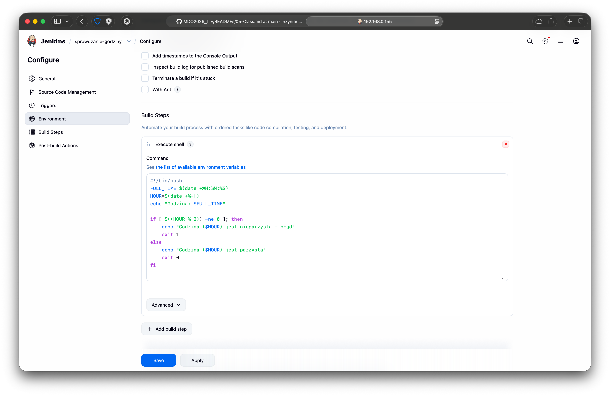

Output:
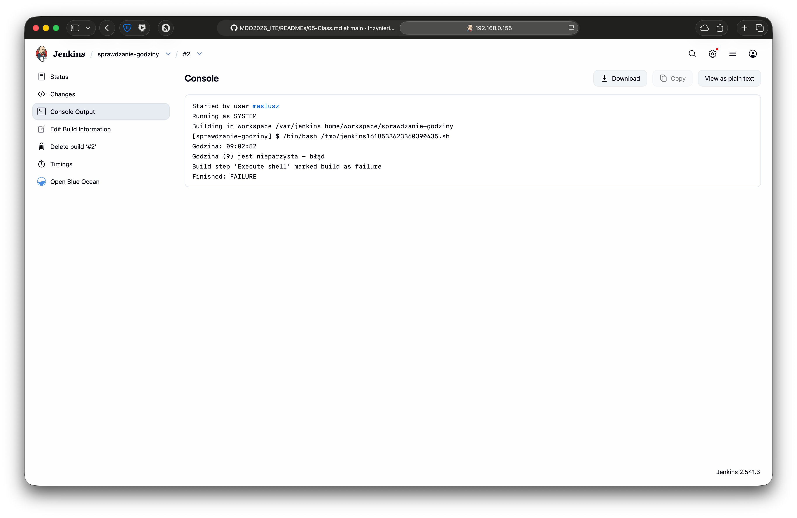

### Pobranie obrazu kontenera `ubuntu` w projekcie
Build steps:
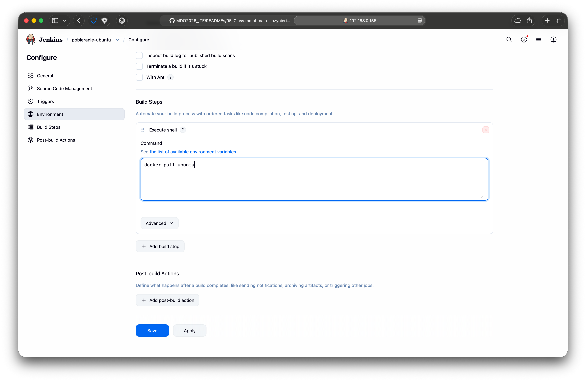

Wynik:
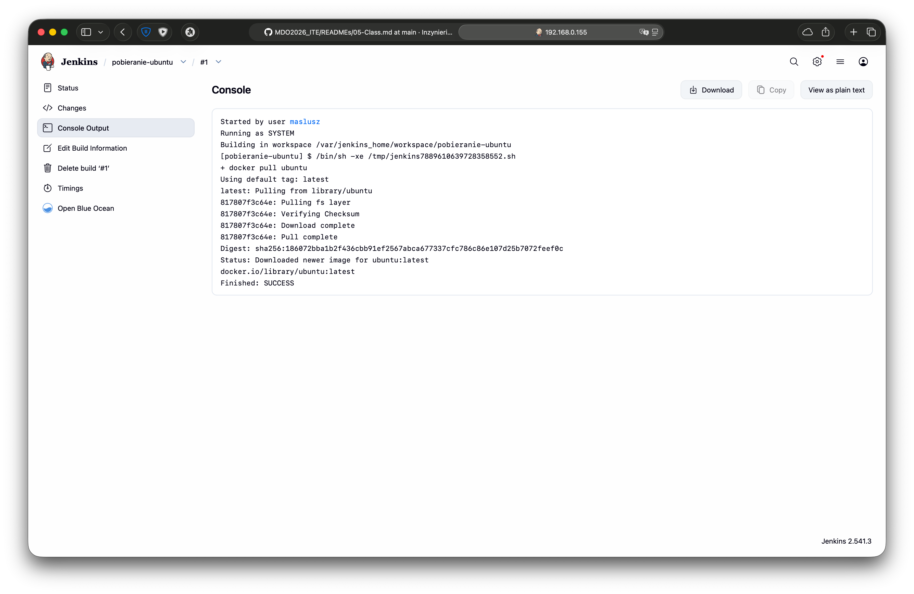

---

## 3. Zadanie wstępne: obiekt typu pipeline

New item:
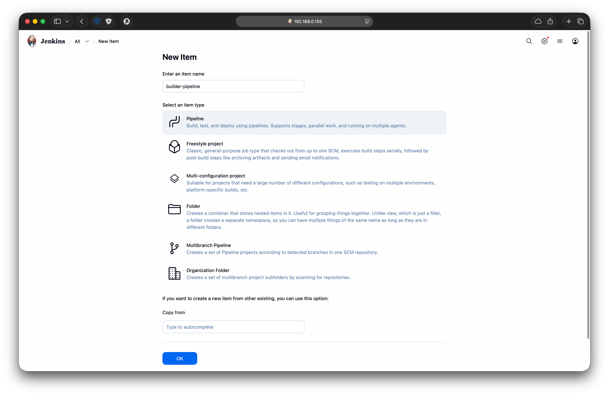

Skrypt pipeline'u:
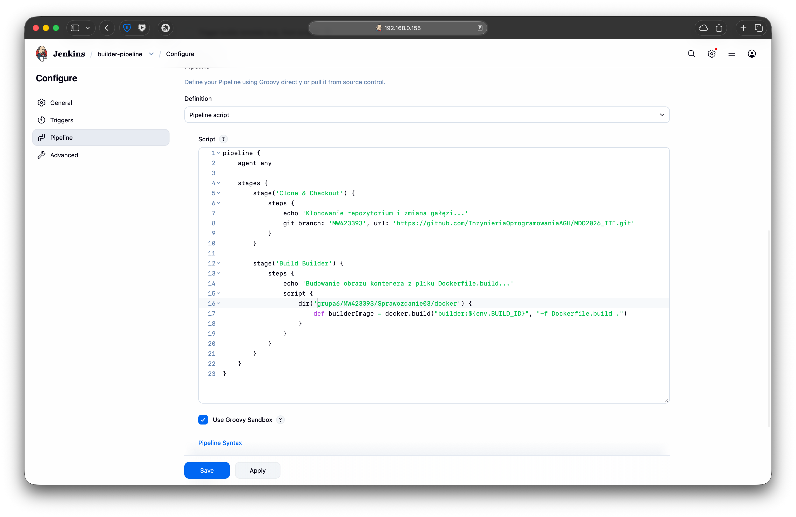

Output konsoli:
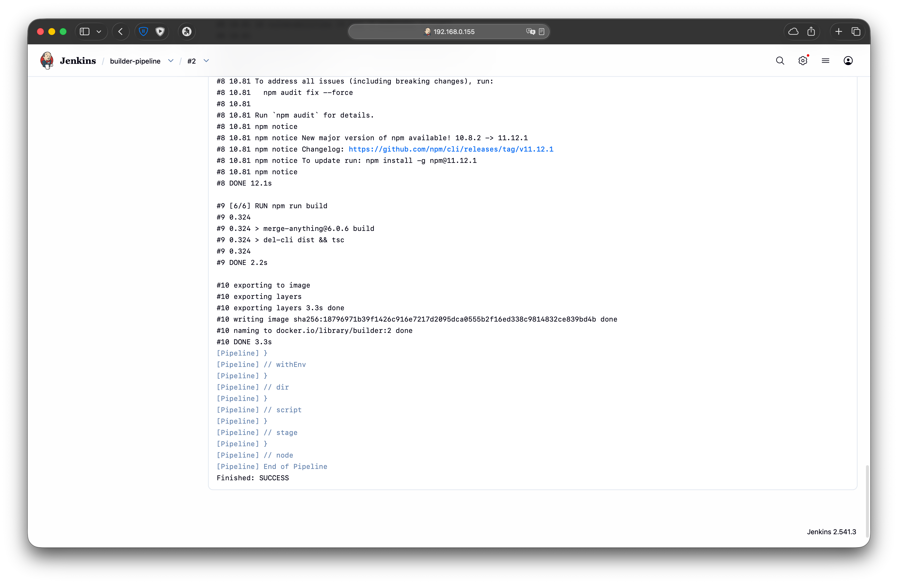

Status wykonanego run'a:
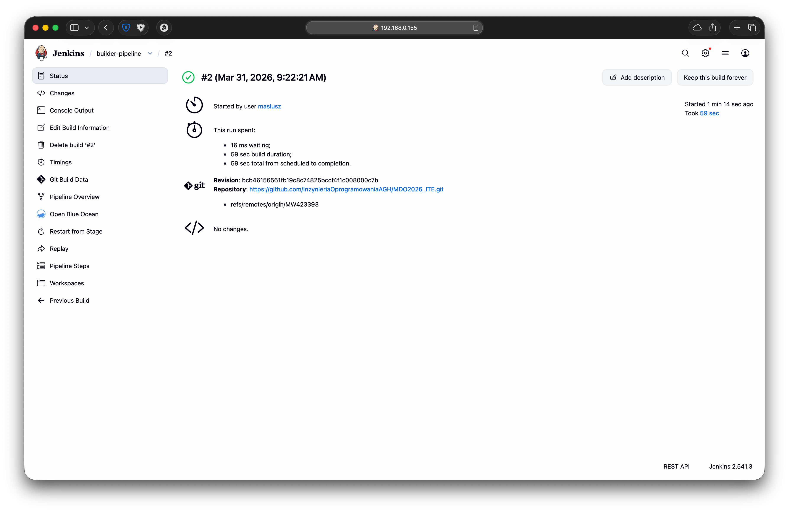

Drugie uruchomienie:
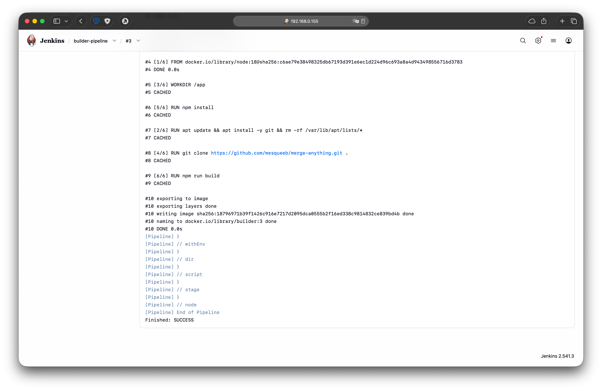


Została poprawnie wykorzystana pamieć podręczna, proces zajał mniej czasu bo Docker skorzystał ze swojego cache (nie musiał ponownie instalować pakietów ani budować aplikacji) a Jenkins nie klonował repozytorium od zera, a jedynie sprawdził zmiany.

---