# Sprawozdanie 06 - Pipeline: lista kontrolna

**Data zajęć:** 14.04.2026 r.

**Imię i nazwisko:** Mateusz Wiech

**Nr indeksu:** 423393

**Grupa:** 6

**Branch:** MW423393

---

## 0. Środowisko

Ćwiczenie wykonano w środowisku linuksowym (Ubuntu Server 24.04.4 LTS) działającym na maszynie wirtualnej z wykorzystaniem klienta `git` (2.43.0) i `OpenSSH` (9.6p1). Połączenie z maszyną realizowano przez SSH. Repozytorium było obsługiwane z poziomu terminala oraz edytora Visual Studio Code. Wykostano oprogramowanie `Docker` w wersji 28.2.2 oraz `Jenkins` w wersji 2.541.3, uruchomiony w kontenerze Docker.
Wybrano projekt [`merge-anything`](https://github.com/mesqueeb/merge-anything.git), będący biblioteką JavaScript/TypeScript. Dobór  wynikał z dostępności testów oraz możliwości uruchomienia procesu w izolacji kontenerowej.

---

## 1. Plan na *pipeline*

Plan *pipeline* obejmuje ręczne uruchomienie w Jenkinsie, pobranie repozytorium z gałęzi `MW423393`, zbudowanie obrazu `merge-anything-build` z `Dockerfile.build`, zbudowanie obrazu `merge-anything-test` z `Dockerfile.test`, uruchomienie testów projektu w kontenerze testowym, przygotowanie artefaktu w postaci archiwum `tar.gz` z katalogiem `dist` i plikami projektu, uruchomienie kontenera `deploy` w celach integracyjnych, wykonanie *smoke testu* przez sprawdzenie obecności zbudowanych plików w `/app/dist`, a następnie archiwizację artefaktów i logów w Jenkinsie. Proces realizuje pełną ścieżkę `clone -> build -> test -> deploy -> publish` z wykorzystaniem izolacji kontenerowej.

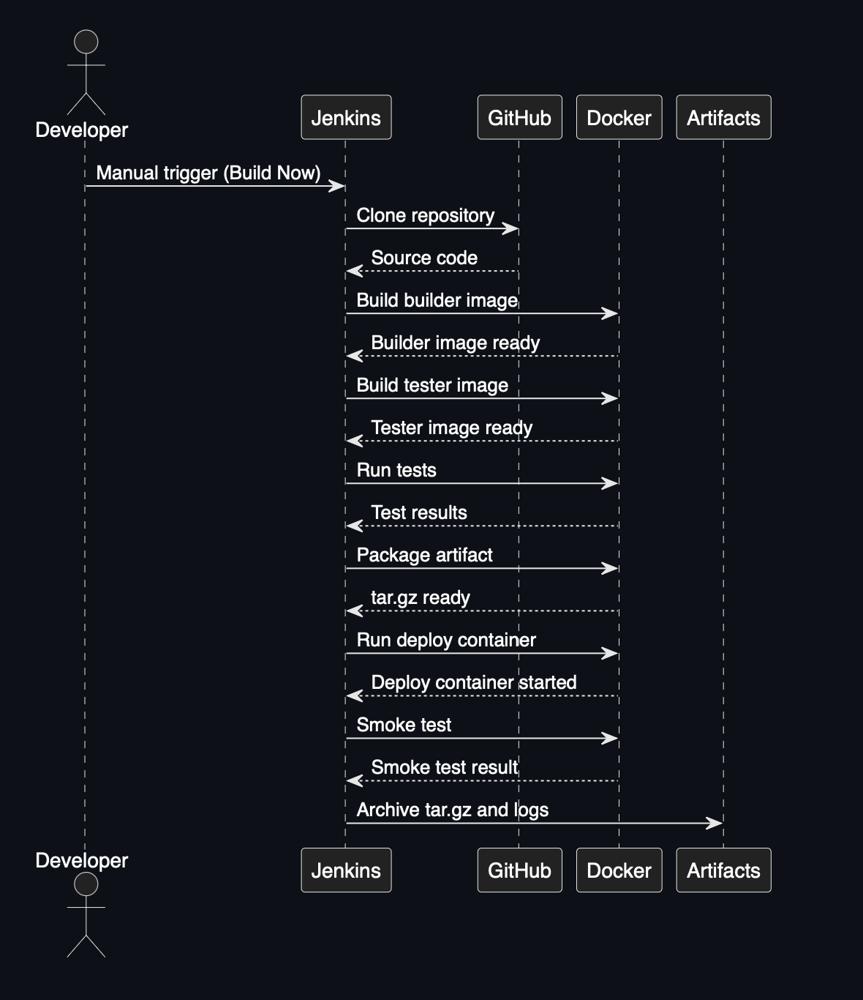

---

## 2. Ścieżka krytyczna

Czynności wykonywane przez utworzony *pipeline*:

### commit (lub tzw. *manual trigger* @ Jenkins)
Proces uruchamiany jest ręcznie z poziomu interfejsu `Jenkins` przy użyciu opcji **Build Now**. Zastosowano więc wariant *manual trigger*. Taki sposób startu pozwala na kontrolowane wykonywanie kolejnych prób oraz weryfikację poprawności działania etapów pipeline'u po wprowadzanych poprawkach.

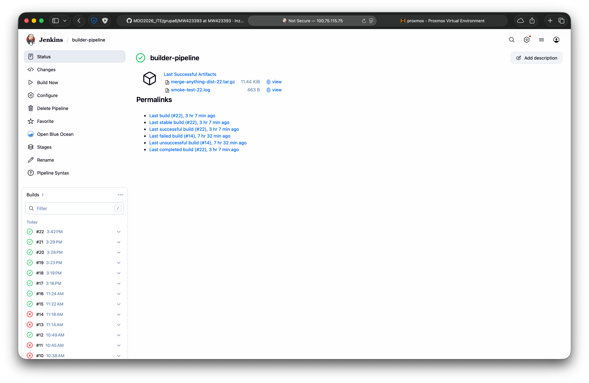

### clone

W pierwszym etapie pipeline pobiera repozytorium `MDO2026_ITE` z gałęzi `MW423393` z wykorzystaniem kroku `git`. Jest to przygotowanie przestrzeni roboczej Jenkinsa oraz udostępnienie plików `Dockerfile` i pozostałych zasobów do dalszych kroków. 

```Groovy
pipeline {
    agent any

    stages {
        stage('Clone') {
            steps {
                git branch: 'MW423393', url: 'https://github.com/InzynieriaOprogramowaniaAGH/MDO2026_ITE.git'
            }
        }
        ...
```

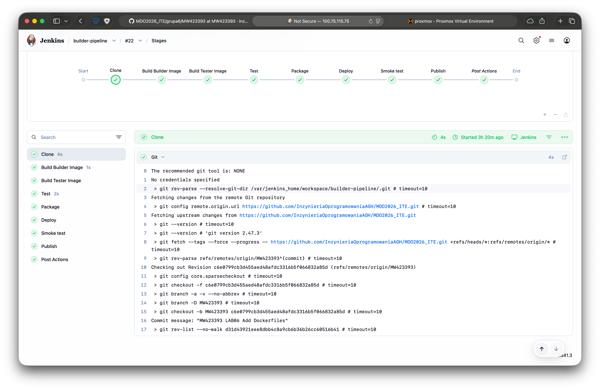

### build

Etap `build` jest realizowany w dwóch krokach. Najpierw budowany jest obraz `merge-anything-build` na podstawie pliku `Dockerfile.build`. Jako kontener bazowy wybrano obraz `node`. Zawiera on środowisko uruchomieniowe oraz zależności potrzebne do zbudowania i przetestowania projektu.

```Groovy
        ...
        stage('Build Builder Image') {
            steps {
                dir('grupa6/MW423393/Sprawozdanie06/docker') {
                    sh 'docker build -t merge-anything-build -f Dockerfile.build .'
                }
            }
        }
        ...
```

Zawartość `Dockerfile.build`:

```Dockerfile
FROM node:18

RUN apt update && apt install -y git && rm -rf /var/lib/apt/lists/*

WORKDIR /app

RUN git clone https://github.com/mesqueeb/merge-anything.git .

RUN npm install
RUN npm run build
```

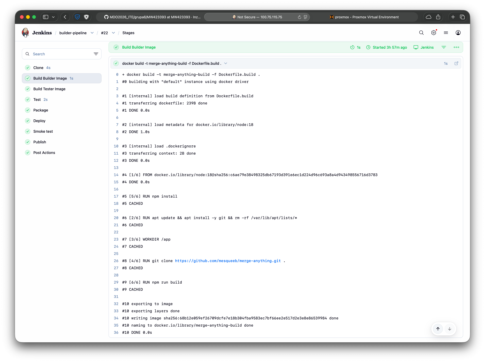

Następnie obraz `merge-anything-test` z pliku `Dockerfile.test`, bazujący na obrazie buildowym i przygotowany do uruchamiania testów. Proces budowania jest zamknięty w izolowanym środowisku kontenerowym i jest powtarzalny.

```Groovy
        ...
        stage('Build Tester Image') {
            steps {
                dir('grupa6/MW423393/Sprawozdanie06/docker') {
                    sh 'docker build -t merge-anything-test -f Dockerfile.test .'
                }
            }
        }
        ...
```

Zawartość `Dockerfile.test`:

```Dockerfile
FROM merge-anything-build

WORKDIR /app

CMD ["npm", "test"]
```

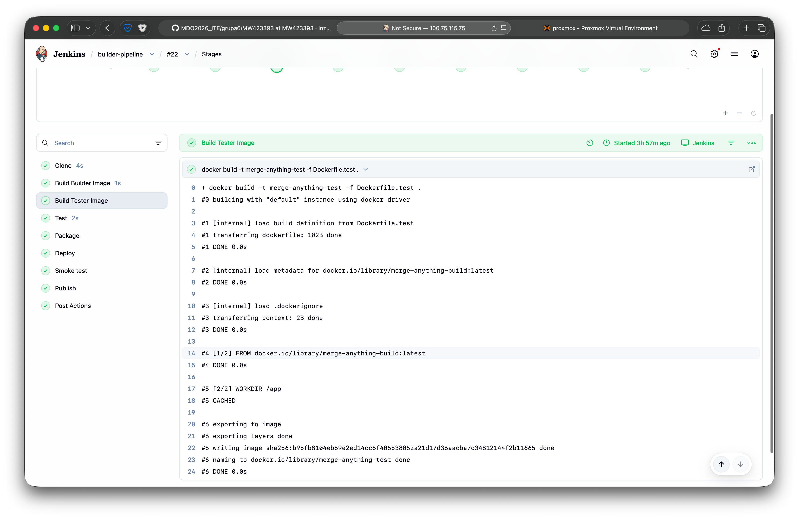

### test

Po zakończeniu budowy obrazu testowego pipeline uruchamia kontener `merge-anything-test`, w którym wykonywane jest polecenie `npm test`. Testy uruchamiane są w oddzielnym kontenerze, niezależnym od etapu budowania. Rezultat zapisywany jest do pliku logu `test-output-<BUILD_NUMBER>.log`.

```Groovy
        ...
        stage('Test') {
            steps {
                sh 'mkdir -p grupa6/MW423393/Sprawozdanie06'
                sh 'docker run --rm merge-anything-test | tee grupa6/MW423393/Sprawozdanie06/test-output-${BUILD_NUMBER}.log'
            }
        }
        ...
```

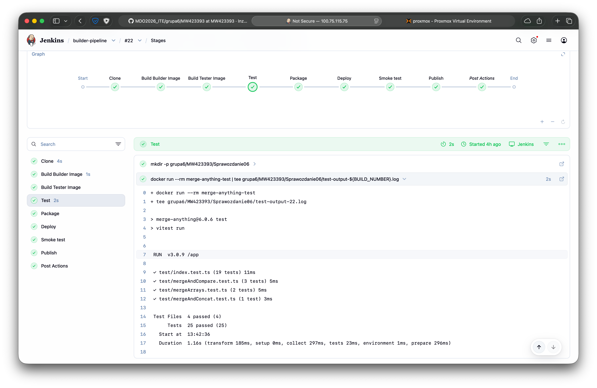

### package

Pipeline tworzy artefakt, który zawiera wszystkie pliki zbudowane w poprzednich etapach procesu. Z kontenera `merge-anything-build` kopiuje pliki z katalogu `/app/dist`, plik `package.json`, `README.md` oraz `LICENSE` oraz pakuje do archiwum `.tar.gz` o nazwie `merge-anything-dist-<BUILD_NUMBER>.tar.gz`. Artefakt ten jest wykorzystywany później w procesie `publish` oraz archiwizacji w Jenkinsie.

```Groovy
        ...
        stage('Package') {
            steps {
                sh '''
                    set -e
                    mkdir -p grupa6/MW423393/Sprawozdanie06/artifact
                    rm -rf grupa6/MW423393/Sprawozdanie06/artifact/*
                    rm -f grupa6/MW423393/Sprawozdanie06/*.tar.gz
                    rm -f grupa6/MW423393/Sprawozdanie06/*.log
        
                    CID=$(docker create merge-anything-build)
                    docker cp ${CID}:/app/dist grupa6/MW423393/Sprawozdanie06/artifact/dist
                    docker cp ${CID}:/app/package.json grupa6/MW423393/Sprawozdanie06/artifact/package.json
                    docker cp ${CID}:/app/README.md grupa6/MW423393/Sprawozdanie06/artifact/README.md
                    docker cp ${CID}:/app/LICENSE grupa6/MW423393/Sprawozdanie06/artifact/LICENSE
                    docker rm ${CID}
        
                    tar -czf grupa6/MW423393/Sprawozdanie06/merge-anything-dist-${BUILD_NUMBER}.tar.gz -C grupa6/MW423393/Sprawozdanie06/artifact .
                '''
            }
        }
        ...
```

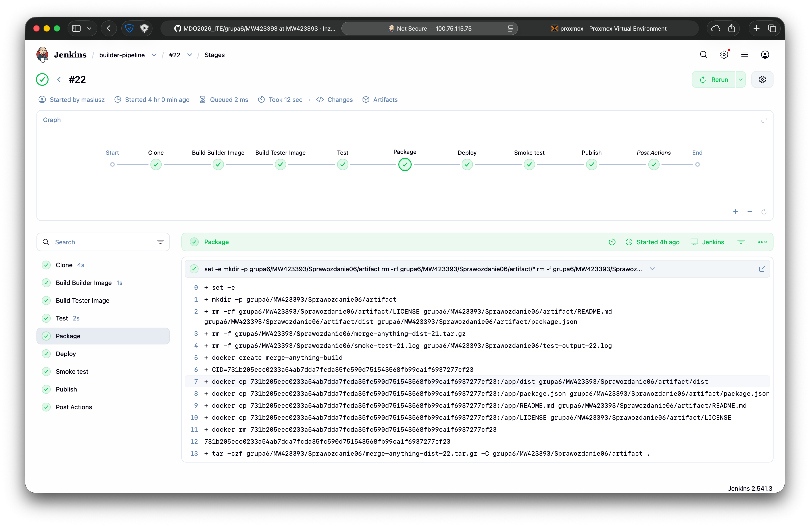

### deploy

Pipeline uruchamia kontener `merge-anything-deploy-${BUILD_NUMBER}` na bazie obrazu `merge-anything-build`, pozostawiając go aktywnym w tle (dzięki poleceniu `tail -f /dev/null`). Pozwala to na weryfikację zbudowanego artefaktu w późniejszym *smoke test* bez konieczności przygotowywania osobnego obrazu runtime. W przypadku analizowanej biblioteki JavaScript podejście to jest wystarczające do potwierdzenia poprawnego wdrożenia zbudowanych plików do środowiska kontenerowego.

```Groovy
        ...
        stage('Deploy') {
            steps {
                sh '''
                    docker rm -f merge-anything-deploy-${BUILD_NUMBER} || true
                    docker run -d --name merge-anything-deploy-${BUILD_NUMBER} merge-anything-build tail -f /dev/null
                '''
            }
        }
        ...
```

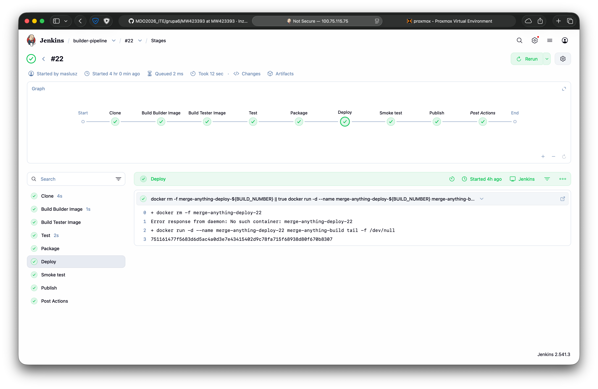

### *smoke test*

Po uruchomieniu kontenera `merge-anything-deploy` wykonuje się dodatkowa weryfikację poprawności działania wdrożenia. *Smoke test* polega na sprawdzeniu zawartości katalogu `/app/dist` wewnątrz kontenera oraz potwierdzeniu istnienia pliku `index.js`. Wynik testu jest zapisywany do pliku `smoke-test-<BUILD_NUMBER>.log`. Potwierdza to, że zbudowany artefakt jest poprawnie osadzony w uruchomionym kontenerze.

```Groovy
        ...
        stage('Smoke test') {
            steps {
                sh '''
                    docker exec merge-anything-deploy-${BUILD_NUMBER} ls -la /app/dist | tee grupa6/MW423393/Sprawozdanie06/smoke-test-${BUILD_NUMBER}.log
                    docker exec merge-anything-deploy-${BUILD_NUMBER} test -f /app/dist/index.js
                    cat grupa6/MW423393/Sprawozdanie06/smoke-test-${BUILD_NUMBER}.log
                '''
            }
        }
        ...
```

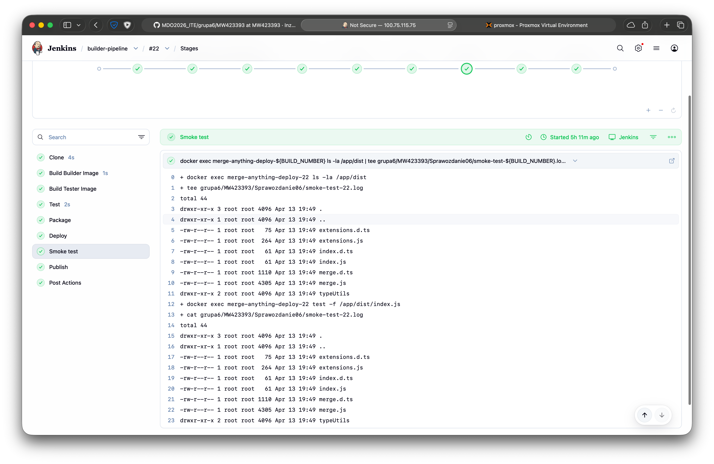

### publish

W etapie `publish` pipeline archiwizuje artefakty wygenerowane w trakcie przebiegu procesu. Artefaktem głównym jest archiwum `merge-anything-dist-<BUILD_NUMBER>.tar.gz`, zawierające katalog `dist` oraz podstawowe pliki projektu. Wersjonowanie artefaktu oparto na numerze przebiegu Jenkins `BUILD_NUMBER`, który jest dołączany do nazwy archiwum i logów. Dodatkowo archiwizowane są logi z testów i *smoke testu*. Jest to realizowane przez mechanizm `archiveArtifacts` w Jenkinsie.

```Groovy
        ...
        stage('Publish') {
            steps {
                archiveArtifacts artifacts: "grupa6/MW423393/Sprawozdanie06/*-${BUILD_NUMBER}.tar.gz,grupa6/MW423393/Sprawozdanie06/*-${BUILD_NUMBER}.log", fingerprint: true
            }
        }
    }
    ...
```

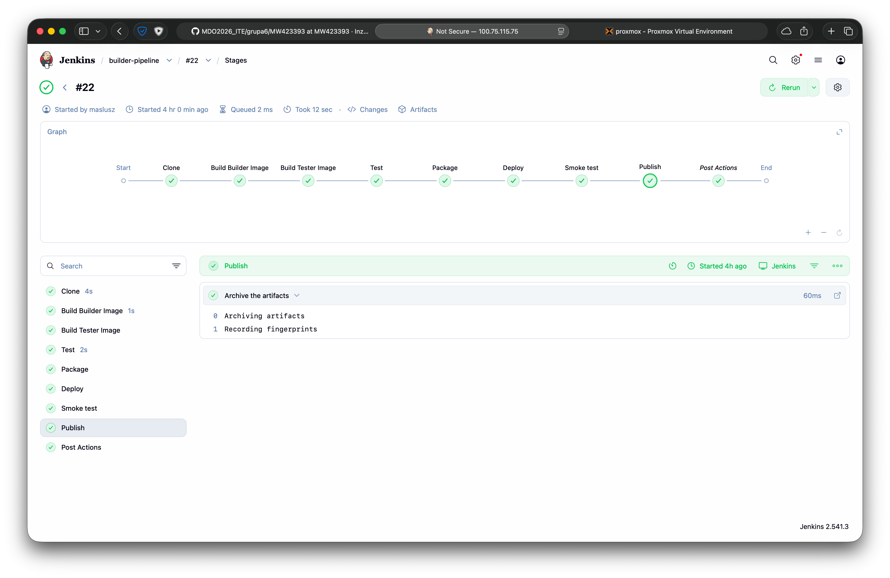

### post actions

W `post actions` pipeline wykonuje czyszczenie środowiska, usuwając kontener `merge-anything-deploy`. Dzięki temu kontener, który był używany do uruchomienia aplikacji w celu przeprowadzenia testów, zostaje usunięty niezależnie od wyniku całego procesu.

```Groovy
    ...
    post {
        always {
            sh 'docker rm -f merge-anything-deploy-${BUILD_NUMBER} || true'
        }
    }
}
```

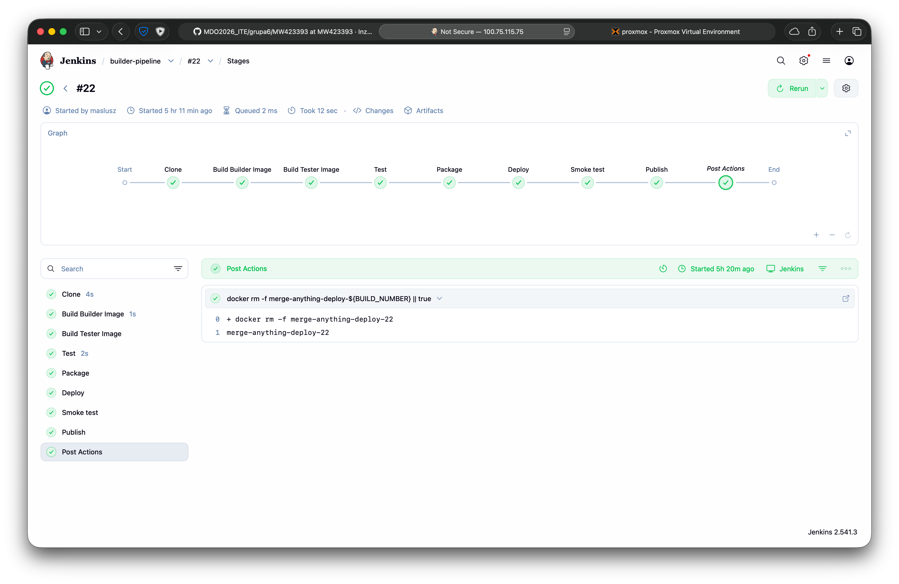

---
