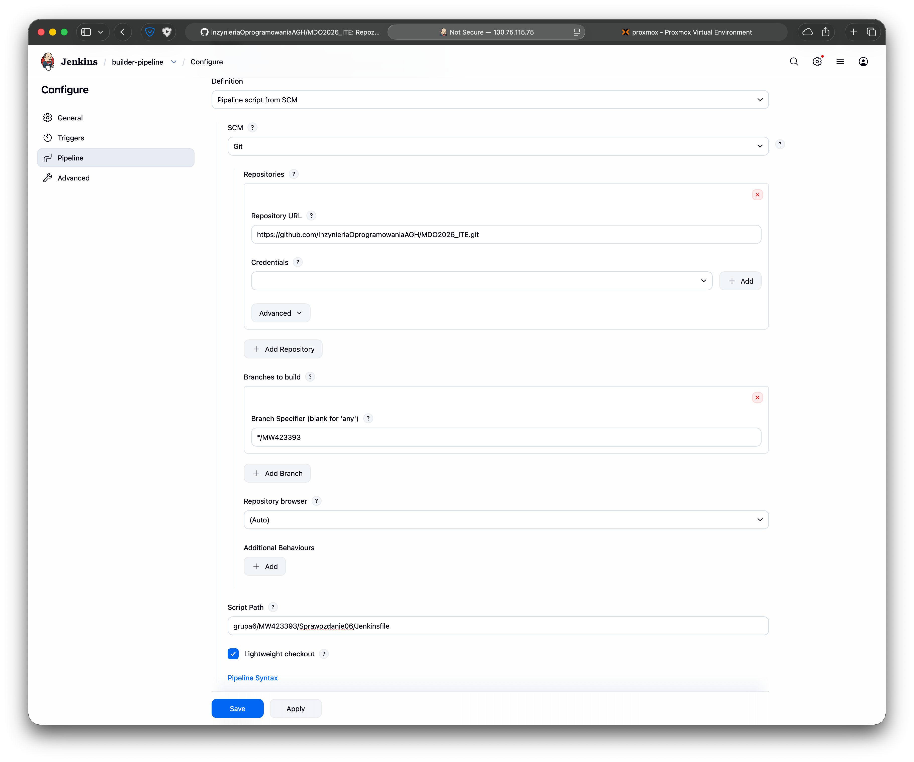
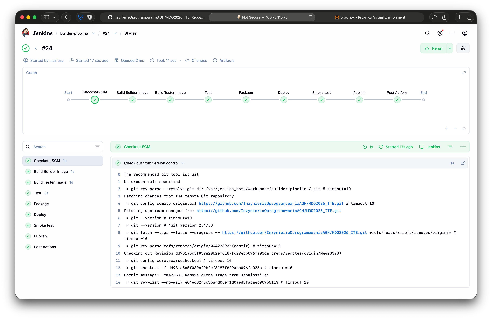
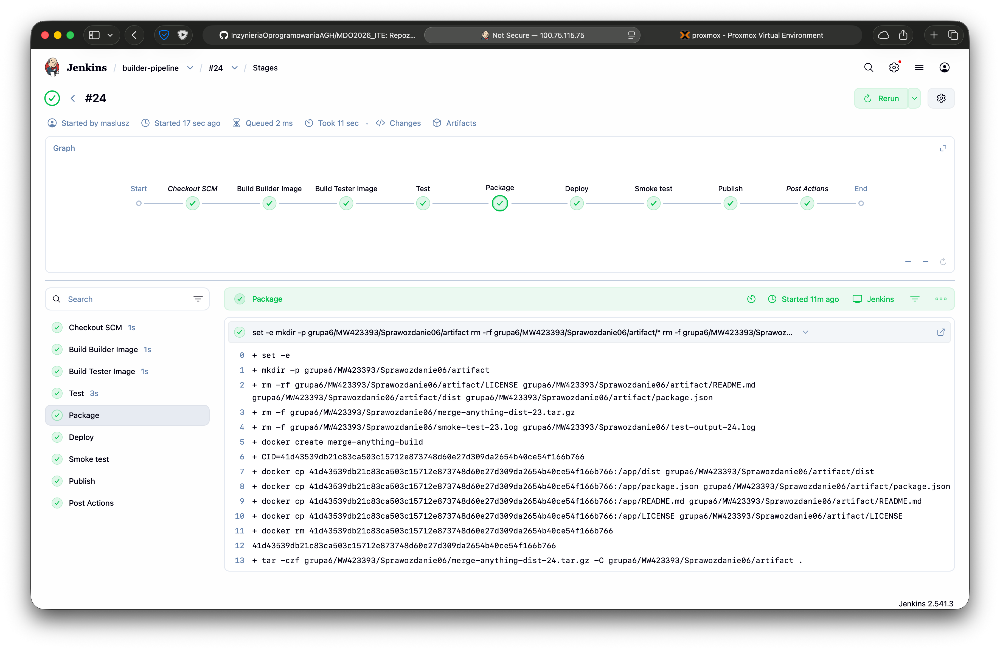
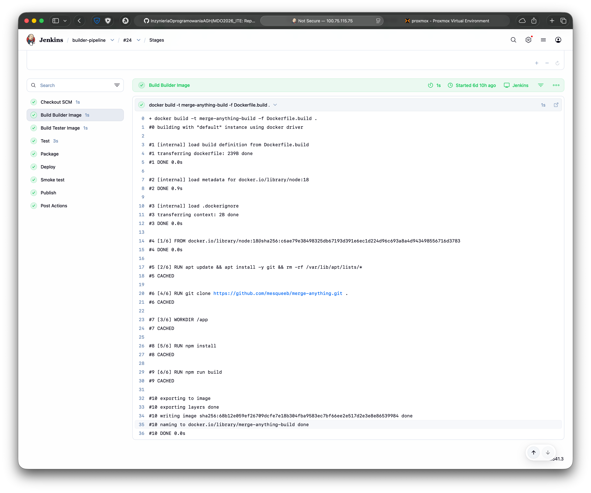
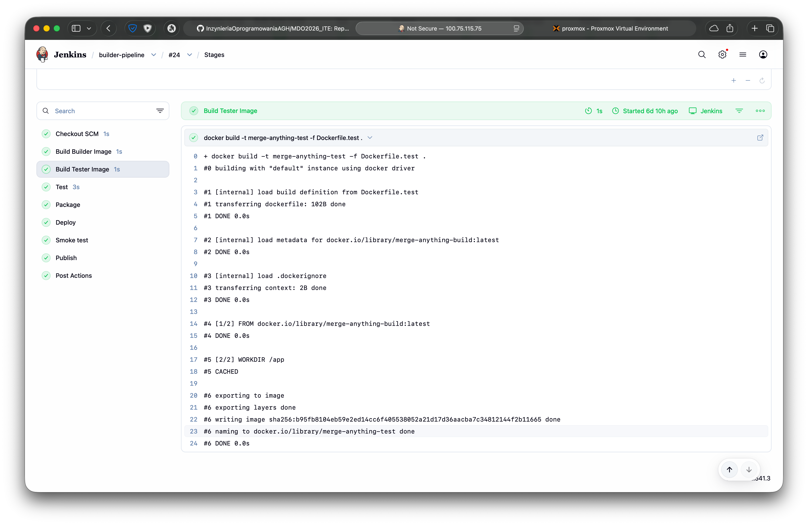
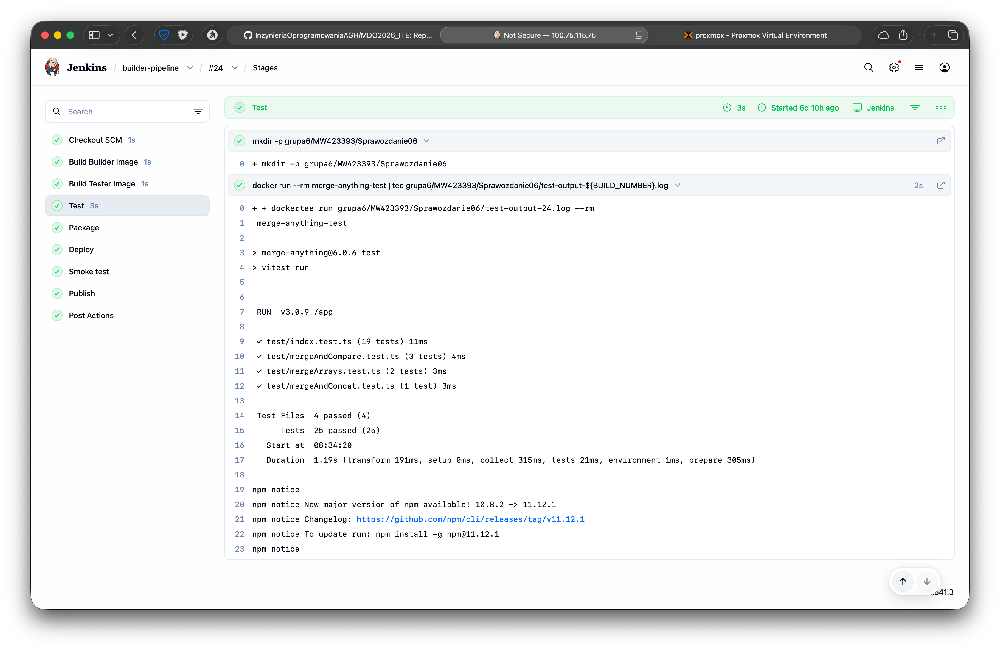
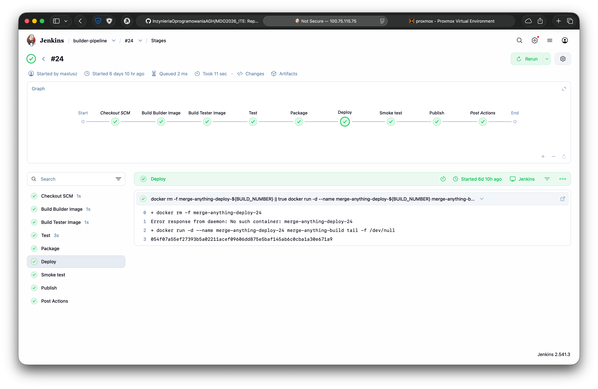
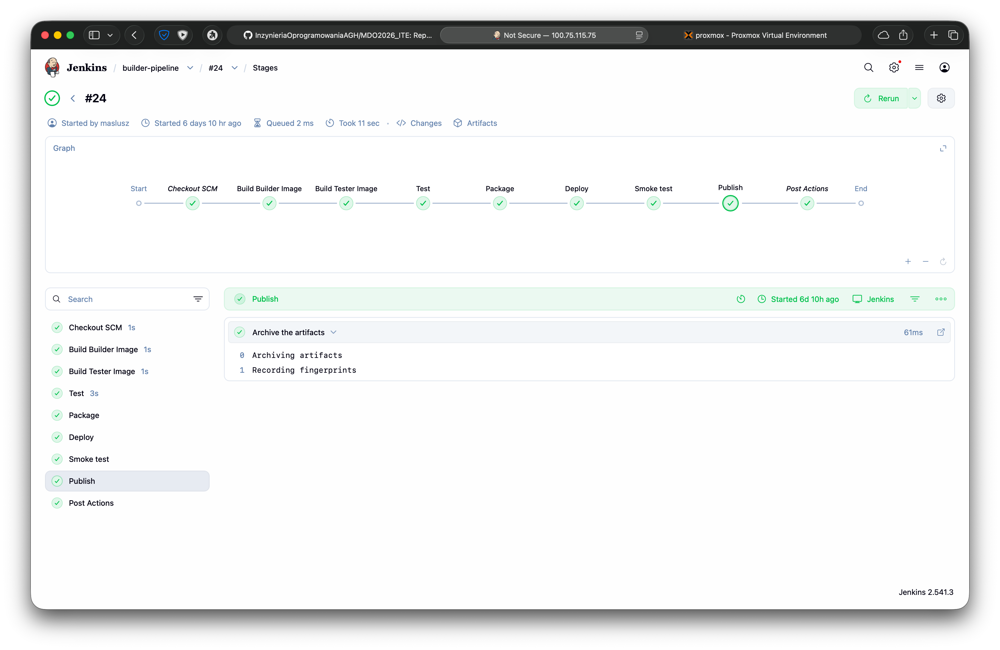

# Sprawozdanie 07 - Jenkinsfile: lista kontrolna

**Data zajęć:** 21.04.2026 r.

**Imię i nazwisko:** Mateusz Wiech

**Nr indeksu:** 423393

**Grupa:** 6

**Branch:** MW423393

---

## 0. Środowisko

Ćwiczenie wykonano w środowisku linuksowym (Ubuntu Server 24.04.4 LTS) działającym na maszynie wirtualnej z wykorzystaniem klienta `git` (2.43.0) i `OpenSSH` (9.6p1). Połączenie z maszyną realizowano przez SSH. Repozytorium było obsługiwane z poziomu terminala oraz edytora Visual Studio Code. Wykostano oprogramowanie `Docker` w wersji 28.2.2 oraz `Jenkins` w wersji 2.541.3, uruchomiony w kontenerze Docker.
Wybrano projekt [`merge-anything`](https://github.com/mesqueeb/merge-anything.git), będący biblioteką JavaScript/TypeScript. Dobór  wynikał z dostępności testów oraz możliwości uruchomienia procesu w izolacji kontenerowej.

---

## 1. Kroki Jenkinsfile

### Przepis dostarczany z SCM

Definicja pipeline’u została przeniesiona z konfiguracji ręcznie wklejanej w Jenkinsie do repozytorium Git. W konfiguracji `builder-pipeline` ustawiono opcję **Pipeline script from SCM**, jako system kontroli wersji wybrano `Git`, wskazano repozytorium `MDO2026_ITE`, gałąź `MW423393` oraz ścieżkę do pliku `grupa6/MW423393/Sprawozdanie06/Jenkinsfile`. Przepis budowania jest przechowywany razem z kodem i stanowi element infrastruktury definiowanej jako kod.

Jenkins przy każdym uruchomieniu pobiera aktualną definicję procesu z repozytorium, zapewniając spójność.



Ze skryptu pipeline w `Jenkinsfile` usunięto etap `clone`, ponieważ po przeniesieniu pipeline do SCM w UI etap ten stał się zbędny - repozytorium jest pobierane automatycznie przez Jenkins podczas wczytywania Jenkinsfile.

```diff
        ...
-        stage('Clone') {
-            steps {
-                git branch: 'MW423393', url: 'https://github.com/InzynieriaOprogramowaniaAGH/MDO2026_ITE.git'
-            }
-        }
        ...
```



---

### Praca na najnowszym kodzie i usuwanie pozostałości po poprzednich buildach. Przygotowanie artefaktu.

W pipeline zdefiniowano oddzielny etap `Package`, którego zadaniem jest przygotowanie archiwum redystrybucyjnego `merge-anything-dist-<BUILD_NUMBER>.tar.gz`.

W tym etapie usuwane są poprzednie archiwa `.tar.gz`, poprzednie pliki `.log` oraz zawartość katalogu `artifact`. Następnie tworzone są nowe pliki wynikowe oznaczone numerem przebiegu `BUILD_NUMBER`. Każdy przebieg pipeline przygotowuje własny, aktualny zestaw artefaktów i logów.

Proces CI/CD wytwarza obraz buildowy używany do wdrożenia integracyjnego oraz osobny artefakt możliwy do archiwizacji i późniejszego pobrania z Jenkinsa.

```Groovy
        ...
        stage('Package') {
            steps {
                sh '''
                    set -e
                    mkdir -p grupa6/MW423393/Sprawozdanie06/artifact
                    rm -rf grupa6/MW423393/Sprawozdanie06/artifact/*
                    rm -f grupa6/MW423393/Sprawozdanie06/*.tar.gz
                    rm -f grupa6/MW423393/Sprawozdanie06/*.log
        
                    CID=$(docker create merge-anything-build)
                    docker cp ${CID}:/app/dist grupa6/MW423393/Sprawozdanie06/artifact/dist
                    docker cp ${CID}:/app/package.json grupa6/MW423393/Sprawozdanie06/artifact/package.json
                    docker cp ${CID}:/app/README.md grupa6/MW423393/Sprawozdanie06/artifact/README.md
                    docker cp ${CID}:/app/LICENSE grupa6/MW423393/Sprawozdanie06/artifact/LICENSE
                    docker rm ${CID}
        
                    tar -czf grupa6/MW423393/Sprawozdanie06/merge-anything-dist-${BUILD_NUMBER}.tar.gz -C grupa6/MW423393/Sprawozdanie06/artifact .
                '''
            }
        }
        ...
```



---

### Etap `Build` dysponuje repozytorium, plikami `Dockerfile` oraz tworzy obraz buildowy

Jenkins pobiera repozytorium `MDO2026_ITE` bezpośrednio z gałęzi `MW423393` - w przestrzeni roboczej pipeline dostępne są wszystkie pliki zapisane w repozytorium, w tym katalog `grupa6/MW423393/Sprawozdanie06/docker`.

Etap `Build` korzysta bezpośrednio z plików `Dockerfile.build` oraz `Dockerfile.test`.

Stworzony obraz `merge-anything-build` pełni rolę głównego obrazu roboczego procesu CI/CD. Zawiera środowisko uruchomieniowe, zależności projektu oraz rezultat budowania aplikacji. Następnie jest wykorzystywany w kolejnych etapach pipeline.

```Groovy
        ...
        stage('Build Builder Image') {
            steps {
                dir('grupa6/MW423393/Sprawozdanie06/docker') {
                    sh 'docker build -t merge-anything-build -f Dockerfile.build .'
                }
            }
        }
        ...
```



```Groovy
        ...
        stage('Build Tester Image') {
            steps {
                dir('grupa6/MW423393/Sprawozdanie06/docker') {
                    sh 'docker build -t merge-anything-test -f Dockerfile.test .'
                }
            }
        }
        ...
```



---

### Etap `Test` przeprowadza testy

Testy etapu `Test` wykonywane są wewnątrz kontenera `merge-anything-test`, zapewniając izolację od etapu budowania zachowując powtarzalność środowiska uruchomieniowego.

W tym etapie wykonywane jest polecenie `docker run --rm merge-anything-test`, a wynik działania testów zapisywany jest dodatkowo do pliku `test-output-<BUILD_NUMBER>.log`.

```Groovy
        ...
        stage('Test') {
            steps {
                sh 'mkdir -p grupa6/MW423393/Sprawozdanie06'
                sh 'docker run --rm merge-anything-test | tee grupa6/MW423393/Sprawozdanie06/test-output-${BUILD_NUMBER}.log'
            }
        }
        ...
```



---

### Etap `Deploy` przygotowuje obraz lub artefakt pod wdrożenie

`Deploy` korzysta bezpośrednio z obrazu buildowego `merge-anything-build`, który został wcześniej przygotowany w etapie `Build`. Nie tworzono osobnego obrazu runtime, ponieważ `merge-anything` jest biblioteką JavaScript, a nie aplikacją usługową uruchamianą jako serwer. Zatem obraz buildowy pełni równocześnie rolę obrazu wdrożeniowego. Równolegle w etapie `Package` przygotowywany jest artefakt `merge-anything-dist-<BUILD_NUMBER>.tar.gz`, zawierający katalog `dist` oraz podstawowe pliki projektu. Takie podejście pozwala zarówno uruchomić środowisko wdrożeniowe, jak i zachować osobny artefakt redystrybucyjny.

```Groovy
        ...
        stage('Deploy') {
            steps {
                sh '''
                    docker rm -f merge-anything-deploy-${BUILD_NUMBER} || true
                    docker run -d --name merge-anything-deploy-${BUILD_NUMBER} merge-anything-build tail -f /dev/null
                '''
            }
        }
        ...
```



---

### Etap `Publish` dodaje artefakt do historii builda

W rozwiązaniu końcowym etap `Publish` dołącza artefakty do historii buildu w Jenkinsie. W tym celu wykorzystuje mechanizm `archiveArtifacts`, który zapisuje archiwum `merge-anything-dist-<BUILD_NUMBER>.tar.gz` oraz logi `test-output-<BUILD_NUMBER>.log` i `smoke-test-<BUILD_NUMBER>.log` jako rezultaty konkretnego przebiegu pipeline.

Podejście to umożliwia pobranie gotowego artefaktu bezpośrednio z poziomu Jenkinsa i powiązanie go z numerem buildu. Opcja `fingerprint: true` pozwala śledzić artefakt w historii procesu budowania.

```Groovy
        ...
        stage('Publish') {
            steps {
                archiveArtifacts artifacts: "grupa6/MW423393/Sprawozdanie06/*-${BUILD_NUMBER}.tar.gz,grupa6/MW423393/Sprawozdanie06/*-${BUILD_NUMBER}.log", fingerprint: true
            }
        }
        ...
```



---

## 2. Definition of done

W rozwiązaniu końcowym powstaje artefakt możliwy do wdrożenia w sensie integracyjnym, tj. archiwum `merge-anything-dist-<BUILD_NUMBER>.tar.gz` oraz kontener `deploy` uruchamiany w środowisku Docker. Etap `Deploy` został zrealizowany przez uruchomienie kontenera na bazie obrazu buildowego `merge-anything-build`, a poprawność wdrożenia potwierdzono przez *smoke test* sprawdzający obecność zbudowanych plików w katalogu `/app/dist`.

Nie zaimplementowano publikacji obrazu do zewnętrznego rejestru kontenerów, dlatego nie można uznać, że rozwiązanie dostarcza w pełni niezależny obraz runtime gotowy do uruchomienia bez modyfikacji poza lokalnym środowiskiem. Zrealizowano formę publikacji w postaci dołączenia artefaktu do historii builda w Jenkinsie.

Dołączony artefakt `merge-anything-dist-<BUILD_NUMBER>.tar.gz` ma charakter redystrybucyjny i może zostać wykorzystany na maszynie docelowej o oczekiwanej konfiguracji z odpowiednim środowiskiem. Nie jest to jednak samowystarczalny pakiet instalacyjny ani pełny obraz runtime publikowany do rejestru.

---