# Sprawozdanie 08 - Automatyzacja i zdalne wykonywanie poleceń za pomocą Ansible

**Data zajęć:** 28.04.2026 r.

**Imię i nazwisko:** Mateusz Wiech

**Nr indeksu:** 423393

**Grupa:** 6

**Branch:** MW423393

---

## 0. Środowisko

Ćwiczenie wykonano w środowisku linuksowym (Ubuntu Server 24.04.4 LTS) działającym na maszynie wirtualnej z wykorzystaniem klienta `git` (2.43.0) i `OpenSSH` (9.6p1). Połączenie z maszyną realizowano przez SSH. Repozytorium było obsługiwane z poziomu terminala oraz edytora Visual Studio Code. Wykorzystano oprogramowanie `Docker` w wersji 28.2.2 oraz `ansible` w wersji 2.16.3.

---

## 1. Inwentaryzacja

### Ustalenie nazw maszyn

Przeprowadzono sprawdzenie nazw maszyn wirtualnych z wykorzystaniem `hostnamectl`. Głównej VM nadano nazwę `devops`, natomiast maszynie docelowej nazwę `ansible-target`.

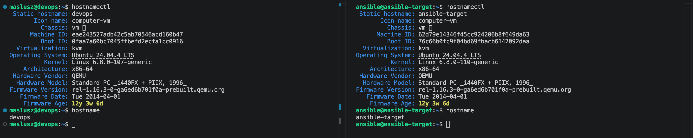

---

### Ustalenie adresów IP

Sprawdzono adresy IP obu maszyn wirtualnych za pomocą poleceń `ip a` oraz `hostname -I`. Adresy wykorzystano do skonfigurowania mechanizmu rozpoznawania nazw hostów przez plik `/etc/hosts`.

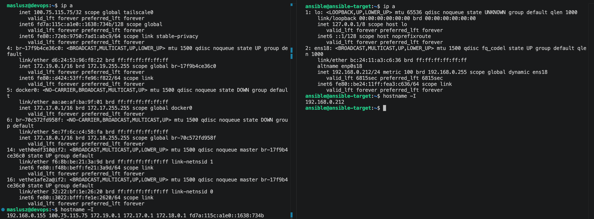

Edycja pliku `/etc/hosts`:
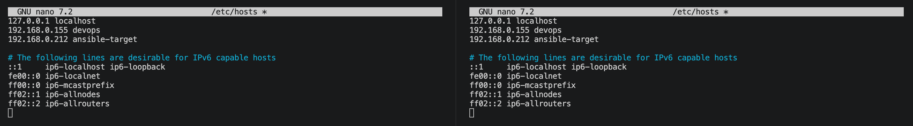

Przypisane nazwy domenowe i adresy IP:
- główna VM - `devops` `192.168.0.155`
- docelowa VM - `ansible-target` `192.168.0.212`

Weryfikacja rozpoznawania nazw i łączności:

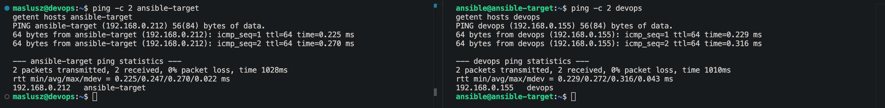

---

### Plik inwentaryzacji

W katalogu roboczym `Sprawozdanie08/ansible` utworzono plik `inventory.ini` o zawartości:

```ini
[Orchestrators]
devops ansible_connection=local

[Endpoints]
ansible-target ansible_user=ansible
```

Do grupy `Orchestrators` przypisano główną maszynę `devops`, natomiast do grupy `Endpoints` maszynę `ansible-target`.

Sprawdzono przypisanie poprzez wysłanie żądanie `ping` do wszystkich maszyn:

```bash
ansible all -i inventory.ini -m ping
```

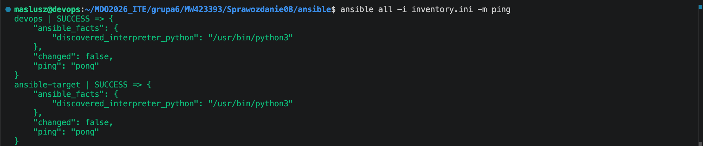

---

### Łączność SSH

Połączenie SSH zostało skonfigurowane wcześniej, na głównej maszynie wygenerowano klucz ssh poleceniem:
```bash
ssh-keygen -t ed25519
```

Następnie użyto polecenia do wymiany kluczy pomiędzy maszyną `devops` a maszyną docelową `ansible-target`:

```bash
ssh-copy-id ansible@ansible-target
```

---

## 2. Zdalne wywoływanie procedur

### Utworzenie playbooka Ansible

W celu zdalnego wykonywania procedur przygotowano playbooki `ping.yml`, `copy-inventory.yml` oraz `update-services.yml`, który realizują podstawowe operacje administracyjne na wszystkich zdefiniowanych maszynach. Obejmują test łączności `ping`, kopiowanie pliku inwentaryzacji na maszyny końcowe, aktualizację pakietów systemowych oraz restart usług `sshd` i `rngd`.

#### Wysłanie żądania `ping` do wszystkich maszyn za pomocą playbooka `ping.yml`:

```yaml
---
- name: Ping wszystkich maszyn
  hosts: all
  gather_facts: false
  tasks:
    - name: Ping
      ansible.builtin.ping:
```

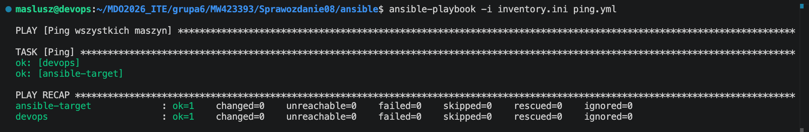

Uruchomienie playbooka potwierdza poprawne połączenie z maszyną `devops` oraz `ansible-target`.

#### Kopiowanie pliku inwentaryzacji na maszynę końcową `copy-inventory.yml`:

```yaml
---
- name: Kopiowanie inventory na Endpoints
  hosts: Endpoints
  gather_facts: false
  become: true
  tasks:
    - name: Skopiuj inventory.ini na endpoint
      ansible.builtin.copy:
        src: inventory.ini
        dest: /tmp/inventory.ini
        mode: '0644'
```

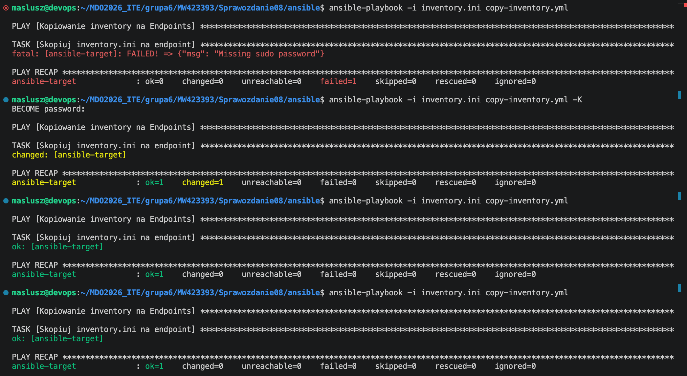

Pierwsza próba jego uruchomienia zakończyła się błędem `Missing sudo password`, ponieważ playbook był wykonywany z `become: true`, a użytkownik `ansible` na maszynie docelowej nie miał jeszcze skonfigurowanego wykonywania poleceń uprzywilejowanych bez podawania hasła.

Zastosowano zatem parametr `-K` polecenia `ansible-playbook`. Powoduje on wyświetlenie prośby o podanie hasła do `sudo` dla użytkownika wykonującego operacje z użyciem `become: true`. Pozwoliło to wykonywać zadania administracyjne bez konfigurowania bezhasłowego `sudo` dla użytkownika `ansible`.

W kolejnej próbie na maszynie `ansible-target` zmieniono konfigurację uprawnień użytkownika `ansible`, tak aby możliwe było wykonywanie operacji uprzywilejowanych bez konieczności każdorazowego podawania hasła (`ansible ALL=(ALL) NOPASSWD:ALL`). Po tej zmianie playbook został uruchomiony ponownie już bez parametru `-K`. Operacja zakończyła się poprawnie, a kolejne uruchomienia zwracały `changed=0`.

#### Aktualizacja pakietów i restart usług `update-services.yml`:

```yaml
---
- name: Aktualizacja pakietow i restart uslug
  hosts: Endpoints
  gather_facts: false
  become: true
  tasks:
    - name: Aktualizacja cache apt
      ansible.builtin.apt:
        update_cache: true

    - name: Upgrade pakietow
      ansible.builtin.apt:
        upgrade: dist

    - name: Restart ssh
      ansible.builtin.service:
        name: ssh
        state: restarted

    - name: Restart rng-tools
      ansible.builtin.service:
        name: rng-tools
        state: restarted
      ignore_errors: true
```

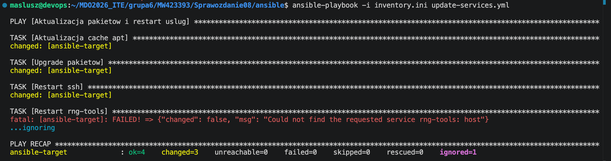

W celu wykonania operacji administracyjnych na maszynie docelowej przygotowano playbook `update-services.yml`. Jego zadaniem było odświeżenie cache pakietów `apt`, wykonanie aktualizacji systemu oraz restart usług `ssh` i `rng-tools`.

Podczas wykonania playbooka na maszynie `ansible-target` poprawnie zrealizowano:
- aktualizację cache pakietów,
- aktualizację pakietów systemowych,
- restart usługi `ssh`.

Natomiast próba restartu usługi `rng-tools` zakończyła się komunikatem o braku takiej usługi w systemie docelowym. Zadanie to zostało jednak oznaczone jako `ignore_errors: true`, dzięki czemu playbook nie został przerwany i zakończył się poprawnie. Pozwala to zachować odporność procesu na różnice konfiguracyjne pomiędzy systemami.

---

### Operacje względem maszyny z wyłączonym serwerem SSH

W celu sprawdzenia zachowania Ansible wobec niedostępnego hosta przeprowadzono test z zatrzymaniem usługi `ssh` na maszynie `ansible-target`. Samo zatrzymanie `ssh.service` nie było wystarczające, ponieważ aktywna pozostawała jednostka `ssh.socket`, mogąca ponownie uruchamiać serwer przy próbie połączenia. Ją również zatrzymano. 

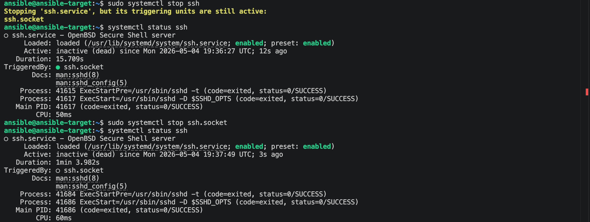

Po wyłączeniu obu jednostek wykonano z maszyny `devops` polecenia:

```bash
ansible all -i inventory.ini -m ping
ansible-playbook -i inventory.ini copy-inventory.yml
ansible-playbook -i inventory.ini update-services.yml
```

Efekt:

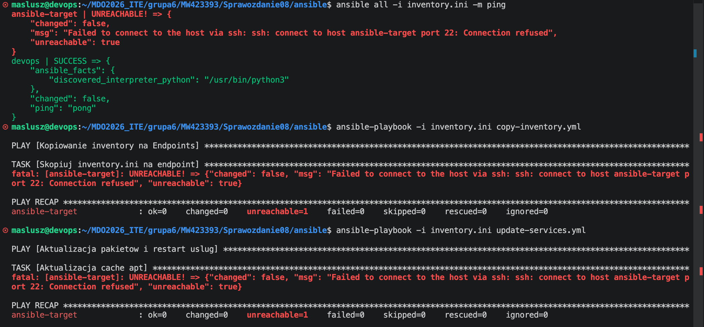

Wynik pokazał brak dostępności hosta ansible-target, potwierdzając problem z łącznością. Po zakończeniu testu usługi `ssh` i `ssh.socket` zostały ponownie uruchomione z poziomu konsoli maszyny wirtualnej.

---

## 3. Zarządzanie stworzonym artefaktem

### Przygotowanie artefaktu do wdrożenia

Artefakt wykorzystywany w dalszej części zadania nie był przechowywany bezpośrednio w repozytorium, lecz jako rezultat wcześniejszego przebiegu pipeline w Jenkinsie. Przed wdrożeniem pobrano archiwum `merge-anything-dist-<BUILD_NUMBER>.tar.gz` z przestrzeni roboczej Jenkinsa i skopiowano je do katalogu roboczego z playbookami Ansible. Dzięki temu możliwe było późniejsze przesłanie pliku na maszynę docelową `ansible-target` i przeprowadzenie operacji wdrożeniowych.

---

### Instalacja Dockera na maszynie docelowej

Na `ansible-target` zainstalowano `Docker` z wykorzystaniem playbooka Ansible. Playbook instaluje pakiet `docker.io`, uruchamia usługę `docker` oraz dodaje użytkownika `ansible` do grupy `docker`. Dzięki temu maszyna docelowa została przygotowana do uruchamiania kontenerów wykorzystywanych podczas wdrożenia artefaktu.

`install-docker.yml`:

```yaml
---
- name: Instalacja Dockera na Endpoints
  hosts: Endpoints
  become: true
  tasks:
    - name: Instalacja dockera
      ansible.builtin.apt:
        name: docker.io
        state: present

    - name: Uruchom docker
      ansible.builtin.service:
        name: docker
        state: started
        enabled: true

    - name: Dodaj ansible do grupy docker
      ansible.builtin.user:
        name: ansible
        groups: docker
        append: true
```

Instalację uruchomiono poleceniem:

```bash
ansible-playbook -i inventory.ini install-docker.yml
```

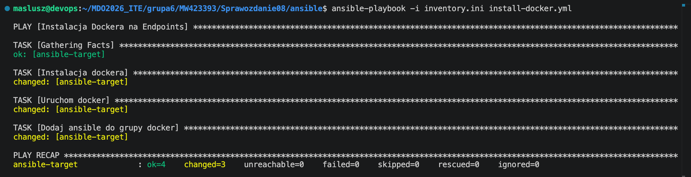

---

### Wdrożenie artefaktu na maszynę docelową

Ponieważ artefaktem z pipeline był plik `merge-anything-dist-24.tar.gz`, wdrożenie zrealizowano przez przesłanie archiwum na maszynę `ansible-target`, rozpakowanie go do katalogu roboczego oraz uruchomienie kontenera runtime `node:18-slim` z podmontowanym katalogiem artefaktu.

Playbook wykonuje test dostępności Dockera, kopiuje artefakt na host docelowy, rozpakowuje go do katalogu `/opt/merge-anything`, pobiera obraz `node:18-slim`, uruchamia kontener `merge-anything-runtime`, a następnie weryfikuje obecność pliku `/app/dist/index.js` wewnątrz kontenera.

Playbook `deploy-artifact.yml`:

```yaml
---
- name: Wdrozenie artefaktu na Endpoints
  hosts: Endpoints
  become: true
  vars:
    artifact_name: merge-anything-dist-24.tar.gz
    remote_artifact: /tmp/merge-anything-dist.tar.gz
    remote_dir: /opt/merge-anything
    container_name: merge-anything-runtime
    runtime_image: node:18-slim

  tasks:
    - name: Sanity check - sprawdz docker
      ansible.builtin.command: docker --version
      register: docker_check
      changed_when: false
      failed_when: docker_check.rc != 0

    - name: Utworz katalog docelowy
      ansible.builtin.file:
        path: "{{ remote_dir }}"
        state: directory
        mode: "0755"

    - name: Skopiuj artefakt na host docelowy
      ansible.builtin.copy:
        src: "{{ artifact_name }}"
        dest: "{{ remote_artifact }}"
        mode: "0644"

    - name: Rozpakuj artefakt
      ansible.builtin.unarchive:
        src: "{{ remote_artifact }}"
        dest: "{{ remote_dir }}"
        remote_src: true

    - name: Pobierz obraz runtime
      ansible.builtin.command: docker pull {{ runtime_image }}
      changed_when: true

    - name: Usun stary kontener jesli istnieje
      ansible.builtin.command: docker rm -f {{ container_name }}
      ignore_errors: true
      changed_when: true

    - name: Uruchom kontener runtime z artefaktem
      ansible.builtin.command: >
        docker run -d
        --name {{ container_name }}
        -v {{ remote_dir }}:/app
        {{ runtime_image }}
        tail -f /dev/null
      changed_when: true

    - name: Zweryfikuj obecność pliku index.js
      ansible.builtin.command: docker exec {{ container_name }} test -f /app/dist/index.js
      changed_when: false

    - name: Listing katalogu dist
      ansible.builtin.command: docker exec {{ container_name }} ls -la /app/dist
      register: dist_listing
      changed_when: false

    - name: Pokaz listing
      ansible.builtin.debug:
        var: dist_listing.stdout_lines
```

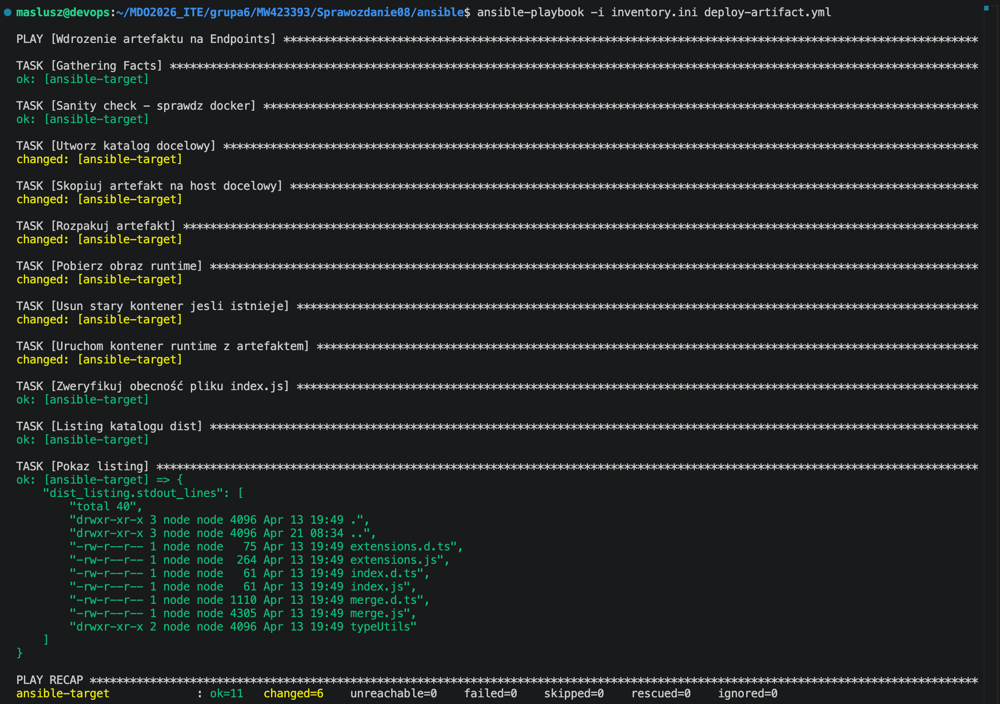

---

### Oczyszczenie środowiska docelowego

Przygotowano playbook czyszczący środowisko docelowe. Ma on za zadanie zatrzymać i usunąć kontener `merge-anything-runtime`, usunąć katalog z rozpakowanym artefaktem oraz usunąć przesłane archiwum `.tar.gz`.

Playbook `cleanup-artifact.yml`:

```yaml
---
- name: Czyszczenie wdrozenia na Endpoints
  hosts: Endpoints
  become: true
  vars:
    remote_artifact: /tmp/merge-anything-dist.tar.gz
    remote_dir: /opt/merge-anything
    container_name: merge-anything-runtime

  tasks:
    - name: Zatrzymaj i usuń kontener
      ansible.builtin.command: docker rm -f {{ container_name }}
      ignore_errors: true
      changed_when: true

    - name: Usuń katalog artefaktu
      ansible.builtin.file:
        path: "{{ remote_dir }}"
        state: absent

    - name: Usuń skopiowane archiwum
      ansible.builtin.file:
        path: "{{ remote_artifact }}"
        state: absent
```

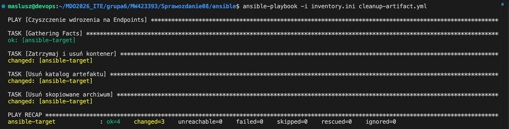

---

### Przygotowanie roli Ansible

Utworzono rolę Ansible poleceniem `ansible-galaxy role init merge_anything_deploy`. Do roli przeniesiono zadania odpowiedzialne za sprawdzenie dostępności Dockera, kopiowanie artefaktu, rozpakowanie archiwum, pobranie obrazu runtime, uruchomienie kontenera oraz weryfikację obecności pliku `dist/index.js`.

W pliku `defaults/main.yml` zdefiniowano podstawowe zmienne roli, takie jak nazwa artefaktu, katalog docelowy, nazwa kontenera i obraz runtime.

`defaults/main.yml`:

```yaml
---
artifact_name: merge-anything-dist-24.tar.gz
remote_artifact: /tmp/merge-anything-dist.tar.gz
remote_dir: /opt/merge-anything
container_name: merge-anything-runtime
runtime_image: node:18-slim
```

W pliku `meta/main.yml` uzupełniono metadane opisujące rolę, w tym autora, platformę docelową i minimalną wersję Ansible.

`meta/main.yml`:
```yaml
galaxy_info:
  author: Mateusz Wiech
  description: Deployment of merge-anything artifact in a Docker runtime container
  license: MIT
  min_ansible_version: "2.10"
  platforms:
    - name: Ubuntu
      versions:
        - all
  galaxy_tags: []
dependencies: []
```

`tasks/main.yml`:

```yaml
---
# tasks file for merge_anything_deploy
- name: Sanity check - sprawdz docker
  ansible.builtin.command: docker --version
  register: docker_check
  changed_when: false
  failed_when: docker_check.rc != 0

- name: Utworz katalog docelowy
  ansible.builtin.file:
    path: "{{ remote_dir }}"
    state: directory
    mode: "0755"

- name: Skopiuj artefakt na host docelowy
  ansible.builtin.copy:
    src: "{{ artifact_name }}"
    dest: "{{ remote_artifact }}"
    mode: "0644"

- name: Rozpakuj artefakt
  ansible.builtin.unarchive:
    src: "{{ remote_artifact }}"
    dest: "{{ remote_dir }}"
    remote_src: true

- name: Pobierz obraz runtime
  ansible.builtin.command: docker pull {{ runtime_image }}
  changed_when: true

- name: Usun stary kontener jesli istnieje
  ansible.builtin.command: docker rm -f {{ container_name }}
  ignore_errors: true
  changed_when: true

- name: Uruchom kontener runtime z artefaktem
  ansible.builtin.command: >
    docker run -d
    --name {{ container_name }}
    -v {{ remote_dir }}:/app
    {{ runtime_image }}
    tail -f /dev/null
  changed_when: true

- name: Zweryfikuj obecnosc pliku index.js
  ansible.builtin.command: docker exec {{ container_name }} test -f /app/dist/index.js
  changed_when: false
```

Do uruchomienia roli przygotowano playbook `role-deploy.yml`, który stosuje rolę `merge_anything_deploy` wobec grupy `Endpoints`.

`role-deploy.yml`:

```yaml
---
- name: Wdrozenie artefaktu przy uzyciu roli
  hosts: Endpoints
  become: true
  roles:
    - merge_anything_deploy
```

Efekt:

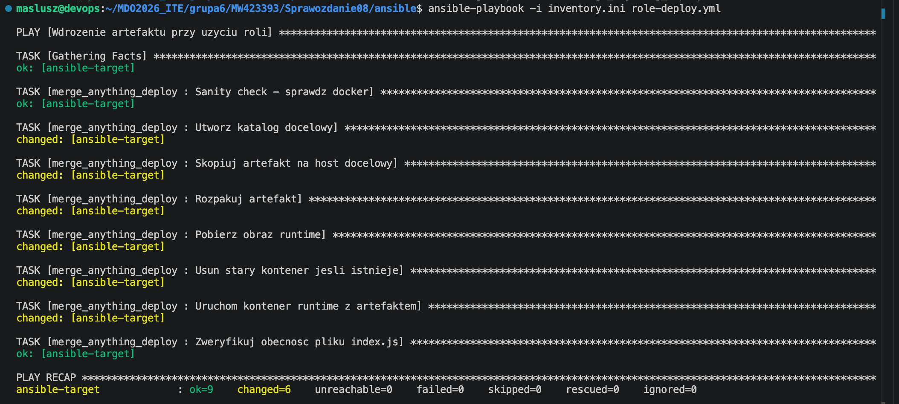

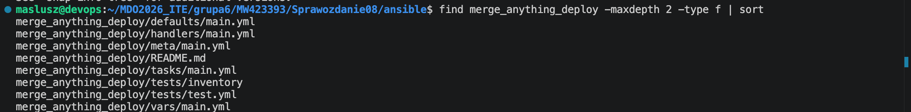

---
