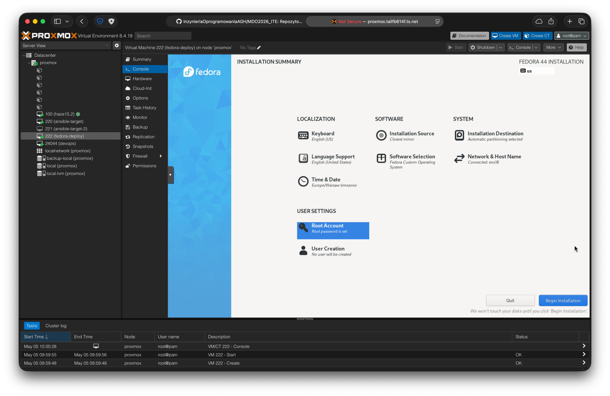
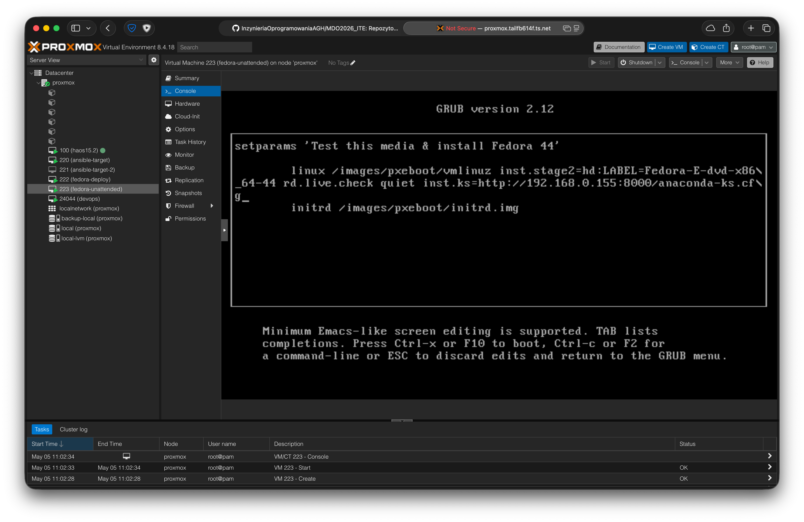
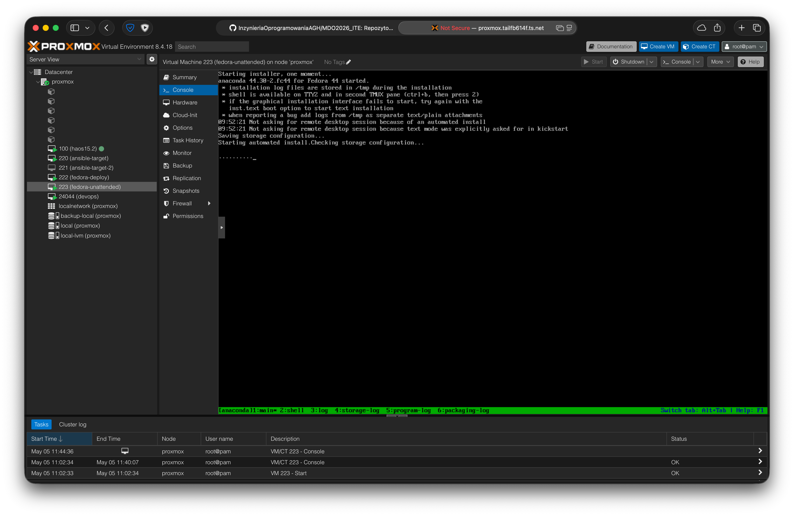
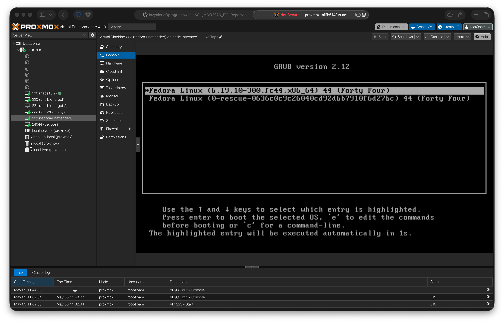
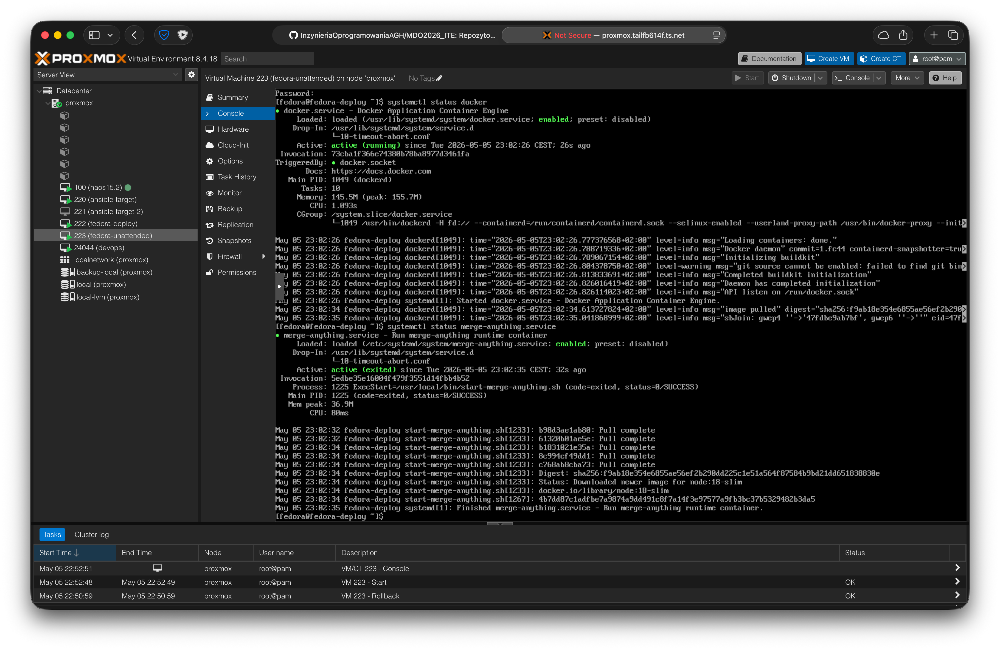
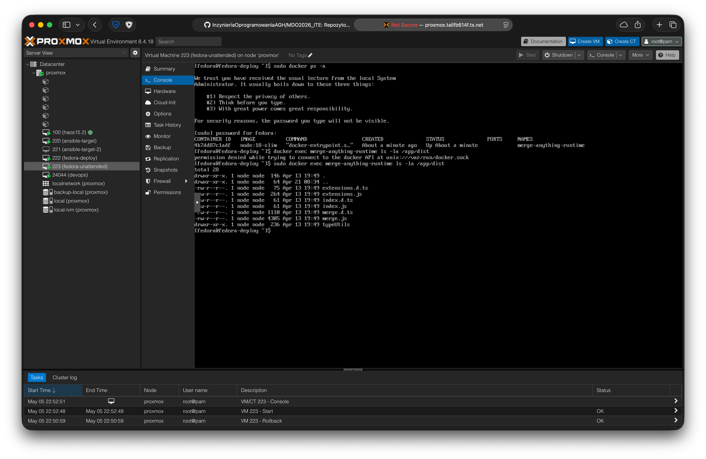
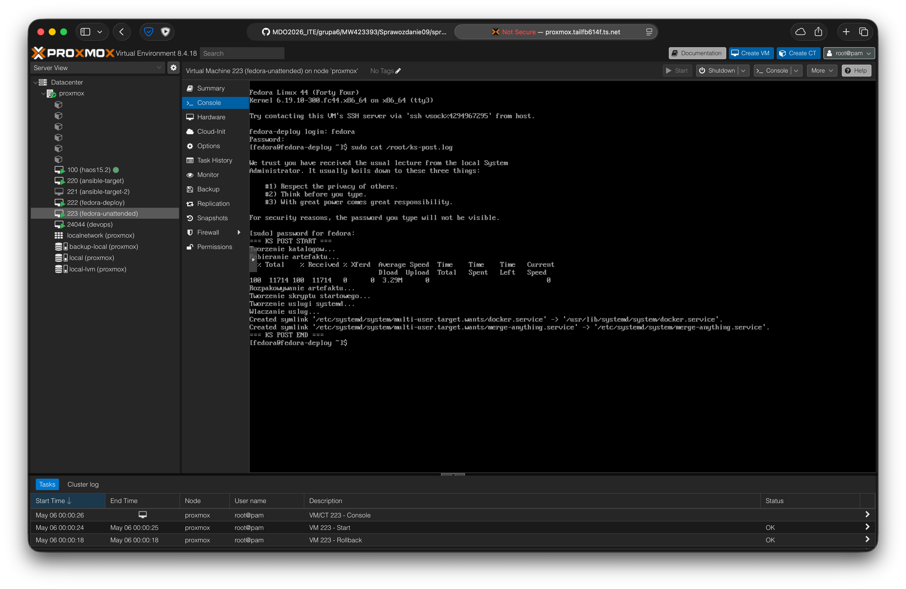

# Sprawozdanie 09 - Pliki odpowiedzi dla wdrożeń nienadzorowanych

**Data zajęć:** 05.05.2026 r.

**Imię i nazwisko:** Mateusz Wiech

**Nr indeksu:** 423393

**Grupa:** 6

**Branch:** MW423393

---

## 0. Środowisko

Ćwiczenie wykonano w środowisku linuksowym (Ubuntu Server 24.04.4 LTS) działającym na maszynie wirtualnej z wykorzystaniem klienta `git` (2.43.0) i `OpenSSH` (9.6p1). Połączenie z maszyną realizowano przez SSH. Repozytorium było obsługiwane z poziomu terminala oraz edytora Visual Studio Code. Wykorzystano oprogramowanie `Docker` w wersji 28.2.2 oraz dystrybucję systemu Linux `Fedora Everything` w wersji 44.

---

## 1. Przygotowanie maszyny wirtualnej

Przygotowano nową maszynę wirtualną przeznaczoną do instalacji nienadzorowanej systemu Fedora. Maszynie nadano nazwę `fedora-deploy`, przydzielono podstawowe zasoby sprzętowe oraz podłączono obraz instalacyjny systemu Fedora. VM została przygotowana jako odrębne środowisko testowe do sprawdzenia instalacji systemu z wykorzystaniem pliku odpowiedzi Kickstart.



---

## 2. Przygotowanie pliku odpowiedzi Kickstart

Plik `anaconda-ks.cfg` został zmodyfikowany tak, aby nadawał się do instalacji nienadzorowanej nowej maszyny wirtualnej. Zmieniono nazwę hosta na `fedora-deploy`, ustawiono automatyczne formatowanie całego dysku przy użyciu `clearpart --all --initlabel`, pozostawiono automatyczny podział dysku `autopart` oraz dodano wymagane pakiety `tar`, `curl`, `wget`, `openssh-server` i `docker`.

Wyłączono `firstboot` oraz włączono automatyczny restart po zakończeniu instalacji. Instalacja może przebiegać bez ręcznej ingerencji, a system po zakończeniu procesu uruchamia się ponownie w gotowej konfiguracji.

Instalator jest uruchamiany z nośnika ISO podłączonego do maszyny wirtualnej, natomiast właściwe pakiety systemowe pobierane są z repozytoriów sieciowych wskazanych przez dyrektywy `url` oraz `repo`. Pierwsza z nich definiuje podstawowe repozytorium Fedora 44, a druga repozytorium aktualizacji.

```ini
# Generated by Anaconda 44.30
text

# System language
keyboard --vckeymap=us --xlayouts='us'
lang en_US.UTF-8

# ISO install
# cdrom

# Install Netinst
url --mirrorlist=http://mirrors.fedoraproject.org/mirrorlist?repo=fedora-44&arch=x86_64
repo --name=updates --mirrorlist=http://mirrors.fedoraproject.org/mirrorlist?repo=updates-released-f44&arch=x86_64

# Network
network --bootproto=dhcp --device=link --activate --hostname=fedora-deploy

# System timezone
timezone Europe/Warsaw --utc
timesource --ntp-server=212-71-233-40.ip.linodeusercontent.com

# Root password
rootpw --iscrypted --allow-ssh $y$j9T$AU3ZeFzyPuQlqbUWDtdN1EWR$WehqQ1f88m5eVf6VbT3.cuEGG.qfQzdN8Z/DSEhHug6
user --name=fedora --groups=wheel --password=fedora --plaintext

# Disks
ignoredisk --only-use=sda
zerombr
# Partition clearing information
clearpart --all --initlabel
autopart

# Boot
bootloader --location=mbr

# Services
firewall --enabled --service=ssh
selinux --enforcing
services --enabled=sshd,NetworkManager

# Run the Setup Agent on first boot
firstboot --disable

# Auto reboot
reboot

%packages
curl
wget
tar
openssh-server
docker
%end
```

---

## 3. Udostępnienie pliku odpowiedzi i artefaktu

Na maszynie `devops` uruchomiono prosty serwer HTTP do udostępnienia pliku `anaconda-ks.cfg` z wykorzystaniem:

```bash
cd ~/MDO2026_ITE/grupa6/MW423393/Sprawozdanie09/fedora
python3 -m http.server 8000
```

---

## 4. Utworzenie nowej maszyny wirtualnej i instalacja nienadzorowana

W kolejnym kroku przygotowano nową maszynę wirtualną w środowisku Proxmox, przeznaczoną do testu instalacji nienadzorowanej systemu Fedora. Podłączono obraz instalacyjny ISO systemu Fedora.



Plik odpowiedzi został przekazany instalatorowi Fedora przy użyciu parametru `inst.ks=` dopisanego do linii startowej jądra w menu GRUB. Parametr został umieszczony na końcu linii `linux`. Po wskazaniu adresu HTTP do pliku `anaconda-ks.cfg` instalator mógł pobrać plik odpowiedzi i rozpocząć instalację nienadzorowaną.



Po zakończeniu instalacji i automatycznym restarcie maszyna uruchomiła już zainstalowany system Fedora z dysku, co potwierdza ekran programu rozruchowego GRUB. Instalacja nienadzorowana została przeprowadzona poprawnie i zakończyła się sukcesem. Następnie zalogowano się do systemu i zweryfikowano podstawowe parametry, w tym hostname skonfigurowany wcześniej w pliku Kickstart.



---

## 5. Rozszerzenie pliku odpowiedzi o repozytoria i oprogramowanie potrzebne do uruchomienia programu zbudowanego przez *pipeline*

Jako poprzednio przygotowano i udostępniono przez HTTP katalog zawierający plik Kickstart oraz artefakt `merge-anything-dist-24.tar.gz`, wytworzony wcześniej przez pipeline Jenkins.

Plik odpowiedzi rozszerzono o pakiety oraz działania potrzebne do uruchomienia programu zbudowanego w ramach wcześniejszego pipeline. Artefaktem projektu nie jest gotowy obraz kontenera, lecz archiwum `merge-anything-dist-24.tar.gz`, zatem potrzebna jest instalacja `Docker` w systemie hosta oraz pobranie artefaktu w sekcji `%post`.

W sekcji `%post` przygotowano katalog `/opt/merge-anything`, pobrano artefakt z serwera HTTP, rozpakowano go oraz utworzono skrypt startowy `/usr/local/bin/start-merge-anything.sh`.

Aby program uruchamiał się automatycznie po pierwszym starcie systemu, przygotowano usługę `systemd` o nazwie `merge-anything.service`. W sekcji `%post` nie wykonywano `docker run` bezpośrednio przez instalator, ponieważ środowisko instalacyjne nie uruchamia jeszcze docelowego systemu w pełnym trybie pracy. Zamiast tego użyto `systemctl enable`, tak aby po pierwszym uruchomieniu nowego systemu usługa wystartowała automatycznie i uruchomiła kontener runtime.

```ini
...
# Pipeline
%post --log=/root/ks-post.log
mkdir -p /opt/merge-anything
mkdir -p /usr/local/bin

curl -o /tmp/merge-anything-dist-24.tar.gz http://192.168.0.155:8000/merge-anything-dist-24.tar.gz
tar -xzf /tmp/merge-anything-dist-24.tar.gz -C /opt/merge-anything

cat > /usr/local/bin/start-merge-anything.sh <<'EOF'
#!/bin/bash
/usr/bin/docker rm -f merge-anything-runtime >/dev/null 2>&1 || true
/usr/bin/docker pull node:18-slim
/usr/bin/docker run -d --name merge-anything-runtime -v /opt/merge-anything:/app node:18-slim tail -f /dev/null
EOF

chmod +x /usr/local/bin/start-merge-anything.sh

cat > /etc/systemd/system/merge-anything.service <<'EOF'
[Unit]
Description=Run merge-anything runtime container
After=network-online.target docker.service
Wants=network-online.target
Requires=docker.service

[Service]
Type=oneshot
RemainAfterExit=yes
ExecStart=/usr/local/bin/start-merge-anything.sh
ExecStop=/usr/bin/docker rm -f merge-anything-runtime
TimeoutStartSec=0

[Install]
WantedBy=multi-user.target
EOF

systemctl enable docker
systemctl enable merge-anything.service
%end
```

---

## 6. Uruchomienie rozszerzonej instalacji nienadzorowanej

Uruchomiono ponownie nową maszynę wirtualną z obrazu ISO Fedora i przekazano instalatorowi dyrektywę `inst.ks=`, wskazującą plik odpowiedzi dostępny po HTTP. Instalacja przebiegła automatycznie, z uwzględnieniem pakietów i działań niezbędnych do późniejszego uruchomienia programu po pierwszym starcie systemu.



Program został przygotowany do działania już przy pierwszym starcie hosta. Sprawdzono stan usługi `docker`, stan usługi `merge-anything.service`, obecność uruchomionego kontenera `merge-anything-runtime` oraz zawartość katalogu `/app/dist` wewnątrz kontenera.



Przygotowany plik odpowiedzi Kickstart przeprowadził nienadzorowaną instalację systemu Fedora oraz doprowadził do automatycznego uruchomienia środowiska hostującego program.

---

## 7. Wyświetlanie działań z sekcji `%post` na ekranie

Zmodyfikowano sekcję `%post` pliku Kickstart tak, aby jej działania były widoczne bezpośrednio podczas instalacji. Zastosowano jednoczesne logowanie do pliku `ks-post.log` oraz przekierowanie standardowego wyjścia i błędów na `tty3` z użyciem `tee`. Kolejne operacje opatrzono komunikatami `echo`.

Przykładowe wykorzystane dyrektywy:

```kickstart
%post --log=/root/ks-post.log
exec > >(tee -a /root/ks-post.log /dev/tty3)
exec 2> >(tee -a /root/ks-post.log /dev/tty3 >&2)

echo "=== KS POST START ==="
...
echo "=== KS POST END ==="
%end
```

Możliwe jest sprawdzenie etapów instalacji jak tworzenie katalogów, pobieranie artefaktu, rozpakowywanie archiwum oraz przygotowanie usługi `systemd` poprzed podgląd pliku `ks-post.log`:



---