# Sprawozdanie 10 - Wdrażanie na zarządzalne kontenery: Kubernetes (1)

**Data zajęć:** 19.05.2026 r.

**Imię i nazwisko:** Mateusz Wiech

**Nr indeksu:** 423393

**Grupa:** 6

**Branch:** MW423393

---

## 0. Środowisko

Ćwiczenie wykonano w środowisku linuksowym (Ubuntu Server 24.04.4 LTS) działającym na maszynie wirtualnej z wykorzystaniem klienta `git` (2.43.0) i `OpenSSH` (9.6p1). Połączenie z maszyną realizowano przez SSH. Repozytorium było obsługiwane z poziomu terminala oraz edytora Visual Studio Code. Wykorzystano oprogramowanie `Docker` w wersji 29.1.3 oraz `minikube` v1.38.1.

---

## 1. Instalacja klastra Kubernetes

### Instalacja Minikube

Do przygotowania lokalnego klastra Kubernetes zainstalowano `minikube`, czyli uproszczoną implementację środowiska k8s przeznaczoną do zastosowań laboratoryjnych i testowych. Program został pobrany w postaci binarnej i zainstalowany w systemie w katalogu `/usr/local/bin`.

```bash
cd /tmp
curl -LO https://github.com/kubernetes/minikube/releases/latest/download/minikube-linux-amd64
sudo install minikube-linux-amd64 /usr/local/bin/minikube && rm minikube-linux-amd64
minikube version
```

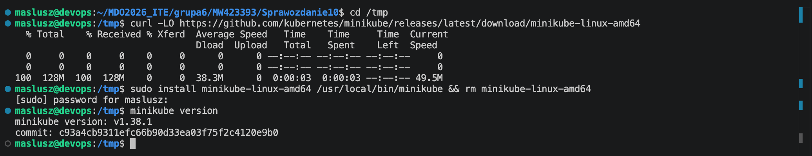

---

### Zdefiniowanie `kubectl`

Przygotowano dostęp do polecenia `kubectl` w wariancie dostarczanym przez `minikube`. W tym celu zdefiniowano alias `kubectl`, wskazujący na polecenie `minikube kubectl --`. Zweryfikowano dostępność klienta, otrzymując informację o wersji `kubectl` i `kustomize`.

```bash
alias kubectl="minikube kubectl --"
kubectl version --client
```

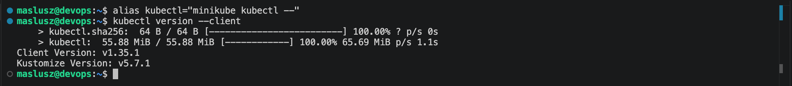

---

### Uruchomienie Kubernetes

Lokalny klaster Kubernetes uruchomiono z pomocą `minikube`, wykorzystując `docker`. W trakcie uruchamiania pojawiło się ostrzeżenie dotyczące ograniczonej ilości pamięci dostępnej w maszynie wirtualnej - przydzielona pamięć może być niewystarczająca z punktu widzenia zalecanego narzutu systemowego, jednak klaster został pomyślnie uruchomiony i osiągnął stan gotowości.

```bash
minikube start --driver=docker
```

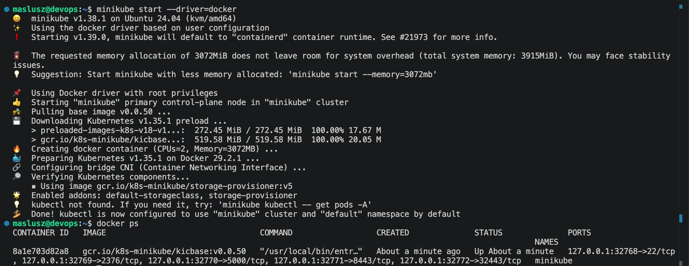

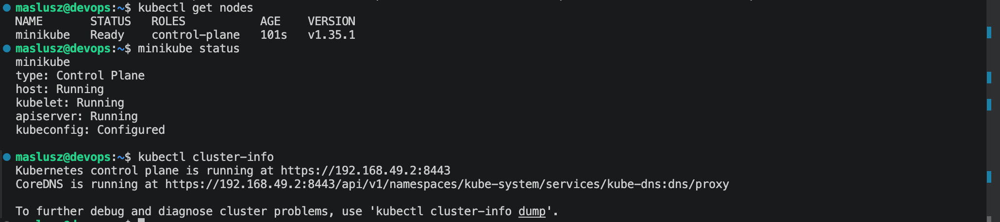

---

### Uruchomienie Dashboardu

Uruchomiono komponent `Kubernetes Dashboard` - graficzny podgląd stanu klastra, podów, wdrożeń i usług. Aktywowany został z wykorzystaniem `minikube addons`, a następnie uzyskano adres URL umożliwiający połączenie z panelem z poziomu przeglądarki.

```bash
minikube addons enable dashboard
minikube dashboard --url
```

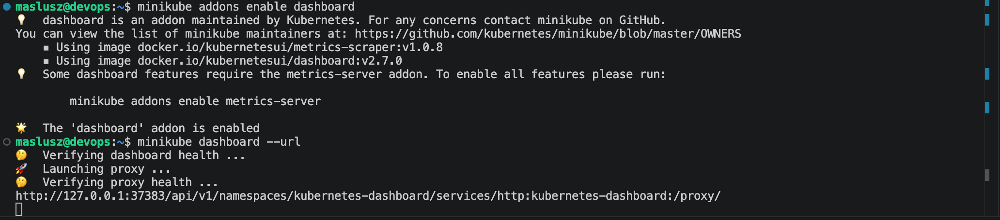

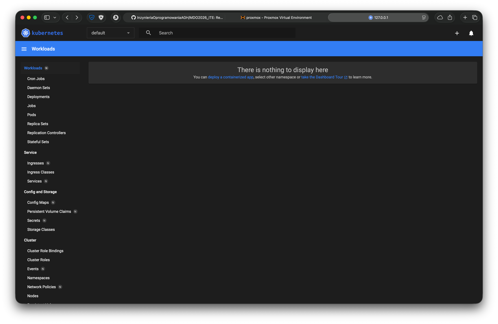

---

### Podstawowe pojęcia Kubernetesa

`Pod` to najmniejsza jednostka uruchomieniowa - zawiera jeden lub więcej kontenerów współdzielących zasoby sieciowe oraz przestrzeń uruchomieniową.
`Deployment` opisuje docelowy stan wdrożenia aplikacji i pozwala zarządzać replikami oraz aktualizacjami podów.
`Service` zapewnia stabilny punkt dostępu do uruchomionych podów i pozwala kierować ruch do odpowiednich replik aplikacji.

---

## 2. Analiza posiadanego kontenera

Wybrany wcześniej artefakt `merge-anything` nie stanowi samodzielnej aplikacji sieciowej, lecz bibliotekę JavaScript. Na potrzeby ćwiczenia wybrano inną aplikację opartą o `nginx`, rozszerzoną o prostą stronę `index.html`. Przygotowano własny obraz Docker `mw423393-nginx:v1`, bazujący na `nginx:alpine` i zawierający własną stronę startową.

Treść `Dockerfile`:
```dockerfile
FROM nginx:alpine
COPY index.html /usr/share/nginx/html/index.html
EXPOSE 80
```

`Nginx` rozszerzony o stronę `index.html`:

```html
<!DOCTYPE html>
<html lang="pl">
<head>
    <meta charset="UTF-8">
    <title>MW423393 Kubernetes</title>
</head>
<body>
    <h1>MW423393 - Kubernetes deploy</h1>
    <p>nginx</p>
</body>
</html>
```

Poprawność działania obrazu zweryfikowano lokalnie przez uruchomienie kontenera i wykonanie żądania HTTP.

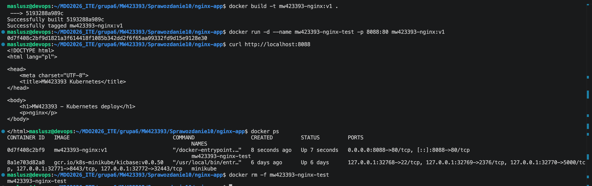

---

## 3. Uruchamianie oprogramowania

### Załadowanie obrazu

Obraz Docker'owy `mw423393-nginx:v1` został załadowany do środowiska `minikube`, tak aby mógł zostać użyty podczas wdrożenia w klastrze Kubernetes.

```bash
minikube image load mw423393-nginx:v1
```

---

### Uruchomienie aplikacji w Kubernetes

Aplikację uruchomiono w klastrze Kubernetes przy użyciu polecenia `kubectl run`. Kontener oparty o obraz `mw423393-nginx:v1` został automatycznie opakowany przez Kubernetes w pojedynczy `pod`, któremu przypisano etykietę `app=mw423393-nginx`.

```bash
kubectl run mw423393-nginx --image=mw423393-nginx:v1 --port=80 --labels app=mw423393-nginx
```

Poprawność uruchomienia potwierdzono z poziomu `kubectl` oraz z użyciem Dashboardu.

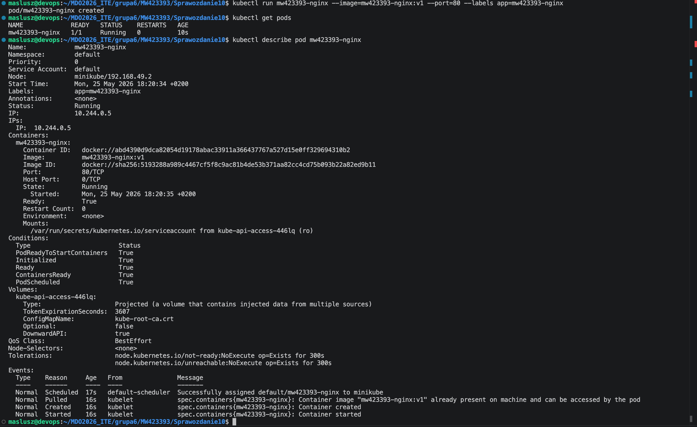

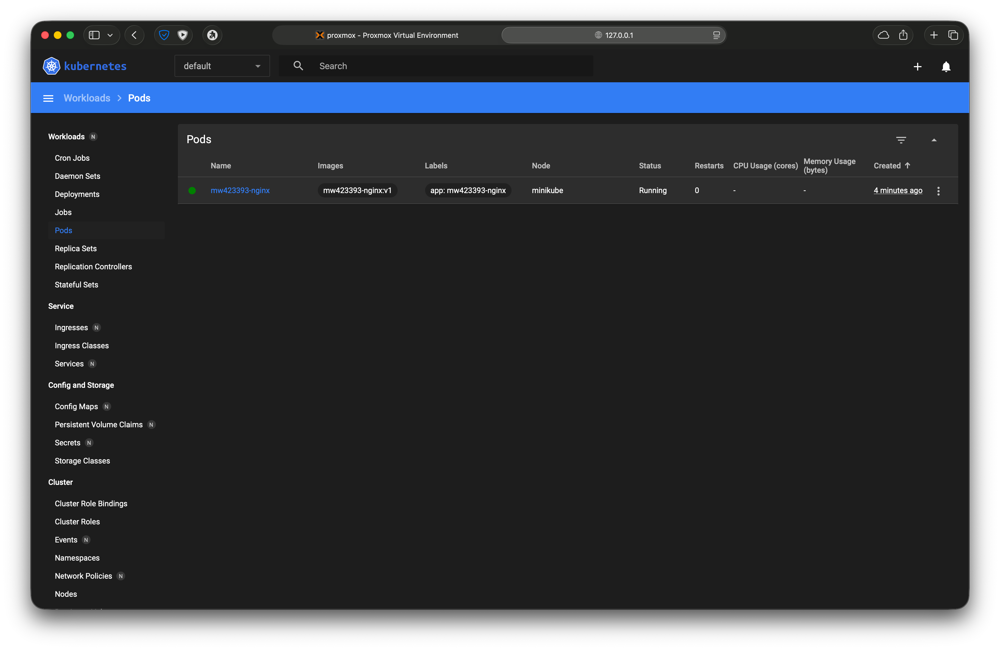

---

###  Wyprowadzenie portu

Aby uzyskać dostęp do funkcjonalności aplikacji zastosowano `port-forward`, przekierowujący lokalny port hosta na port kontenera działającego w podzie. Wykonano lokalne żądanie HTTP do strony udostępnianej przez `nginx`.

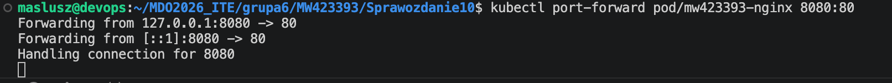

Działanie potwierdzono poleceniem `curl` oraz sprawdzono w przeglądarce.

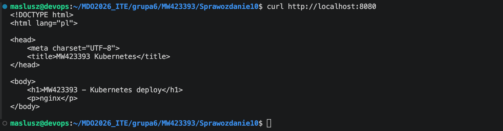

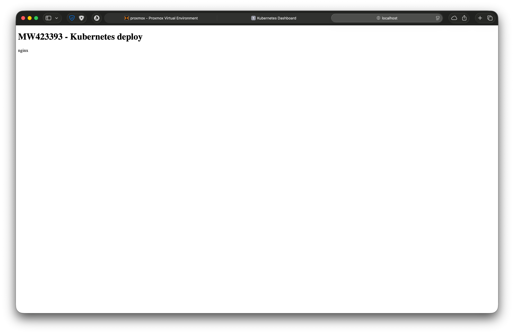

---

## 4. Zapisanie wdrożenia jako plik YAML

### Wdrożenie manifestu

Przekształcono ręczne wdrożenie w plik YML manifestu Kubernetes poprzez stworzenie pliku `mw423393-nginx-deployment.yml`, który opisuje obiekt typu `Deployment`. Wdrożenie skonfigurowano na cztery repliki - aplikacja może działać równolegle w kilku identycznych podach.

```yaml
apiVersion: apps/v1
kind: Deployment
metadata:
  name: mw423393-nginx-deployment
spec:
  replicas: 4
  selector:
    matchLabels:
      app: mw423393-nginx
  template:
    metadata:
      labels:
        app: mw423393-nginx
    spec:
      containers:
        - name: mw423393-nginx
          image: mw423393-nginx:v1
          imagePullPolicy: Never
          ports:
            - containerPort: 80
```

Przygotowany manifest wdrożono do klastra za pomocą `kubectl apply`. Następnie sprawdzono przebieg wdrożenia przez `kubectl rollout status` oraz zweryfikowano stan podów i deploymentu.

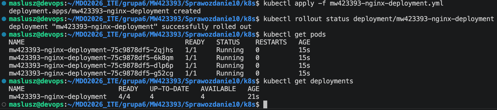

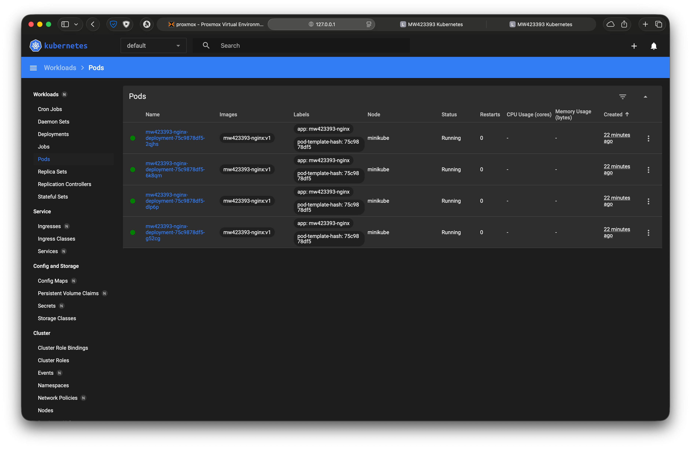

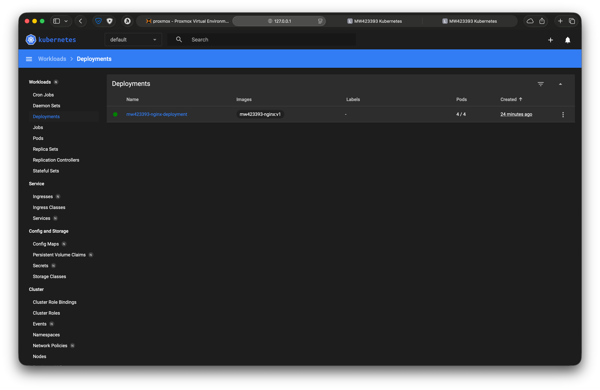

---

### Wyeksponowanie wdrożenia jako `service`

Dla zapewnienia stabilnego punktu dostępu do replik aplikacji, utworzono obiekt `Service`, wybierający pody oznaczone etykietą `app=mw423393-nginx`. Serwis został zdefiniowany w osobnym pliku YAML `mw423393-nginx-service.yml` i wdrożony przy użyciu `kubectl apply`.

```yaml
apiVersion: v1
kind: Service
metadata:
  name: mw423393-nginx-service
spec:
  selector:
    app: mw423393-nginx
  ports:
    - protocol: TCP
      port: 80
      targetPort: 80
```

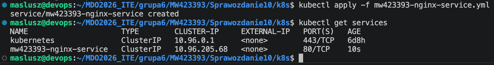

---

### Przekierowanie portu

Po utworzeniu obiektu `Service` wykonano przekierowanie portu z poziomu hosta do serwisu działającego w klastrze. Uzyskano dostęp do aplikacji z poziomu lokalnej przeglądarki i potwierdzono poprawną komunikację z funkcjonalnością udostępnianą przez Kubernetes.

```bash
kubectl port-forward service/mw423393-nginx-service 8081:80
```

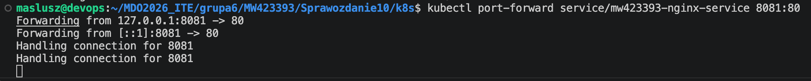

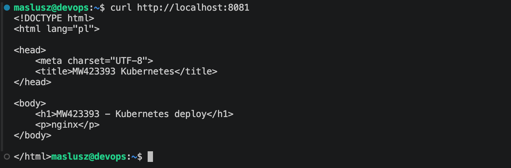

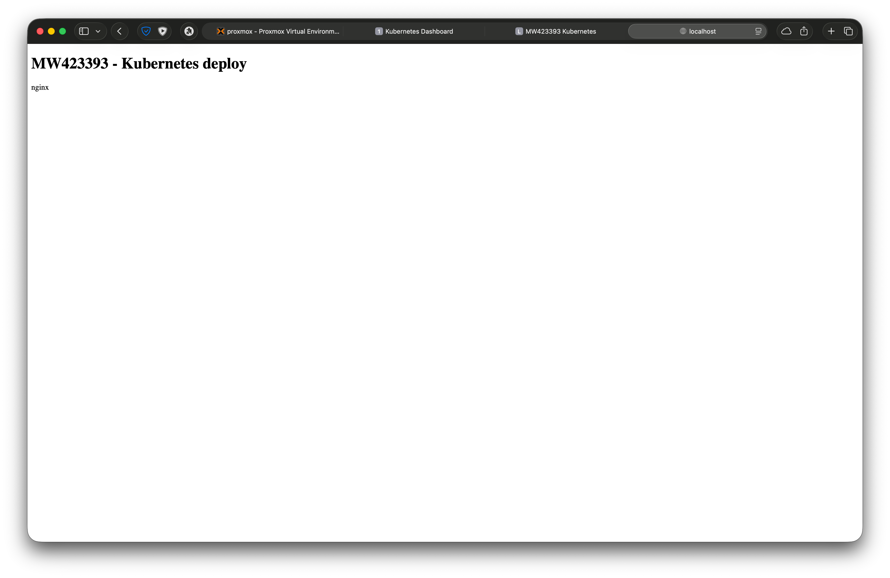

---