# Sprawozdanie 11 - Wdrażanie na zarządzalne kontenery: Kubernetes (2)

**Data zajęć:** 26.05.2026 r.

**Imię i nazwisko:** Mateusz Wiech

**Nr indeksu:** 423393

**Grupa:** 6

**Branch:** MW423393

---

## 0. Środowisko

Ćwiczenie wykonano w środowisku linuksowym (Ubuntu Server 24.04.4 LTS) działającym na maszynie wirtualnej z wykorzystaniem klienta `git` (2.43.0) i `OpenSSH` (9.6p1). Połączenie z maszyną realizowano przez SSH. Repozytorium było obsługiwane z poziomu terminala oraz edytora Visual Studio Code. Wykorzystano oprogramowanie `Docker` w wersji 29.1.3 oraz `minikube` v1.38.1.

---

## 1. Przygotowanie kolejnych wersji obrazu

### Drugi obraz

Przygotowano kolejną wersję obrazu aplikacji `mw423393-nginx`. Druga wersja różniła się zawartością strony `index.html`:

```html
<!DOCTYPE html>
<html lang="pl">
<head>
    <meta charset="UTF-8">
    <title>MW423393 Kubernetes v2</title>
</head>
<body>
    <h1>MW423393 - Kubernetes deploy v2</h1>
    <p>druga wersja obrazu nginx</p>
</body>
</html>
```

Budowa obrazu:

```bash
docker build -t mw423393-nginx:v2 .
```

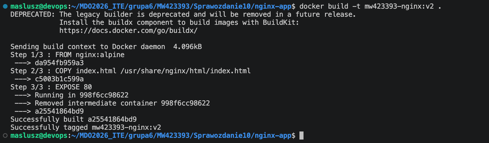

---

### Wadliwy obraz

Przygotowano wadliwą wersję obrazu `mw423393-nginx:bad`, której uruchomienie kończy się błędem. Nadpisano polecenie startowe kontenera instrukcją `CMD ["false"]`:

```Dockerfile
FROM nginx:alpine
COPY index.html /usr/share/nginx/html/index.html
CMD ["false"]
```

Budowa i test wadliwego obrazu:

```bash
docker build -t mw423393-nginx:bad -f Dockerfile.bad .
```

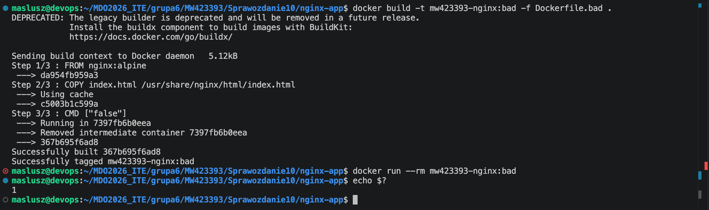

---

### Załadowanie obrazów do `minikube`

Wszystkie wersje obrazu zostały załadowane do `minikube` bez konieczności publikacji obrazów do zewnętrznego rejestru.

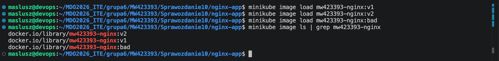

---

## 2. Zmiany w deploymencie

### Bazowe wdrożenie aplikacji

Jako punkt wyjścia przygotowano manifest `Deployment`, wykorzystujący obraz `mw423393-nginx:v1` i cztery repliki. Wdrożono go do klastra przy użyciu `kubectl apply`, oraz sprawdzono poprawność wdrożenia przez `kubectl rollout status`.

`mw423393-nginx-deployment.yml`:

```yaml
apiVersion: apps/v1
kind: Deployment
metadata:
  name: mw423393-nginx-deployment
spec:
  replicas: 4
  selector:
    matchLabels:
      app: mw423393-nginx
  template:
    metadata:
      labels:
        app: mw423393-nginx
    spec:
      containers:
        - name: mw423393-nginx
          image: mw423393-nginx:v1
          imagePullPolicy: Never
          ports:
            - containerPort: 80
```

Wdrożenie do klastra:

```bash
kubectl apply -f mw423393-nginx-deployment.yml
kubectl rollout status deployment/mw423393-nginx-deployment
```

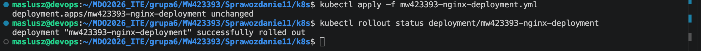

---

### Zmiany liczby replik

Przetestowano zmianę liczby replik deploymentu. Zwiększano liczbę replik do ośmiu, następnie zmniejszono ją do jednej, potem do zera, a na końcu ponownie zwiększono do czterech. Kubernetes tworzy i usuwa pody w odpowiedzi na zmianę deklarowanego stanu wdrożenia.

#### Zwiększenie do 8

```bash
kubectl scale deployment mw423393-nginx-deployment --replicas=8
```

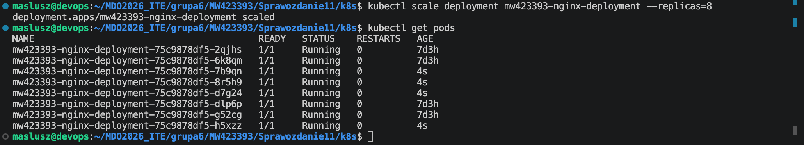

#### Zmniejszenie do 1

```bash
kubectl scale deployment mw423393-nginx-deployment --replicas=1
```

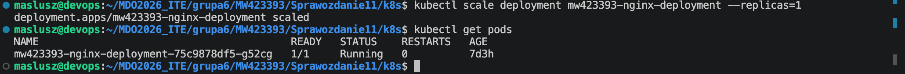

#### Zmniejszenie do 0

```bash
kubectl scale deployment mw423393-nginx-deployment --replicas=0
```

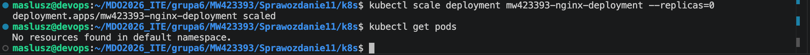

#### Przywrócenie 4 replik

```bash
kubectl scale deployment mw423393-nginx-deployment --replicas=4
```

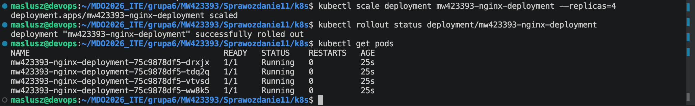

---

### Zmiana wersji obrazu

Przeprowadzono serię zmian wersji obrazu wykorzystywanego przez deployment. Wdrożono wersję `v2`, przywrócono starszą wersję `v1`, a na końcu zastosowano obraz wadliwy `mw423393-nginx:bad`, którego uruchomienie kończy się błędem.

`mw423393-nginx:v2`:

```bash
kubectl set image deployment/mw423393-nginx-deployment mw423393-nginx=mw423393-nginx:v2
kubectl rollout status deployment/mw423393-nginx-deployment
kubectl get pods
```

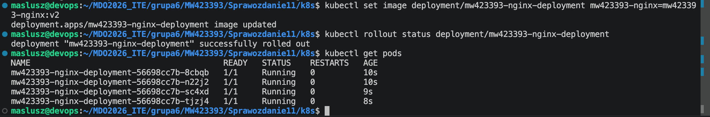

`mw423393-nginx:v1`:

```bash
kubectl set image deployment/mw423393-nginx-deployment mw423393-nginx=mw423393-nginx:v1
kubectl rollout status deployment/mw423393-nginx-deployment
kubectl get pods
```

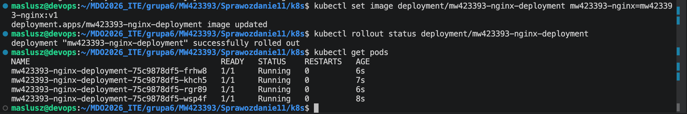

`mw423393-nginx:bad`:

```bash
kubectl set image deployment/mw423393-nginx-deployment mw423393-nginx=mw423393-nginx:bad
kubectl rollout status deployment/mw423393-nginx-deployment --timeout=60s
kubectl get pods
```

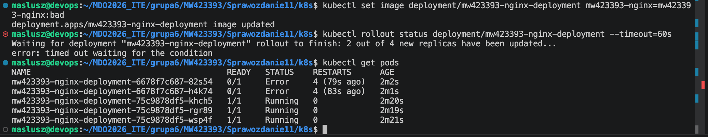

---

### Histora i cofanie wdrożeń

Wykorzystano mechanizmy `kubectl rollout history` oraz `kubectl rollout undo`. Odczytano historię wdrożeń i przywrócono poprzednią, działającą wersję po nieudanym wdrożeniu wadliwego obrazu.

```bash
kubectl rollout history deployment/mw423393-nginx-deployment
kubectl rollout undo deployment/mw423393-nginx-deployment
```

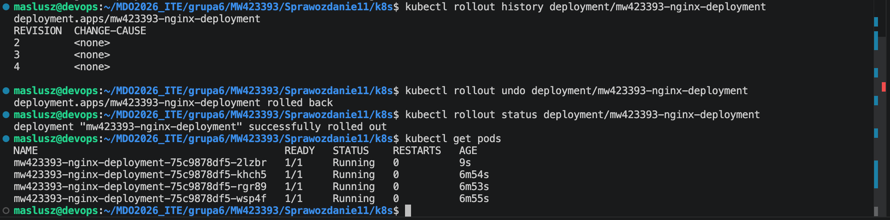

---

## 3. Kontrola wdrożenia

Przygotowano skrypt `check-rollout.sh`, który sprawdza, czy deployment zdołał osiągnąć stan gotowości w czasie nieprzekraczającym 60 sekund. Skrypt wykorzystuje polecenie `kubectl rollout status` z parametrem `--timeout=60s` i zwraca komunikat zależny od wyniku operacji.

```sh
#!/bin/bash
DEPLOYMENT="$1"
if [ -z "$DEPLOYMENT" ]; then
  echo "Uzycie: $0 <deployment>"
  exit 1
fi
minikube kubectl -- rollout status deployment/"$DEPLOYMENT" --timeout=60s
STATUS=$?
if [ $STATUS -eq 0 ]; then
  echo "Wdrozenie zakonczone sukcesem. Czas <= 60s"
else
  echo "Wdrozenie nie zakonczylo sie sukcesem. Czas > 60s"
fi
exit $STATUS
```

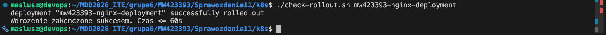

---

## 4. Strategie wdrożenia

Przygotowano trzy warianty wdrożeń różniące się strategią aktualizacji: `Recreate`, `RollingUpdate` oraz `Canary`.

### `Recreate`

Kubernetes usuwa wszystkie dotychczas działające pody przed uruchomieniem nowych. Podczas aktualizacji z obrazu występuje chwilowy brak dostępnych replik (stare pody zostały zatrzymane przed uruchomieniem nowych). Strategia ta powoduje przerwę w dostępności aplikacji.

`recreate-deployment.yml`:

```yaml
apiVersion: apps/v1
kind: Deployment
metadata:
  name: mw423393-nginx-recreate
spec:
  replicas: 4
  strategy:
    type: Recreate
  selector:
    matchLabels:
      app: mw423393-nginx-recreate
  template:
    metadata:
      labels:
        app: mw423393-nginx-recreate
    spec:
      containers:
        - name: mw423393-nginx
          image: mw423393-nginx:v1
          imagePullPolicy: Never
          ports:
            - containerPort: 80
```

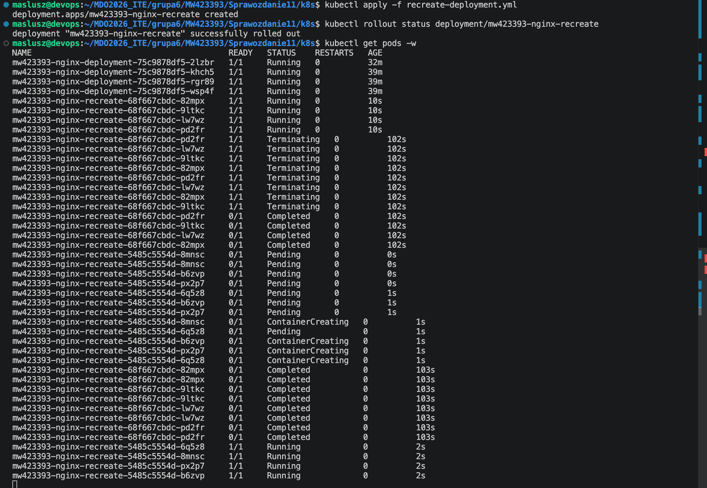

### `RollingUpdate`

`RollingUpdate` z parametrami `maxUnavailable: 2` oraz `maxSurge: 25%` podczas aktualizacji obrazu stopniowo wymienia pody. Część starych replik pozostaje aktywna, podczas gdy Kubernetes uruchamia już nowe pody z nowszą wersją obrazu. Aplikacja pozostaje dostępna w trakcie wdrożenia.

`rolling-deployment.yml`:

```yaml
apiVersion: apps/v1
kind: Deployment
metadata:
  name: mw423393-nginx-rolling
spec:
  replicas: 4
  strategy:
    type: RollingUpdate
    rollingUpdate:
      maxUnavailable: 2
      maxSurge: 25%
  selector:
    matchLabels:
      app: mw423393-nginx-rolling
  template:
    metadata:
      labels:
        app: mw423393-nginx-rolling
    spec:
      containers:
        - name: mw423393-nginx
          image: mw423393-nginx:v1
          imagePullPolicy: Never
          ports:
            - containerPort: 80
```

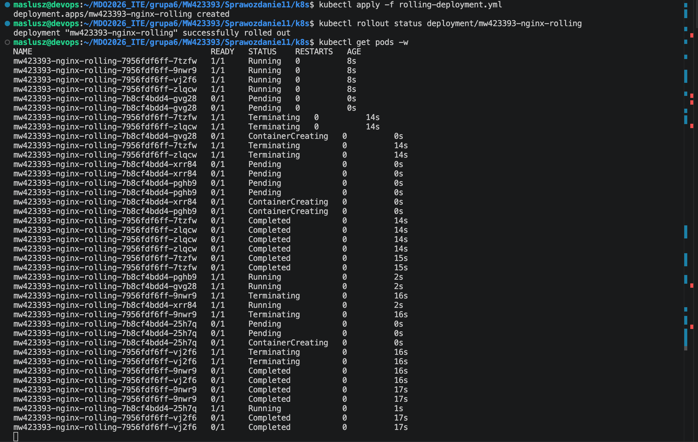

### `Canary`

Wariant `Canary` zrealizowano przez równoległe uruchomienie dwóch deploymentów: stabilnego (`mw423393-nginx-stable`) oraz testowego (`mw423393-nginx-canary`). Deployment stabilny wykorzystywał obraz `mw423393-nginx:v1` i większą liczbę replik, natomiast deployment canary wykorzystywał obraz `mw423393-nginx:v2` i tylko jedną replikę. Oba wdrożenia oznaczono wspólną etykietą aplikacji oraz dodatkowymi etykietami `track=stable` i `track=canary`.

Możliwe było jednoczesne utrzymywanie wersji stabilnej i testowej, a serwis kierował ruch do podów oznaczonych wspólną etykietą aplikacji. Strategia `Canary` pozwala testować nową wersję przy ograniczonym udziale replik, bez pełnej wymiany całego wdrożenia.

`canary-stable.yml`:

```yaml
apiVersion: apps/v1
kind: Deployment
metadata:
  name: mw423393-nginx-stable
spec:
  replicas: 3
  selector:
    matchLabels:
      app: mw423393-nginx-canary
      track: stable
  template:
    metadata:
      labels:
        app: mw423393-nginx-canary
        track: stable
    spec:
      containers:
        - name: mw423393-nginx
          image: mw423393-nginx:v1
          imagePullPolicy: Never
          ports:
            - containerPort: 80
```

`canary-canary.yml`:

```yaml
apiVersion: apps/v1
kind: Deployment
metadata:
  name: mw423393-nginx-canary
spec:
  replicas: 1
  selector:
    matchLabels:
      app: mw423393-nginx-canary
      track: canary
  template:
    metadata:
      labels:
        app: mw423393-nginx-canary
        track: canary
    spec:
      containers:
        - name: mw423393-nginx
          image: mw423393-nginx:v2
          imagePullPolicy: Never
          ports:
            - containerPort: 80
```

`canary-service.yml`:

```yaml
apiVersion: v1
kind: Service
metadata:
  name: mw423393-nginx-canary-service
spec:
  selector:
    app: mw423393-nginx-canary
  ports:
    - protocol: TCP
      port: 80
      targetPort: 80
```

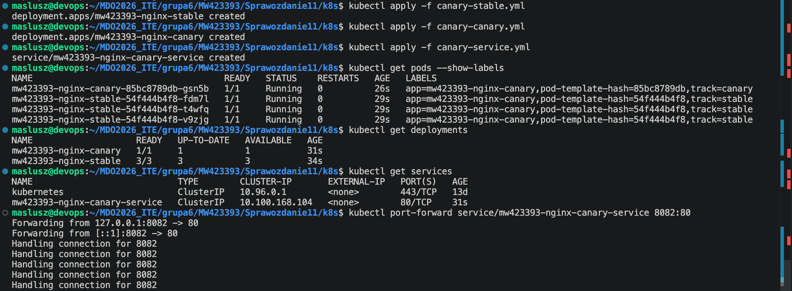

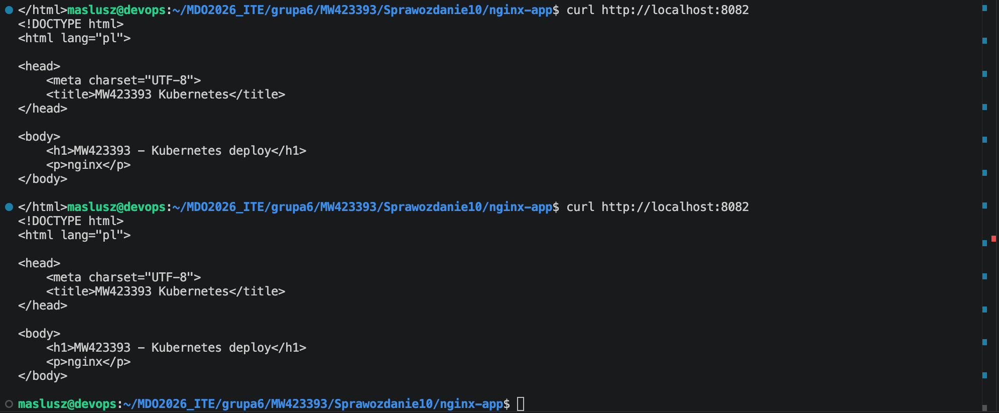


---