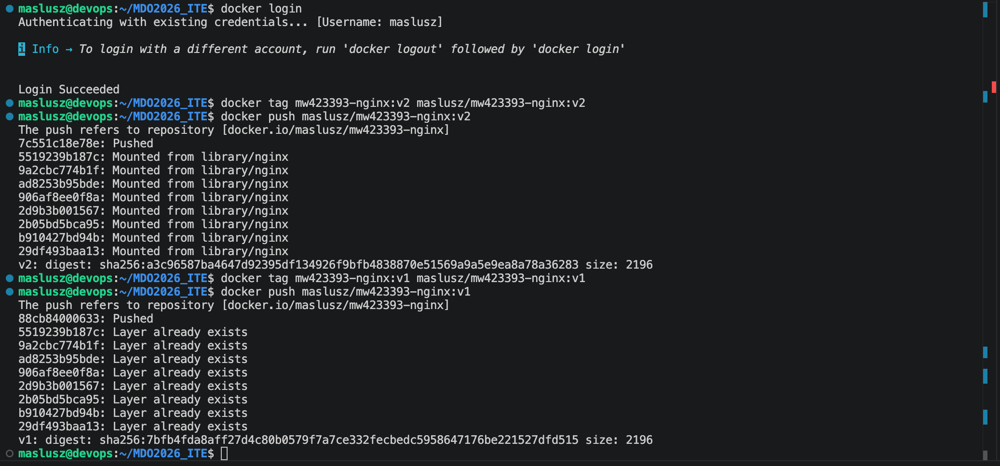
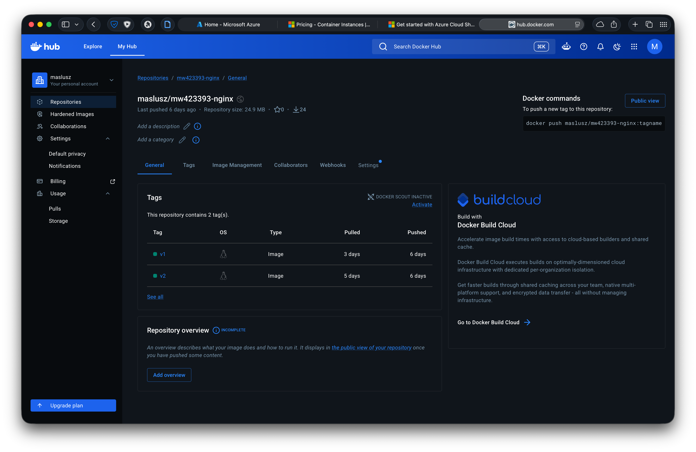
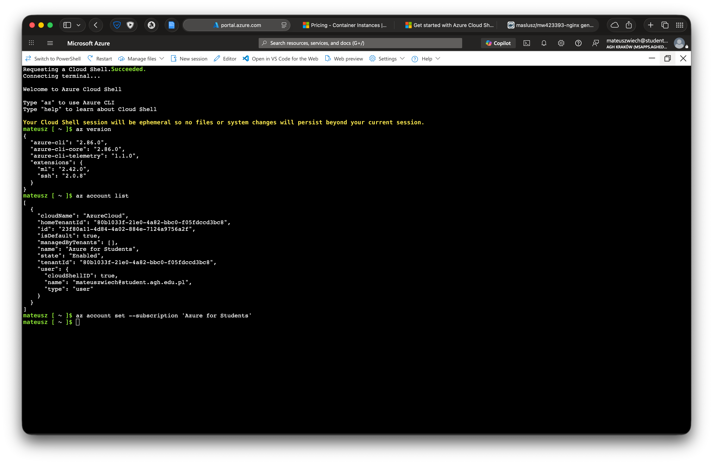
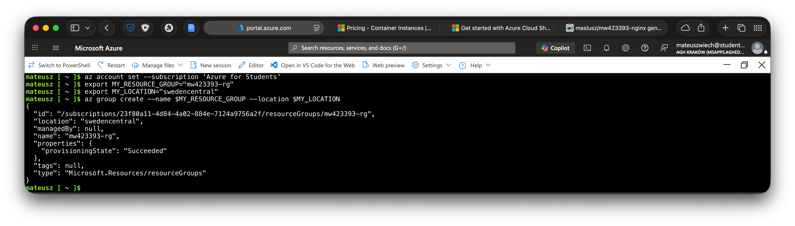
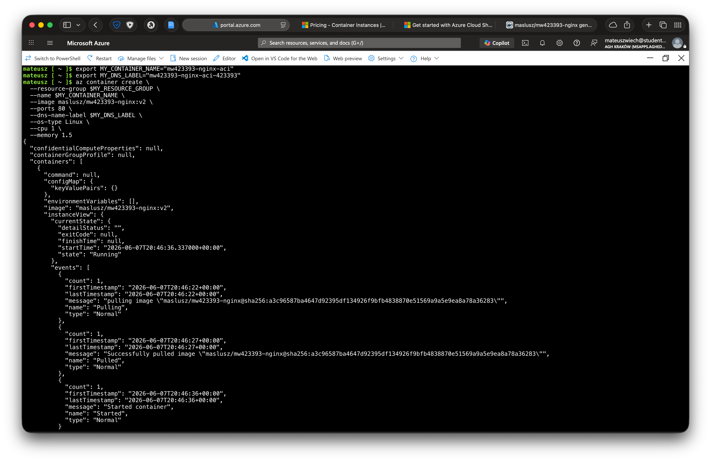
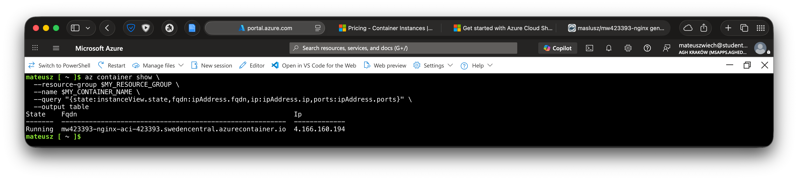
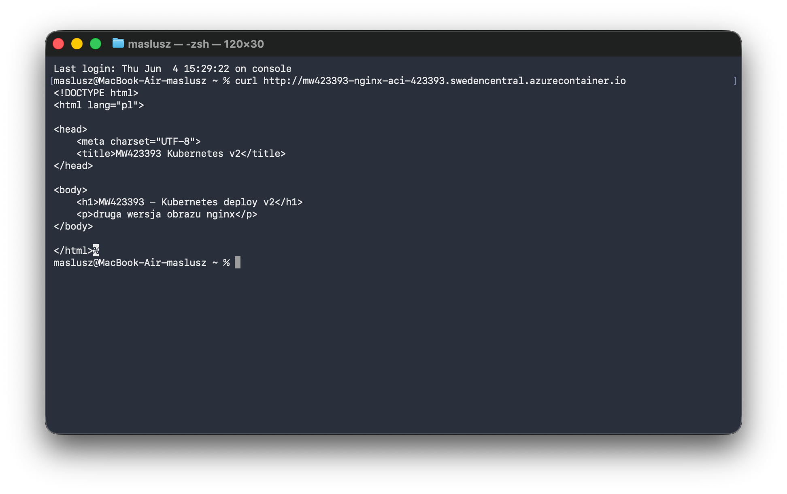
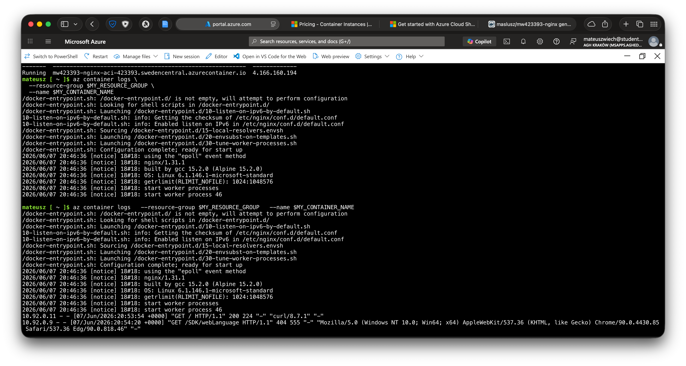
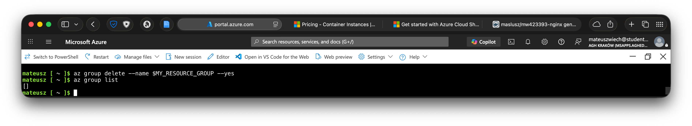

# Sprawozdanie 12 - 

**Data zajęć:** 02.06.2026 r.

**Imię i nazwisko:** Mateusz Wiech

**Nr indeksu:** 423393

**Grupa:** 6

**Branch:** MW423393

---

## 0. Środowisko

Ćwiczenie wykonano w środowisku linuksowym (Ubuntu Server 24.04.4 LTS) działającym na maszynie wirtualnej z wykorzystaniem klienta `git` (2.43.0) i `OpenSSH` (9.6p1). Połączenie z maszyną realizowano przez SSH. Repozytorium było obsługiwane z poziomu terminala oraz edytora Visual Studio Code. Wykorzystano oprogramowanie `Docker` w wersji 29.1.3.

---

## 1. Przygotowanie kontenera

Obraz kontenera ze stroną `index.html` oparty o `nginx` został oznaczony odpowiednim tagiem i opublikowany w Docker Hub, tak aby mógł zostać użyty jako źródło obrazu dla Azure Container Instances.

```bash
docker login
docker tag mw423393-nginx:v2 maslusz/mw423393-nginx:v2
docker push maslusz/mw423393-nginx:v2
```






---

## 2. Zapoznanie z platformą Azure

### Uruchomienie Azure Cloud Shell

Wykorzystano `Azure Cloud Shell` w wariancie `Bash` z opcją `No storage account`. Przed wykonaniem operacji sprawdzono dostępność narzędzia `az` oraz ustawiono posiadaną subskrybcję.

```bash
az version
az account list
az account set --subscription 'Azure for Students'
```



---

## 3. Zadania do wykonania

### Utworzenie resource group

Utworzono własną grupę zasobów, która miała przechowywać kontener uruchamiany w usłudze Azure Container Instances.

```bash
export MY_RESOURCE_GROUP="mw423393-rg"
export MY_LOCATION="swedencentral"
az group create --name $MY_RESOURCE_GROUP --location $MY_LOCATION
```



---

### Wdrożenie kontenera

Do wdrożenia wykorzystano własny obraz `maslusz/mw423393-nginx:v2` z Docker Hub. Przy pierwszym uruchomieniu Azure zgłosił błąd `ResourceRequestsNotSpecified` - konieczne było określenie zasobów CPU (`--cpu`) i pamięci (`--memory`) dla kontenera.

```bash
export MY_CONTAINER_NAME="mw423393-nginx-aci"
export MY_DNS_LABEL="mw423393-nginx-aci-423393"

az container create \
  --resource-group $MY_RESOURCE_GROUP \
  --name $MY_CONTAINER_NAME \
  --image maslusz/mw423393-nginx:v2 \
  --ports 80 \
  --dns-name-label $MY_DNS_LABEL \
  --os-type Linux \
  --cpu 1 \
  --memory 1.5
```



---

### Weryfikacja działania kontenera

Po wdrożeniu sprawdzono stan instancji kontenera, przypisany publiczny adres IP oraz nazwę FQDN. Usługa otrzymała publiczny adres `mw423393-nginx-aci-423393.swedencentral.azurecontainer.io`.

```bash
az container show \
  --resource-group $MY_RESOURCE_GROUP \
  --name $MY_CONTAINER_NAME \
  --query "{state:instanceView.state,fqdn:ipAddress.fqdn,ip:ipAddress.ip,ports:ipAddress.ports}" \
  --output table
```



---

### Dostęp do usługi HTTP

Metodą dostępu do aplikacji był publiczny adres FQDN przypisany do instancji kontenera. Po wdrożeniu wykonano połączenie HTTP z poziomu lokalnego terminala, używając polecenia `curl`.

```bash
curl http://mw423393-nginx-aci-423393.swedencentral.azurecontainer.io
```



---

### Pobranie logów

W celu potwierdzenia poprawnego uruchomienia pobrano logi kontenera poprzez `az container logs`. W logach widoczny był proces startu `nginx` - konfiguracja kontenera i uruchomienie procesów serwera HTTP. Logi zawierały również wpisy dotyczące żądań HTTP kierowanych do wdrożonej usługi.

```bash
az container logs \
  --resource-group $MY_RESOURCE_GROUP \
  --name $MY_CONTAINER_NAME
```



---

### Usunięcie zasobów

Po zakończeniu usunięto całą grupę zasobów wraz z wdrożonym kontenerem, tak aby nie pozostawiać aktywnych usług zużywających kredyty w subskrypcji Azure.

```bash
az group delete --name $MY_RESOURCE_GROUP --yes
```

Usunięcie samego kontenera:

```bash
az container delete \
  --resource-group $MY_RESOURCE_GROUP \
  --name $MY_CONTAINER_NAME \
  --yes
```



---
