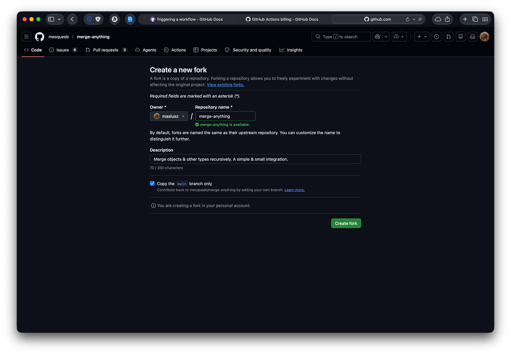
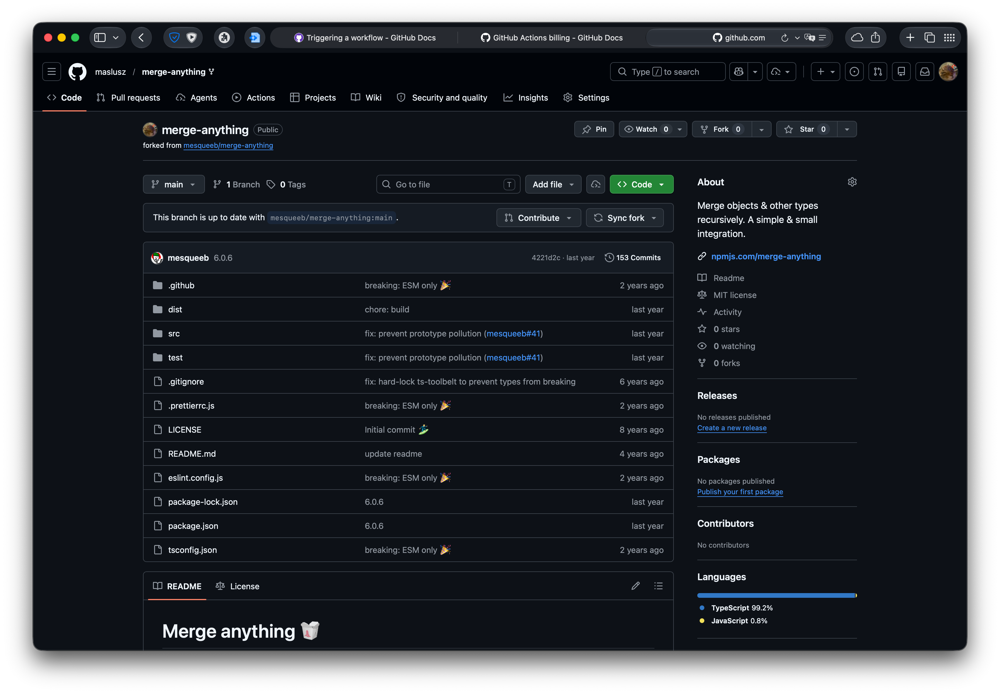
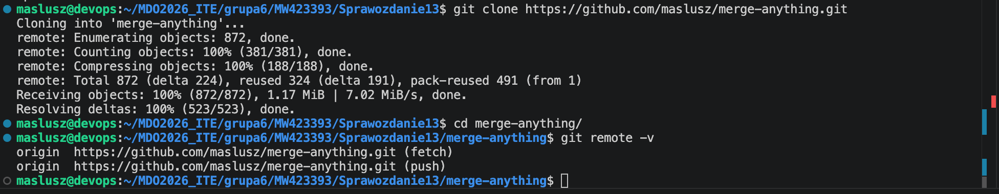
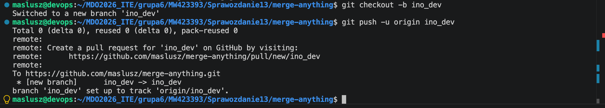
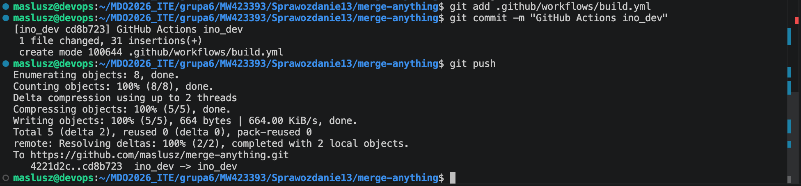
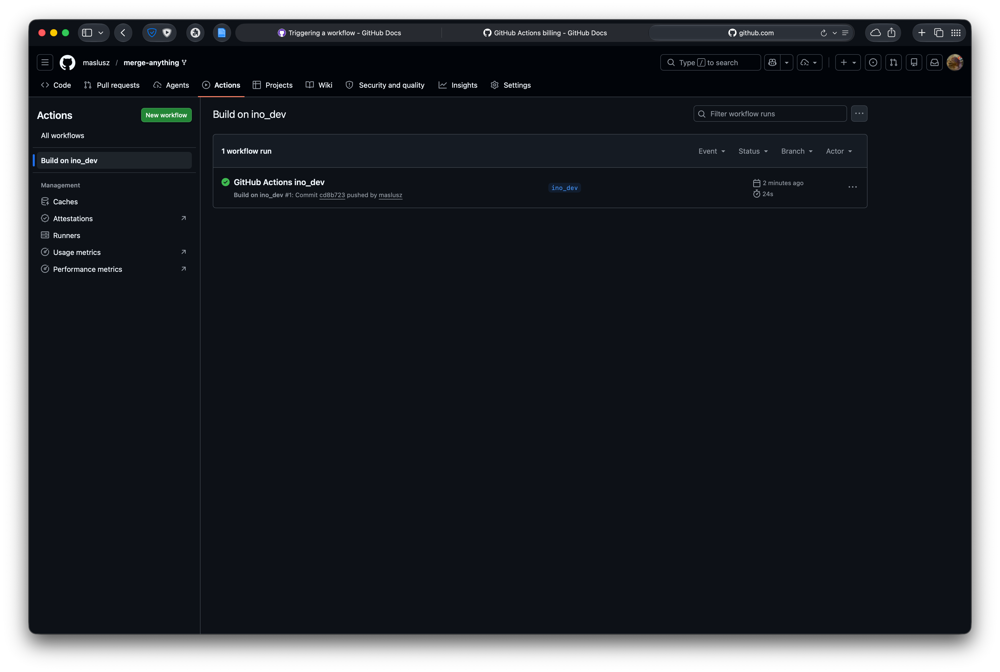
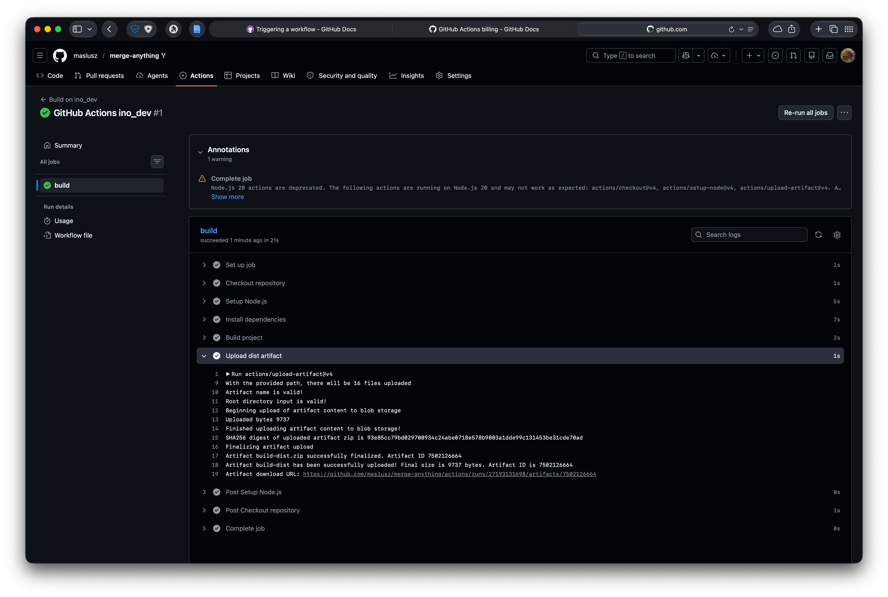
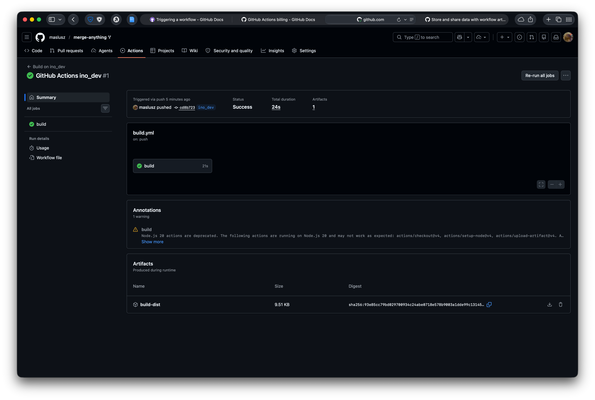

# Sprawozdanie 13 - GitHub Actions

**Data zajęć:** 09.06.2026 r.

**Imię i nazwisko:** Mateusz Wiech

**Nr indeksu:** 423393

**Grupa:** 6

**Branch:** MW423393

---

## 0. Środowisko

Ćwiczenie wykonano w środowisku linuksowym (Ubuntu Server 24.04.4 LTS) działającym na maszynie wirtualnej z wykorzystaniem klienta `git` (2.43.0) i `OpenSSH` (9.6p1). Połączenie z maszyną realizowano przez SSH. Repozytorium było obsługiwane z poziomu terminala oraz edytora Visual Studio Code.

---

## 1. Przygotowanie repozytorium

Przygotowano własną kopię repozytorium [`merge-anything`](https://github.com/mesqueeb/merge-anything) poprzez wykonanie forka w serwisie GitHub.





---

## 2. Klonowanie własnej kopii projektu

Sklonowano własny fork repozytorium `merge-anything` na maszynę roboczą i zweryfikowano konfigurację zdalnych repozytoriów `git`.

```bash
git clone https://github.com/maslusz/merge-anything.git
cd merge-anything
git remote -v
```



---

## 3. Przygotowanie gałęzi roboczej

Przygotowano dedykowaną gałąź `ino_dev`, przeznaczoną do uruchamiania workflow `GitHub Actions`.

```bash
git checkout -b ino_dev
git push -u origin ino_dev
```



---

## 4. Przygotowanie akcji GitHub Actions

Przed dodaniem własnej akcji wyczyszczono zawartość katalogu `.github/workflows` z obecnych w projekcie workflow.

```bash
rm -f .github/workflows/*
```

W katalogu `.github/workflows` utworzono plik `build.yml` - akcję reagującą na `push` do gałęzi `ino_dev`. Workflow: pobranie repozytorium, konfiguracja środowiska `Node.js`, instalacja zależności, budowa projektu, zapisanie katalogu `dist` jako artefaktu.

`build.yml`:
```yaml
name: Build on ino_dev

on:
  push:
    branches:
      - ino_dev

jobs:
  build:
    runs-on: ubuntu-latest

    steps:
      - name: Checkout repository
        uses: actions/checkout@v4

      - name: Setup Node.js
        uses: actions/setup-node@v4
        with:
          node-version: 20

      - name: Install dependencies
        run: npm ci

      - name: Build project
        run: npm run build

      - name: Upload dist artifact
        uses: actions/upload-artifact@v4
        with:
          name: build-dist
          path: dist
```

---

## 5. Uruchomienie workflow

Wykonano commit i `push` do gałęzi `ino_dev` - automatycznie uruchomiła się akcja GitHub Actions.

```bash
git add .github/workflows/build.yml
git commit -m "GitHub Actions ino_dev"
git push
```



Na GitHubie w zakładce `Actions` workflow został automatycznie uruchomiony zgodnie z konfiguracją triggera `push`. W widoku przebiegu akcji poprawnie wykonały się poszczegoólne kroki `checkout`, `setup-node`, `npm ci`, `npm run build` oraz zapisania artefaktu.





W workflow użyto akcji `actions/upload-artifact` przez co katalog `dist` został zapisany jako [artefakt](https://github.com/maslusz/merge-anything/actions/runs/27193131698/artifacts/7502126664) przebiegu bezpośrednio w widoku przebiegu.



---
