# Sprawozdanie zbiorcze - zajęcia 08-12

**Imię i nazwisko:** Mateusz Wiech

**Nr indeksu:** 423393

**Grupa:** 6

**Branch:** MW423393

---

## 0. Środowisko

Ćwiczenie wykonano w środowisku linuksowym (Ubuntu Server 24.04.4 LTS) działającym na maszynie wirtualnej z wykorzystaniem klienta `git` (2.43.0) i `OpenSSH` (9.6p1). Połączenie z maszyną realizowano przez SSH. Repozytorium było obsługiwane z poziomu terminala oraz edytora Visual Studio Code. W trakcie laboratoriów wykorzystywano kolejno technologie `Docker` w wersji 28.2.2, `ansible` w wersji 2.16.3, dystrybucję systemu Linux `Fedora Everything` w wersji 44, `minikube` v1.38.1 oraz `Azure Cloud Shell`. W części dotyczącej konteneryzacji i orkiestracji zastosowano własny obraz `nginx` oraz wcześniej przygotowany artefakt projektu `merge-anything`.

---

## 1. Cel ćwiczeń

Celem laboratoriów 08–12 było przejście od automatyzacji pojedynczych operacji administracyjnych do pełnego, wieloetapowego podejścia do wdrażania oprogramowania. W pierwszej części wykorzystano `Ansible` do inwentaryzacji systemów, zdalnego wykonywania procedur oraz zarządzania artefaktem przygotowanym wcześniej przez pipeline. Następnie zastosowano pliki odpowiedzi `Kickstart` do zautomatyzowania instalacji systemu operacyjnego i doprowadzenia do automatycznego uruchomienia programu. Dalej pracowano z zarządzalnymi kontenerami: lokalnie z użyciem `minikube` i `Kubernetes`, następnie w chmurze z użyciem `Azure Container Instances`.

---

## 2. Automatyzacja i zdalne wykonywanie poleceń za pomocą Ansible

Pierwszą technologią był `Ansible`, wykorzystany jako narzędzie do automatyzacji zadań administracyjnych. Przygotowano środowisko obejmujące maszynę-orchestrator `devops` oraz maszynę docelową `ansible-target`. Dla obu skonfigurowano nazwy hostów, wpisy w `/etc/hosts`, plik inwentaryzacji `inventory.ini` oraz bezhasłową łączność `SSH`. Możliwe było kierowanie operacji do grup `Orchestrators` i `Endpoints` bez odwoływania się bezpośrednio do adresów IP.

Ustalenie nazw maszyn:

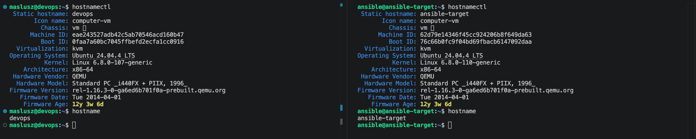

Ustalenie adresów IP:

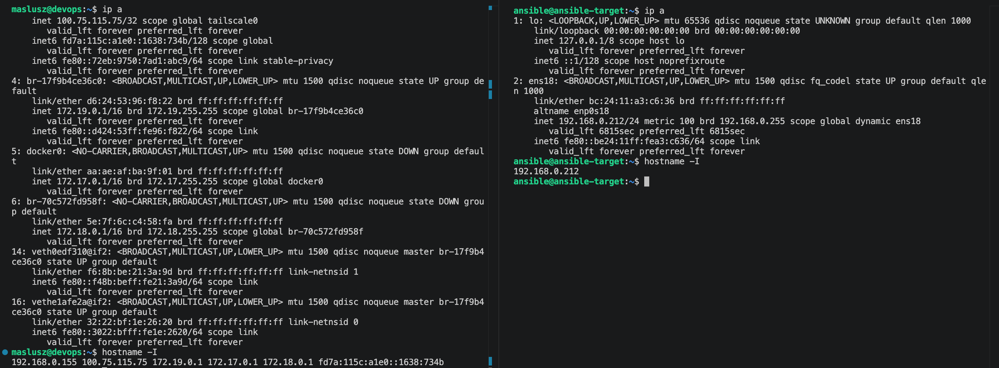

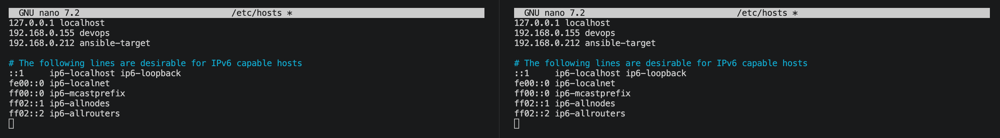

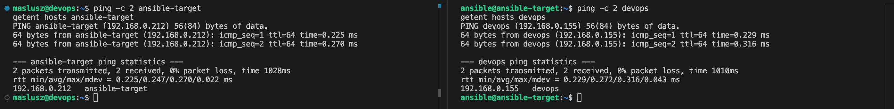

`ping` do przypisanych maszyn z pliku inwentaryzacji:

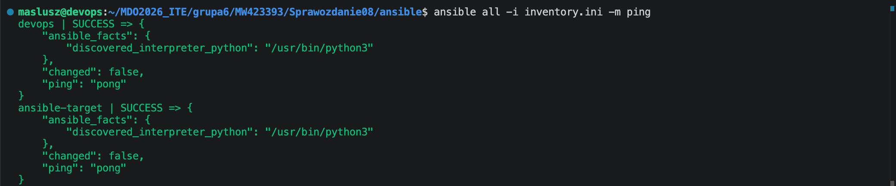

Dalej przygotowano playbooki (pliki YAML, które opisują zadania do wykonania dla danych hostów) `ping.yml`, `copy-inventory.yml` i `update-services.yml` z podstawowymi mechanizmami działania `Ansible`: moduły, grupy hostów, `become`, obsługa błędów przez `ignore_errors`. `Ansible` został użyty do sprawdzenia łączności oraz do kopiowania plików, aktualizacji pakietów i restartu usług. Sprawdzono reakcję na niedostępność hosta po wyłączeniu `ssh.service` oraz `ssh.socket`. `Ansible` nie jest tylko narzędziem do zdalnego uruchamiania komend, lecz platformą do kontrolowania stanu infrastruktury.

Wysłanie żądania `ping` do wszystkich maszyn za pomocą playbooka `ping.yml`:

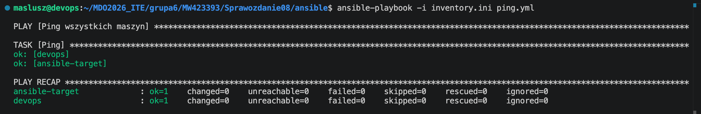

Kopiowanie pliku inwentaryzacji na maszynę końcową `copy-inventory.yml`:

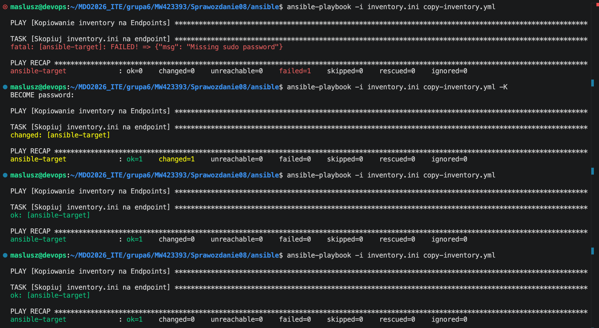

Aktualizacja pakietów i restart usług `update-services.yml`:

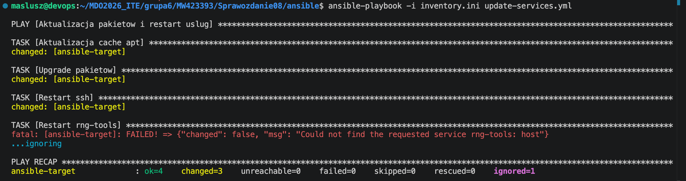

Operacje względem maszyny z wyłączonym serwerem SSH:

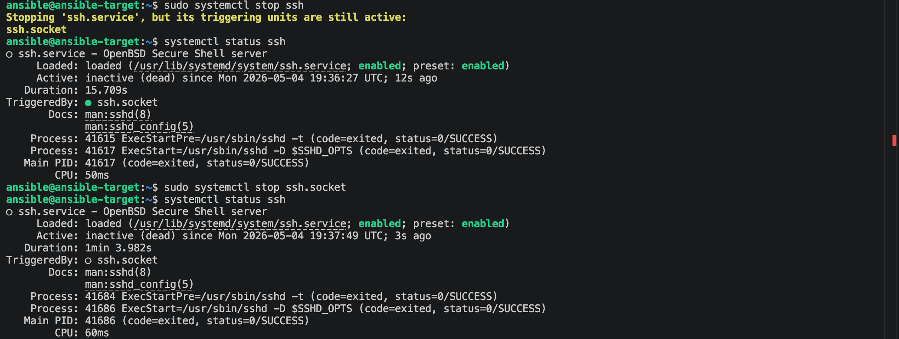

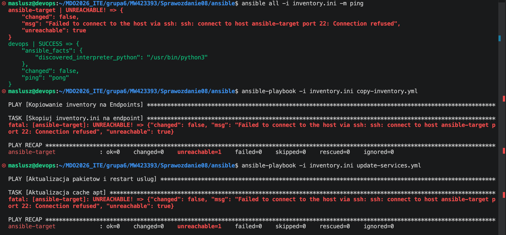

Dalej połączono `Ansible` z wcześniej przygotowanym artefaktem `merge-anything-dist-24.tar.gz`. Artefakt pobrany z rezultatów `Jenkins` został przesłany na `ansible-target`, rozpakowany oraz udostępniony wewnątrz kontenera runtime opartego o `node:18-slim`. `Ansible` pełnił rolę warstwy orkiestrującej operacje na hostach, natomiast `Docker` stworzył kontrolowane środowisko wykonawcze dla wdrażanego programu. Przygotowano playbook czyszczący środowisko oraz rolę `merge_anything_deploy`.

Instalacja Dockera na maszynie docelowej:

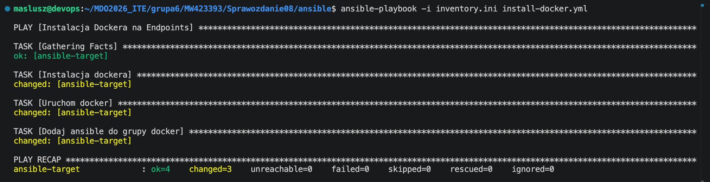

Wdrożenie artefaktu na maszynę docelową:

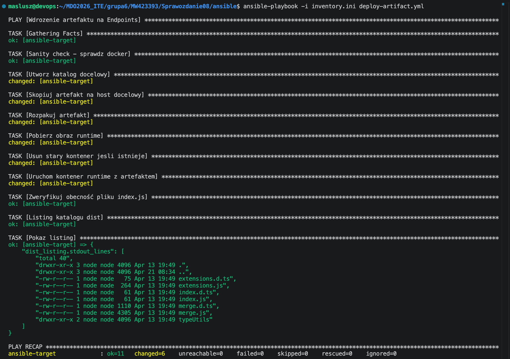

Oczyszczenie środowiska docelowego:

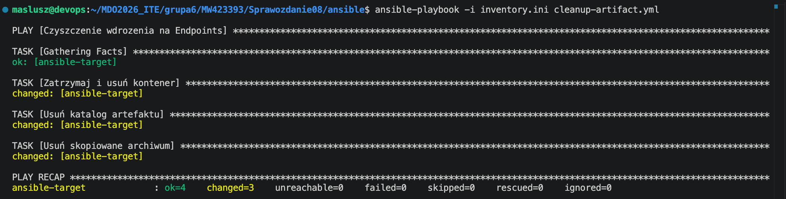

Przygotowanie i wdrożenie roli Ansible:

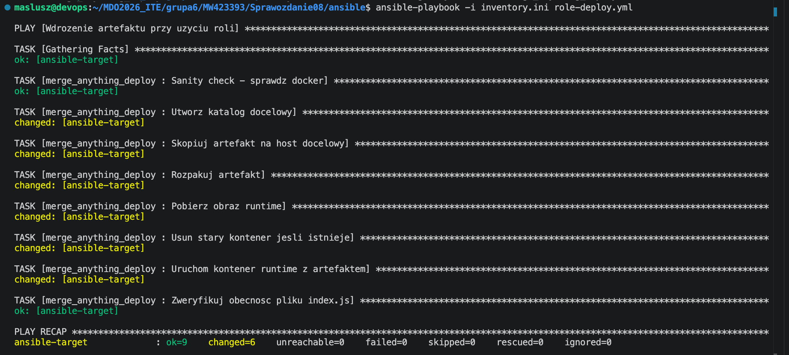

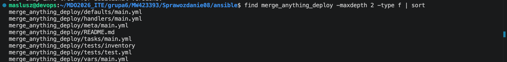

---

## 3. Nienadzorowana instalacja systemu z wykorzystaniem Kickstart

`Kickstart` to mechanizm plików odpowiedzi dla nienadzorowanych instalacji systemów opartych o instalator `Anaconda`. Przygotowano nową maszynę wirtualną z `Fedora Everything 44`, zmodyfikowano plik `anaconda-ks.cfg`, tak aby zawierał instrukcje potrzebne do automatycznej instalacji: konfigurację języka, sieci, użytkowników, usług, automatyczny podział dysku (`clearpart --all --initlabel`, `autopart`), a także restart po instalacji. Wykorzystano `url` i `repo` zamiast `cdrom` - źródłem pakietów może obraz ISO, jak i repozytoria sieciowe Fedory.

Utworzenie nowej maszyny wirtualnej i instalacja nienadzorowana, plik odpowiedzi przekazany poprzez użycie parametru `inst.ks=`:

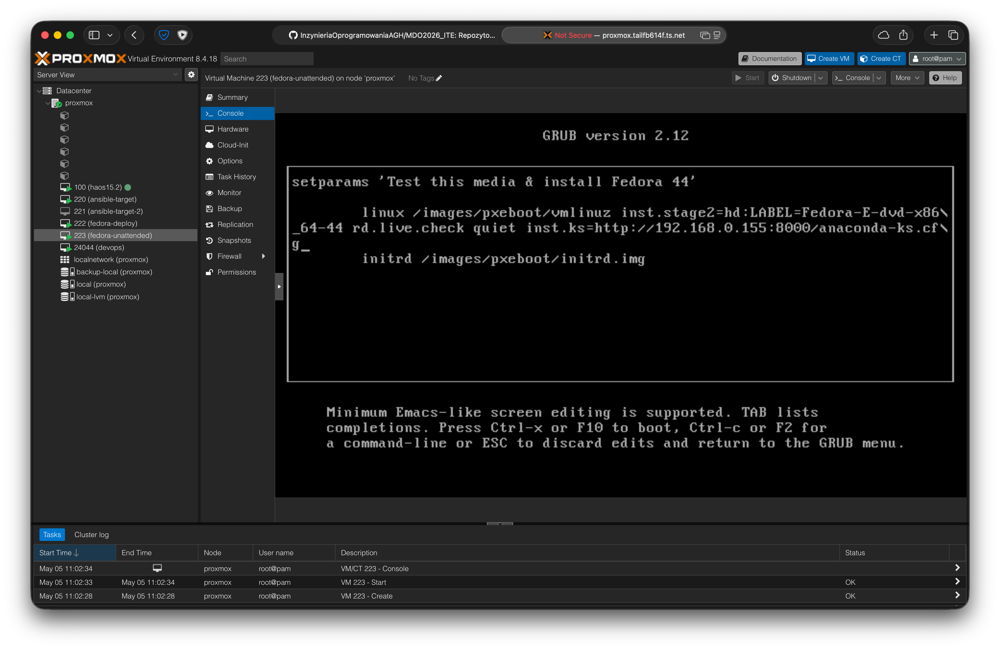

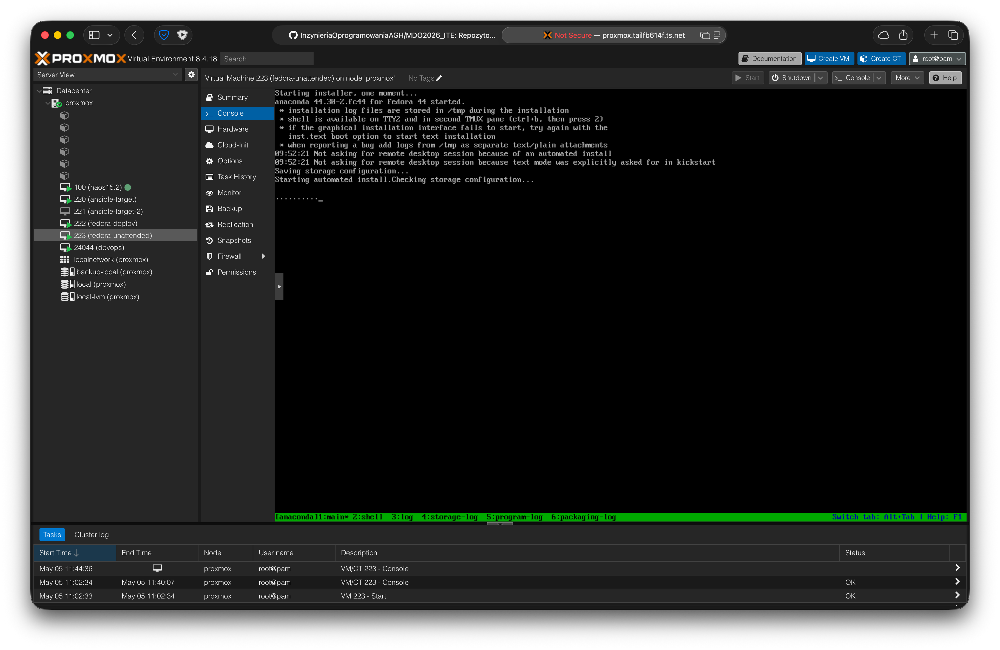

Do połączenia z istniejącym procesem CI/CD wykorzystano i udostępniono z maszyny `devops` artefakt `merge-anything-dist-24.tar.gz` i pobrano go w sekcji `%post` pliku Kickstart.
Przygotowano katalog `/opt/merge-anything`, rozpakowano artefakt, utworzono skrypt `/usr/local/bin/start-merge-anything.sh` oraz jednostkę `systemd merge-anything.service`. Wykorzystano `systemctl enable` zamiast `docker run` w trakcie instalacji, ponieważ środowisko instalatora nie stanowi jeszcze w pełni działającego systemu docelowego.

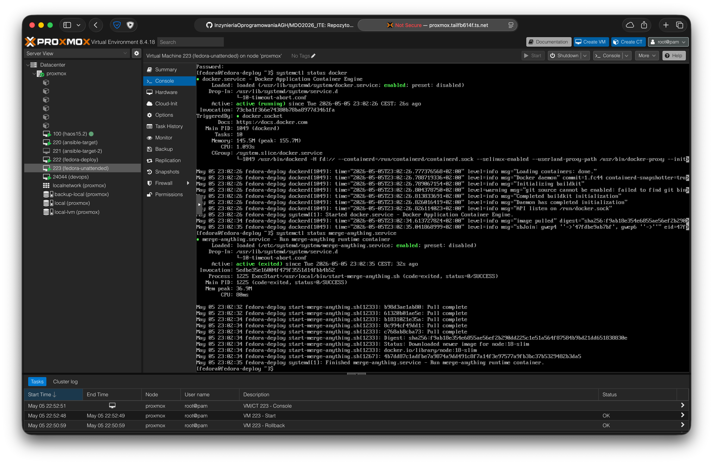

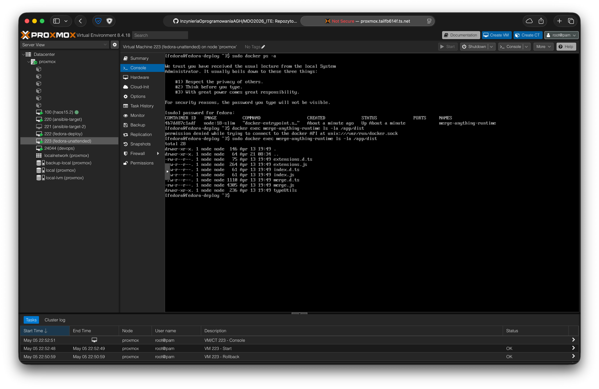

Wykorzystano połączenie trzech technologii w jednym procesie: `Kickstart` - mechanizm nienadzorowanej instalacji, `Docker` - środowisko wykonawcze programu, `systemd` - mechanizm autostartu usług po pierwszym uruchomieniu systemu. Nowa instalacja systemu Fedora uruchamia od razu usługę hostującą program, a dodatkowo umożliwiając śledzenie działania `%post` przez `ks-post.log` i przekierowanie go na `tty3`. Automatyzacja może zaczynać się już w momencie instalacji systemu.

Działania z sekcji `%post` na ekranie:

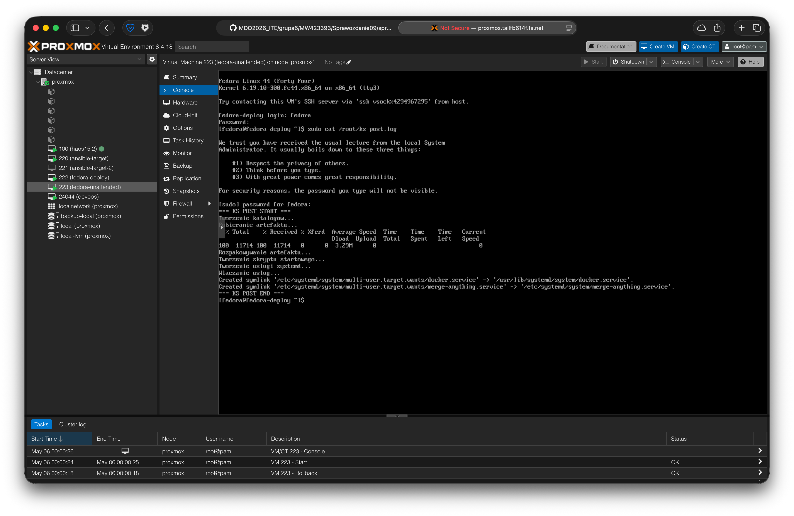

---

## 4. Kubernetes jako warstwa uruchomieniowa dla kontenerów

Przygotowano jednowęzłowy klaster, alias `kubectl` wskazujący na polecenie `minikube kubectl --`, uruchomiono `Kubernetes` wykorzystując `docker` oraz `Kubernetes Dashboard` do graficznego podglądu. Przygotowano obraz Docker bazujący na `nginx` z prostą stroną `index.html`. Celem było przygotowanie dostępnej sieciowo aplikacji kontenerowej, nadającej się do wdrażania w środowisku orkiestratora.

Uruchomienie `Kubernetes` i sprawdzenie stanu:

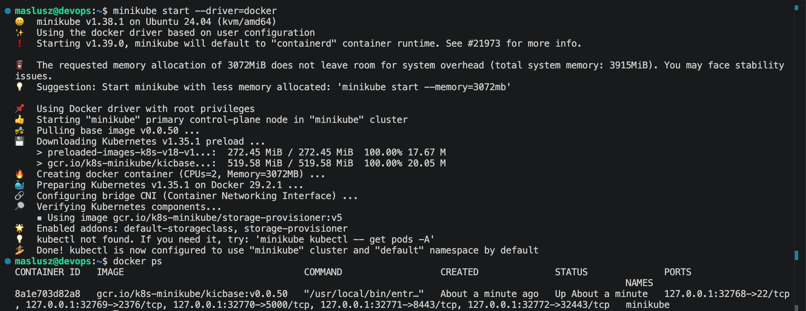

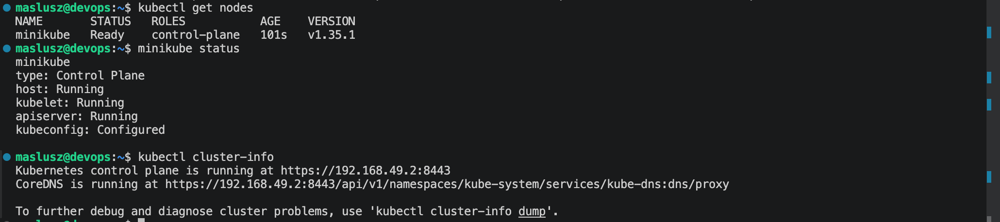

Budowa i uruchomienie obrazu `mw423393-nginx:v1` z własną stroną: 

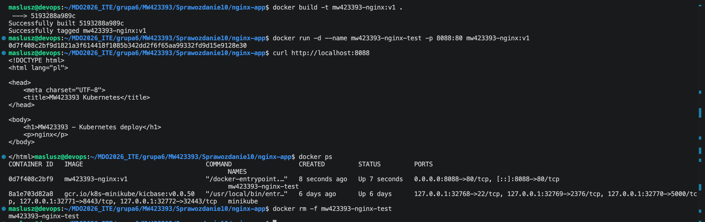

Dalej wykorzystano dwa sposoby uruchamiania programu w Kubernetes. Najpierw obraz został załadowany do środowiska `minikube`, gdzie aplikację uruchomiono poprzez `kubectl run`, powiązując obraz kontenera z obiektem `Pod` i umożliwiając dostęp dzięki `port-forward`. Następnie wdrożenie zapisano deklaratywnie jako manifesty YAML dla `Deployment` i `Service`. `Deployment` tworzy pody, definiuje ich pożądany stan i liczbę replik, natomiast `Service` jest obiektem pośredniczący pomiędzy klientem a uruchomionymi podami. Aplikacja przestała być pojedynczym kontenerem uruchamianym manualnie, a stała się zasobem zarządzanym przez platformę orkiestracyjną.

Poprawność uruchomienia obrazu z poziomu `kubectl` oraz Dashboardu:

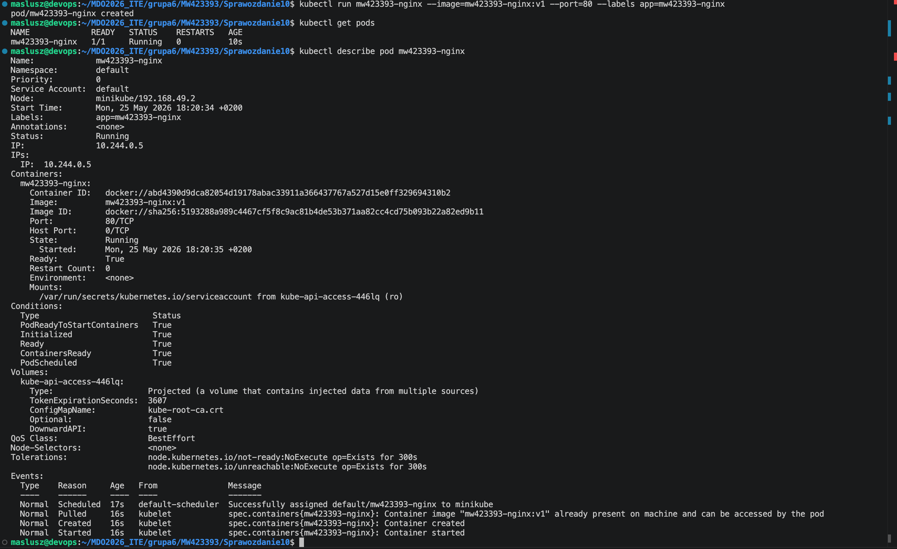

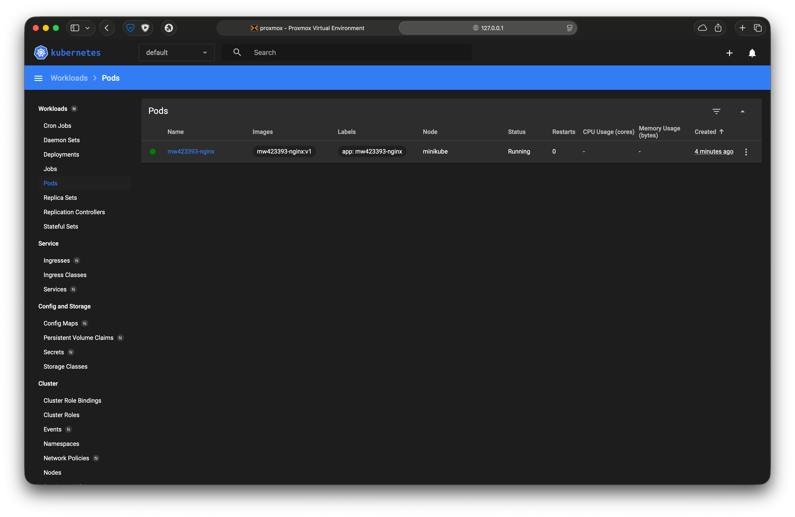

Lokalne żądanie HTTP do strony udostępnianej przez `nginx`:

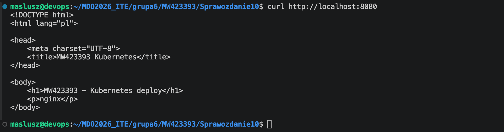

Wdrożenie manifestu YAML `Deployment`:

```yaml
apiVersion: apps/v1
kind: Deployment
metadata:
  name: mw423393-nginx-deployment
spec:
  replicas: 4
  selector:
    matchLabels:
      app: mw423393-nginx
  template:
    metadata:
      labels:
        app: mw423393-nginx
    spec:
      containers:
        - name: mw423393-nginx
          image: mw423393-nginx:v1
          imagePullPolicy: Never
          ports:
            - containerPort: 80
```

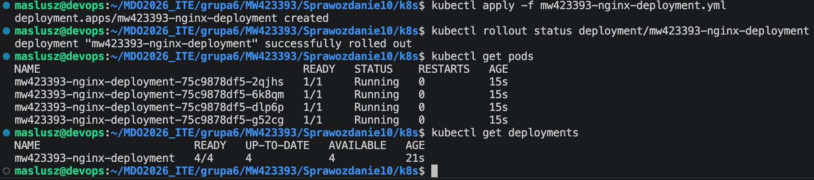

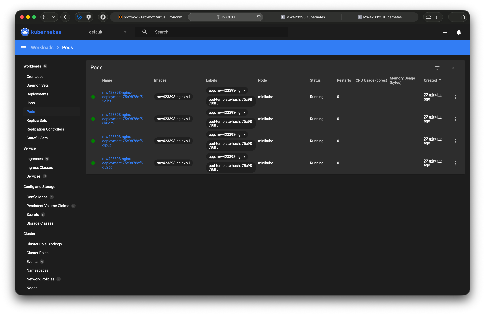

Uruchomienie `Service`:

```yaml
apiVersion: v1
kind: Service
metadata:
  name: mw423393-nginx-service
spec:
  selector:
    app: mw423393-nginx
  ports:
    - protocol: TCP
      port: 80
      targetPort: 80
```

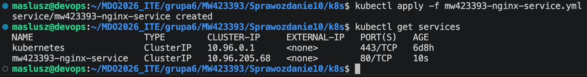

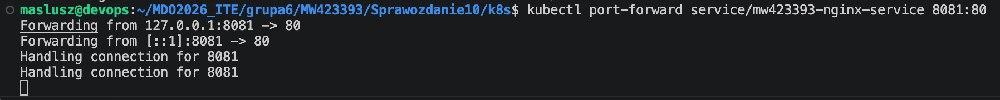

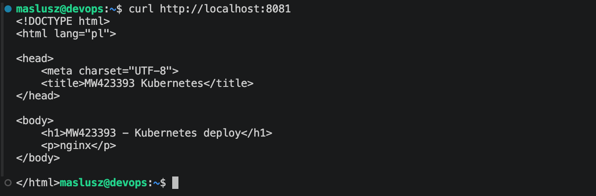

Przygotowano kilka wersji obrazu `mw423393-nginx`: poprawną `v1`, nową `v2` i wadliwą `bad`. Pokazano jak `Kubernetes` reaguje na zmiany obrazu i liczby replik, jak zapisuje historię wdrożeń przez `rollout history` i jak umożliwia przywrócenie poprzedniej wersji przez `rollout undo`. `Kubernetes` pozwala kontrolować cykl życia kontenetów oraz jakość ich wdrożenia. Uzupełnieniem był skrypt `check-rollout.sh`, sprawdzający czy deployment osiągnął stan gotowości w przeciągu 60 sekund.

Załadowanie obrazów do `minikube` i ich wdrożenie:

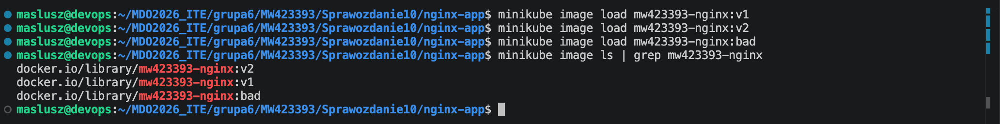

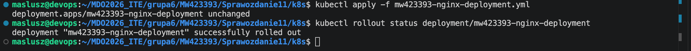

Określenie liczby replik:

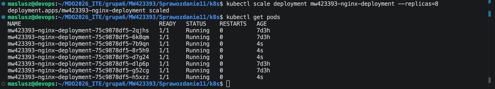

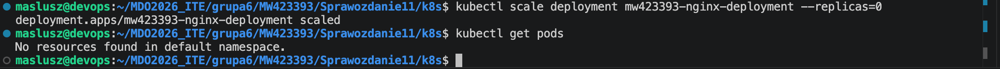

Podmiana obrazu na wersję `v2` oraz wadliwą:

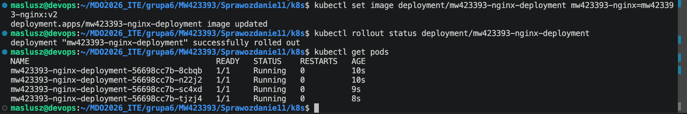

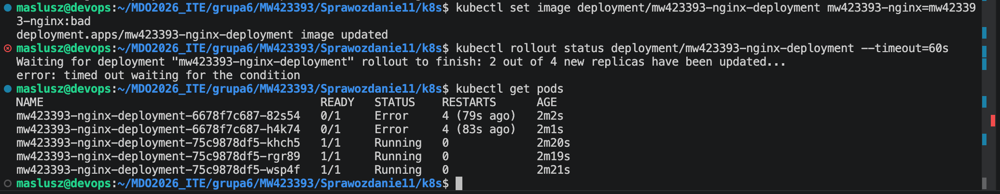

Przegląd i wykorzystanie historii wdrożeń:

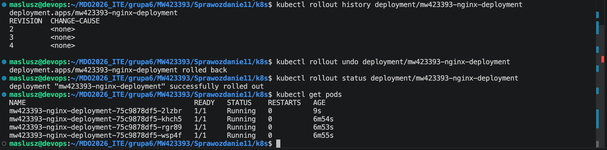

Kontrola czasowa wdrożenia:

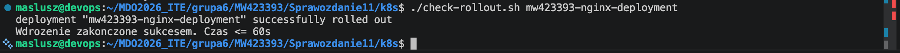

Sprawdzono trzy strategie wdrożeniowe: `Recreate`, `RollingUpdate` i `Canary`:

- `Recreate` - najprostsza, tym samym najmniej bezpieczna metoda aktualizacji — pełne usunięcie starych podów przed uruchomieniem nowych.
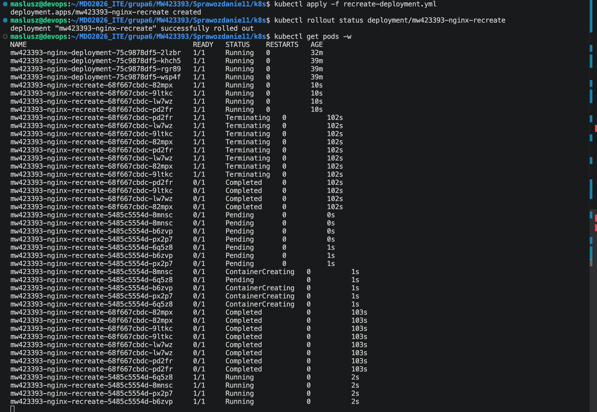

- `RollingUpdate` - wykorzystał parametry `maxUnavailable` i `maxSurge`, zastosował stopniową wymianę replik bez pełnej utraty dostępności usługi.
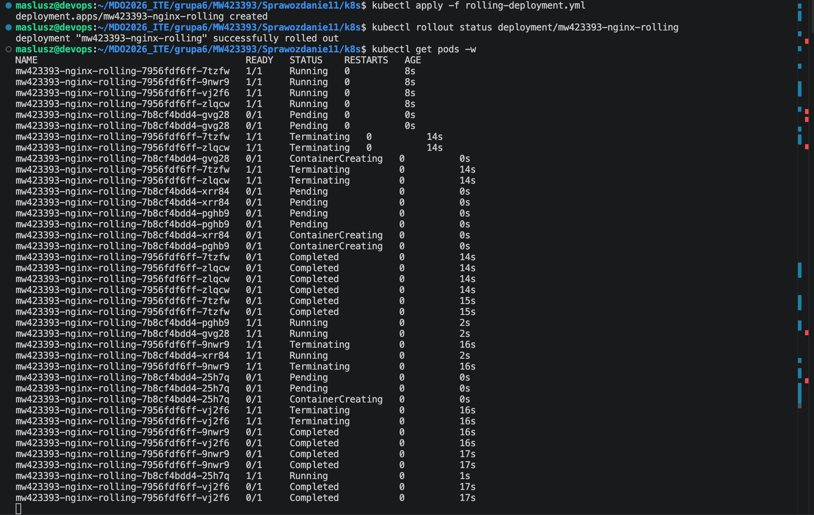

- `Canary` - `Kubernetes` umożliwia równoległe utrzymywanie wersji stabilnej i testowej w ramach jednego logicznego serwisu. 
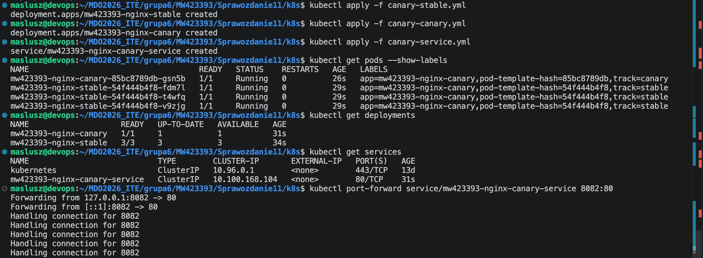

Zaletą `Kubernetesa` jest kontrola aktualizacji, skalowania i ekspozycji usług w sposób deklaratywny i powtarzalny.

---

## 5. Azure jako środowisko wdrożeniowe w chmurze

Podstawową technologią środowiska w chmurze wykorzystywaną po stronie klienta był `Azure Cloud Shell` z wbudowanym `Azure CLI`, a po stronie wykonawczej — `Azure Container Instances` (`ACI`). ACI nie dostarcza pełnej orkiestracji wielopodowych aplikacji, lecz umożliwia szybkie uruchomienie pojedynczego kontenera w chmurze z publicznym adresem IP i FQDN (pełny adres hosta w DNS). Celem było wdrożenie kontenera w usługę zarządzaną przez dostawcę chmury.

Utworzenie grupy zasobów dla kontenera:

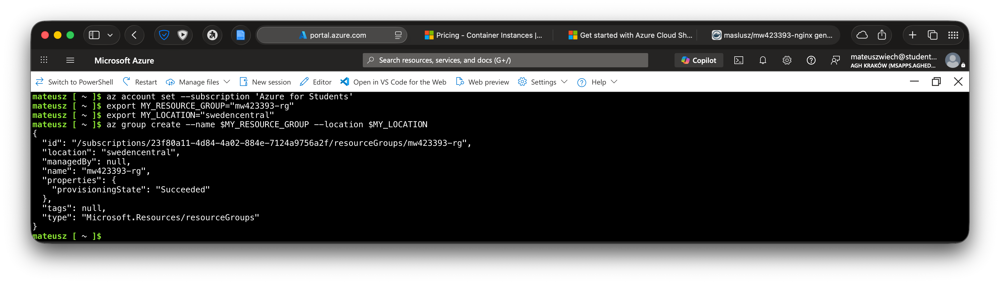

Do wdrożenia wykorzystano obraz `maslusz/mw423393-nginx:v2` opublikowany wcześniej w `Docker Hub`. Wdrożenie w chmurze wymaga wziącia pod uwagę dodatkowych ograniczeń platformy. Azure ma politykę ograniczającą uruchomienie konkretnych aplikacji w danych regionach. Dodatkowo `az container create` wymagało jawnego określenia CPU i pamięci (`--cpu`, `--memory`) - błąd `ResourceRequestsNotSpecified` przy pierwszej próbie. Poza samą aplikacją trzeba uwzględnić polityki subskrypcji, model kosztowy i sposób deklarowania zasobów.

Utworzenie kontenera z udostępnionego wcześniej obrazu w `Docker Hub`:

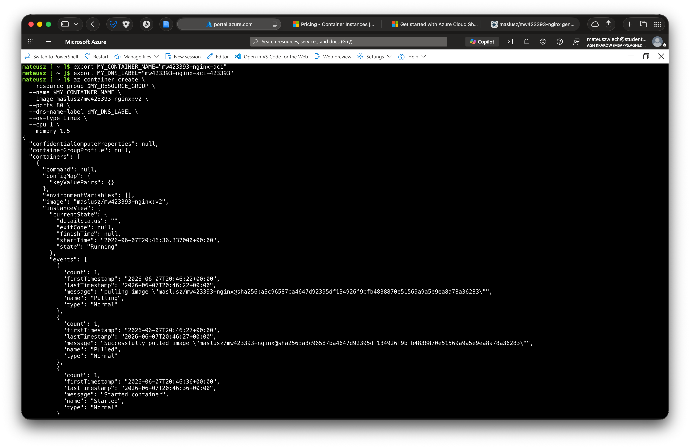

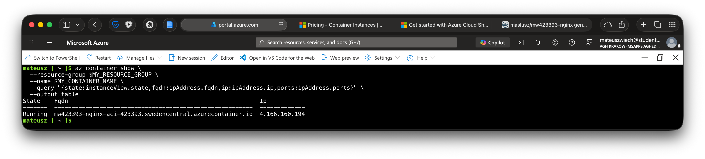

Sprawdzono stan instancji przez `az container show`, pobrano logi przez `az container logs` i zweryfikowano dostęp HTTP przez `curl` do publicznego FQDN. `ACI` pełniło rolę lekkiej, zarządzanej warstwy uruchomieniowej dla własnego kontenera z `Docker Hub`, bez konieczności utrzymywania klastra czy ręcznej konfiguracji infrastruktury sieciowej. Na koniec usunięto kontener i całą `resource group`, ze względu na pobierane kredyty subskrypcji i model rozliczeń chmurowych.

Dostęp publiczny do aplikacji:

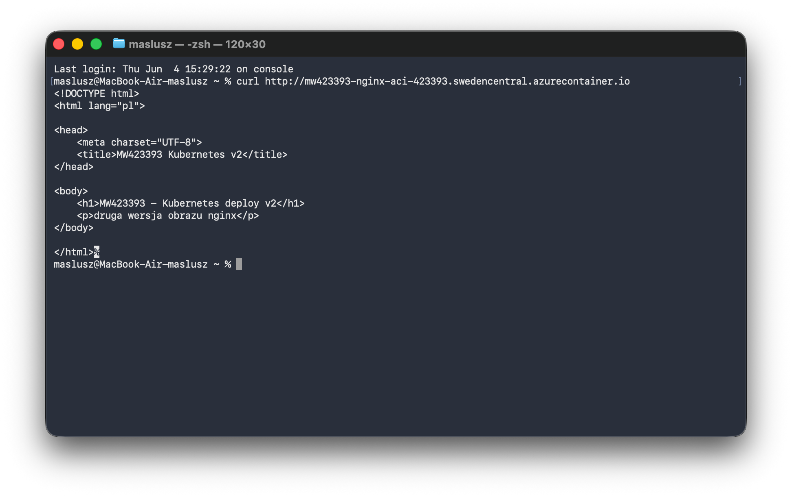

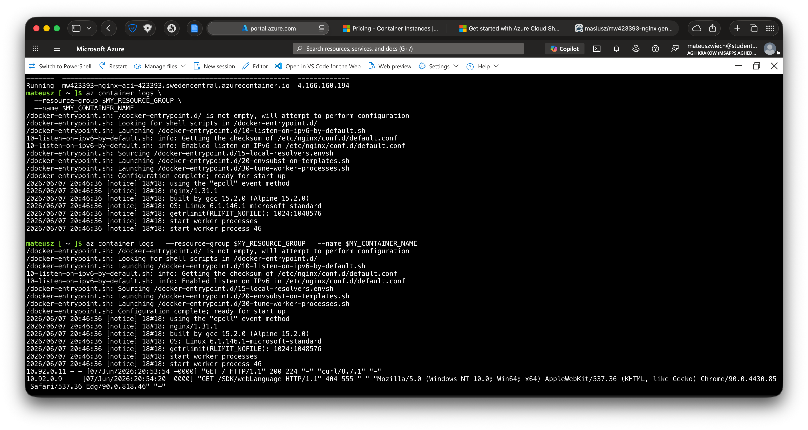

---

## 6. Wnioski

Laboratoria 08–12 pokazały ciąg technologiczny prowadzący od automatyzacji pojedynczych hostów do zarządzanego wdrażania kontenerów lokalnie i w chmurze. `Ansible` umożliwił deklaratywne zarządzanie maszynami, zdalne wykonywanie procedur oraz wdrożenie artefaktu przygotowanego wcześniej w pipeline. `Kickstart` rozszerzył ten model o etap automatycznej instalacji systemu i przygotowania usług już podczas wstępnej konfiguracji hosta. `Docker` był wykorzystywany jako standard środowiska wykonawczego aplikacji. `Kubernetes` w wersji lokalnej (`minikube`) dodał warstwę orkiestracji, skalowania, usług i strategii aktualizacji, natomiast `Azure Container Instances` pokazało uproszczony wariant uruchamiania kontenerów w chmurze z użyciem gotowej platformy zarządzanej.

`Ansible` kontroluje stan hostów, `Kickstart` automatyzuje tworzenie systemu, `Docker` standaryzuje środowisko uruchomieniowe, `Kubernetes` zarządza cyklem życia i ekspozycją aplikacji kontenerowych, a `Azure` dostarcza zarządzane środowisko wdrożeniowe w chmurze. Razem tworzą one spójny łańcuch prowadzący od przygotowania systemu i artefaktu do uruchomienia usługi w kontenerowym modelu wdrożeniowym.

---